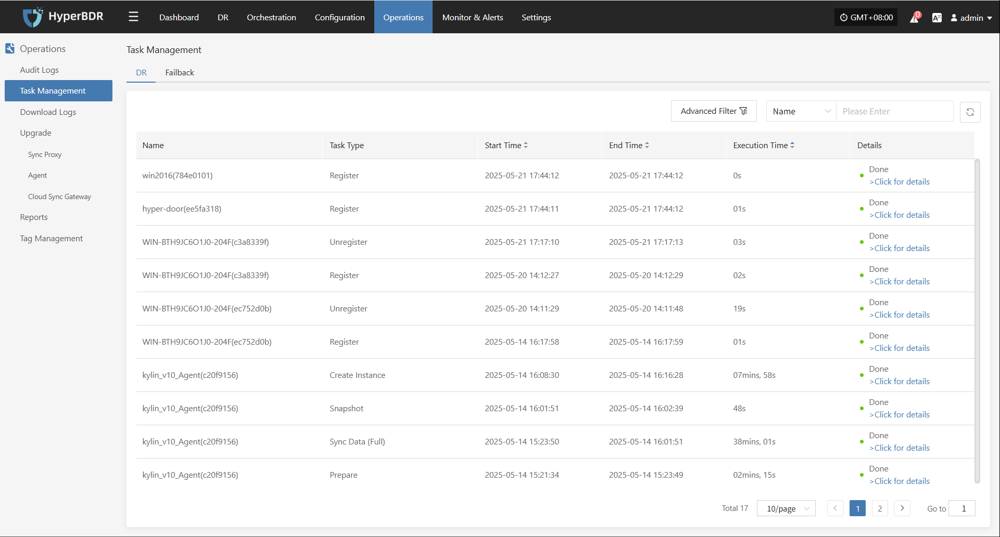
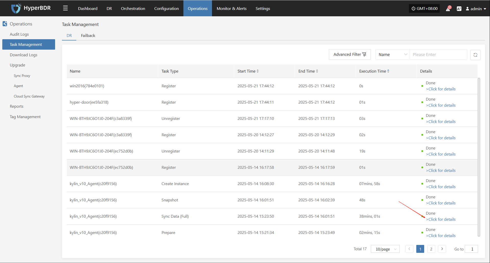
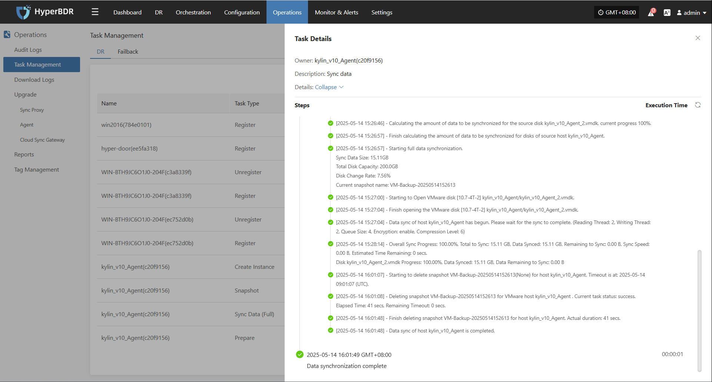

# Task Management

In HyperBDR, users can go to "Operations Management > Task Management" to view the execution status of all **DR** and **Failback** tasks, including key types such as registration, snapshot, and replication. The system supports real-time task status queries, filtering, and detailed views, helping users fully track task progress and results.

## Page Features

Users can quickly search using the top filter options, supporting log filtering by the following fields:

* **Advanced Filters:**
  * **Task Type:** Select the resource type related to the operation (e.g., VM, user resource, etc.)
  * **Task Status:** Filter specific operation events by keyword
  * **Task Name:** Enter a keyword to find the corresponding resource
  * **End Time:** Sort in ascending or descending order

### Task Management Description

| Field Name | Description                                  |
| ---------- | -------------------------------------------- |
| Name       | Shows the host or resource name for the task |
| Task Type  | Shows the type of task, such as registration, snapshot, sync, or replica creation |
| Start Time | The actual start time of the task            |
| End Time   | The time the task finished or was interrupted|
| Execution Time   | How long the task ran                        |
| Details    | Shows the final result status, with a link to view task details |

> Note: Click the status link in the "Task Status" field to go to the task details page for full logs and error information.

### Other Notes

* The page supports pagination, showing 10 records per page by default. Users can adjust the number of records per page or jump to a specific page using the filter bar at the bottom for quick access to needed information.
* Task logs record all actions and results during task execution, keeping a complete operation history for tracking and troubleshooting.

