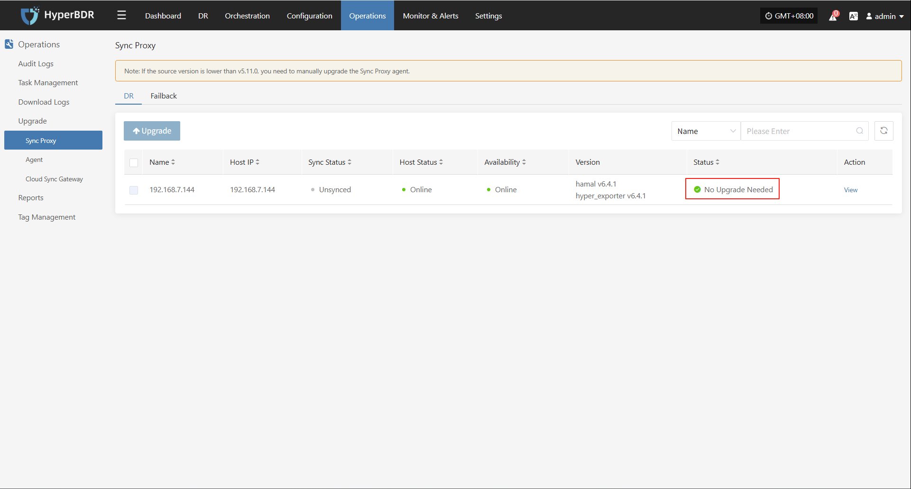
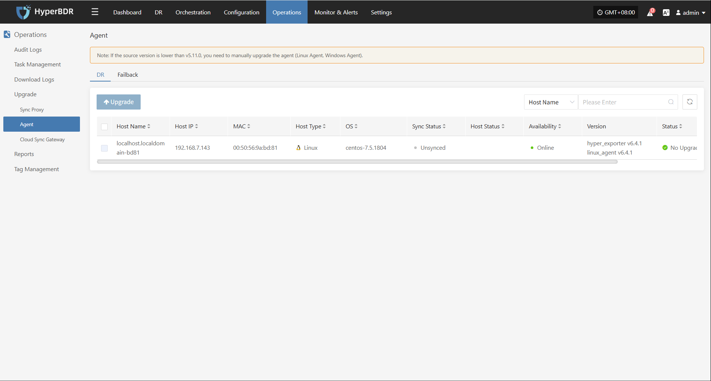
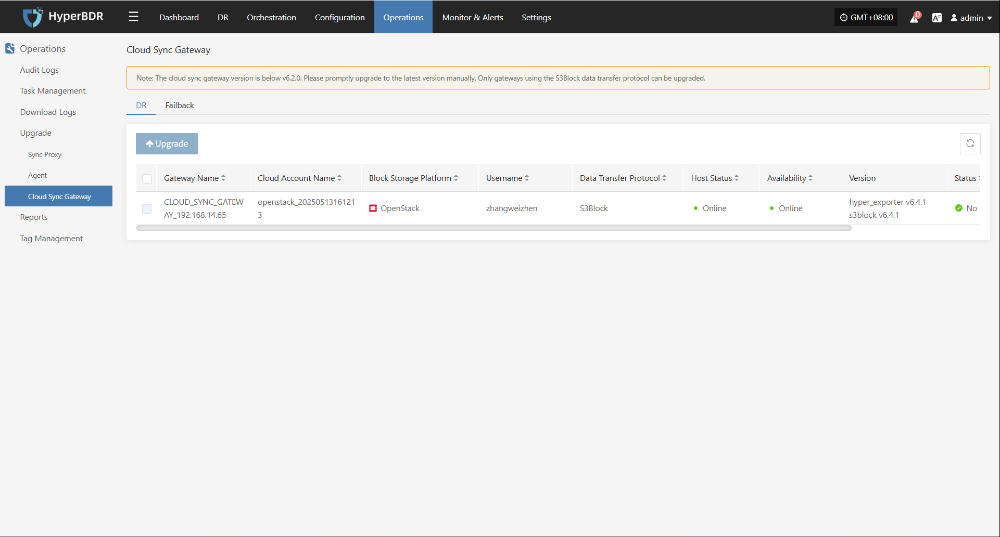
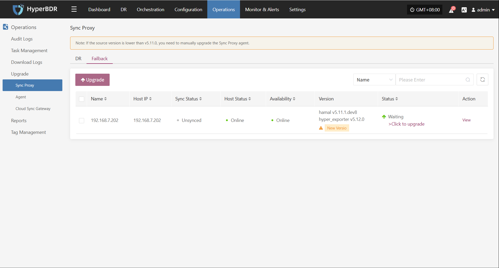
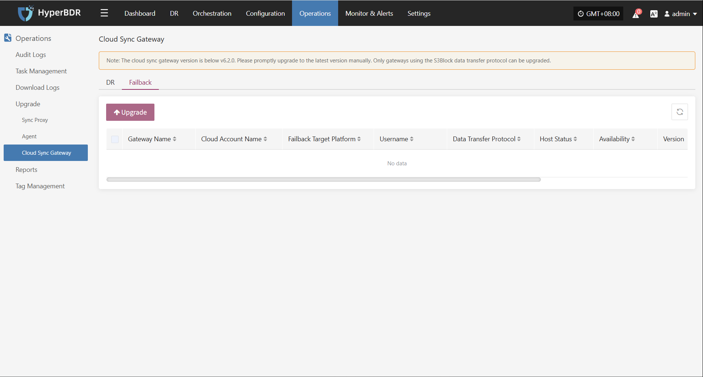

# Upgrade

**Upgrade** provides unified management for updating system components and agent versions, ensuring all modules stay supported and stable. Users can view current version info and perform online upgrades as needed through the platform interface.

## **Upgrade Preparation**

Before upgrading any functional components (such as Sync Proxy, Cloud Sync Gateway, etc.), you must first upgrade the Console version. As the core management module, the Console must be compatible with other components to avoid issues or upgrade failures caused by version mismatches.

### **Get Installation Package**

#### **Online Method:**

Log in to the host where the Console is installed and use this method to get the installation package.

```bash
# Get the latest HyperBDR package URL.
HYPERBDR_PACKAGE=$(curl -s -k https://install.oneprocloud.com/get_hyperbdr_latest/latest)
echo "HYPERBDR_PACKAGE: ${HYPERBDR_PACKAGE}"

# Get the corresponding MD5 file URL.
HYPERBDR_PACKAGE_MD5="${HYPERBDR_PACKAGE}.md5"
echo "HYPERBDR_PACKAGE_MD5: ${HYPERBDR_PACKAGE_MD5}"

# Extract the package name using string operations.
HYPERBDR_PACKAGE_NAME="${HYPERBDR_PACKAGE##*/}"
echo "HYPERBDR_PACKAGE_NAME: ${HYPERBDR_PACKAGE_NAME}"

# Extract MD5 file name
HYPERBDR_PACKAGE_MD5_NAME="${HYPERBDR_PACKAGE_NAME}.md5"
echo "HYPERBDR_PACKAGE_MD5_NAME: ${HYPERBDR_PACKAGE_MD5_NAME}"

# Start download
curl -k -O "$HYPERBDR_PACKAGE"
curl -k -O "$HYPERBDR_PACKAGE_MD5"
```

#### **Offline Method:**

> If you have already obtained the package online, skip this step.

If the installation host cannot access the internet, use another device's browser to visit the following address to get the package link:

After downloading, use Xftp or similar tools to upload the package to the Console host

```plain&#x20;text
https://install.oneprocloud.com/get_hyperbdr_latest
```

### **Extract to Specified Directory**

Use the following command to extract it to the specified directory:

```plain&#x20;text
tar zxvf <update-package>.tar.gz -C /path/to/extract
```

### **Execute Upgrade**

Run the upgrade command, and the system will automatically load the update content to the running directory `/opt/installer/production/venvs`:

```plain&#x20;text
/opt/installer/production/scripts/hmctl upgrade /<path-to-extracted-package>/installer/venvs
```

## **DR**

### **Sync Proxy**

#### **Upgrade Execution**

After completing the prerequisite steps (Upgrade Preparation), the system will automatically display the upgradable proxy components and related prompts in the corresponding position on this page. Users can follow the prompts to complete the upgrade process.

**Operations > Upgrade > DR > Sync Proxy**



### **Agent**

#### **Upgrade Execution**

After completing the prerequisite steps (Upgrade Preparation), the system will automatically display the upgradable agent components and related prompts in the corresponding position on this page. Users can follow the prompts to complete the upgrade process.

**Operations > Upgrade > DR > Sync Proxy > Agent**



### **Cloud Sync Gateway**

#### **Upgrade Execution**

After completing the prerequisite steps (Upgrade Preparation), the system will automatically display the upgradable proxy components and related prompts in the corresponding position on this page. Users can follow the prompts to complete the upgrade process.

**Operations > Upgrade > DR > Cloud Sync Gateway**




## **Failback**

### **Sync Proxy**

#### **Upgrade Execution**

After completing the prerequisite steps (Upgrade Preparation), the system will automatically display the upgradable proxy components and related prompts in the corresponding position on this page. Users can follow the prompts to complete the upgrade process.

**Operations > Upgrade > Failback > Sync Proxy**



### **Agent**

#### **Upgrade Execution**

After completing the prerequisite steps (Upgrade Preparation), the system will automatically display the upgradable agent components and related prompts in the corresponding position on this page. Users can follow the prompts to complete the upgrade process.

**Operations > Upgrade > DR > Agent**


### **Cloud Sync Gateway**

#### **Upgrade Execution**

After completing the prerequisite steps (Upgrade Preparation), the system will automatically display the upgradable proxy components and related prompts in the corresponding position on this page. Users can follow the prompts to complete the upgrade process.

**Operations > Upgrade > DR > Cloud Sync Gateway**



