# **DR Group**

The "DR Group" feature allows unified disaster recovery configuration and scheduling at the resource group level. It is suitable for scenarios where multiple related resources (such as hosts, networks, and storage) need to be protected and recovered together.

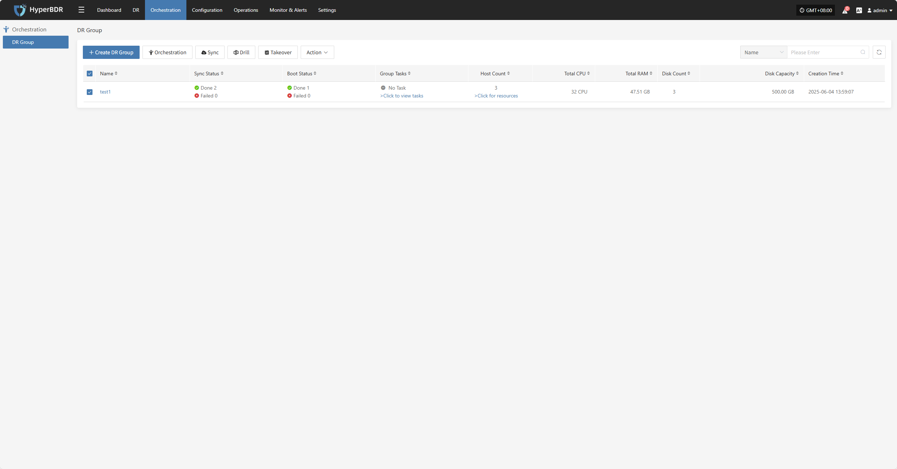

## **Create DR Group**

Click "Create DR Group" to group hosts that have completed resource configuration. This makes it easier to manage and schedule disaster recovery for multiple resources at once.

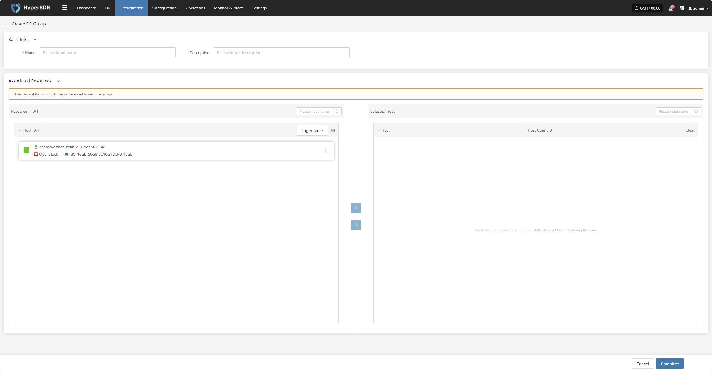

Set the resource group name, add notes, select the corresponding host resources, and click "Finish" to create the resource group.

## **Orchestration**

Resource orchestration lets you predefine the startup order and dependencies of hosts, networks, and storage. This ensures that in the event of a disaster, the system can quickly and orderly recover according to the correct process.

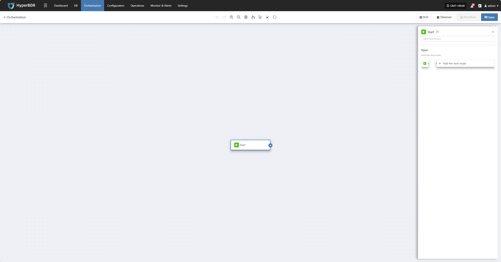

Click the "Start" button to begin adding nodes. Complete the configuration for each node and add them as needed.

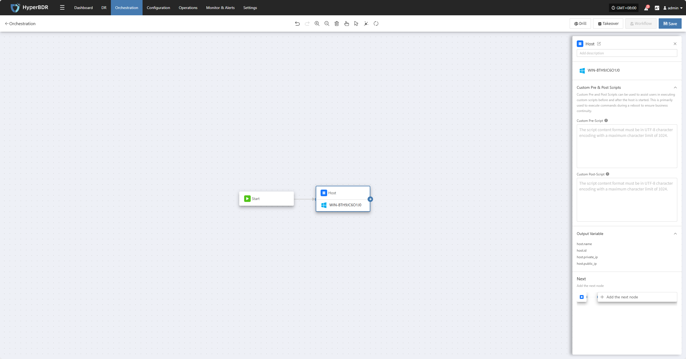

After clicking "Add Host Node," the settings panel will appear on the right. Here, you can add pre-start scripts, post-start scripts, and other configurations before adding the next node or parallel nodes.

## **Sync**

Select the resource group you want to protect, then click **"Sync"** to start data synchronization according to your business needs.

> Note: By default, the first sync is a full sync. Subsequent syncs are incremental. If you need to perform a full sync again after incremental syncs to ensure data integrity, you can choose to force a full sync.

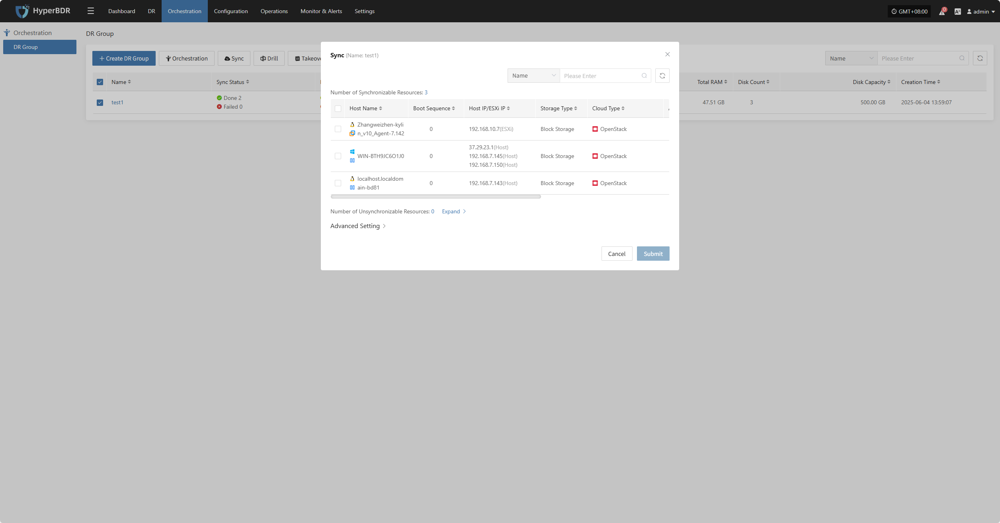

### **Advanced Setting**

In "Advanced Settings," you can enable the **Force Full Synchronization** option to ensure all data is fully synchronized again.

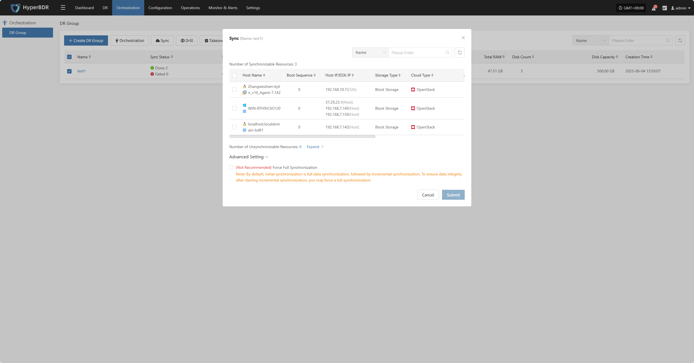

## **Drill**

Select the resource group, click "Drill," choose the host and recovery point, and restore the disaster recovery host to the target environment with one click.

> Note: Only hosts that have completed synchronization can participate in drills. Hosts with unsynchronized data will be excluded and cannot be started.

The system will automatically create or start the target instances based on the predefined orchestration (compute, storage, network, etc.). Once started, you can log in to the target platform to verify configurations and perform business drills.

After recovery, check if application services, databases, and load balancers are working properly.

## **Takeover**

Select the resource group, click **"Takeover"**, choose the recovery snapshot point, and confirm to proceed.

> Note: Only hosts that have completed synchronization can participate in takeover. Hosts with unsynchronized data will be excluded and cannot be started.

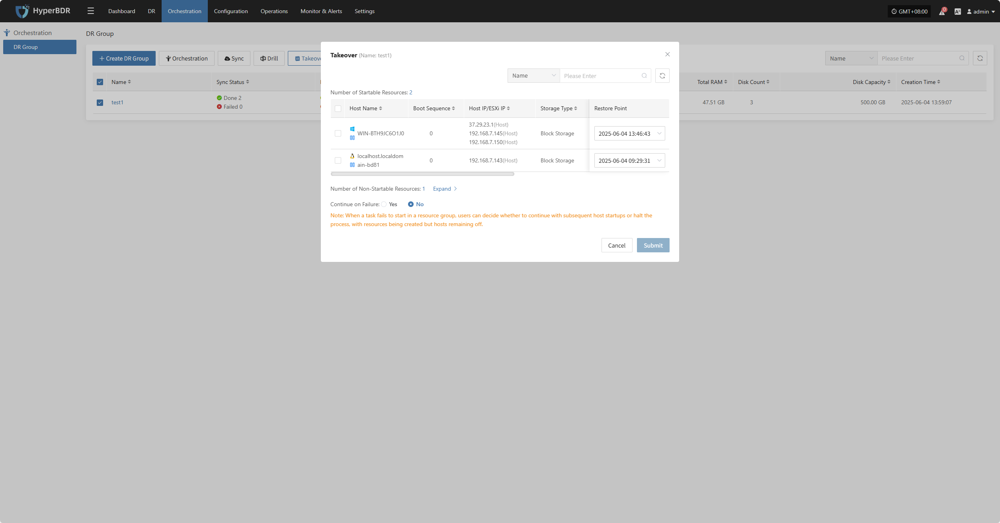

The system will automatically create or start the target instances based on the predefined orchestration (compute, storage, network, etc.). Once started, you can log in to the target platform to verify configurations and take over business operations.

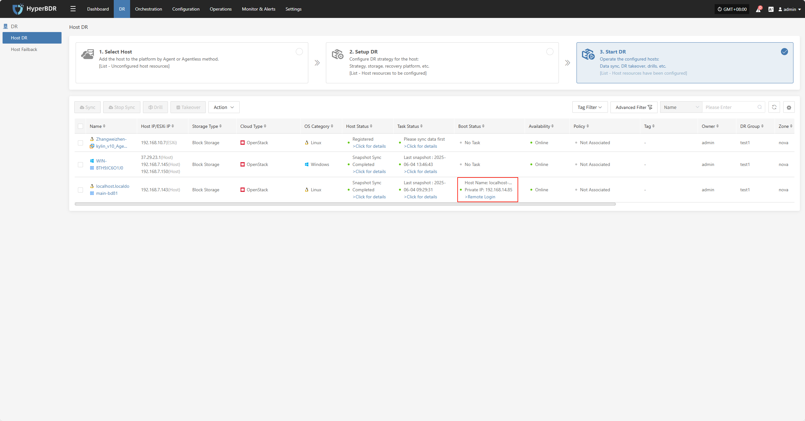

After takeover, check database versions, application service configurations, and dependent services (such as cache and message queues) to ensure everything is working normally.

## **Action**

### **Basic Info**

Click "Basic Info" to view the resource group's name, notes, and other information.

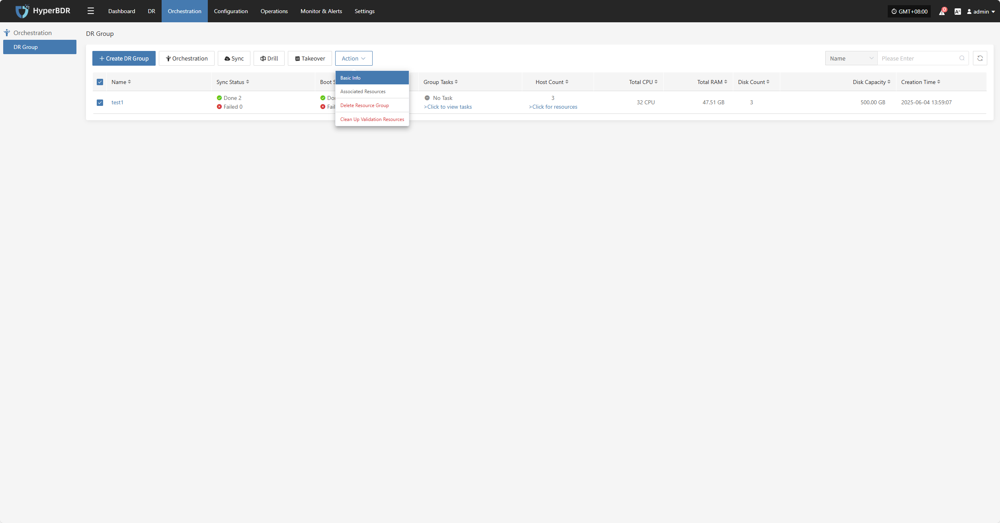

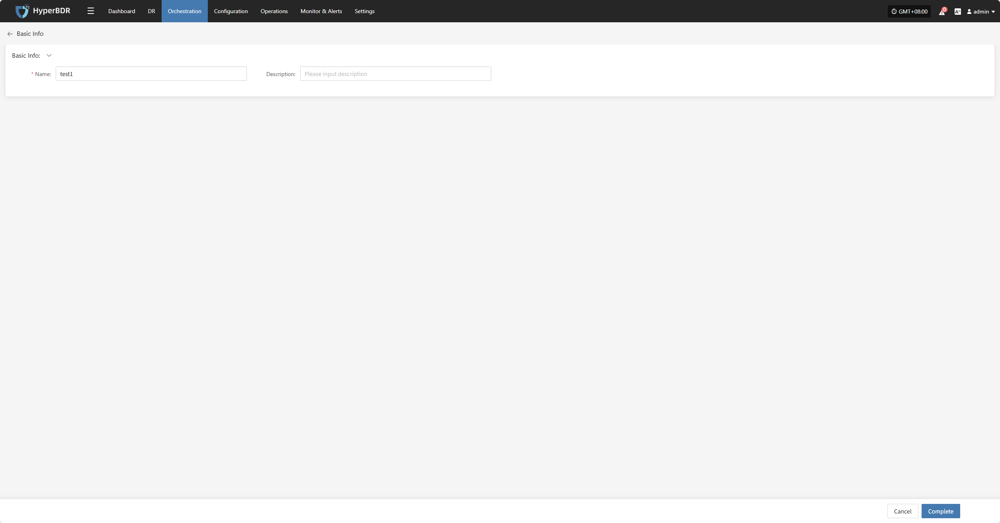

### **Associated Resources**

Click "Associated Resources" to manage the hosts in the resource group. You can add or remove hosts as needed.

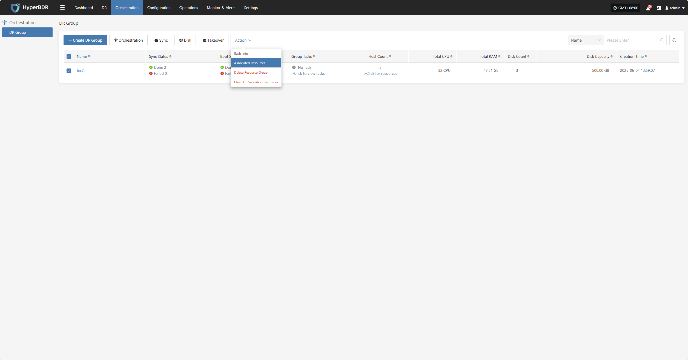

To remove a host, click the "x" next to the host in the resource list.

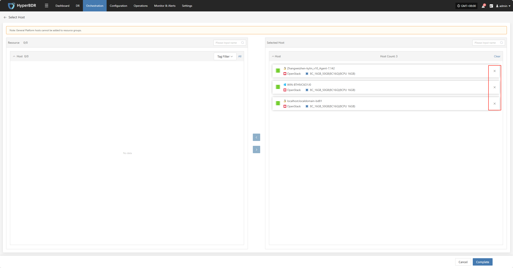

To add a host, select the host and click confirm to add it to the resource group.

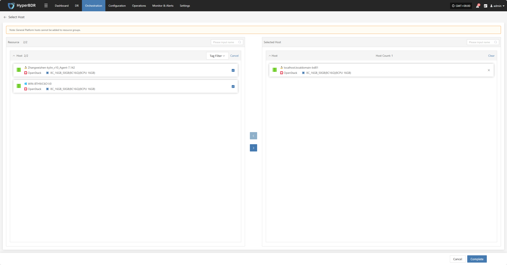

### **Delete Resource Group**

> Note: This operation only deletes the resource group. The resources within the group will be retained.

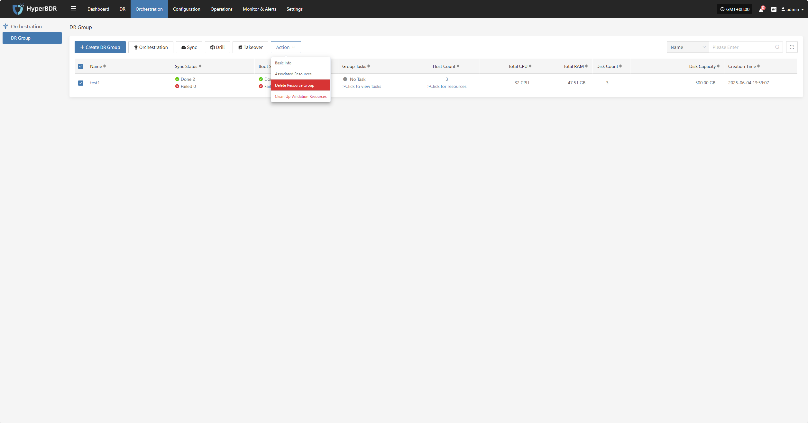

### **Clean Up Validation Resources**

> Note: This operation only cleans up resources that have been started in the cloud.

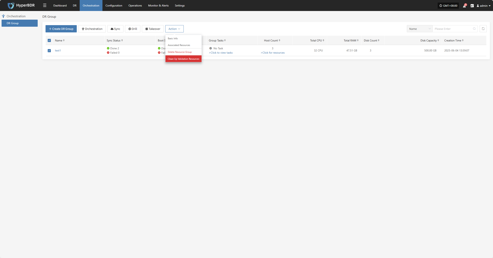

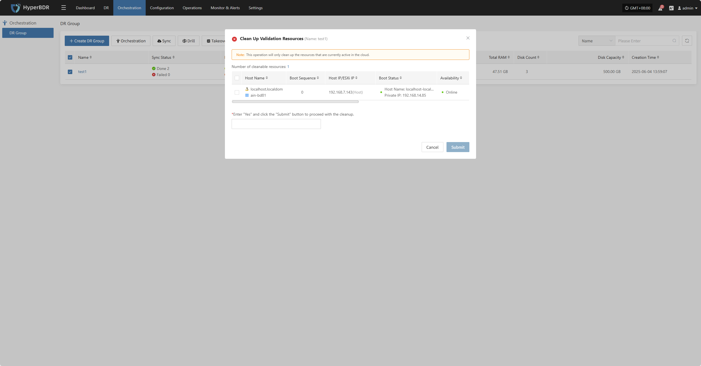

