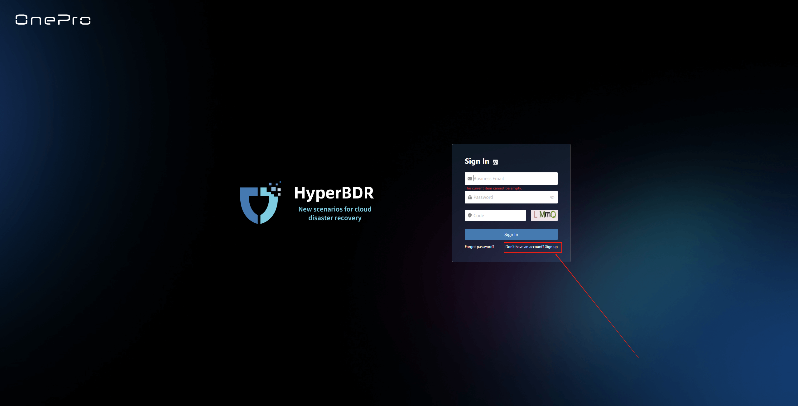
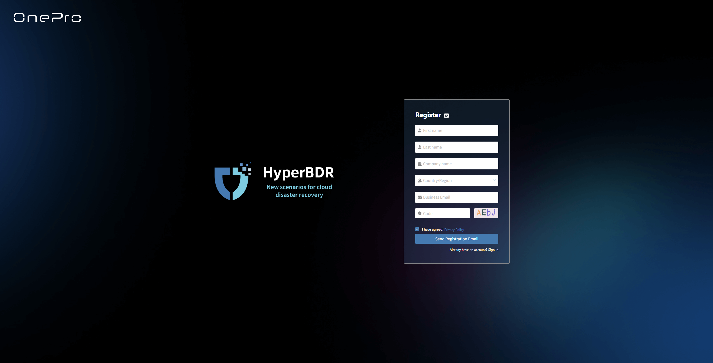
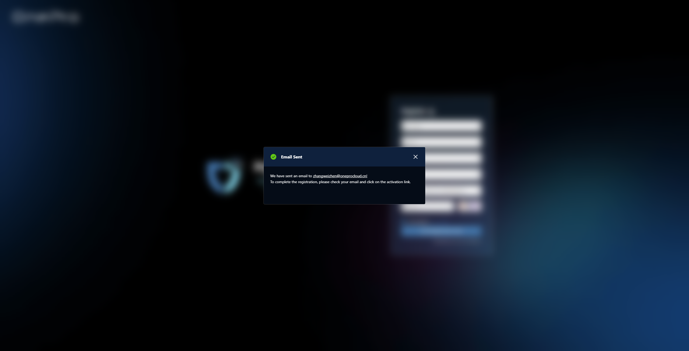
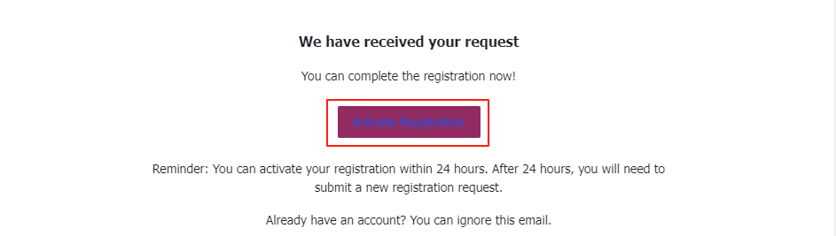
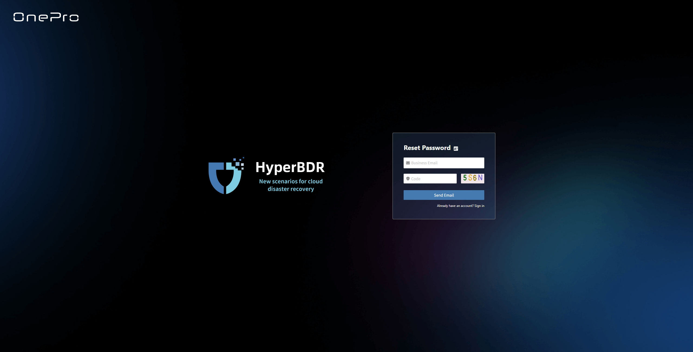
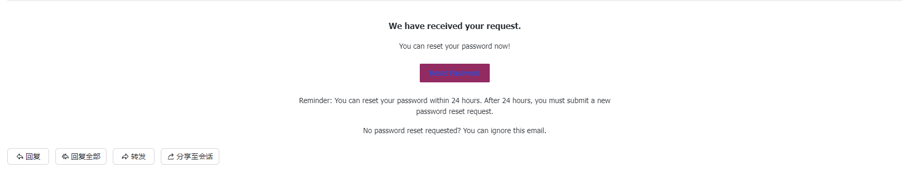

# **Register**

The registration function allows new users to create a platform account for future login, use, and receiving system notifications. During registration, users need to provide required identity information and contact details. The platform will verify user identity through the configured verification method to ensure account security.

## **Start Registration**

### **Access the Registration Page**

Open the login page and click **"Don't have an account? Sign up"** to enter the account registration page.

### **Fill in Registration Information**

Enter the required information, including: first name, last name, company name, country/region, email, and other authentication details.

> The email address must be valid and accessible to receive system verification codes and notifications.

### **Submit Registration Application**

After filling in the authentication information, click **"Send Registration Email"**. The system will send a verification email.

### **Activation Confirmation**

Please check your registration email inbox, click **"Activate Registration"** in the email to complete the verification. Your account will be activated and the system will redirect you to the **"Set Password"** page.

### **Set Password**

After account activation, you need to enter and confirm a new password to complete the registration process.

> The password must meet the platform's complexity requirements. It is recommended to include uppercase and lowercase letters, numbers, and special characters. Please keep your password safe to ensure account security.

After setting the password, you can now use it to log in and securely access the platform. Please go to the login page to sign in.

## **Forgot Password**

### **Access Password Recovery**

Open the login page and click **"Forgot password?"** to enter the password recovery page.

### **Fill in Recovery Information**

Enter your registered email address. The system will send a password reset email to start the reset process.

### **Submit Reset Request**

After entering the required information, click **"Send Email"**. The system will send a verification email.

### **Reset Confirmation**

Please check your registered email inbox, click **"Reset Password"** in the email to complete the verification. The system will redirect you to the **"Reset Password"** page.

### **Set Password**

After setting the password, you can use it to log in and securely access the platform. Please go to the login page to sign in.

> The password must meet the platform's complexity requirements. It is recommended to include uppercase and lowercase letters, numbers, and special characters. Please keep your password safe to ensure account security.

