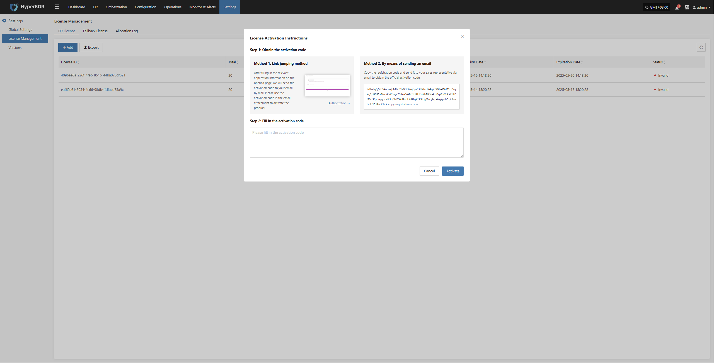
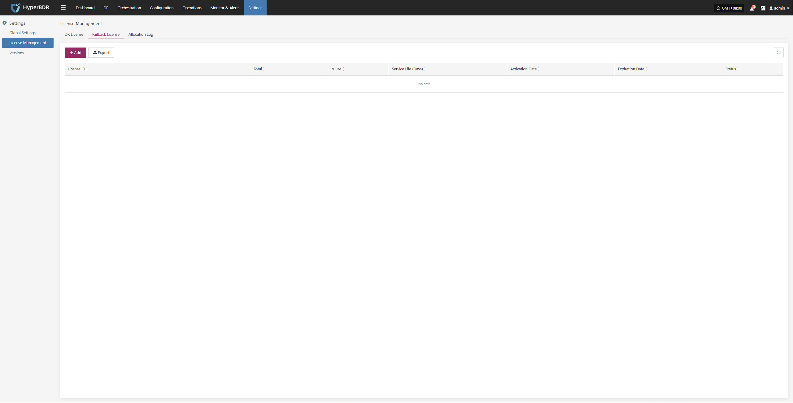
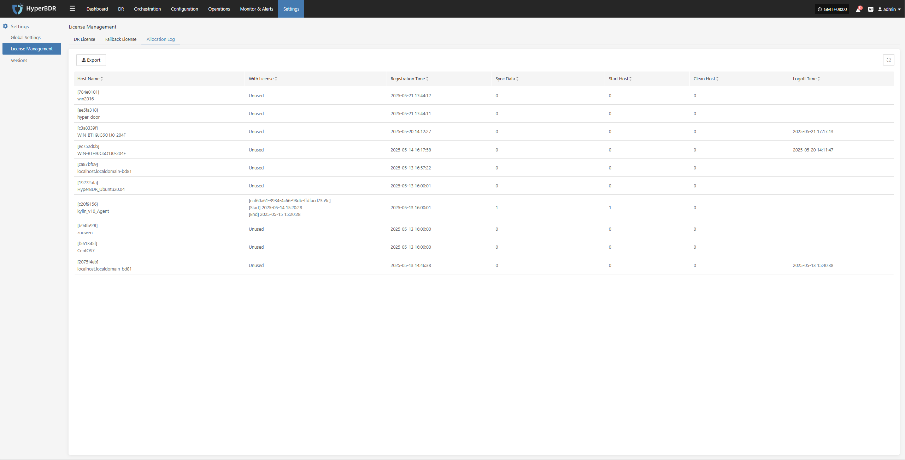

# **License Management**

## **DR License**

The DR License controls the use of disaster recovery features for different resources on the platform. It ensures users have the proper authorization to perform disaster recovery, takeover, and data restore operations.

### **Add License**

Go to **Settings > License Management > DR License**, click **"Add"**, fill in the required information as prompted, and enter a valid license code to complete the authorization.

## **Failback License**

The Failback License is used to manage authorization when moving business operations back from the target site to the original site after a failover. A valid failback license code is required to ensure data migration and business recovery are legal and complete.

### **Add License**

Go to **Settings > License Management > Failback License**, click **Add"**, enter and activate the license code as prompted to enable the failback feature.

## **Allocation Log**

This page displays basic information and operation status for all connected hosts, helping O&M staff track host lifecycle, license usage, and key operation history.

### **Export Operation Records**

Go to **Settings > License Management > Allocation Log**, click **"Export"** to download host information and operation status.

