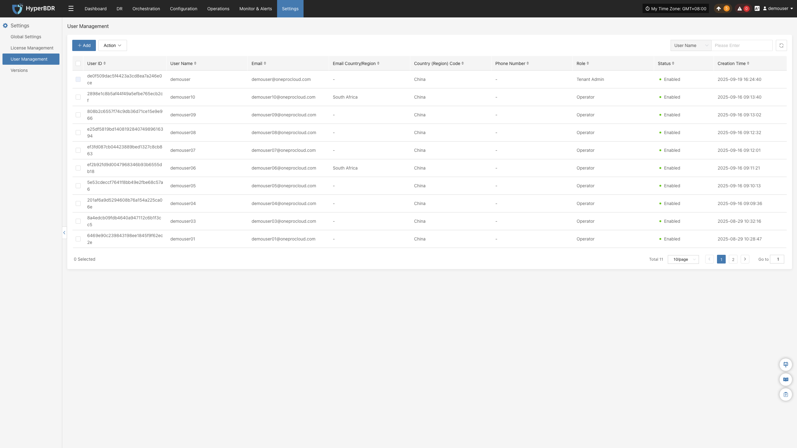
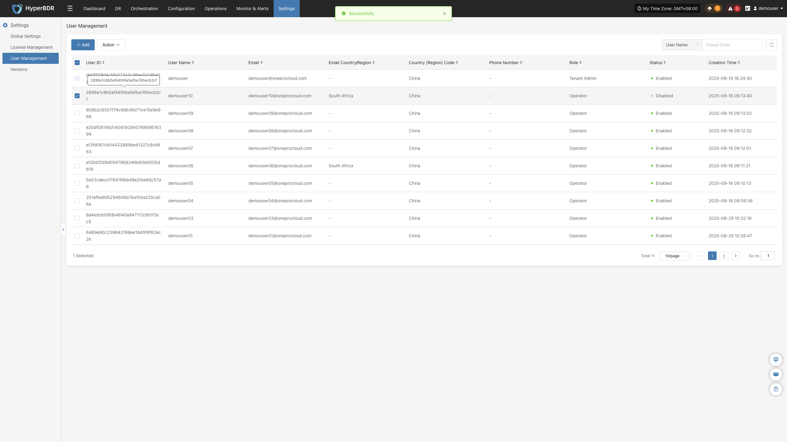

# User Management

A core module for the full lifecycle management and control of tenant accounts, supporting capabilities such as adding new system accounts, assigning role permissions, viewing account information, batch managing users, and retrieving and filtering accounts, etc\., to implement hierarchical and decentralized management for multiple operators and ensure the operational security of the backup platform\. 

- **User List Field Description**

Each user record in the list contains the following fields, with the meanings as follows: 

| **Field Name**                      | **Description**                                              |
| ----------------------------------- | ------------------------------------------------------------ |
| User ID                             | The system automatically generates a unique identifier, which cannot be modified and is used by the backend to distinguish accounts |
| Username                            | Account name for logging into the system, a mandatory credential for login |
| Email                               | User binds a contact email for password retrieval and alert email push |
| Email Country / Region              | Email ownership region identifier, e\.g\., South Africa; if there is no special region, it will display "\-" |
| User Mobile Country \(Region\) Code | Mobile phone number country code, default is China           |
| User's mobile phone number          | Bind a mobile phone number for account security verification |
| Role                                | Account permission levels are divided into three categories: Tenant Administrator: Highest privilege across the platform; Configured User: Only backup business operation permissions; Read\-only user: Only view data across all platforms, with no permission for any editing operations |
| Status                              | Account login status, green dot = enabled \(can log in normally\); after disabling, the account cannot log in |
| Creation Time                       | Account creation exact timestamp                             |

## **Add**

After logging in to the system, navigate to the **\[Settings\] \- \[User Management\] **page, click the "\+ Add" button at the top of the page, fill in the necessary information such as username, email, region, mobile phone number, role, etc\. in the new user form, and submit it after checking the content\. Save to complete the user account addition\.

## More Operations

After selecting the corresponding user, management operations including modification, password reset, activation, deactivation, and deletion can be performed\. 

### Modify

After selecting the corresponding user row, click the \[Modify\] button, and the system will pop up a user editing window\. The administrator can re\-edit and adjust information such as the email, mobile phone number, role, and account status of the created account within the window, and the changes will take effect after saving\. 

### Reset Password

Select the Target User and click the \[Reset Password\] button\. The system will pop up a password modification window\. After entering and confirming the new password, the original password will immediately become invalid, and the new password needs to be informed to the corresponding user\.

### Enable

Select the Target User, click the \[Enable\] button to lift the account freeze restriction, allowing the user to log in to the system normally, and the list status will be synchronously updated to the green enabled indicator\. 

### Disable

Select the Target User, click the \[Disable\] button to freeze the account's login permission, the user will be unable to log in to the system, and the list status will be synchronously updated to the disabled status\.

### Delete

Select the Target User, click the \[Delete\] button, the user account will be permanently deleted, all account\-related login information and permission configurations will become invalid, and the deletion operation cannot be undone\. Please confirm that the account has no unfinished business tasks and no associated resources before proceeding\.

