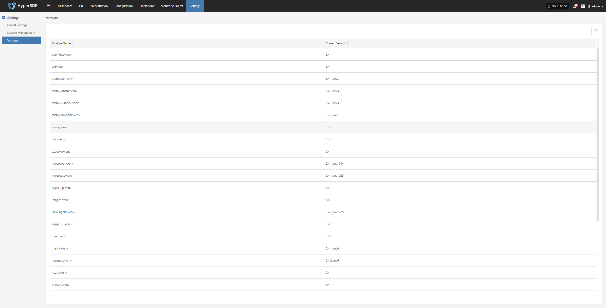

# **Versions**

The Versions page displays detailed version information for the current system platform. This helps O&M staff check software version status, track release history, and provide reference when requesting technical support.

