# FAQ

[[toc]]

## How do I connect to SSH on Windows?

**Q: How do I connect to SSH on Windows?**

**A:** Please note that starting from Windows 10, Microsoft has integrated an OpenSSH client, allowing you to use the ssh command directly in the Command Prompt or PowerShell. Follow these steps:

1. **Open Command Prompt or PowerShell:**

   - Press `Win + X` and select "Windows PowerShell" or "Command Prompt."

2. **Run the SSH command:**

   - In the opened window, type the following command to connect to a remote server:

     ```bash
     ssh username@remote_host
     ```

     替换 `username` with your remote server username and `remote_host` with the server's address.

   - If your remote server uses a non-standard port (not the default 22), use the `-p` parameter to specify the port:

     ```bash
     ssh -p port_number username@remote_host
     ```

     Replace `port_number` with your server's port.

   - If you need to use a private key for authentication, use the `-i` parameter to specify the path to the private key:

     ```bash
     ssh -i path/to/private/key username@remote_host
     ```

**Examples:**
```bash
ssh john@example.com
ssh -p 2222 jane@192.168.1.100
ssh -i C:\path\to\private\key.pem user@remote-server
```

These commands will establish an SSH session, allowing you to execute commands or transfer files on the remote server.

**Note:** Ensure your network connection is stable, and the remote server allows SSH connections. If you encounter issues, check firewall settings, SSH server configuration, or network connectivity.

## Connecting to Linux with PuTTY on Windows

**Q: How can I use PuTTY to connect to a Linux server from Windows?**

**A:** PuTTY is a popular SSH client for Windows. Follow these steps to connect to a Linux server:

1. **Download and Install PuTTY:**
   - Download PuTTY from the official website: [PuTTY Download](https://www.chiark.greenend.org.uk/~sgtatham/putty/latest.html).
   - Install PuTTY by following the installation instructions.

2. **Open PuTTY:**
   - Launch PuTTY from the Start menu or desktop shortcut.

3. **Configure the Connection:**
   - In the PuTTY configuration window:
     - Enter the IP address or hostname of your Linux server in the "Host Name (or IP address)" field.
     - Ensure that the "Port" is set to 22 (the default for SSH).

4. **Choose Connection Type:**
   - On the left panel, navigate to "Connection" > "SSH."
   - Make sure "SSH" is selected.

5. **Optional: Save Session:**
   - To save your settings for future use, enter a name in the "Saved Sessions" field and click "Save."

6. **Initiate Connection:**
   - Click the "Open" button to start the connection.

7. **Enter Login Credentials:**
   - Once the terminal window opens, you will be prompted to enter your Linux username and password.

8. **Success:**
   - If the credentials are correct, you will be connected to your Linux server via SSH.

**Note:** Ensure that SSH is enabled on your Linux server and that you have the correct login credentials.

**Troubleshooting:**
- If you encounter issues, double-check your server's IP address, ensure SSH is running, and confirm your login details.

## How HyperBDR ensure the integrity of Windows Data?

**Q1: How does HyperBDR ensure the integrity of Windows data?**

A1: HyperBDR primarily utilizes Windows VSS (Volume Shadow Copy Service) technology to ensure data integrity. In VMware without an agent, it achieves this by invoking VSS through VMware Tools. In Windows Agent mode, it directly calls the VSS interface.

**Q2: What is Windows VSS technology?**

A2: VSS, or Volume Shadow Copy Service, is a Windows service that enables the creation of point-in-time snapshots of volumes, including those containing databases. These snapshots, or shadow copies, provide a consistent view of the data, even if changes are being made to the database during the snapshot creation process.

VSS ensures database integrity through a process known as "shadow copy creation." When a VSS snapshot is triggered, the service coordinates with various components, including VSS writers associated with applications such as databases. These writers temporarily freeze write I/O operations to ensure that the data on the disk is in a consistent state at the time of the snapshot.

VSS is compatible with various Database Management Systems (DBMS), including SQL Server. Most major DBMS vendors provide VSS writers that integrate with the VSS framework, allowing for the creation of consistent and reliable database snapshots.

**Q3: In VMware without an agent, how does HyperBDR call VSS?**

A3: In VMware without an agent, HyperBDR collaborates with VMware Tools to invoke VSS, freezing the file system and application states to ensure data consistency during snapshot creation.

**Q4: In Windows Agent mode, how does HyperBDR directly call the VSS interface?**

A4: In Windows Agent mode, HyperBDR directly calls the VSS interface provided by the Windows operating system to freeze data and create snapshots, ensuring the backup data is in a transactionally consistent state.

**Q5: Does HyperBDR's data integrity assurance apply to specific applications like databases?**

A5: Yes, HyperBDR's VSS integration is application-aware and applicable to specific applications, including databases. VSS ensures that application data is in a consistent state during snapshot creation.

## Configuration of Antivirus Software on Windows Agent Source Host

### Kaspersky

#### Kaspersky Pause Protection

Set the running Kaspersky to Pause Protection status.


#### Create a new subgroup named "windows agent" under [Application]

Select [**Security**] - [**Intrusion Prevention**] - [**Manage applications**], and create a new subgroup named "**windows agent**" under [**Application**].


#### Configure [**Intrusion Prevention**]

Locate the [**Trust group for applications started before startup of Kaspersky Small Office Security**] item and set it to the recently created trust group "**windows agent**", save the configuration.


#### Exit Kaspersky

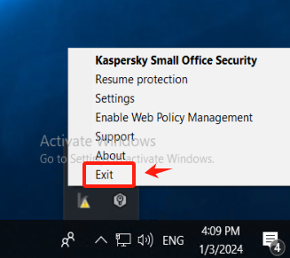

#### Install Windows Agent

::: tip
After installing Windows Agent, do not start Windows Agent temporarily.
:::

Reference Document: [https://docs.oneprocloud.com/userguide/poc/agent-pre-settings.html#unzip-the-installation-package-and-proceed-with-the-installation](https://docs.oneprocloud.com/userguide/poc/agent-pre-settings.html#unzip-the-installation-package-and-proceed-with-the-installation)


#### Run the Kaspersky

::: tip
When Kaspersky is restarted, it remains in the paused protection state.
:::


#### Add the application of Windows Agent to the trusted group.

Select [**Security**] - [**Intrusion Prevention**] - [**Manage applications**], Right-click on "**windows agent**", click on [**Add Application to Group**], and add all exe, bat, and sys files under the installation directory of Windows Agent and its subdirectory "**hyper_exporter**".

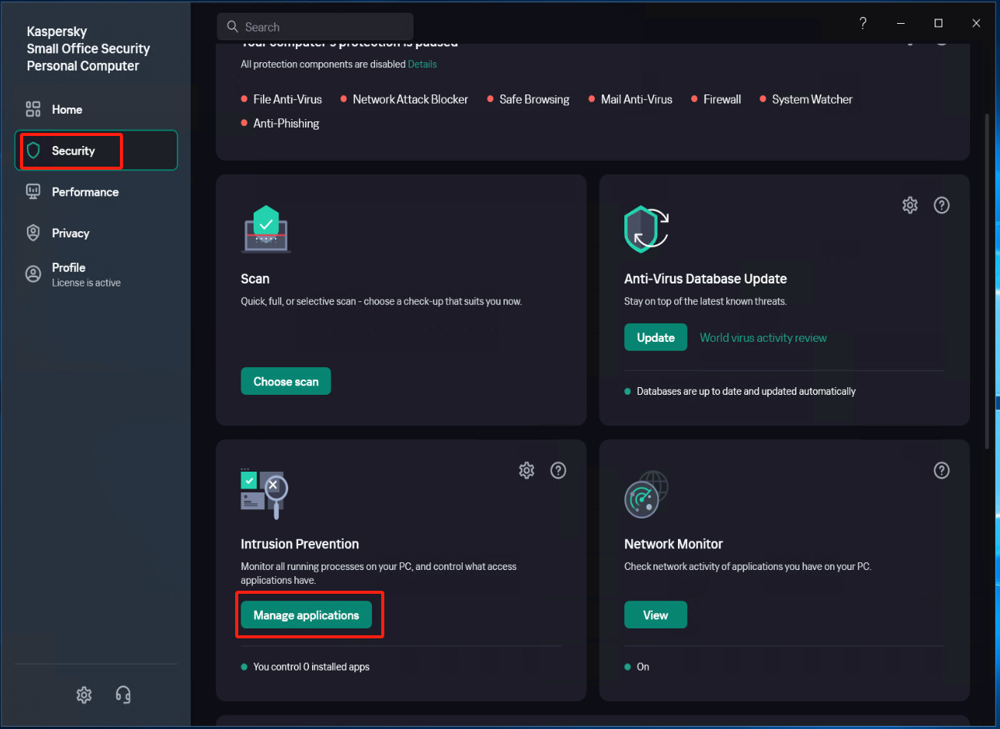

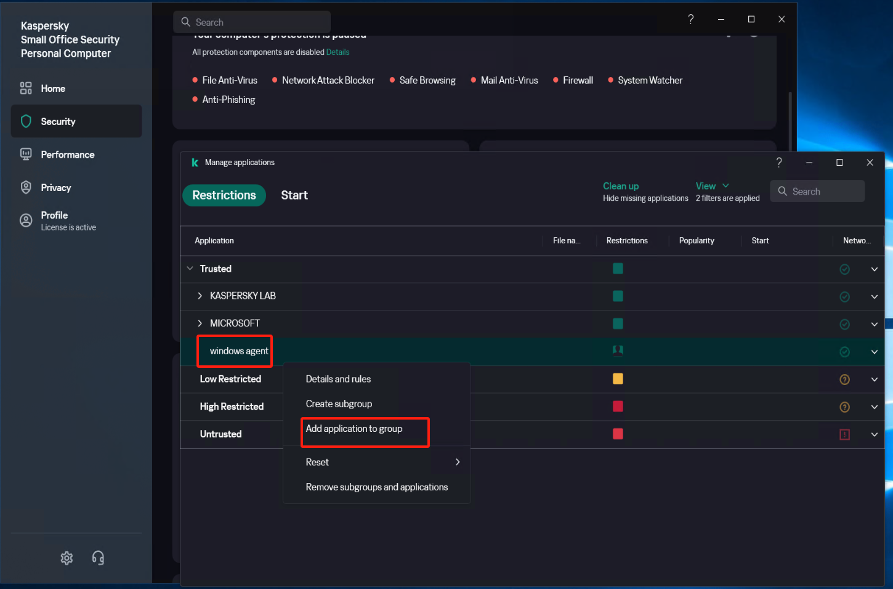

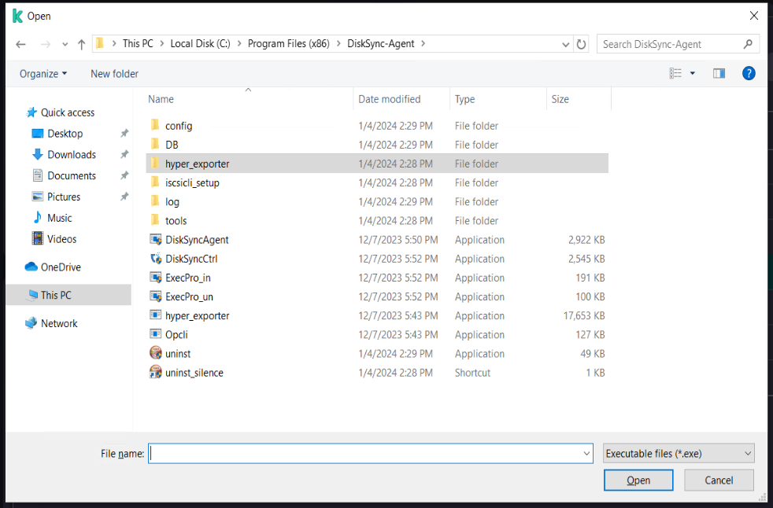

#### Modify Security settings (1)

 In [**Settings**] - [**Security Settings**] - [**File Anti-Virus**], locate the [**Actions on threat detection**] option, check [**Block**], and save the settings.


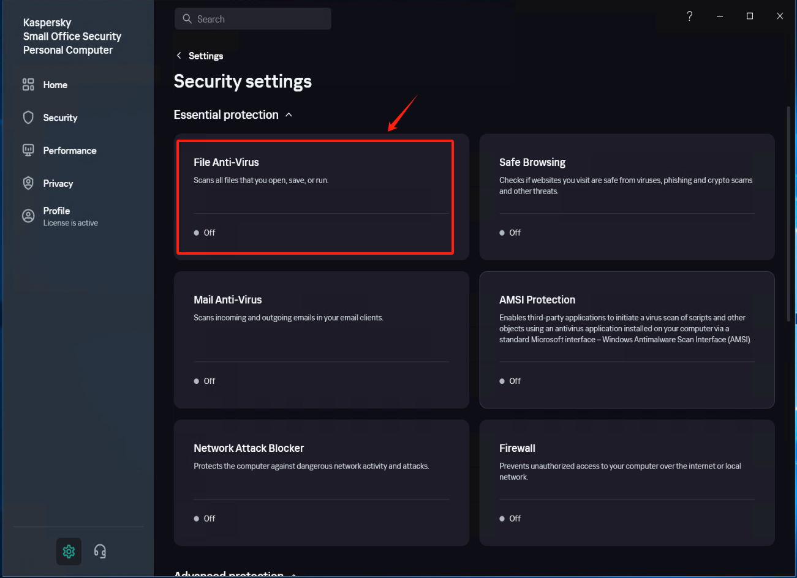


#### Modify Security settings (2)

 In [**Settings**] - [**Security Settings**] - [**Exclusions and actions on object detected**], click [**Manage Exclusions**] - [**+Add**] add the installation directory of Windows Agent as an exclusion, check [**Protect components**] - [**All components**], Click [**Add**] after confirmation.


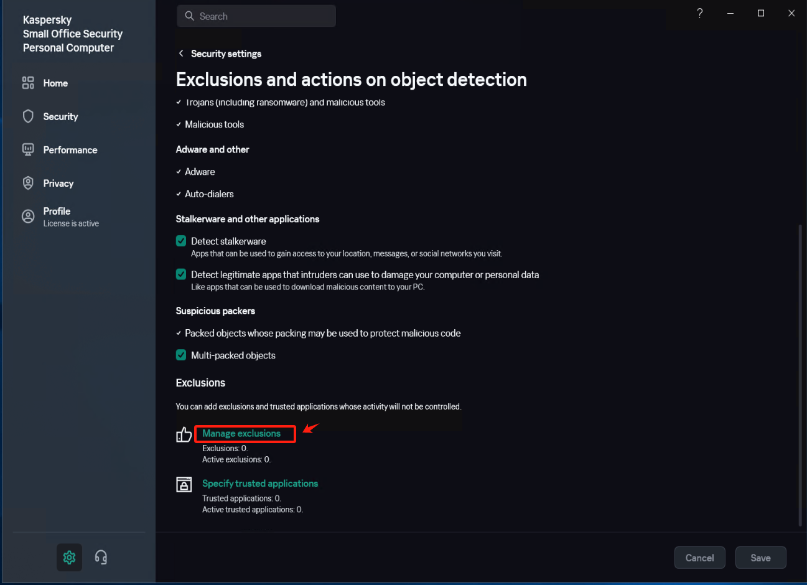

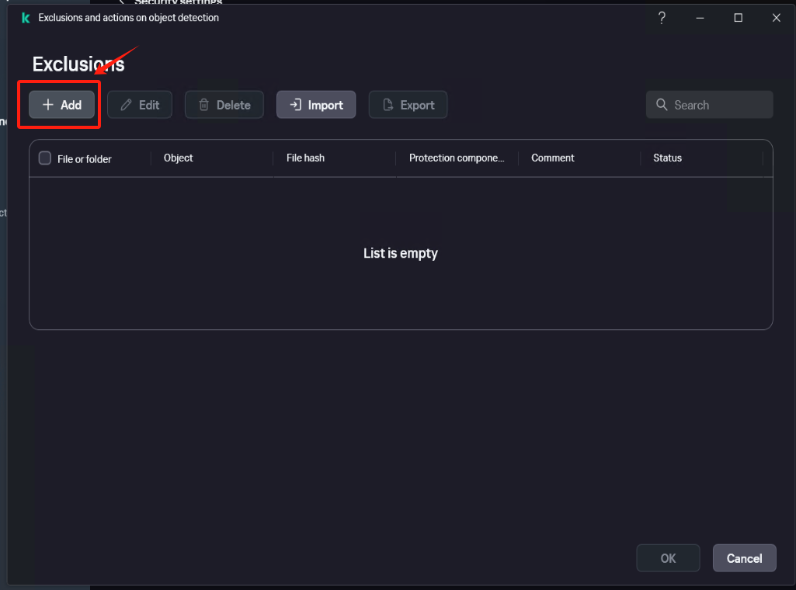


Confirm that the exclusion status is set to [**Active**].


Save the settings


#### Run Windows Agent

 Click on the Windows Agent shortcut on the desktop, start the service, and check if the registration is successful after 1-2 minutes. Verify if the service status is normal.


#### Restore Kaspersky protection status


::: warning
If any application is added to [Low Restricted] during the operation, it needs to be manually added back to the trusted group "Windows Agent."
:::


### McAfee

#### Turn off Real-Time Scanning in McAfee

Access Real-time scan from the left-side menu and click on [**Turn off**]


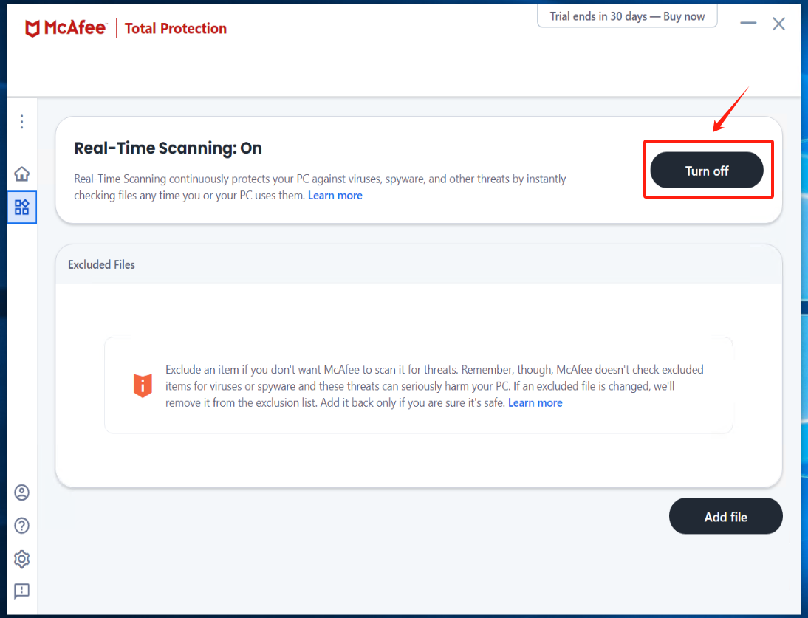
 
Check the option "**Never**" under [**When do you want to resume Real-Time Scanning?**] and click the [**Turn off**].


#### Install Windows Agent and run Windows Agent

Reference Document：[https://docs.oneprocloud.com/userguide/poc/agent-pre-settings.html#unzip-the-installation-package-and-proceed-with-the-installation](https://docs.oneprocloud.com/userguide/poc/agent-pre-settings.html#unzip-the-installation-package-and-proceed-with-the-installation)

#### Turn on Real-Time Scanning in McAfee and add Excluded files

click [**Turn on**] Real-Time Scanning


click [**Add file**] add all exe, bat, and sys files under the installation directory of Windows Agent and its subdirectory "**yper_exporter**".

::: tip
The default installation path for Windows Agent: C:\Program Files (x86)\DiskSync-Agent
:::


#### Check Quarantined items

::: warning
If there is an abnormal termination of the Windows Agent service, enter McAfee to check the Quarantined items. Select the files related to Windows Agent and proceed with the restoration.
:::

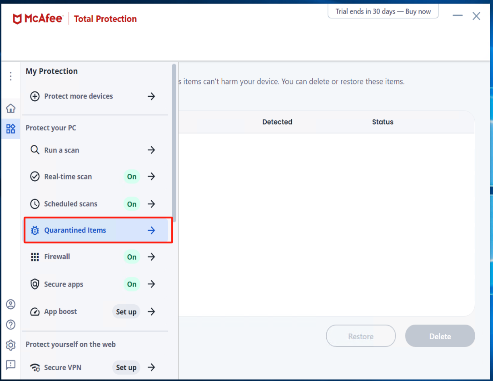


## How to Create a Failback Gateway（HyperDoor） on a Physical Machine

Physical servers can utilize the IPMI console to create a fallback gateway by loading the HyperDoor image.
::: tip
The HyperDoor image has already been downloaded to the local machine by default.
:::

### 1. Log in to the IPMI console

Open a web browser locally and enter the IPMI address of the physical machine (usually accessed through a browser, for example: https://ipmi_address).
Log in to the IPMI interface using the username and password assigned to the server.

### 2. Locate the 'Virtual Media' or a similar option

Navigate to the menu on the IPMI console, and find an option similar to 'Virtual Media' or other related options.

### 3. Choose to mount the image

In the Virtual Media menu, there is typically an option for "Mount ISO" or a similar choice. Select this option.

### 4. Upload the image file

Provide the local path of the HyperDoor image file or upload the HyperDoor image file.

### 5. Confirm the mounting

Confirm the mounting of the image. The system will use the provided image file to simulate an optical drive, allowing the server to boot from it.

### 6. Restart the server

In the IPMI console, find "Power Control" or a similar option, and select restart for the server.

### 7. Enter the BIOS/Boot Menu of the server

When the server restarts, follow the on-screen prompts to enter BIOS settings or the boot menu. This is typically done by pressing a specific key (such as F2, F10, Del, etc.).

### 8. Choose virtual media as the boot device

In the BIOS or boot menu, select virtual media as the boot device, ensuring that the system will boot from the virtual optical drive.

### 9. Save settings and exit

In the BIOS settings, save the changes and exit, allowing the system to boot from the virtual media. The system will load the HyperDoor image file.

### 10. Failback Gateway startup

After the system restarts again, it will successfully load the HyperDoor image, becoming a HyperDoor failback gateway.

::: tip
Please note that different servers and IPMI implementations may have slight variations, so be sure to refer to the documentation for specific operational guidance.
:::

## Instructions for Migration or DR on a physical machine

Due to the diverse models of underlying hardware in physical machines and the potential need for different drivers to accommodate various hardware models, it is essential to proactively query the hardware information of the physical machine, including RAID cards, disks, network cards, etc., when migrating or reverting.  

Currently, manual intervention is required for the adaptation and repair of physical machine drivers. This involves the installation of hardware drivers to ensure compatibility and functionality.

## Configuring Firewall Settings

To configure firewall settings in two different environments, please follow the steps below:

### **1: Windows 2008/2012/2016**

Access the "Windows Firewall" settings, add the "Windows Agent.exe" service to the "Allow another program through the firewall" list, as illustrated in the screenshots below:

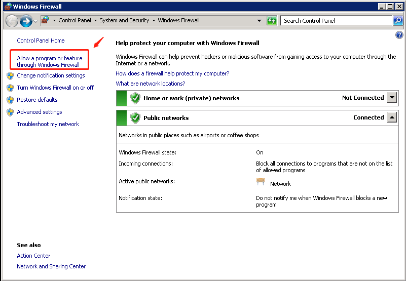

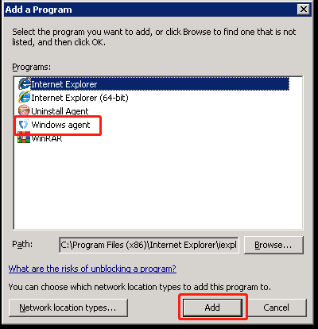


### **2. Windows 2003**

Access the "Windows Firewall" settings; click on the "Exceptions" tab, select "Add a program, click "Browse" to locate the program you want to add:


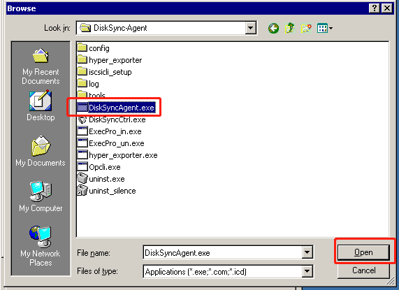

In Figure 3; select "DiskSyncAgent.exe", then click "Open".

In Figure 4, you will see "DiskSyncAgent.exe" already selected in the "Add a Program" list. Click "OK" to complete the addition. Afterward, restart the system.


_Note: The default directory for "DiskSync-Agent.exe" is "C:\Program Files\DiskSync-Agent\DiskSyncAgent.exe."_


