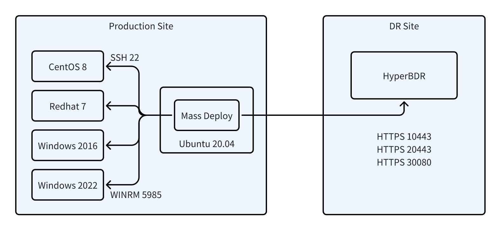

# Agent Batch Installation

## 1. Overview

This manual is applicable for the batch installation of Linux and Windows Agents for HyperMotion and HyperBDR, as well as for the batch installation and upgrade of HyperBDR rollback Agents.

During execution, if any tasks fail, only the failed tasks will be retried to improve installation efficiency.

## 2. Installation Environment Requirements

### 2.1 Operating Environment

The batch installation program must be deployed independently and is recommended to run in a production environment. The specific requirements are as follows:

- Operating System: Ubuntu 20.04
- Container Environment: Docker

### 2.2 Network Architecture



## 3. Host Requirements

| Operating System | Restrictions                                                                                                                  | Network Requirements                                                  | Permission Requirements                                                                                                                   |
| ---------------- | ----------------------------------------------------------------------------------------------------------------------------- | --------------------------------------------------------------------- | ----------------------------------------------------------------------------------------------------------------------------------------- |
| Windows          | ✅ Windows Server 2012 and above <br> ❌ Not supported for Windows Server 2008 and below (requires additional system patches) | - WinRM service must be enabled <br> - Ensure port 5985 is accessible | Must use Administrator user                                                                                                               |
| Linux            | Python ≥ 2.7 (manual installation required for lower versions)                                                                | Must support SSH connection                                           | ✅ Supports direct installation by root user <br> ✅ Supports installation with sudo permissions (passwordless switch must be configured) |

Here is a simple English translation:

## 4. Tool Preparation

### 4.1 Tool Installation

```bash
# Pull the deployment image
docker pull registry.cn-beijing.aliyuncs.com/oneprocloud-opensource/massdeploy:latest
```

### 4.2 Tool Verification

```bash
docker run --rm registry.cn-beijing.aliyuncs.com/oneprocloud-opensource/massdeploy:latest mass-deploy -version
# Output: mass-deploy 2025-02-27

docker run --rm registry.cn-beijing.aliyuncs.com/oneprocloud-opensource/massdeploy:latest hyperbdr -version
# Output: hyperbdr 0.0.1
```

## 5. Batch Installation Process

### 5.1 Configure Host List

```bash
mkdir -p ./mass-deploy && cd ./mass-deploy
```

Create the `hosts_to_install.csv` ([download](/attachments/hosts_to_install.csv)) file for batch installation. The field descriptions are as follows:

| Field Name | Required | Description                                                                                                                                                                                  |
| ---------- | -------- | -------------------------------------------------------------------------------------------------------------------------------------------------------------------------------------------- |
| ip         | Yes      | Host accessible IP address                                                                                                                                                                   |
| protocol   | Yes      | Communication protocol (winrm/ssh)                                                                                                                                                           |
| port       | Yes      | Service port (WinRM:5985 / SSH:22)                                                                                                                                                           |
| username   | Yes      | Authentication username                                                                                                                                                                      |
| password   | Yes      | Authentication password/key file path (key must be in the same directory as CSV)<br> Key file permissions should be set to 600 <br> It is recommended to use relative paths for the key file |
| os_type    | Yes      | Operating system type (windows/linux)                                                                                                                                                        |
| tag        | No       | Automatically generated by the program, task tag, blank means no tag set                                                                                                                     |
| hostname   | No       | Automatically generated by the program, hostname, blank means hostname not obtained                                                                                                          |
| os_name    | No       | Automatically generated by the program, OS name, blank means OS not recognized                                                                                                               |
| status     | No       | Automatically generated by the program, task status: deploying=deploying, success=success, failed=failed                                                                                     |
| node_uuid  | No       | Automatically generated by the program, HyperBDR registration ID, blank means not registered                                                                                                 |
| error      | No       | Automatically generated by the program, error details, shown when deployment fails                                                                                                           |

### 5.2 Start Deployment Container

```bash
docker run -itd --rm --name massdeploy \
  -v $(pwd):/root \
  registry.cn-beijing.aliyuncs.com/oneprocloud-opensource/massdeploy:latest bash
```

### 5.3 Target Host Connectivity Check

```bash
docker exec massdeploy mass-deploy ping
```

For unreachable machines, the status will be changed to `unreachable`. Subsequent connectivity checks will only check the hosts with the `unreachable` status. Sample output:

```
# docker exec massdeploy mass-deploy ping
2025-02-27 05:54:29,432 - INFO - The current working directory is /root
2025-02-27 05:54:29,433 - INFO - Successfully read 3 hosts
2025-02-27 05:54:34,345 - INFO - Host 192.168.8.21 is ok
2025-02-27 05:54:34,384 - INFO - Host 192.168.8.22 is ok
2025-02-27 05:54:35,103 - WARNING - Host 192.168.8.23 is unreachable, Failed to connect to the host via ssh: ssh: connect to host 192.168.8.23 port 22: No route to host
2025-02-27 05:54:36,803 - INFO - Host check completed. A total of 3 hosts were tested, and 1 host failed the connectivity check.
2025-02-27 05:54:36,803 - INFO - The CSV file has been saved successfully.
```

### 5.4 Obtain Agent Installation Package

```bash
docker exec massdeploy bash download-hyperbdr-agent <ConsoleIP>:Port <Username> <Password>
```

- The HyperBDR Console URL is usually: `https://<ConsoleIP>:10443`
- The HyperBDR rollback console URL is usually: `https://<ConsoleIP>:20443`
- The HyperMotion Console URL is usually: `https://<ConsoleIP>:20443`

After execution, an `agents` directory will be created under the `mass-deploy` folder, containing the following four files if the download is successful:

```
install-cli.bat
linux_agent.sh
Windows_server_32bit_beta.zip
Windows_server_64bit_beta.zip
```

### 5.5 Execute Batch Deployment

```bash
docker exec massdeploy mass-deploy deploy
```

After deployment, the status for successful hosts will be `success`, and for failed hosts, it will be `failed`.

Sample output:

```
[root@localhost ~]# docker exec massdeploy mass-deploy deploy
2025-02-27 06:14:40,538 - INFO - The current working directory is /root
2025-02-27 06:14:40,538 - INFO - Successfully read 2 hosts
2025-02-27 06:14:40,539 - INFO - Starting the deploy of 0 hosts. A total of 2 hosts, with 2 remaining.
2025-02-27 06:14:40,539 - INFO - Starting the deploy of 1 hosts. A total of 2 hosts, with 1 remaining.
2025-02-27 06:14:48,181 - ERROR - Host 192.168.7.232 deployment failed, info {"msg": "The linux agent already exists", "_ansible_no_log": null, "changed": false}
2025-02-27 06:14:48,182 - INFO - The CSV file has been saved successfully.
2025-02-27 06:17:23,404 - INFO - Host 192.168.7.235 has been successfully deployed.
2025-02-27 06:17:23,404 - INFO - The CSV file has been saved successfully.
2025-02-27 06:17:23,405 - INFO - The CSV file has been saved successfully.
```

Successful host log example:

```
INFO - Host 192.168.7.235 has been successfully deployed.
```

Failed host log example:

```
ERROR - Host 192.168.7.232 deployment failed, info {"msg": "The linux agent already exists", "_ansible_no_log": null, "changed": false}
```

## 6. Batch Upgrade Process

This tool supports batch upgrading of Agents, and upgrades can also be performed via the product page.

After completing the upgrade on the control side, you need to obtain the upgrade package and execute the upgrade command.

### 6.1 Configure Host List for Upgrade

Create the `hosts_to_upgrade.csv` ([download](/attachments/hosts_to_upgrade.csv)) file for batch upgrade.

### 6.2 Get the Upgrade Package

```bash
# Download the upgrade package
wget -O ./agents/upgrade_x86.zip https://<ConsoleIP>:30080/softwares/windows-agent-new/upgrade_x86.zip
wget -O ./agents/upgrade_agent.sh https://<ConsoleIP>:30080/softwares/upgrade_agent.sh
```

### 6.3 Perform Batch Upgrade

```
docker exec massdeploy mass-deploy upgrade
```

## 7. Advanced Features

### 7.1 Batch Command Execution

:::warning
This tool supports batch command execution, allowing you to customize the commands to be executed, but does not support scripts.
:::

```bash
docker exec massdeploy mass-deploy -t unsupported_kernel shell -os linux "uname -a"
```

- Query the kernel version of the host machines:

```bash
docker exec massdeploy mass-deploy shell -os linux "uname -a"
```

- Check if the host can connect to HyperBDR:

```bash
docker exec massdeploy mass-deploy shell -os linux ping -c 2 -w 5 <HyperBDRConsoleIP>
```

## Appendix

### How to Install Docker on Ubuntu 20.04?

```bash
# Update the existing package list
sudo apt update

# Install necessary packages to allow apt to use repositories over HTTPS
sudo apt install apt-transport-https ca-certificates curl software-properties-common

# Add Docker’s official GPG key
curl -fsSL https://download.docker.com/linux/ubuntu/gpg | sudo apt-key add -

# Add Docker stable repository
sudo add-apt-repository "deb [arch=amd64] https://download.docker.com/linux/ubuntu $(lsb_release -cs) stable"

# Update the package list again
sudo apt update

# Install Docker
sudo apt install docker-ce

# Start Docker and enable it to start on boot
sudo systemctl start docker
sudo systemctl enable docker
```

### Common Error Messages

| Error Message                                                        | Cause Analysis                                                                             |
| -------------------------------------------------------------------- | ------------------------------------------------------------------------------------------ |
| `The linux agent directory already exists`                           | The target host already has the Agent installation directory                               |
| `cat: /var/lib/egisplus-agent/registered: No such file or directory` | The Agent service was not successfully registered (usually due to service startup failure) |
| `Sorry, the current kernel version ... is not supported`             | Incompatible Linux kernel version                                                          |
| `ansible-core requires a minimum of Python2 version 2.7...`          | The Python runtime version is too low                                                      |

## Version Update Log

| Date           | Update Content                                                                             |
| -------------- | ------------------------------------------------------------------------------------------ |
| **2024/12/06** | ✅ Added label filtering feature <br> ✅ Supports task execution by specified label/IP     |
| **2024/12/02** | 🔄 Code architecture refactor <br> ⏱️ Optimized timeout mechanism (check 60s/deploy 10min) |
| **2024/11/29** | 🚦 Added unreachable status recognition <br> ⏭️ Automatically skips unreachable hosts      |
| **2024/11/28** | 👥 Supports Linux non-root user deployment                                                 |
| **2024/11/27** | 🛠️ Optimized Windows QEMU Guest Agent service handling logic                               |
