# **Dashboard Overview**

The dashboard provides an overview of the production platform, data storage, and Migration platform in the current environment. It helps users quickly understand the status of system resources, sync progress, task results, alert events, and other key information, supporting unified monitoring and decision-making for administrators.

## **Page Structure and Function Description**

This section helps users quickly understand the purpose and navigation of each module. By explaining each area of the page, users can fully grasp the system's entry points and core resource status, providing guidance for further operations and management.

### **Top Navigation Bar**

The top navigation bar provides quick access to the main system modules, including: **Dashboard, Migration, Configuration, Operations, Monitor & Alerts, Settings**.

The upper right area displays the current logged-in user, system time (with time zone), and language settings for easy viewing and personalization.

### **Core System Structure Overview**

Shows the three core components of the system architecture: **Migration Source → Storage → Target Platform**

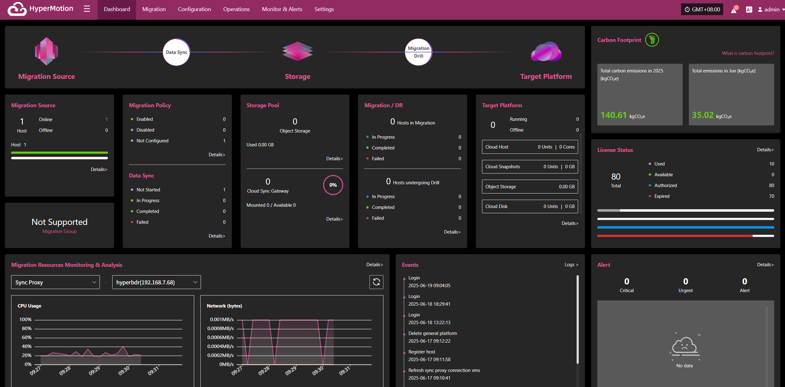

### **Section Descriptions**

The dashboard displays the current status and operational data of various resources, including production platform, Migration policies, sync progress, storage configuration, resource recovery drills, and alert events. Each section supports navigation to the corresponding module page for more details and actions.

#### **Production**

Displays an overview of production resources connected to the system, including the total number of hosts and their running status, helping users quickly understand the overall load of the production environment.

Click the **Details** button in the lower right to go to the Migration resources page for detailed host information and Migration configuration status.

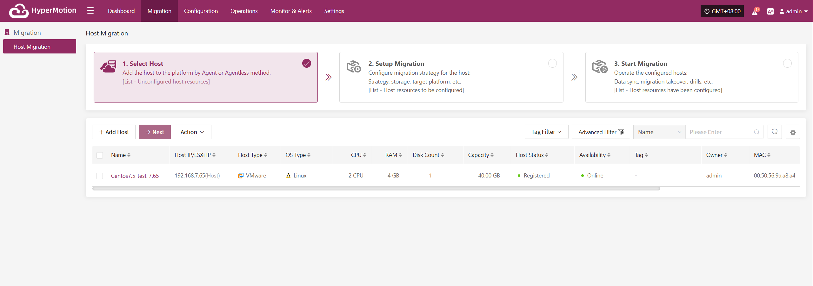

#### **Migration Policy**

Displays the Migration policy configuration status for production hosts, helping users quickly identify how many hosts are protected by Migration.

Click the **Details** button in the lower right to go to the "Start Migration" page, where you can select target hosts and associate policies.

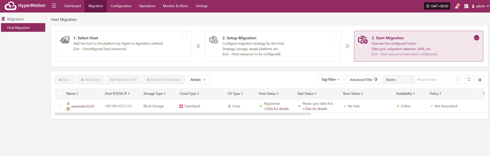

#### **Data Sync**

Shows the overall progress of data synchronization from source hosts, which is an important indicator of Migration readiness.

Click the **Details** button in the lower right to go to the "Start Migration" page, where you can select hosts and perform immediate sync operations.

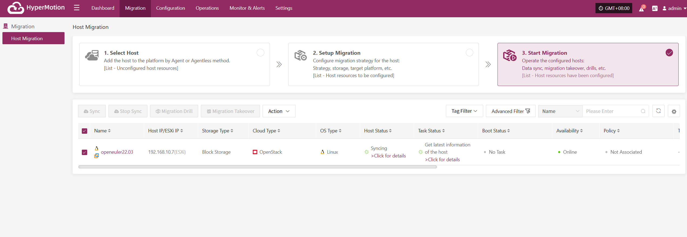

#### **Storage Pool**

##### **Cloud Sync Gateway**

Click the **Details** button in the lower right to go to the storage configuration page for block storage management.

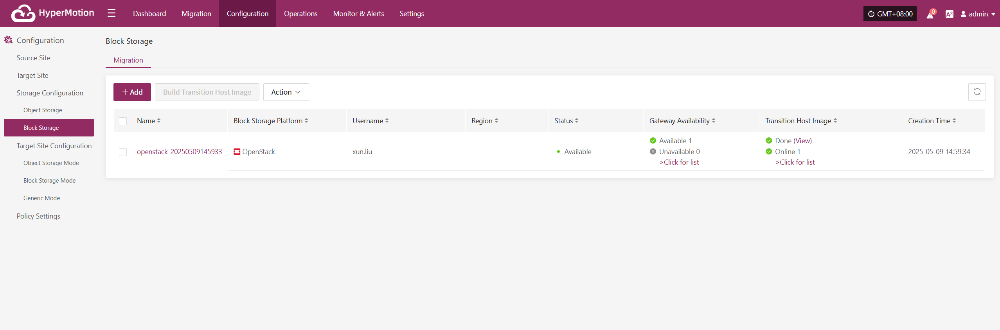

#### **Restore / Migration Drill**

The "Restore / Migration Drill" area shows the recovery status of Migration resources on the platform, helping users quickly understand resource protection and drill status.

##### **Restore**
Shows the number of resources under "Restore" management, as well as the number of resources in restoring, restored, and failed states.

##### **Migration**
Shows the number of resources under "Drill" management, as well as the number of resources in drilling, drill success, and drill failure states.

Click the **Details** button in the lower right to go to the "Start Migration" page for drill and takeover operations on hosts.

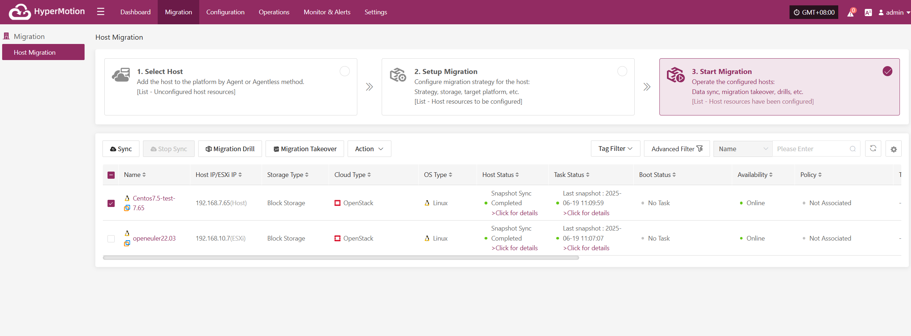

#### **Migration Site**

Displays the number of successfully and unsuccessfully connected Migration sites, as well as detailed configuration information.

Click the **Details** button to go to the "Start Migration" page for related operations.

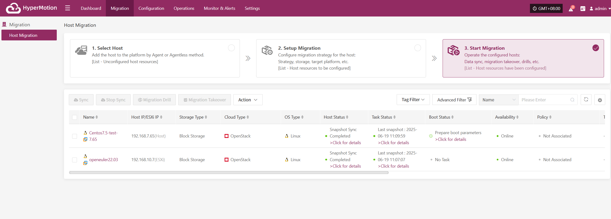

#### **Migration Resources Monitoring & Analysis**

This module provides real-time statistics and visualizations of the overall health, configuration, and usage of key Migration resources, helping users quickly understand the stability of the Migration system.

Users can select different monitoring resources from the dropdown list. Supported resource types and monitoring metrics include:

| **Resource Type**      | **Monitoring Metrics**  |
| ------------- | --------- |
| Sync Proxy        | CPU Usage, Network (bytes) |
| Cloud Sync Gateway         | CPU Usage, Network (bytes) |
| Linux Agent   | CPU Usage, Network (bytes) |
| Windows Agent | CPU Usage, Network (bytes) |

Click the **Details** button in the upper right to go to the system monitoring page for more information.

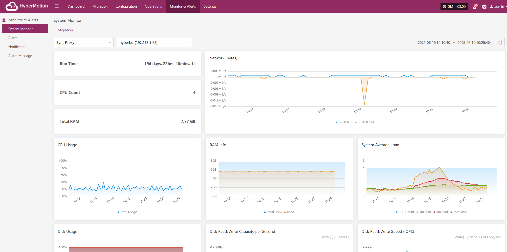

#### **Events**

This module displays key dynamic information related to the user, helping users quickly understand system status and task progress through real-time event aggregation and classification.

Click the **Operation Log** button in the upper right to go to the audit log page for detailed event logs.

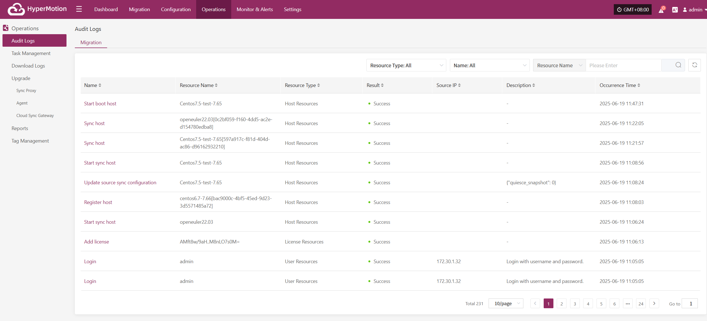

#### **Alarm Message**

Displays alert messages triggered by the alarm system, helping users stay informed of system exceptions.

Click the **Details** button in the upper right to go to the alert messages page for more information.

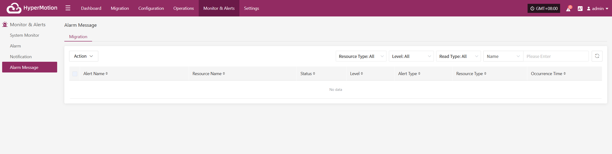

#### **License Status**

Shows the number, usage status, and validity of activation codes, helping administrators efficiently manage license resources.

Click the **Details** button in the upper right to go to the license management page for more information and to add or export licenses.

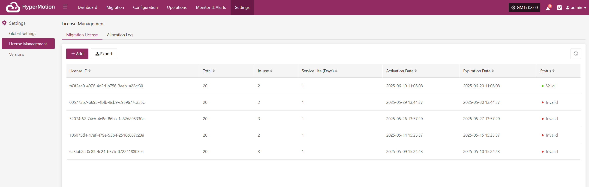

#### **Carbon Footprint**

User's carbon emission data is calculated based on the usage of cloud resources. When calculating the carbon emissions data for cloud products, factors such as Power Usage Effectiveness (PUE) of different cloud data centers in different countries or regions, resource sales, the proportion of renewable energy usage, and technological carbon reduction measures are taken into account. Therefore, the calculated carbon emissions data may vary for different regions or within different months, which is considered normal.

The cloud product carbon footprint covers various cloud products, including computing, storage, networking, databases, CDN, etc. During the calculation process, only the resources generated in actual business scenarios are taken into account.