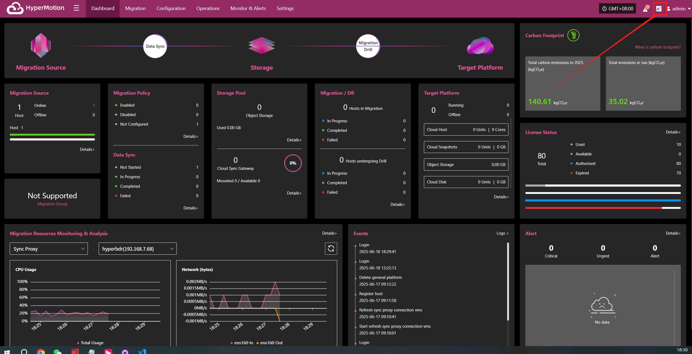
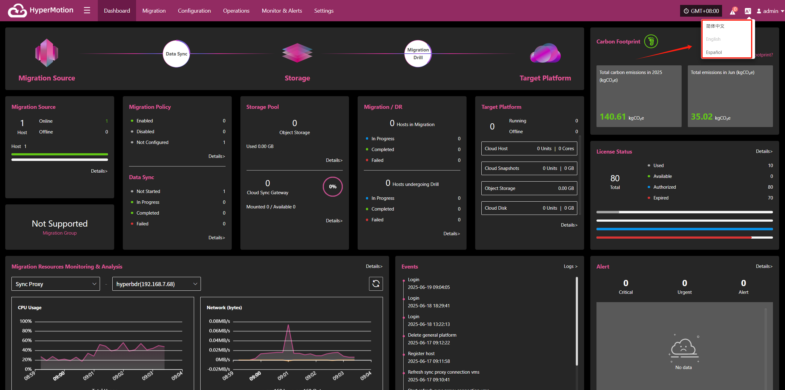

# **Language Switch**

* The system currently supports the following languages:

  * 简体中文

  * English

  * Español

* To change the display language in the system interface:

  * Click the "A icon" in the upper right corner to open the dropdown menu.

    

  * In the language list that appears, select your preferred language, such as "Simplified Chinese" or "English".

    > The default language is Simplified Chinese.

    

After switching, the system will automatically refresh and display the selected language.