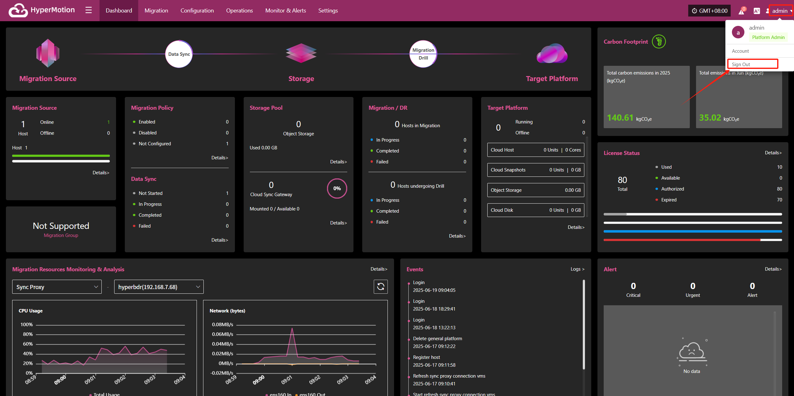

# **Logout**

* To safely log out of your account, follow these steps:

  * Click your username in the upper right corner of the page to open the dropdown menu.

  * Click the "Sign Out" option. You will be securely logged out and returned to the login page.

    

  You will be securely logged out and redirected to the login page.
  > Note: Simply closing the browser window may not end your session. It is recommended to use the logout option above to prevent unauthorized access to your account and avoid unnecessary risks.