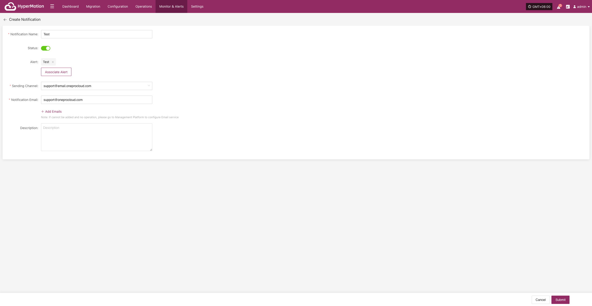
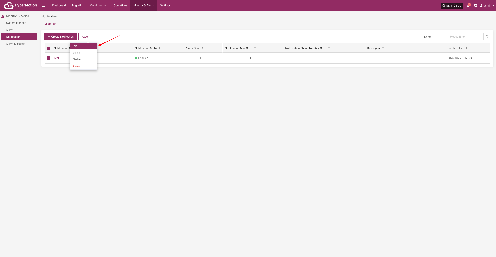
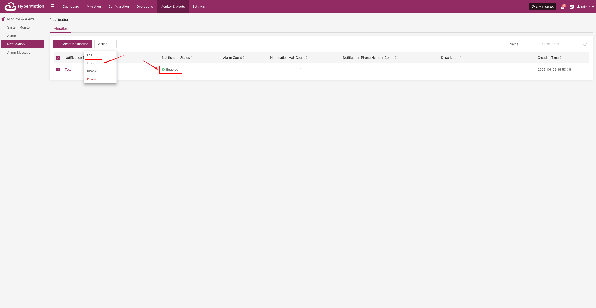
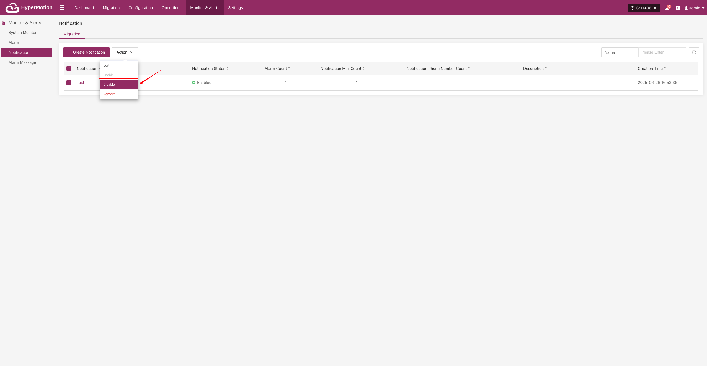
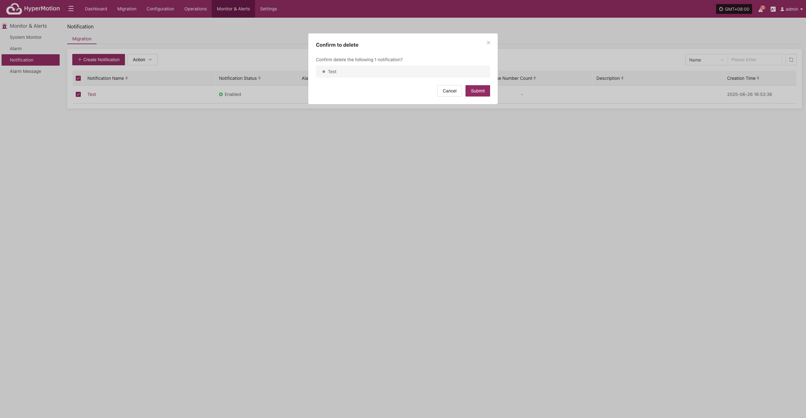

# Notification

When an alert occurs, the system will notify designated people or groups. Notification recipients can receive alerts by email, SMS, phone, or other methods to ensure timely awareness and response.

> If no email or SMS service is configured for notification recipients, you cannot create notification users. Please go to [O&M Platform] -> [Notification Settings] to configure.

## Migration

### Create Notification

Go to [Monitoring & Alerts], select [Notification Recipients] under [Migration], then click [Create Notification Recipient].

Fill in the required information as prompted to complete the notification recipient setup, ensuring that relevant personnel can receive alerts in time.

|   **Field Name**   |    **Field Info**     |                        **Description**                        |
| :----------------: | :-------------------: | :-----------------------------------------------------------: |
| Notification Name  |         test          |                Name of the notification object                |
|       Status       |        Enabled        |              Whether the notification is active               |
|       Alert        |         dame1         |                    Name of the alert rule                     |
|  Sending Channel   | dianzheng0410@163.com | Channel for sending notifications, e.g., email adMigrationess |
| Notification Email |      XXX@qq.com       |     Email(s) to receive notifications (multiple allowed)      |
|    Description     |                       |                Additional notes or description                |

### Action

After selecting a notification recipient, you can manage it by editing, enabling, disabling, or removing.

#### Edit

- Click [Edit] to go to the edit page, where you can update the alert configuration.

  

#### Enable

- Enabled notification recipients cannot be edited. To change the configuration, please disable it first.

  

#### Disable

- Disabled notification recipients cannot be edited. To change the configuration, please enable it first.

  

#### Remove

- Click [Remove] to trigger a confirmation. After confirming, the system will delete the notification recipient and remove its association with related alerts.

  
