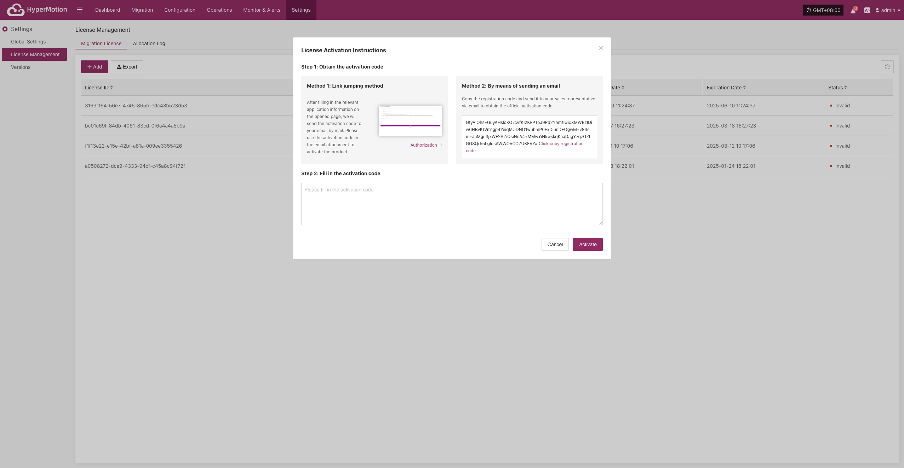
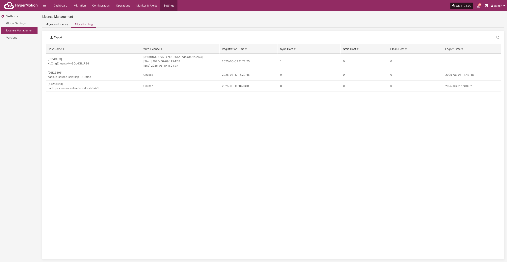

# **License Management**

## **Migration License**

The Migration License controls the use of Migration features for different resources on the platform. It ensures users have the proper authorization to perform Migration, takeover, and data restore operations.

### **Add License**

Go to **Settings > License Management > Migration License**, click **"Add"**, fill in the required information as prompted, and enter a valid license code to complete the authorization.

## **Allocation Log**

This page displays basic information and operation status for all connected hosts, helping O&M staff track host lifecycle, license usage, and key operation history.

### **Export Operation Records**

Go to **Settings > License Management > Allocation Log**, click **"Export"** to download host information and operation status.

