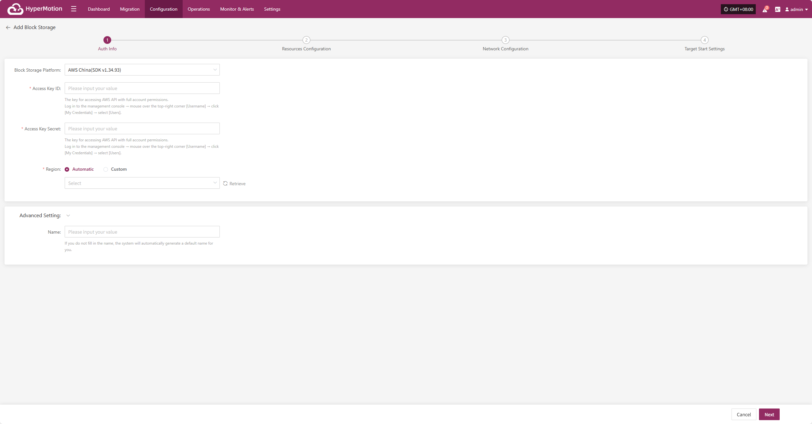
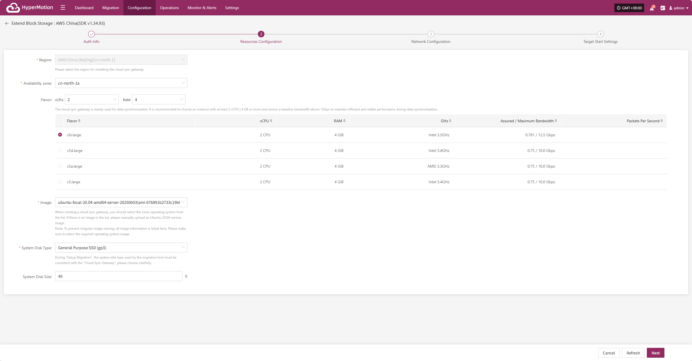
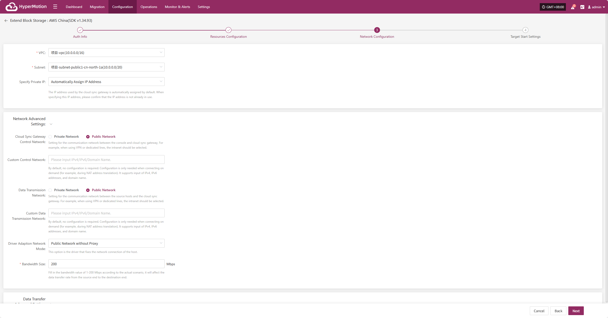
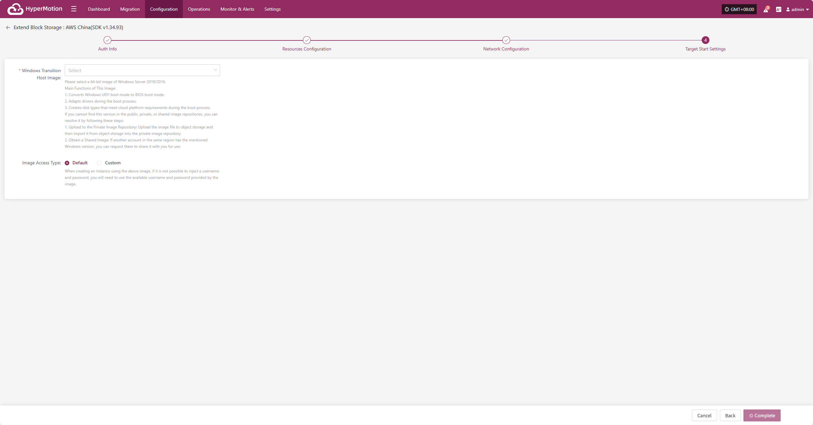

# **AWS China (SDK v1.34.93)**

## **Add Block Storage**

From the top navigation bar, select **"Configuration" → "Storage Configuration" → "Block Storage"** to enter the block storage page. Click the "Add" button in the upper right corner to add a new block storage configuration.

### **Auth Info**

Select "AWS China (SDK v1.34.93)" from the block storage platform dropdown list. Fill in the following authentication information according to your actual environment:

> If you're unsure how to obtain the relevant information, you can click 'Click to View' below for detailed instructions: 
> [👉 Click to View](../../poc/aws-target-pre-settings.html#create-aws-iam-account-for-dr-purpose)

* Auth Info Description

| **Field**           | **Example**                          | **Description**                                                                           |
|---------------------|--------------------------------------|-------------------------------------------------------------------------------------------|
| Block Storage Platform | AWS China (SDK v1.34.93)           | Select AWS China (SDK v1.34.93) from the dropdown list                                    |
| Access Key ID         | AKIA5SII3Q•••••••••••••••           | The key for accessing AWS API with full account permissions. Log in to the AWS console → hover over the top-right [Username] → click [My Credentials] → select [Users]. |
| Access Key Secret     | ••••••••••••••••••••••••••••••••    | The secret for accessing AWS API with full account permissions. Log in as above.           |
| Region               | Automatic / Custom                   | In automatic mode, click "Refresh" to get the latest regions. Select the required AWS region from the dropdown list. |
| Name                 | test                                 | If not specified, the system will generate a default name for you.                        |

After filling in the authentication information, click **"Next"** to proceed to **"Resource Configuration"**.

### **Resource Configuration**

Allocate computing and storage resources for the Cloud Sync Gateway to ensure stable and efficient operation in the target environment.

* Resource Configuration Description

| Field   | Example                                      | Description                                                                                                         |
| ------- | -------------------------------------------- | -------------------------------------------------------------------------------------------------------------------|
| Region  | China (Beijing) [cn-north-1]                 | Select the region where the Cloud Sync Gateway will be installed                                                    |
| Availability Zone | cn-north-1a                        | Select the availability zone within the region from the dropdown list                                               |
| Flavor  | Select vCPU and memory as needed from the dropdown. After selection, the example specs below will refresh automatically. | The Cloud Sync Gateway is mainly used for data synchronization. It is recommended to choose at least 2 vCPU and 4 GB or above, and ensure the base bandwidth is higher than 1Gbps for stable and efficient data sync. |
| Image   | Select the corresponding Linux image from the dropdown | When creating the Cloud Sync Gateway, select a Linux OS image from the list. If not available, manually upload an Ubuntu 20.04 image. Note: To avoid naming issues, all images are listed. Please select the required OS image. |
| System Disk Type | General SSD (gp3) / General SSD (gp2) | Select as needed                                                                                                    |
| System Disk Size | User-defined (based on instance needs) | Choose the appropriate size based on the workload. Default is 40GB.                                                 |

After resource configuration, click **"Next"** to proceed to **"Network Configuration"**.

### **Network Configuration**

Allocate network resources for the Cloud Sync Gateway to ensure stable and efficient operation in the target environment.

* Network Configuration Description

| **Field** | **Example**                                                 | **Description**                                                                     |
|-----------|-------------------------------------------------------------|-------------------------------------------------------------------------------------|
| VPC       | project-vpc (xxx.xxx.xxx.xxx/xx)                            | Select the private network for the Cloud Sync Gateway from the dropdown list         |
| Subnet    | project-subnet-public1-cn-north-1a (xxx.xxx.xxx.xxx/xx)     | Select the subnet within the availability zone from the dropdown list                |
| Specify Private IP | Auto-assign IP address                             | By default, the IP address is assigned automatically. To specify, select manual assignment from the dropdown. Make sure the IP is not already in use. |

* Network Advanced Settings

| **Field**                  | **Example**                                   | **Description**                                                                 |
|----------------------------|-----------------------------------------------|---------------------------------------------------------------------------------|
| Cloud Sync Gateway Control Network | Internal / Public                     | Set the control network between the console and the Cloud Sync Gateway. For VPN or dedicated line, select Internal. |
| Custom Control Network     | Enter IPv4/IPv6/domain name                   | Usually not required. Configure only if needed (e.g., for NAT). Supports IPv4, IPv6, and domain names. |
| Data Transmission Network  | Internal / Public                             | Set the data transfer network between the source and the Cloud Sync Gateway. For VPN or dedicated line, select Internal. |
| Custom Data Transmission Network | Enter IPv4/IPv6/domain name             | Usually not required. Configure only if needed (e.g., for NAT). Supports IPv4, IPv6, and domain names. |
| Driver Adaption Network Mode | Public network without proxy Internal network without proxy Public network via Cloud Sync Gateway proxy Internal network via Cloud Sync Gateway proxy  | Network connection mode for driver adaption host                                 |
| Bandwidth Size             | 200 Mbps                                      | Enter a value between 1-200 Mbps as needed. This affects the data transfer rate from source to target. |

* Data Transfer Advanced Setting

| **Field**             | **Options**                   | **Description**                                                                                 |
|-----------------------|------------------------------|------------------------------------------------------------------------------------------------|
| Data Transfer Protocol| S3Block / iSCSI (Not Recommended) | The protocol for data transfer between the source and the sync gateway. S3Block is widely used for WAN and is more suitable for data transfer. iSCSI is for storage networks and suitable for stable network environments. |

After network configuration, click **"Next"** to proceed to **"Target Start Settings"**.

### **Target Start Settings**

Configure the key parameters required for starting the target during recovery or drill, ensuring resources can take over and run smoothly.

* Target Start Settings Description

| **Field**                | **Example**                                         | **Description** |
|--------------------------|-----------------------------------------------------|-----------------|
| **Windows Transition Host Image** | Windows Server-2019-English-Full-Base-2025.05.15 | Please select a 64-bit image of Windows Server 2019/2016.  **Main Functions:** 1. Convert Windows UEFI boot mode to BIOS boot mode. 2. Adapt drivers during boot. 3. Create disk types that meet cloud platform requirements.  If you cannot find this version in the public, private, or shared image repositories, you can: 1. **Upload to Private Image Repository**: Upload the image file to object storage, then import it into the private image repository. 2. **Obtain a Shared Image**: If another account in the same region has this Windows version, you can request them to share it with you. |
| **Image Access Method**  | Default / Custom                                   | If you cannot inject username and password when creating an instance with this image, use the available username and password for the image. |

After completing the target start settings, click **"Complete"**. The system will automatically create the Cloud Sync Gateway and transition host image.

<!-- @include: ./huawei.md#snippet -->