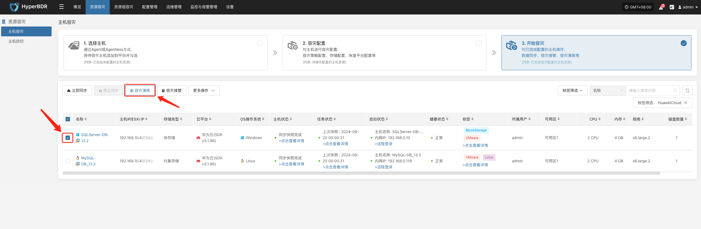
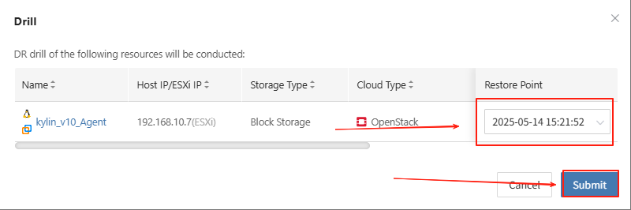
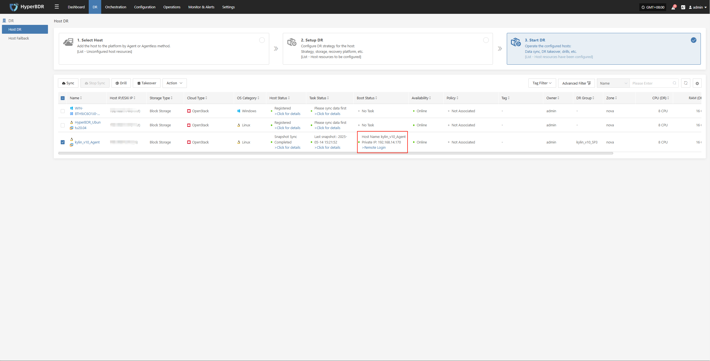

# Drill Process

## Trigger a Disaster Scenario

* Manually or via script, simulate failures such as stopping the source server, power outage, or network isolation.

* Confirm that monitoring alerts are triggered correctly and that the HyperBDR console displays the fault information in real time.

## Start the Disaster Recovery Drill Process

* In the HyperBDR console, select the corresponding DR host, click "Drill," choose the recovery point in time, and restore the DR host to the target environment with one click.

The system will automatically create or start the target instance based on the pre-configured resource orchestration (compute, storage, network, etc.). Once the startup is complete, you can log in to the target platform for verification and business drill.

Monitor the recovery progress to ensure that key business drills are completed within the expected RTO.

## Business Verification

* After recovery, check whether application services, databases, load balancers, etc. are functioning properly.

* Perform data consistency checks to confirm that business functions are fully available.