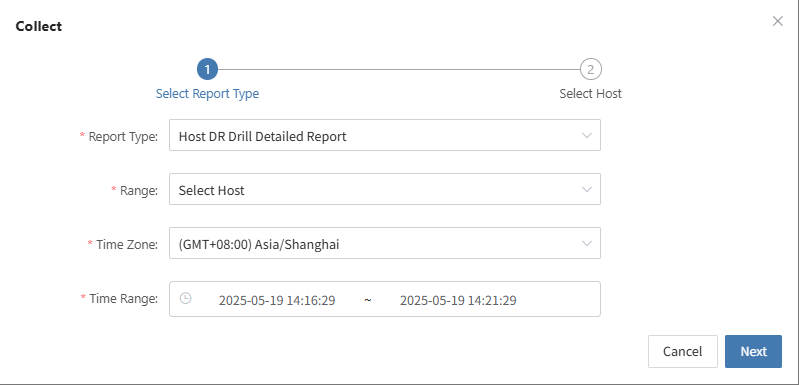

# Drill Verification and Report

## Evaluation of Drill Results

* Compare the actual recovery time with the preset RTO/RPO to see if the targets are met.

* Record and analyze any exceptions, failure points, and the time taken to resolve them during the drill.

## Writing of the Drill Report

* The report should include drill objectives, execution steps, result analysis, identified issues, and improvement measures.

You can use the platform's "Operations -- Report" feature to select the host involved in this drill and export a detailed disaster recovery drill report.

* Distribute the report to relevant teams (business, management, audit) to ensure closed-loop management.

## Subsequent Optimization

* Based on issues found during the drill, adjust backup strategies, resource allocation, or failure handling processes.

* Update documentation and automation scripts to improve efficiency for future drills and real disaster recovery scenarios.