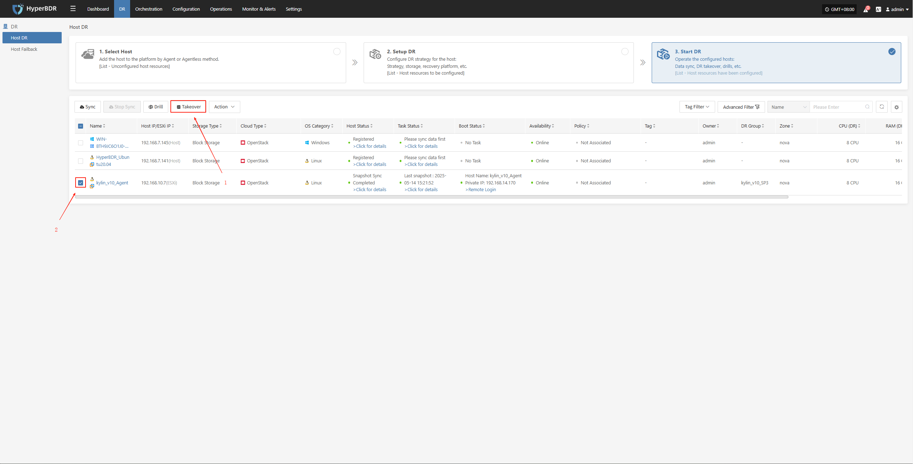
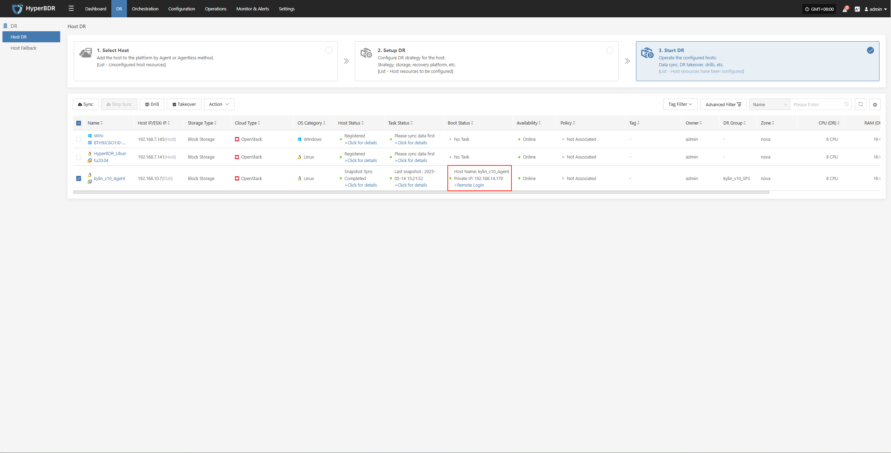
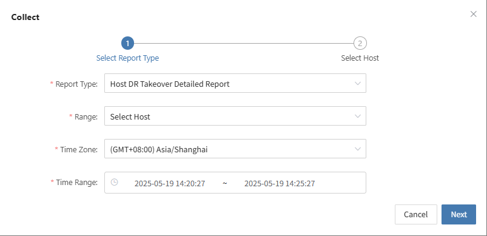

# Takeover Process

## Perform Takeover

* In the HyperBDR console, select the "Takeover" function for the corresponding business host, choose the desired recovery snapshot point, and click Confirm.

The system will automatically create or start the target instance based on the pre-configured resource orchestration (compute, storage, network, etc.). Once the startup is complete, you can log in to the target platform for verification, configuration, and business takeover.

## Data Verification

* After the business is started, check whether the database version, application service configuration, and dependent services (such as cache, message queue) are functioning properly.

* If needed, perform partial traffic testing in the DR environment first. After confirming business functionality, proceed with a full switchover.

## DNS/Load Balancing Switch

* Modify DNS resolution or load balancing policies to direct user traffic to the DR environment.

* Monitor traffic changes to ensure normal business access after the takeover.

## Fault Takeover Switch Completed

* Record the completion time of the takeover and continuously monitor system metrics on the dashboard.

* Communicate with business stakeholders to verify that functionality and performance meet expectations.

## Export the Business Takeover Report

You can use the platform's "Operations -- Report" feature to select the host involved in this takeover and export a detailed disaster recovery takeover report.

Archive and further analyze the exported business takeover report to identify any steps or processes that can be optimized.