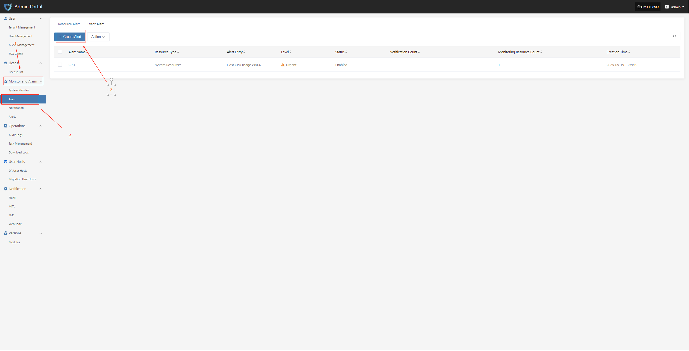
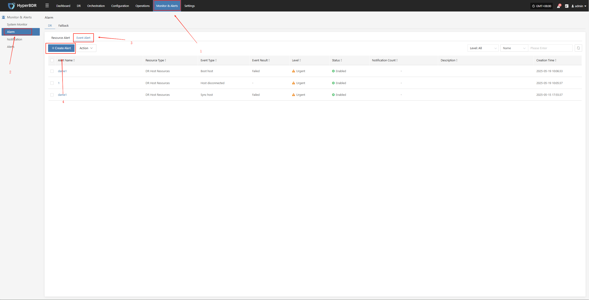

# Alarm Best Practice

## Resource Alarm

To ensure system stability and controllable resource usage, basic alarm thresholds have been set for key resources such as CPU, memory, and disk. When resource usage exceeds the preset warning value, the system will automatically trigger an alarm notification, allowing O&M personnel to respond and handle it in time to avoid resource bottlenecks affecting business operations.

| Resource Type | Alarm Metric                | Alarm Rule                | Alarm Level | Note |
|:-------------:|:--------------------------:|:-------------------------:|:-----------:|:----:|
| Host          | CPU Usage                  | ≥ 80%, sustained for 5 min| Critical    |      |
| Host          | Memory Usage Percentage    | ≥ 80%, sustained for 5 min| Critical    |      |
| Host          | Root Disk Usage Percentage | ≥ 80%, sustained for 5 min| Critical    |      |
| Host          | Number of Unhealthy Containers | ≥ 1, sustained for 5 min | Critical    |      |
| RabbitMQ      | Queue Message Count        | ≥ 10, sustained for 5 min | Critical    |      |

### Configuration Example: CPU Resource Alarm

* Log in to the O&M management platform: IP:30443

  

  * Monitor and Alarm -- Alarm -- Create Alert

    

  * Fill in the corresponding level name as needed, and clarify the monitoring scope according to the table above

    

  * Complete the creation

    

## Event Alarm

To ensure the security and observability of system operations, event monitoring strategies have been set for key operational behaviors and abnormal states of DR hosts. When events such as host disconnection, sync failure, or startup exception are detected, the system will automatically record and trigger alarm notifications to help O&M personnel quickly locate and handle issues, reducing the impact of potential risks on business.

| Monitored Resource | Event Type   | Event Result | Alarm Level | Note |
|:------------------:|:------------:|:------------:|:-----------:|:----:|
| Event              | Host Disconnected | Success   | Critical    |      |
| Event              | Sync Host         | Failure   | Critical    |      |
| Event              | Boot Host        | Failure   | Critical    |      |

### Configuration Example: Sync Data Failure Alarm

* Log in to the console: IP:10443

  

  * Monitor & Alerts -- Alarm -- Event Alerts -- Create Alerts

    

  * Select and fill in the corresponding monitored event type as needed

    

  * Specify the event result type

    

  * Complete the creation

    