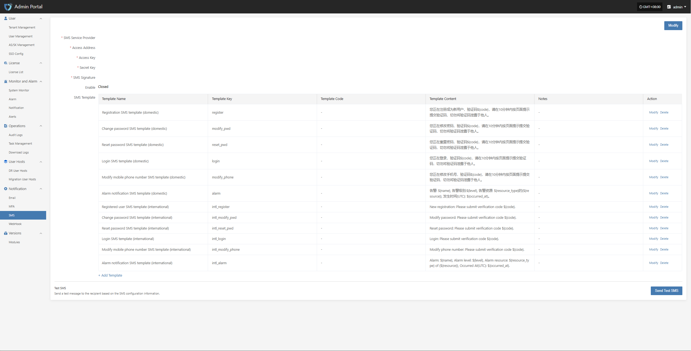

# Monitoring Alerts

## Alarm Threshold Setting

* Set reasonable thresholds and levels (warning, critical, emergency) for core metrics such as CPU, memory, network, and task failure rate.

* For key task events (such as backup tasks), stricter alarm conditions can be set.

Currently, alarms can be created for both resources and events.

* Create Resource Alarm

Define the alarm name, alarm level, and resource type. Configure resource alarms for CPU, memory, disk, and processes. When the threshold is reached, an alarm event will be triggered.

* Create Event Alarm

Define the event alarm name, alarm level, and event type. Configure event alarms for disaster recovery host resources, production platform resources, disaster recovery platform resources, etc. When the event is triggered, an alarm event will be sent.

* Important Alarm Metrics

  * Event type: DR host resource "Host disconnected", event result "Success".

  * Event type: DR host resource "Sync host", event result "Failure".

  * Event type: DR host resource "Boot host", event result "Failure".

Other monitoring metrics can be configured as needed.

## Multi-channel Notification

* Configure multiple alarm channels such as email, SMS, and IM (e.g., DingTalk, WeChat Work) to ensure timely awareness of issues.

* Email alarm channel

* SMS alarm channel

* WebHook alarm channel

## Alarm Response Process

* After receiving an alarm, O&M staff should investigate and handle the issue within the specified SLA time.

* After processing, update the ticket system or logs to record the cause, steps, and result of the incident.