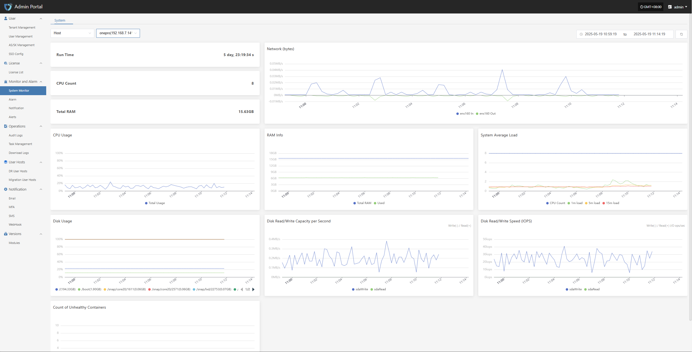
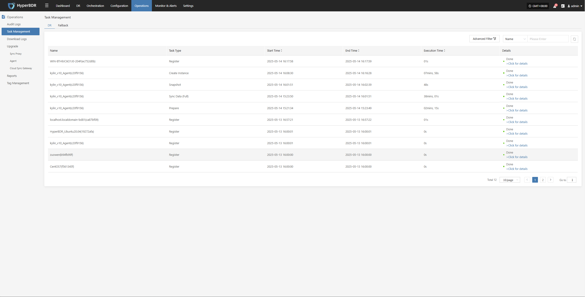
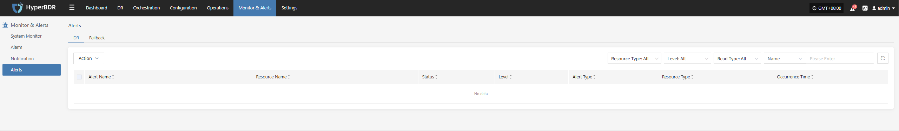
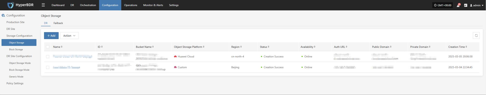
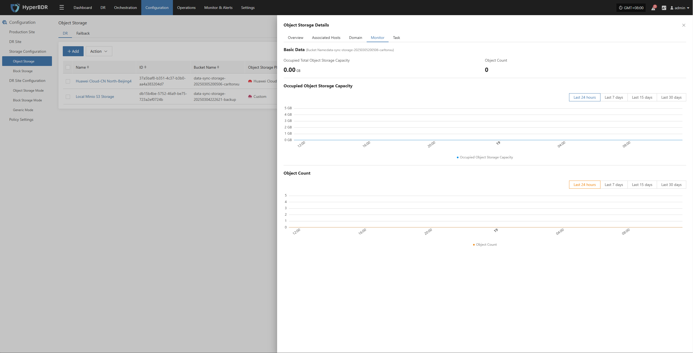
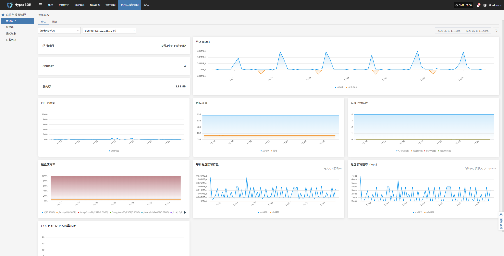
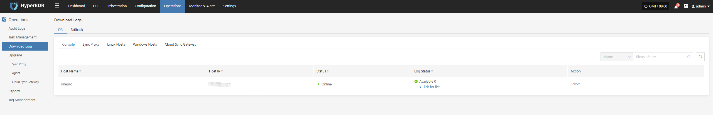

# **Daliy Operation Maintenance**

## **Routine Checks**

### **System Health Check**

* **Console Status**: Log in to the HyperBDR Operations & Maintenance Management Platform and check the running status of each module, as well as the usage of key resources such as CPU, memory, and storage.

* **Backup Task List**: Review the execution status of all backup tasks to confirm if there are any failed or excessively delayed tasks.

* **Logs and Alerts**: Use the log management module to check for abnormal alerts or error logs.

### **Network Connectivity**

* Ensure that the network connection between the source (production environment) and the target (disaster recovery environment or cloud platform) is stable and has sufficient bandwidth.

* If using VPN, dedicated line, or VPC Endpoint, regularly check the tunnel status.

### **Cloud Accounts and Authorization**

* Regularly verify the validity of cloud platform accounts and check if any keys have expired.

* Review account permissions to avoid excessive privileges or missing critical permissions that could cause backup or recovery failures.

## **Resource Monitoring and Backup Task Inspection**

### **Resource Monitoring**

* **Storage Space**: Check the remaining capacity of object storage, block storage, and database storage. If space is insufficient, expand capacity or clean up historical snapshots in time.

* **Network Throughput**: Monitor bandwidth usage during backup peak periods. Upgrade bandwidth or adjust backup schedules as needed.

### **Backup Task Inspection**

* **Backup Strategy**: Review backup strategies (full/incremental) weekly or monthly, and adjust backup frequency and retention periods according to business changes.

* **Data Consistency Check**: Regularly verify backup data or perform sample recovery tests to ensure data integrity and availability.

* **Handling Abnormal Tasks**: Analyze the causes of failed backup tasks (network, permissions, storage space, etc.), fix issues promptly, and re-execute the tasks.

## **Log Export**

The log management feature allows you to quickly collect logs from service components for further analysis and troubleshooting when issues occur.

* Console

* Source Sync Proxy

* Linux Host

* Windows Host

