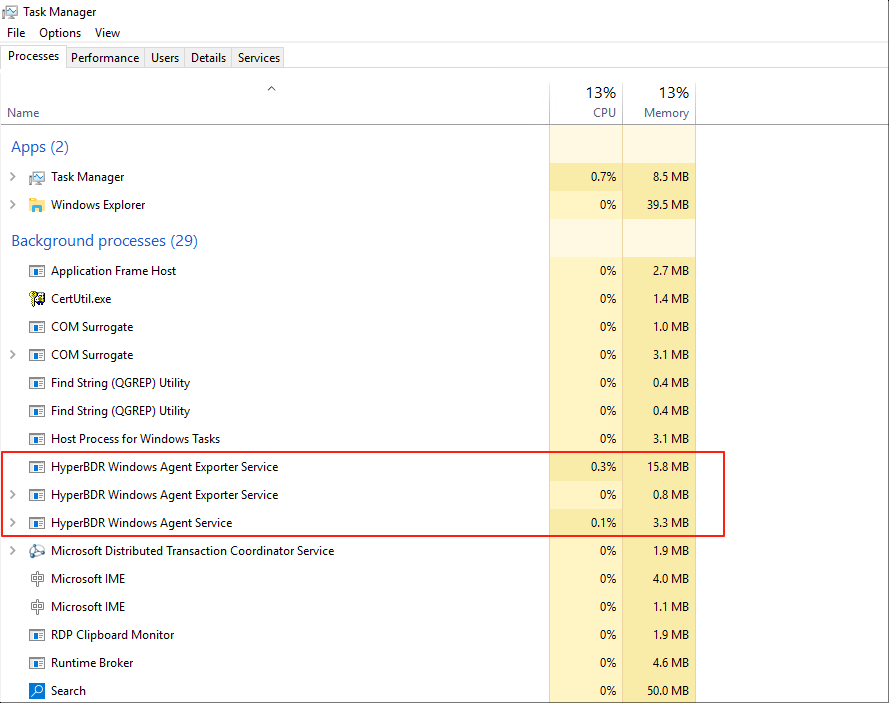
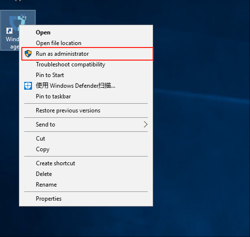
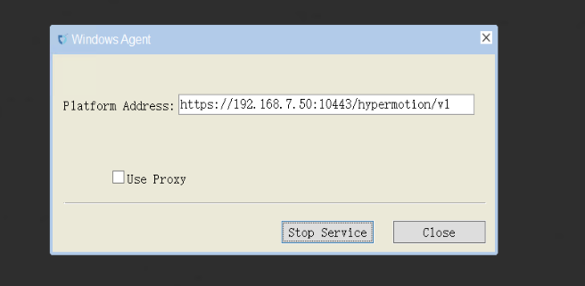

# **Windows Agent Operations Maintenance**

## **Runtime Environment**

By deploying the Agent program on the source server, the system can capture real-time changes in the file system or block devices to achieve continuous data synchronization. This is suitable for physical servers, non-virtualized environments, or scenarios requiring more granular control.

Windows Agent supports deployment on the following Windows Server operating systems: 2003 SP2/R2, 2008, 2008 R2, 2012, 2012 R2, 2016, 2019 (all 64-bit).

The system is installed in the `C:\Program Files (x86)\DiskSync-Agent` directory (the actual path depends on your installation choice). The main files and directory structure are as follows:


## **Service Health Status**

Operations staff can check the service status using Windows Task Manager to confirm whether the service is running properly.

* Ways to open Task Manager:

  * Method 1:

    ```plain
    Press <Ctrl + Alt + Del> on your keyboard at the same time.
    ```

  * Method 2:

    ```plain
    Press Win + R to open the Run dialog.
    Enter taskmgr and press Enter.
    ```

    

## **Service Start/Stop/Restart**

* **Start Service:**

  * Right-click the Windows Agent shortcut on the desktop and run as administrator.

  

  * Left-click "Start Service".

  

  * Warning message (can be ignored).

  

  

  * Service started successfully.

  

* **Stop Service:**

  * Click "Stop Service" to stop the service.

  

## **Log Management**

All system log files are stored in the `C:\Program Files (x86)\DiskSync-Agent\log` directory (the actual path depends on your installation choice). Operations staff can view log files to monitor system status, troubleshoot issues, or provide relevant files to project managers to ensure system stability.


## **Configuration File Management**

The main configuration file for Windows Agent is located in the `C:\Program Files (x86)\DiskSync-Agent\config` directory (the actual path depends on your installation choice), and the file name is `Sysconfig.ini`. This file contains all configuration information for the Windows Agent, including service connections, database, sync tasks, logs, S3 settings, and more.

Below are the main sections of the configuration file and their descriptions:

```ini
[SysParam]
HM_URL =https://192.168.7.141:10443/hypermotion/v1
SYNC_NODE_KEY =da8aae5b-facb-452f-8161-5c866f8fafaa

;log level
LOGFLAG=2
                                        
;Filename of successful host registration
REG_FILE=registered        

;Heartbeat interval (seconds)
HEARTBEAT_INTERVAL=50

;Whether to modify the iscsi initiator name tag, 1: modify; 0: not modify.
MODIFY_INITIATOR=1

;Used for the blobsize in iSCSI mode under non-VSS mode 
COPYSIZE=3

;Proportion of cache files in partition capacity under non-VSS mode. 
SWAPESPACE_PERCENT=10

;Whether to adopt the vss mode: 1. vss mode; 0. normal mode.
VSS_MODEL=1

;The proportion of volume shadow storage on the disk in VSS mode.
VSS_MAX_SIZE_PERCENT=10

;Configuration of volume shadow storage for special volumes in VSS mode, which can be configured for multiple volumes: size (G)
;VSS_SPEC_MAX_C=c:10

;The minimum proportion of free space in the volume.
FREELIMIT_PERCENT=3

apply_scene=dr

; 0: Retry after an error occurs during the synchronization process, with the retry time referring to ERRRETRY_DURATION; 1: Return an error immediately upon a synchronization error. 
ERRORRETURN=0

;Maximum retry duration (in seconds) after a synchronization error. 
ERRRETRY_DURATION=600

;Maximum number of blobs for hook in non-VSS mode. 
HOOKBUFF_BLOCKCOUNT_MAX=256

;Minimum number of blobs for hook in non-VSS mode. 
HOOKBUFF_BLOCKCOUNT_MIN=64

; 1: Write the first sector to the target disk, 0: Do not write the first sector to the target disk. 
WRITE_FIRST_SECTOR=0

;Maximum number of write threads in object storage mode. 
THREAD_COUNT=4

;thread interval(millisecond)
THREAD_INTERVAL=25

;Whether to send the metafile (including the local metafile) to the object storage. 
WRITE_OSS_META=0

;The maximum CPU usage allowed for the process. The actual CPU usage of the process may fluctuate up and down, and online update is supported. 
CPU_USEAGE_SETTING=30

;Specify the disks that do not require synchronization. When there are multiple disks, separate the disk numbers with commas. For example: EXCLUDE_DISKS=1,2. The default is EXCLUDE_DISKS=NULL, which synchronizes all disks.
EXCLUDE_DISKS=NULL

;iscsi service parameters
MaxRequestHoldTime=120
SrbTimeoutDelta=120
LinkDownTime=15
InitialR2T=1
ImmediateData=0
FirstBurstLength=16384
MaxBurstLength=16384
MaxRecvDataSegmentLength=8192

ISCSI_SYNC_STATUS=0
ISCSI_PROTECT_STATUS=0
hyper_exporter_id=c85eb10e1a8f4dd58080d9cbe0d71bf4
LOCAL_LAN=1
use_proxy=0
VSS_CHECK_RESULT=1
```