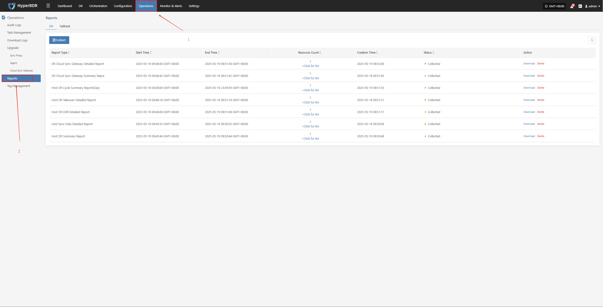
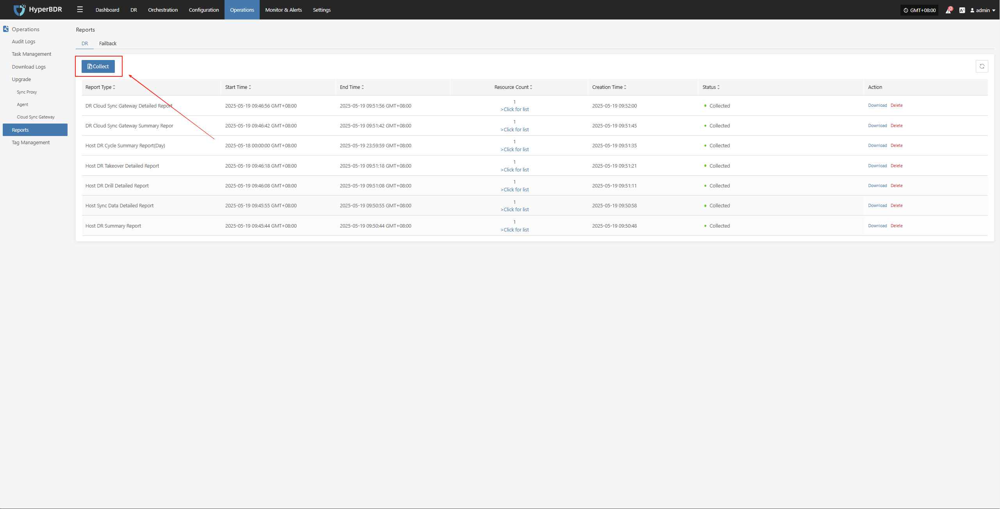
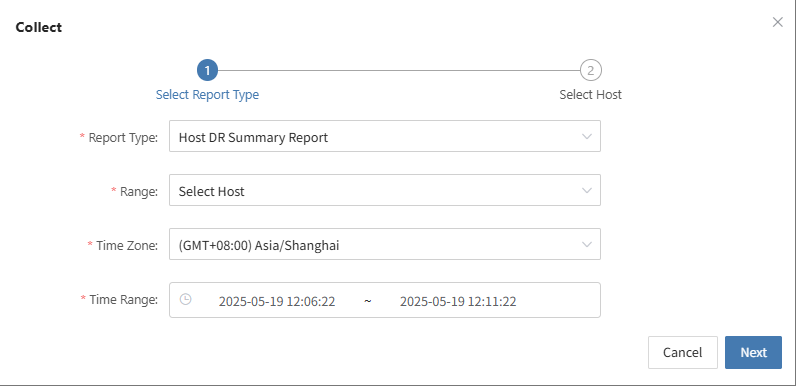
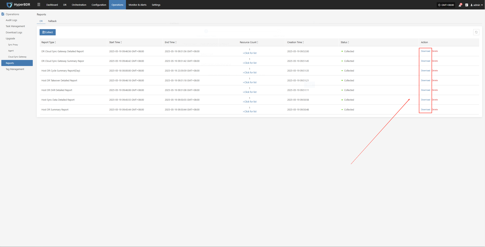

# Report Export

## Report Export Operation Example

* Log in to the HyperBDR-HyperMotion Console

  > * Note: If you need to download host information reports for different tenants, you must log in to the console with a user belonging to the corresponding tenant.

  * Click [Operations] > [Report] to enter the report page.

    

  * Collect reports

    

  * Select the report type, scope, time zone, and time range as needed. After confirming the information, click [Submit].

    

  * Download the report

    * Click [Download] to get the report.

    