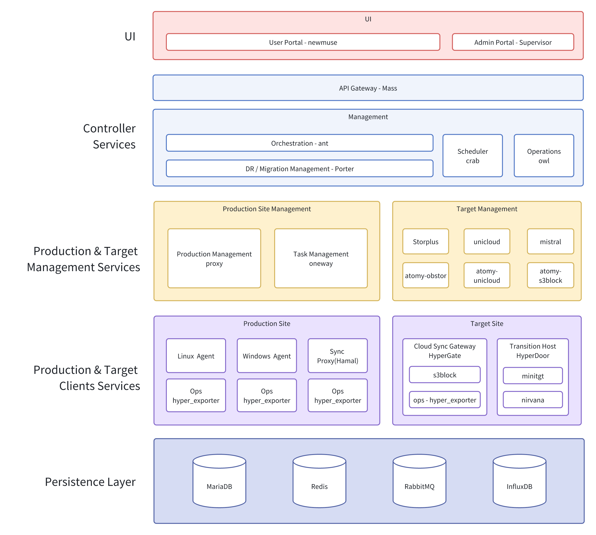

# Architecture
The system adopts a modular architecture to enable data collection, transmission, storage, and management from the production site to the target site. It supports various business scenarios such as disaster recovery and migration, and provides unified scheduling and visualized operations & maintenance capabilities.
