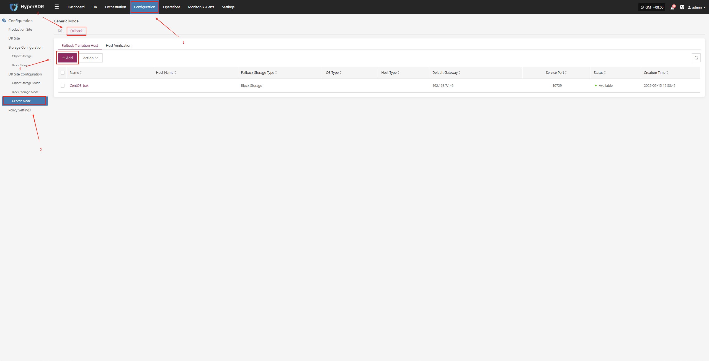

# Transition Host Image

## Upgrade Preparation

The system supports component upgrades through the platform's web interface. The upgrade process is smooth and preserves all configurations, making it suitable for routine version maintenance and feature updates.

> During the component upgrade process, you also need to complete the above-mentioned upgrade package preparation and deployment steps.

## Upgrade Operation

Users can access the platform login page via a web browser and authenticate with a valid username and password. Once logged in, you can perform the online upgrade.

Due to the special nature of the transition host, reconfiguration is required during the upgrade.

* Configuration Management -- Disaster Recovery Platform Configuration -- General Mode -- Failback -- Add

  

* Download the latest temporary transition host image as needed and recreate the temporary transition host.

  