# HyperBDR Operation and Maintenance Manual

## 1. Overview

HyperBDR, as a cloud-native backup and disaster recovery platform, covers the entire process from **data protection** to **business orchestration**. After delivery, the operations team needs to perform daily inspections, use the monitoring dashboard, conduct regular disaster recovery drills, and quickly take over (Failover) during unexpected failures.

This manual will provide operations personnel with systematic operational guidance and best practices to ensure stable operation in the production environment and meet business continuity requirements.

***

## 2. Daily Operations

### 2.1 Daily inspection

#### 2.1.1 **System health check**

* **Console status**：Log in to the HyperBDR operations management platform to check the running status of each module and verify whether key resource usage such as CPU, memory, and storage are normal.

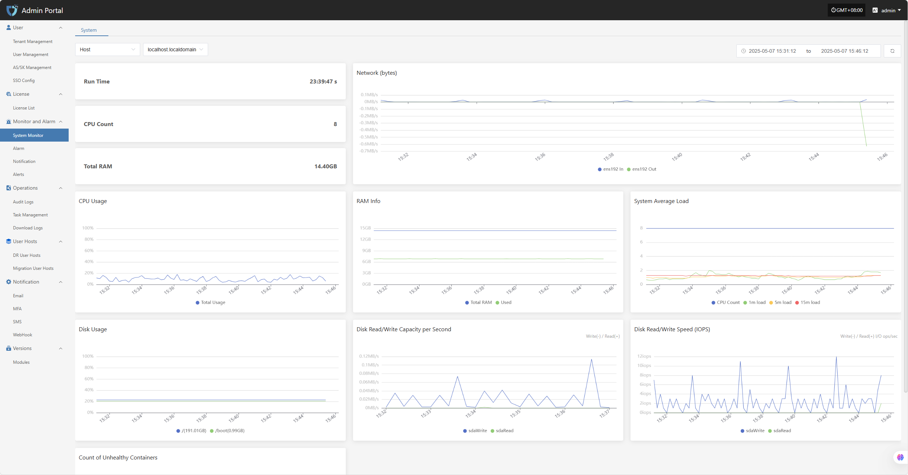

* **Backup Task List**: Review the execution status of all backup tasks to identify any failures or excessively delayed tasks.

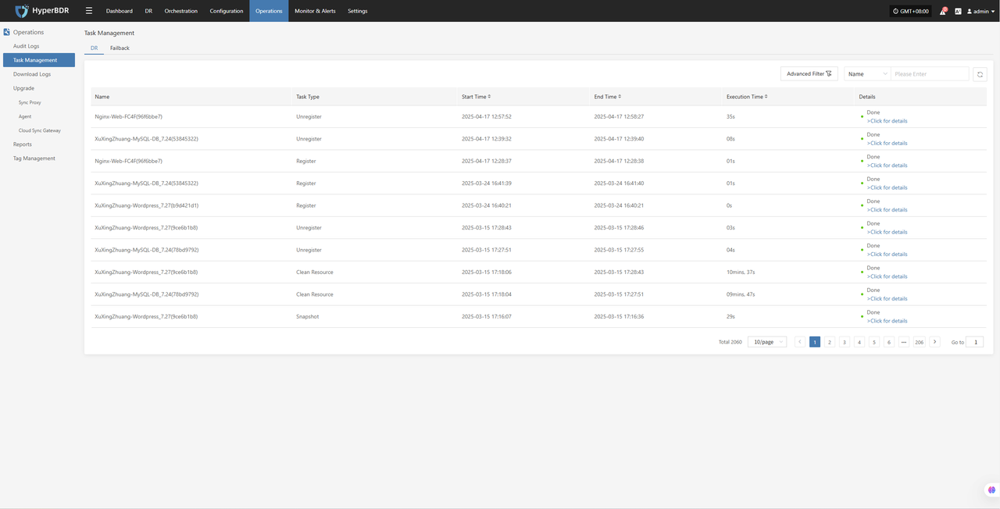

* **Logs and Alarms**：Use the log management module or log platform to check for any abnormal alerts or error logs.

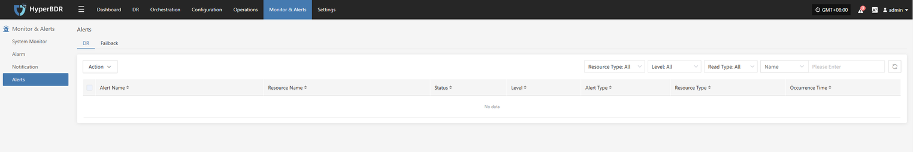

#### 2.1.2 **Network connectivity**

* Ensure stable network connectivity and sufficient bandwidth between the source (production environment) and the target (disaster recovery environment or cloud platform).

* If using VPN, dedicated line, or VPC Endpoint, regularly check whether the tunnel status is normal.

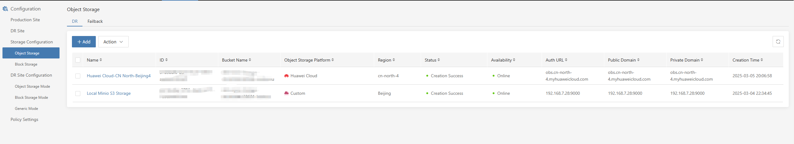

#### 2.1.3 **Cloud Account and Authorization**

* Regularly verify the validity of cloud platform accounts and whether the access keys have expired.

* Check account permissions to avoid over-authorization or missing critical permissions that may lead to backup or recovery failures.

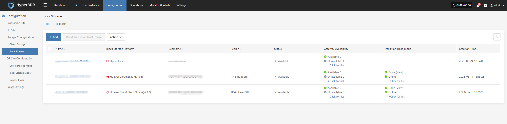

### 2.2 Resource monitoring and backup task inspection

#### 2.2.1 **Resource monitoring**

* **Storage Space**：Check the remaining capacity of object storage, block storage, and database storage. If the space is insufficient, promptly expand the capacity or clean up historical snapshots.

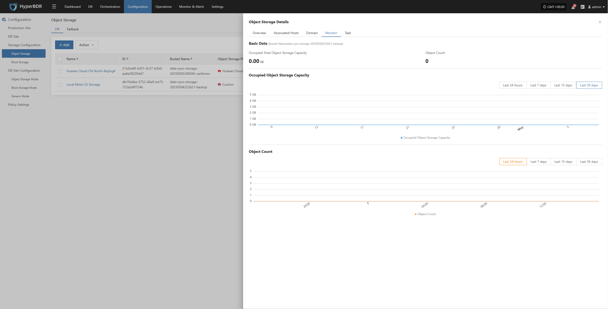

* **Network Throughput**：Monitor bandwidth usage during backup peak periods, and upgrade bandwidth or implement off-peak backup strategies when necessary.

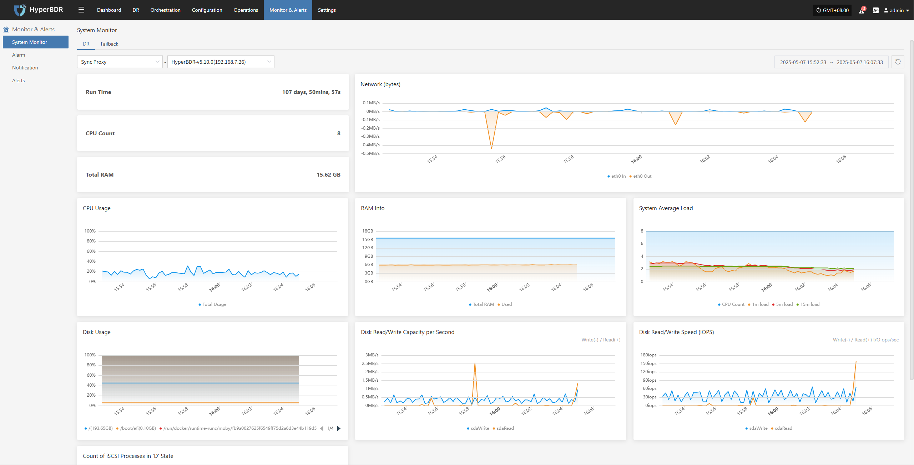

#### 2.2.2 **Backup Task Check**

* **Backup Strategy**:**&#x20;**&#x52;eview the backup strategy (full/incremental) weekly or monthly, and adjust the backup frequency and retention period based on business changes.

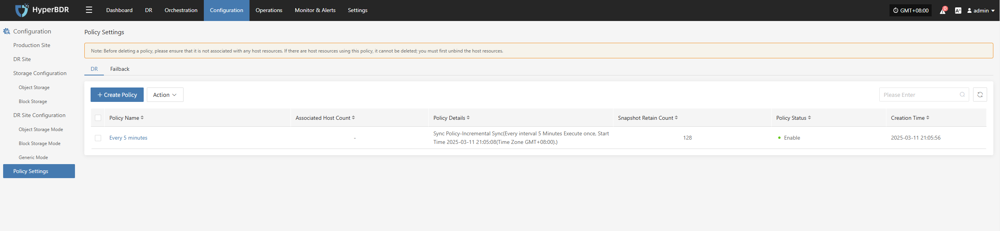

* **Data Consistency Check**: Regularly perform checks or sample recovery tests on backup data to ensure data integrity and availability.


* **Abnormal Task Handling**: For failed backup tasks, analyze the cause of failure (network, permissions, storage space, etc.), promptly fix the issue, and re-execute the task.

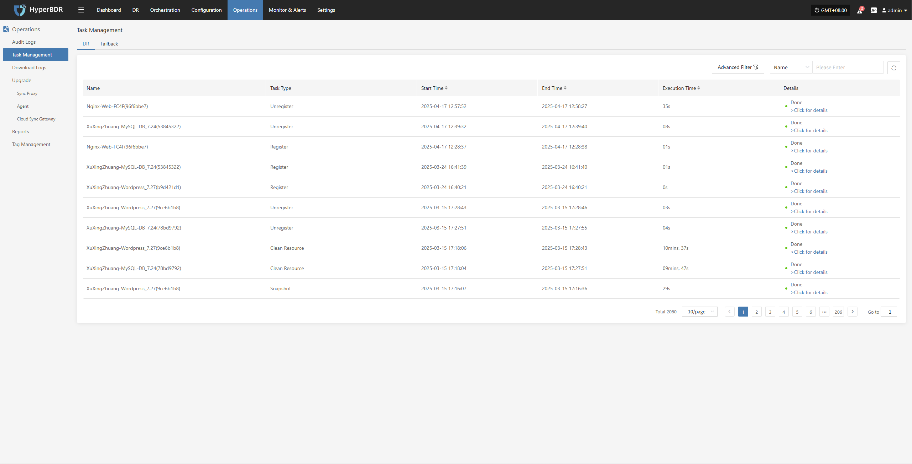

### 2.3 Log export

The log management function allows you to collect service component logs immediately after an issue occurs, enabling further analysis and problem identification.

* Console

* Source-side Sync Agent

* Linux Host

* Windows Host

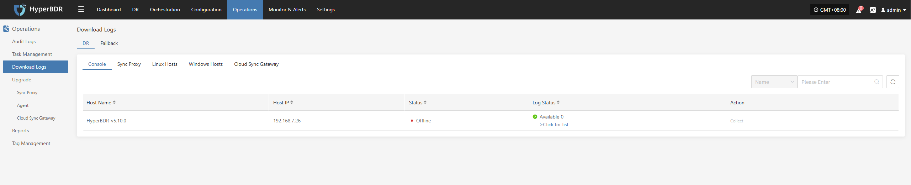

***

## 3. Disaster Recovery Overview Display

The disaster recovery overview monitoring interface provided by HyperBDR displays a summary of the resources and related data involved in the entire disaster recovery platform. It allows for a more intuitive view of the operational status of the entire disaster recovery platform.

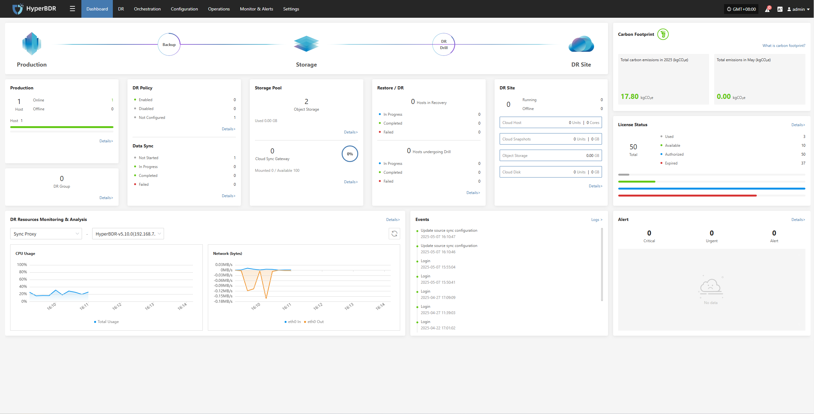

### 3.1 Key Metrics

#### 3.1.1 **System Level**

* **CPU / Memory Usage**: Identify if there are any resource bottlenecks.

* **Concurrent Tasks**:**&#x20;**&#x4D;onitor the number of backup/recovery/synchronization tasks currently being executed.

* **Network Throughput**: Monitor data transfer speeds to assess if there is any network congestion.

#### 3.1.2 Recovery/Drill Level

* **Task Success Rate**: Trigger alerts promptly if the failure rate of backup or recovery tasks exceeds the threshold.

* **Snapshot Count and Size**: Monitor the storage space occupied by snapshots to avoid storage exhaustion.

* **Resource Usage**: Includes the usage status of resources such as cloud hosts and cloud storage.

#### 3.1.3 **Alerts and Events**

* **Alarm Severity Distribution**: Statistics of the current alarm levels (informational, warning, critical), with priority given to handling high-level alarms.

* **Event Trends**: Monitor changes in the number of alarms over a specific period (e.g., 7 days, 30 days) to promptly identify potential issues.

### 3.2 Alarm Configuration and Response

#### 3.2.1 **Alarm threshold setting**

* Set reasonable thresholds and levels (warning, critical, urgent) for core metrics such as CPU, memory, network, and task failure rate.

* For critical task events (e.g., backup tasks), stricter alarm conditions can be set.

Currently supports creating alarms for resources and events，

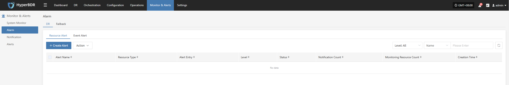

* Create Resource Alarm

Define the alarm name, alarm level, and resource type, including CPU, memory, disk, and processes, to configure resource alarms. When a defined threshold is reached, an alarm event will be triggered and sent.

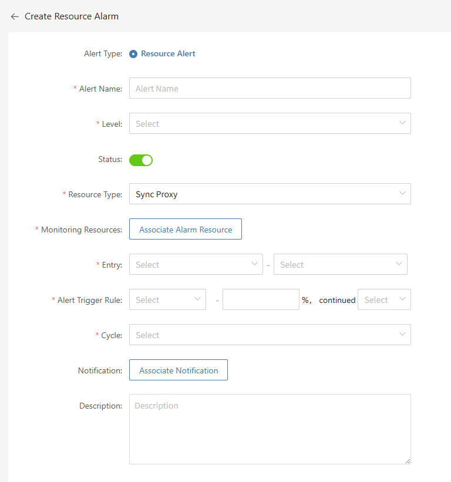

* Create Event Alarm

Define the event alarm name, alarm level, and event type, including disaster recovery host resources, production platform resources, disaster recovery platform resources, etc., to configure event alarms. Once the event is triggered, an alarm event will be sent.

* Important Alarm Indicators

  * Event Type: Disaster Recovery Host Resource "Host Disconnected", with the event result being "Successful".

  * Event Type: Disaster Recovery Host Resource "Sync Host", with the event result being "Failed".

  * Event Type: Disaster Recovery Host Resource "Start Host", with the event result being "Failed".

Other monitoring indicators can be configured as needed.

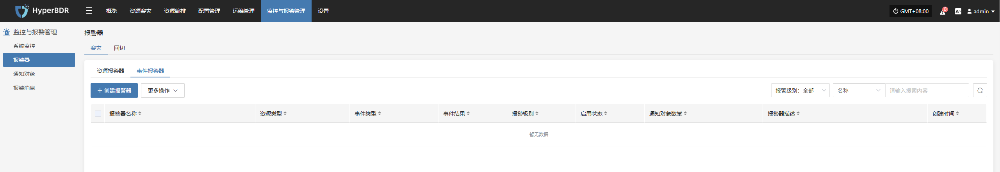

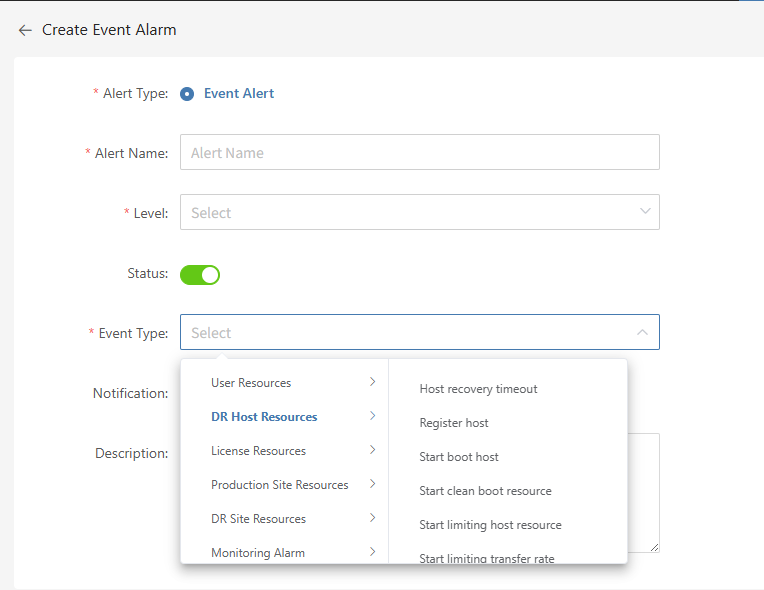

#### 3.2.2 **Multi-channel Notification**

* Configure multiple alarm channels, such as email, SMS, and IM (e.g., DingTalk, WeChat Work), to ensure timely awareness of issues.

* Email Alarm Channel

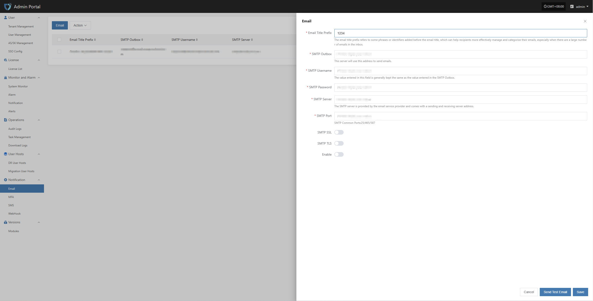

* SMS Alarm Channel

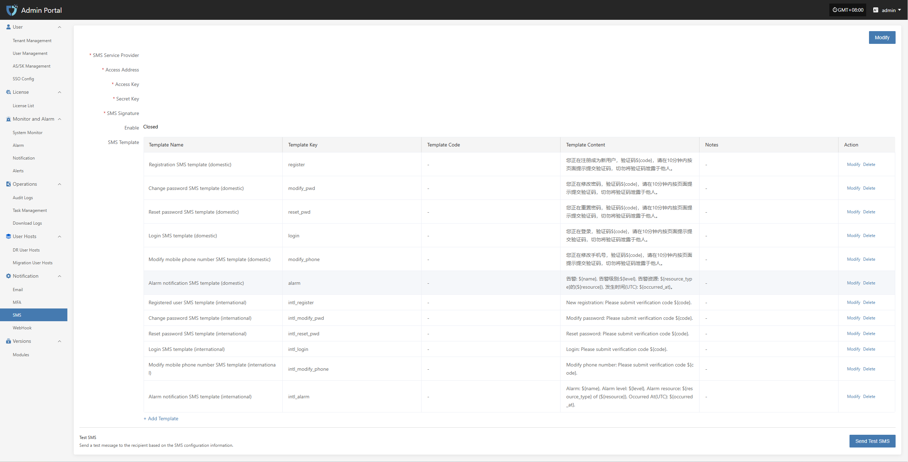

* WebHook Alarm Channel

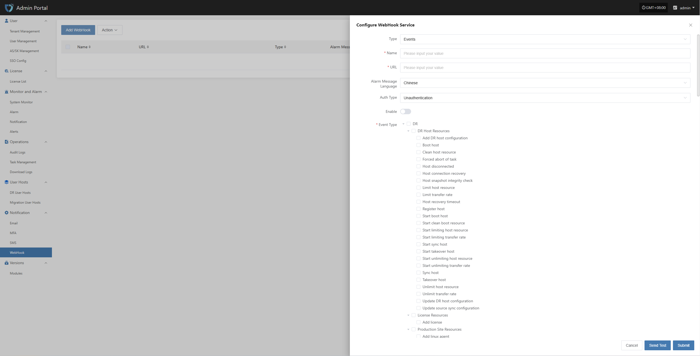

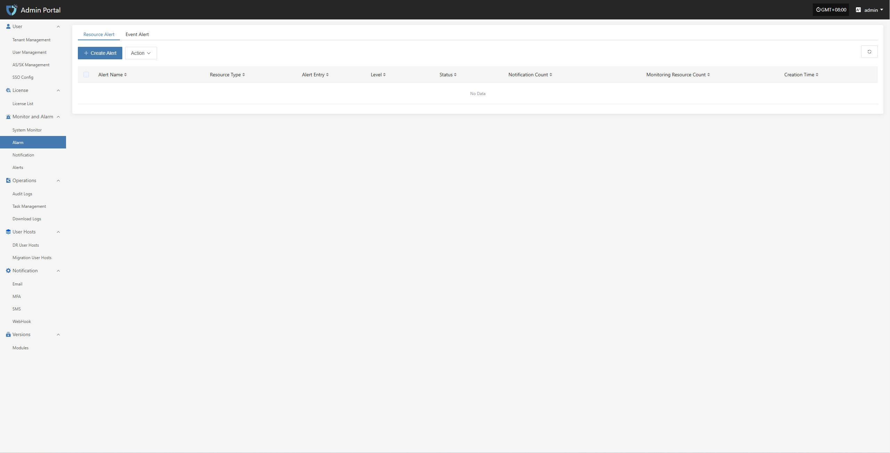

#### 3.2.3 **Alarm Response Process**

* After receiving the alarm, the operations personnel should investigate and resolve the issue within the specified SLA time.

* After resolution, update the ticketing system or logs to record the cause of the issue, the steps taken, and the outcome.

### 3.3 Common Use Cases

* **Troubleshooting Sudden Backup Failures**：View task logs, system resource usage, and network status through the monitoring dashboard to pinpoint the cause of the failure.

* **Performance Bottleneck Analysis**：Based on historical indicator trends, determine whether additional bandwidth is needed, server configurations should be upgraded, or backup strategies need to be optimized.

* **Disaster Recovery Drill Observation**：During a disaster recovery drill, monitor the progress of recovery tasks and resource usage in real-time through the overview dashboard.

***

## 4. Disaster Recovery Drill

Disaster recovery drills are a crucial step in ensuring the actual availability of the disaster recovery system. It is recommended to conduct a full-process drill every quarter or at least once every six months.

### 4.1 Drill Preparation

#### 4.1.1 **Drill Objectives and Scope**

* Clearly define which business systems, data types, and RPO/RTO objectives the drill will cover.

* Define the drill scenarios: such as simulating power outages in the data center, core network failures, or regional cloud platform outages.

#### 4.1.2 **Resource Reservation**

* Prepare the necessary target environment resources for the drill (e.g., cloud hosts, storage, network configurations, etc.).

* Ensure that the drill does not impact the normal operation of production business by using a test environment or reserved disaster recovery resources.

#### 4.1.3 **Notifications and Approvals**

* Inform relevant business units, management, and the operations team in advance, and obtain approval for the drill window and authorization.

* Develop drill scripts and rollback plans to ensure that the drill can be terminated and the system restored to its original state in case of unexpected issues.

### 4.2 Drill Process

#### 4.2.1 **Triggering Disaster Scenarios**

* Simulate failures manually or through scripts, such as stopping the source server, power interruption, network isolation, etc.

* Verify that monitoring alarms are triggered correctly and that the HyperBDR console displays the fault information in real-time.

#### 4.2.1 **Initiating the Disaster Recovery Drill Process**

* In the HyperBDR console, select the corresponding disaster recovery host, click "Disaster Recovery Drill," choose the recovery point, and perform a one-click recovery of the disaster recovery host to the target environment.

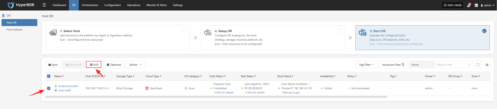

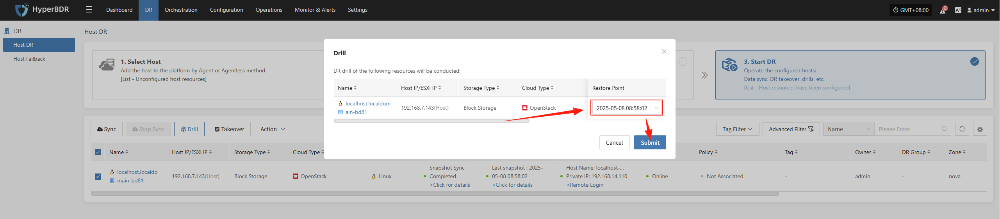

The system will automatically create or start the target instances based on the pre-configured resource orchestration (compute, storage, network, etc.), and once the startup is complete, you can log into the target platform to verify configurations and conduct business drills.

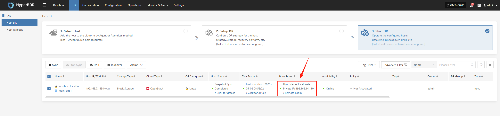

Monitor the recovery progress to ensure that the critical business drills are completed within the expected RTO.

#### 4.2.2 **Business Validation**

* After recovery is complete, check whether application services, databases, load balancers, etc., are functioning properly.

* Perform data consistency checks to confirm that business functions are fully operational and available.

### 4.3 Drill Validation and Reporting

#### 4.3.1 **Drill Results Evaluation**

* Compare the actual recovery time with the predefined RTO/RPO to see if the targets were met.

* Compile statistics on anomalies, fault points, and the time taken to resolve them during the drill.

#### 4.3.2 **Drill Report Writing**

* Include drill objectives, execution steps, result analysis, issues encountered, and improvement measures.

You can use the "Report Export" feature on the platform side, select the host from this drill, and export the detailed disaster recovery drill report for the host.

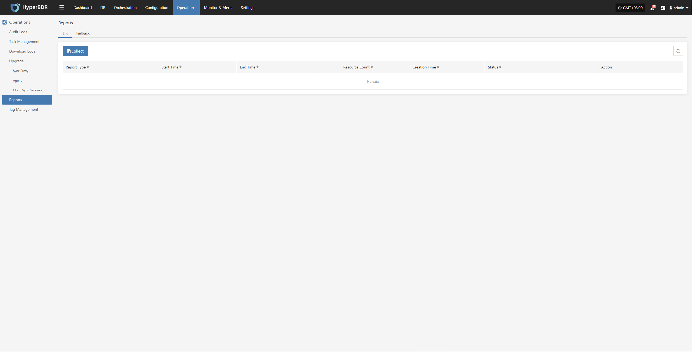

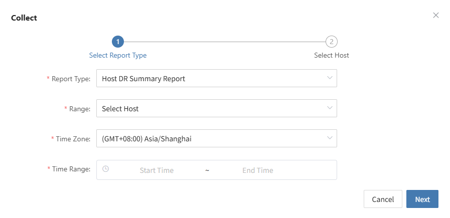

* Distribute to relevant teams (business, management, audit) to close the loop on management.

#### 4.3.3 **Post-Drill Optimization**

* Based on the issues discovered during the drill, adjust the backup strategy, resource configuration, or fault handling processes.

* Update documentation and automation scripts to improve response efficiency for the next drill and real disaster recovery scenarios.

***

## 5. Failover Operation Guide

When a critical failure or disaster occurs on the source side that cannot be quickly recovered, failover to the disaster recovery environment is necessary to ensure business continuity.

### 5.1 Failover Conditions and Prerequisites

#### 5.1.1 **Confirm Fault Severity**

* If the fault cannot be fixed within a short time and has exceeded the tolerable RTO/RPO boundaries, disaster recovery failover can be initiated.

* It is necessary to confirm in advance that the production environment cannot be quickly restored, in order to avoid blind takeover that could lead to a greater impact.

#### 5.1.2 **Disaster Recovery Environment Preparation**

* Ensure that the target environment has completed the latest data synchronization or snapshot backup in the HyperBDR strategy.

* The network configuration and resource allocation of the disaster recovery environment meet the business go-live requirements (such as CPU, memory, bandwidth, etc.).

#### 5.1.3 **Business Impact Assessment**

* Communicate with the business side to understand the impact on user access paths, data consistency, and application dependencies after the switch.

* Confirm the takeover operation window and whether there is a need to release an external announcement (such as notifying customers about the switch).

### 5.2 Fault Handover Process

#### 5.2.1 **Initiating Handover**

* In the HyperBDR console, select the "Disaster Recovery Handover" function for the corresponding business host, choose the desired recovery snapshot time point, and click Confirm.

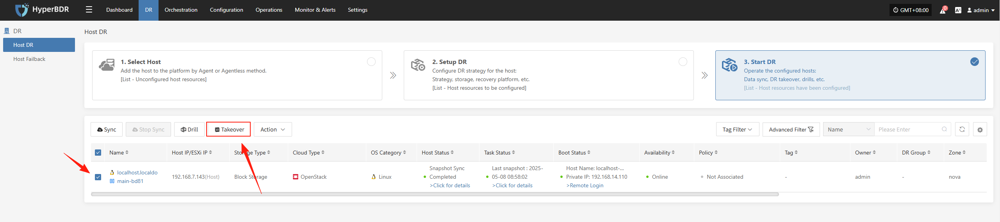


In the HyperBDR console, select the "Disaster Recovery Handover" function for the corresponding business host, choose the desired recovery snapshot time point, and click Confirm.

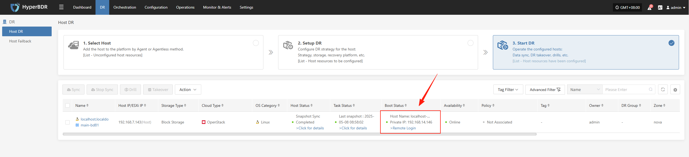

#### 5.2.2 **Data Verification**

* After the business starts, check if the database version, application service configurations, and dependent services (such as cache and message queues) are functioning properly.

* If necessary, perform partial traffic testing only in the disaster recovery environment. After confirming the availability of business functions, proceed with the full-scale switch.

#### 5.2.3 **DNS / Load Balancer Switch**

* Modify the DNS resolution or load balancing strategy to direct user traffic to the disaster recovery environment.

* Monitor traffic changes to ensure normal business access after the takeover.

#### 5.2.4 **Confirm the completion of the switchover**

* Record the takeover completion time and continuously monitor system metrics on the monitoring dashboard.

* Communicate with the business team to verify whether the functionality and performance meet expectations.

#### 5.2.5 Export the business takeover report

You can use the "Report Export" feature on the platform side to select the hosts involved in this takeover and export a detailed disaster recovery takeover report for the hosts.

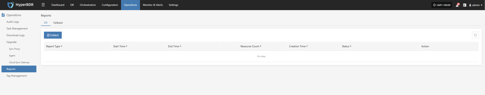

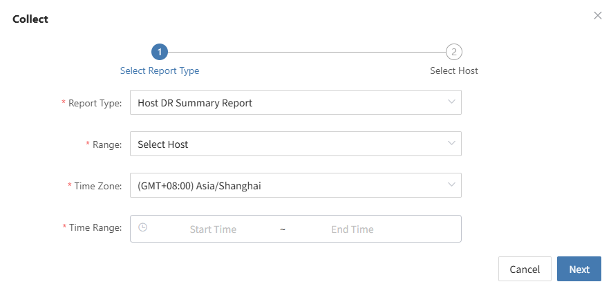

Retain and further analyze the exported report of the business takeover event to identify any optimization steps and processes.

***

## 6. Appendix

### 6.1 Common Commands and Tools

* **HyperBDR**

  * **View service logs**

    Background log component service directory

  ```plain&#x20;text
  /opt/installer/production/logs/
  ```

  * **Service component status check**

  ```plain&#x20;text
  docker ps  #View each service module
  ```

* **Network troubleshooting**：`ping`, `traceroute`, `telnet`, `curl` And other common commands

### 6.2 Common Issue Queries and Submissions

During daily operations, if you encounter related issues, you can visit the following QA websites to search for solutions to the problems.

If you encounter any issues, you can also log in to the QA website to submit the problem. We will analyze the issue and provide a quick response as soon as the problem is submitted.

* [Issue QA (Chinese)](https://wenti.oneprocloud.com/)

* [Issue QA (English)](https://support.oneprocloud.com/)

### 6.3 Change Log

| Version | Date       | Change Description                             | Author                                |
|----|------------|-------------------------------------------------|----------------------------------------|
| 1  | 8/20/2024  | Initial version release                         | Disaster Recovery Product Operations Team |
| 2  | 12/10/2024 | Update alarm configuration                      | Disaster Recovery Product Operations Team |
| 3  | 2/10/2025  | Add disaster recovery drill/takeover operation  | Disaster Recovery Product Operations Team |
| 4  | 2/15/2025  | Add log export functionality                    | Disaster Recovery Product Operations Team |
| 5  | 2/25/2025  | Add common issue explanations                   | Disaster Recovery Product Operations Team |

## 7. Conclusion

This operations manual focuses on th&#x65;**&#x20;daily operations, monitoring dashboard usage, disaster recovery drills**, and **fault takeover** key processes of **HyperBDR** in the production environment. It provides a systematic operational workflow and best practices. The operations team should regularly review and update this manual based on actual conditions to ensure the continuous and stable operation of the HyperBDR system and to promptly meet the business's disaster recovery and high availability requirements.

