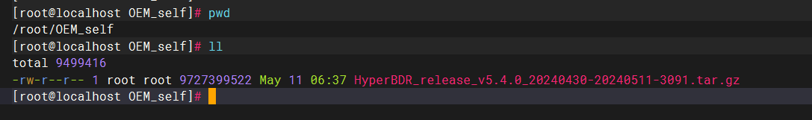
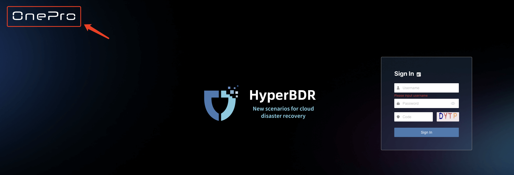
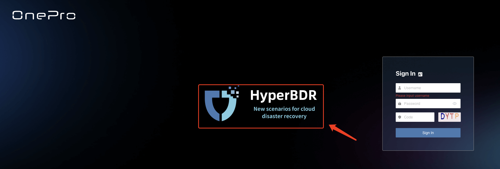
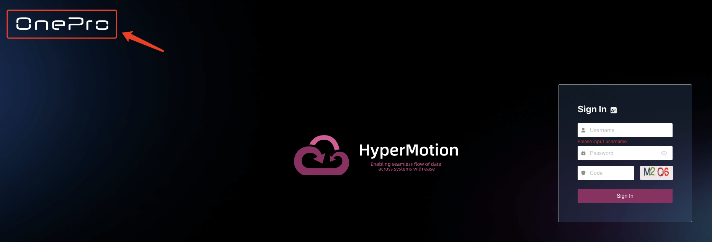
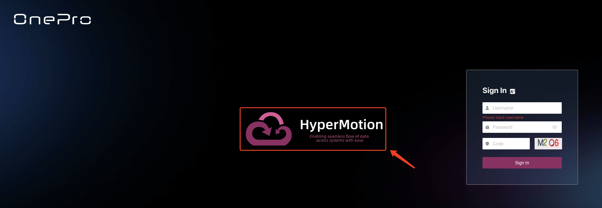
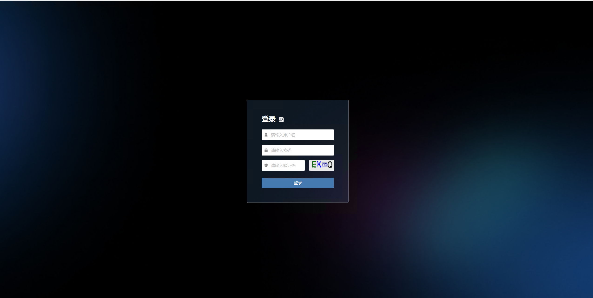
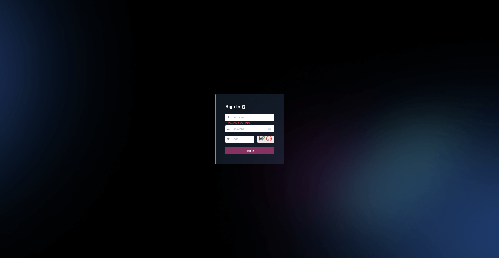
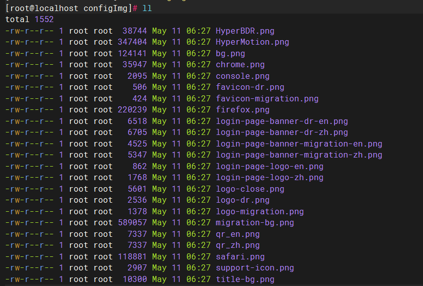
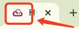
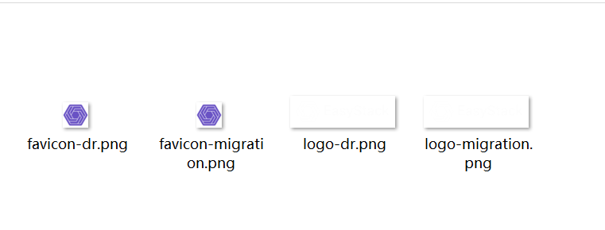

# OEM Product Logo Customization Guide

This document provides instructions for customers to customize the installation package provided by HyperBDR, replacing the default logos with their own brand logos.

## Upload and Extract the Standard Installation Package to the Migration/DR Host

Create a directory named OEM_self:

```plain text
mkdir /root/OEM_self
cd /root/OEM_self
```

Upload the installation package to /root/OEM_self.



Extract the package:

```plain text
tar zxvf HyperBDR_release_v5.4.0_20240430-20240511-3091.tar.gz
```

You will get the installer directory.

## Hide Logo and Customer Service Icons on the Login Page

### DR Main Page Configuration

```plain text
cd /root/OEM_self/installer/OEM/newmuse
vi /root/OEM_self/installer/OEM/newmuse/newmuse.json   # Enter the following content (example)
```
```json
{
"oem": true,
"title":"MyDR",
"openOnlineService":false,
"loginPageLogo":false,
"loginPageBanner": false
}
```

```plain text
Sample Code：
 {
"oem": true,   --> enable oem feature
"title":"MyDR", --> Browser tab title
"openOnlineService":false, --> Remove customer service icon
"loginPageLogo":false, --> Remove OnePro logo at top right of login page
"loginPageBanner": false --> Remove HyperBDR scenario logo in the center of login page
}
```

* Browser tab title


* OnePro logo at top right of login page



* HyperBDR scenario logo in the center of login page



### Migration Main Page Configuration

```plain text
vi /root/OEM_self/installer/OEM/newmuse-motion/newmuse.json  # Enter the following content (example)
```
```json
{
"oem": true,
"title": "MyMigration",
"openOnlineService": false,
"loginPageLogo": alse,
"loginPageBanner": false
}
```

```plain text
Sample Code：
{
"oem": true,   --> enable oem feature
"title":"MyMigration", --> Browser tab title
"openOnlineService":false, --> Remove customer service icon
"loginPageLogo":false, --> Remove OnePro logo at top right of login page
"loginPageBanner": false --> Remove HyperBDR scenario logo in the center of login page
}
```

* Browser tab title


* OnePro logo at top right of login page



* HyperBDR scenario logo in the center of login page



After configuration, the login page will look as follows:

* DR Main Page



* Migration Main Page



## Replace with Your Own Logo

```plain text
cd /root/OEM_self/installer/OEM/newmuse/static/configImg
ll  # The following files will be shown
```



Upload your prepared image files to this directory, overwriting files with the same name (see the 4 files below).

### Migration Logo Replacement

* favicon-migration.png

Displayed as the browser tab icon. **Size: 32 × 32, Format: png**



* logo-migration.png

Displayed at the top left after logging into the migration platform. **Size: 184 × 56, Format: png**


### DR Logo Replacement

* favicon-dr.png

Displayed as the browser tab icon. **Size: 32 × 32, Format: png**


* logo-dr.png

Displayed at the top left after logging into the DR platform. **Size: 184 × 56, Format: png**




### Tool Installation 

```plain&#x20;text
bash /root/OEM_self/installer/install.sh -i <service_ip>  # If you do not add "-i <service_ip>", the default host IP address will be used.
```
Wait for the installation to complete
After the installation is complete, run the command:
```plain&#x20;text
sed -i s/HyperBDR/<Tag_Name>/g /opt/installer/production/venvs/newmuse-venv/index.html
```
<Tag_Name>：Company Product Name

At this point, the installation is complete. You can access the tools in your browser:

Disaster Recovery Tool: https://<service_ip>:10443 (Default credentials: admin/P@ssw0rd)

Migration Tool: https://<service_ip>:10443 (Default credentials: admin/P@ssw0rd)