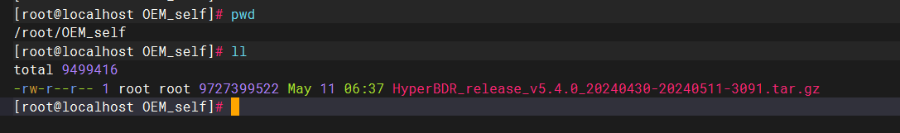
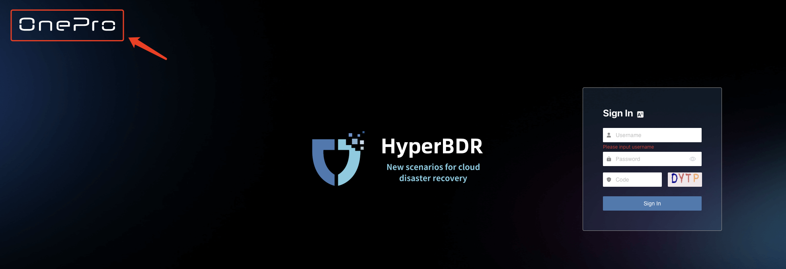
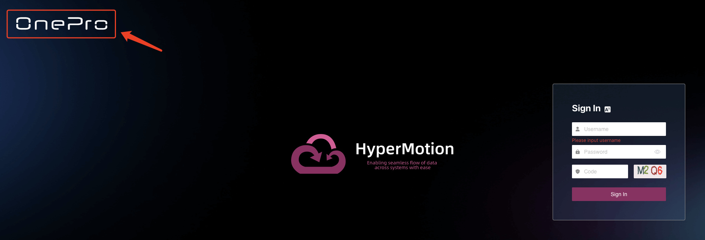
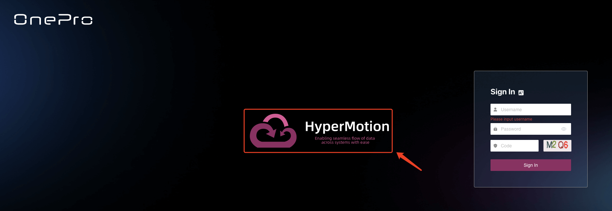
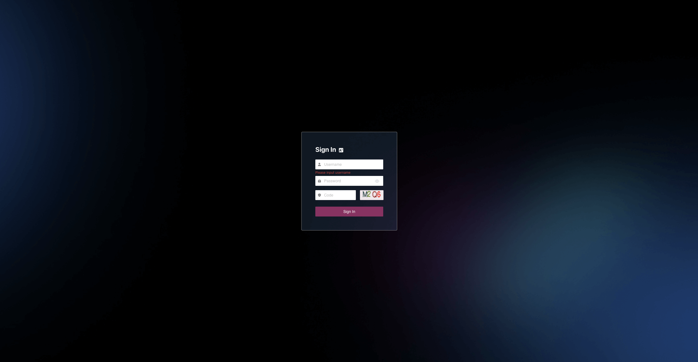
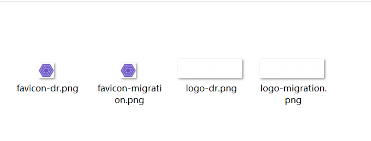

# OEM Product Logo Customization Guide

This document provides instructions for customers to customize the installation package provided by HyperBDR, replacing the default logos with their own brand logos.

## Upload and Extract the Standard Installation Package to the Migration/DR Host

Create a directory named OEM_self:

```plain text
mkdir /root/OEM_self
cd /root/OEM_self
```

Upload the installation package to /root/OEM_self.



Extract the package:

```plain text
tar zxvf HyperBDR_release_v5.4.0_20240430-20240511-3091.tar.gz
```

You will get the installer directory.

## Hide Logo and Customer Service Icons on the Login Page

### DR Main Page Configuration

```plain text
cd /root/OEM_self/installer/OEM/newmuse
vi /root/OEM_self/installer/OEM/newmuse/newmuse.json   # Enter the following content (example)
```
```json
{
"oem": true,
"title":"MyDR",
"openOnlineService":false,
"loginPageLogo":false,
"loginPageBanner": false
}
```

```plain text
Sample Code：
 {
"oem": true,   --> enable oem feature
"title":"MyDR", --> Browser tab title
"openOnlineService":false, --> Remove customer service icon
"loginPageLogo":false, --> Remove OnePro logo at top right of login page
"loginPageBanner": false --> Remove HyperBDR scenario logo in the center of login page
}
```

* Browser tab title


* OnePro logo at top right of login page



* HyperBDR scenario logo in the center of login page


### Migration Main Page Configuration

```plain text
vi /root/OEM_self/installer/OEM/newmuse-motion/newmuse.json  # Enter the following content (example)
```
```json
{
"oem": true,
"title": "MyMigration",
"openOnlineService": false,
"loginPageLogo": alse,
"loginPageBanner": false
}
```

```plain text
Sample Code：
{
"oem": true,   --> enable oem feature
"title":"MyMigration", --> Browser tab title
"openOnlineService":false, --> Remove customer service icon
"loginPageLogo":false, --> Remove OnePro logo at top right of login page
"loginPageBanner": false --> Remove HyperBDR scenario logo in the center of login page
}
```

* Browser tab title


* OnePro logo at top right of login page



* HyperBDR scenario logo in the center of login page



After configuration, the login page will look as follows:

* DR Main Page


* Migration Main Page



## Replace with Your Own Logo

```plain text
cd /root/OEM_self/installer/OEM/newmuse/static/configImg
ll  # The following files will be shown
```


Upload your prepared image files to this directory, overwriting files with the same name (see the 4 files below).

### Migration Logo Replacement

* favicon-migration.png

Displayed as the browser tab icon. **Size: 32 × 32, Format: png**


* logo-migration.png

Displayed at the top left after logging into the migration platform. **Size: 184 × 56, Format: png**


### DR Logo Replacement

* favicon-dr.png

Displayed as the browser tab icon. **Size: 32 × 32, Format: png**


* logo-dr.png

Displayed at the top left after logging into the DR platform. **Size: 184 × 56, Format: png**




## Browser Tab Display Modification During Refresh
Purpose: After decompression, modify the file content and then recompress it. The specific steps are as follows:
```plain text
cd /root/OEM_self/installer/venvs/
tar zxvf newmuse-venv-7.3.2.dev10.tar.gz    # Use the filename in the current directory; this is only an example. The newmuse-venv directory will be obtained after decompression.
sed -i s/HyperBDR/<Brand_Name>/g ./newmuse-venv/index.html   # Replace <Brand_Name> with the MSP's tool name, e.g. Migrater
rm -f ./newmuse-venv-7.3.2.dev10.tar.gz
tar zcvf newmuse-venv-7.3.2.dev10.tar.gz ./newmuse-venv
```
Proceed with the installation steps after processing is complete.

## Custom OEM LOGO Installation Package
### Installation by the Customer
If an MSP partner needs to create a unique OEM LOGO installation package that the customer can directly install and deploy upon receipt, the processed OEM package must be compressed and sent to the customer.
Create Compressed Package:
```plain text
cd /root/OEM_self
tar zcvf Migrater_release_7.3.0.tar.gz ./installer   # The compressed package name can be customized
```
> The generated software package can be directly uploaded and provided to the customer for download and subsequent installation.

The customer only needs to execute the following installation command (assuming the customer places the installation package in the /root/package directory):
```plain text
cd /root/package/
tar zxvf Migrater_release_7.3.0.tar.gz
bash ./installer/install.sh -i <Server_IP>        # If "-i <Server_IP>" is omitted, the first IP address of the host will be used
```
Wait for the installation to complete.

### Installation Assisted by MSP Partner
If the MSP partner assists the customer with installation, directly execute the following command after OEM processing is finished:
```plain text
bash /root/OEM_self/installer/install.sh -i <Server_IP>  # If "-i <Server_IP>" is omitted, the first IP address of the host will be used
```
Wait for the installation to complete.

## Access the Disaster Recovery/Migration Tool via Browser

Disaster Recovery Tool Access: **https://<Server_IP>:10443**

Migration Tool Access: **https://<Server_IP>:20443**