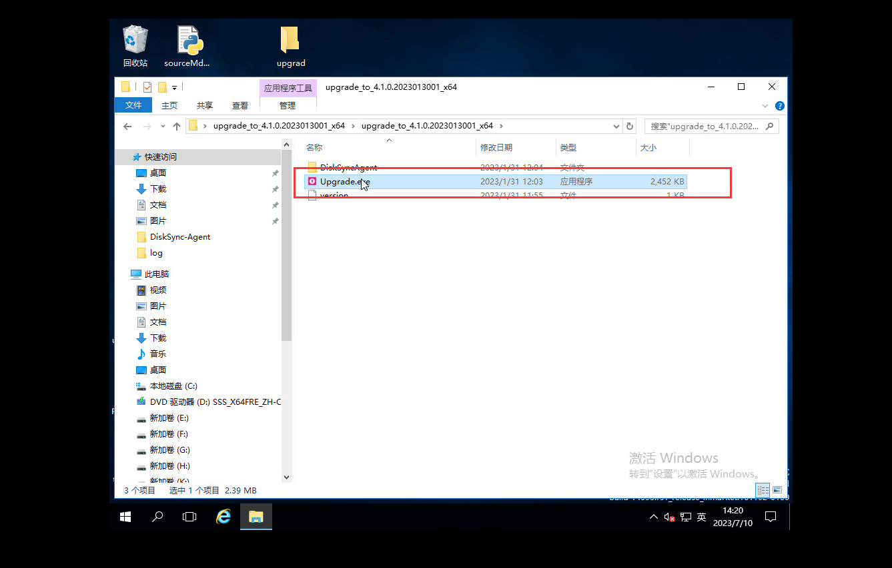

# HyperBDR Upgrade Manual

[[toc]]

::: tip
Note: The minimum supported HyperBDR version for upgrading is HyperBDR 4.4.0. Versions below HyperBDR 4.4.0 are not supported for upgrading to the latest version.
:::

## HyperBDR Server Upgrade

[Upgrade Package download link](https://hyperbdr-system-image-do-not-delete.obs.ap-southeast-3.myhuaweicloud.com/upgrade_incremental_4.4.0_to_5.2.0.tar.gz)

### Obtain the upgrade package and extract it

- Step 1: Obtain the upgrade package URL.

- Step2. Download the upgrade package to the **HyperBDR Console** operating system and extract it using the following command:

```shell
tar zxvf upgrade_incremental_4.4.0_to_4.9.0.tar.gz -C /tmp/
```

### Check the current installed version

```shell
cat /opt/installer/Version
HyperBDR_release_v4.9.0_20230928-20230927-1437.tar.gz
```

The installed version is HyperBDR_release_v4.9.0_20230928

> If the HyperBDR version is earlier than 4.6.0, perform the following additional steps:

```shell
[root@log images]# cd /tmp/upgrade/images
[root@log images]# ls
influxdb-1.7.6.tar.gz  mariadb-10.3.36.tar.gz  rabbitmq-3.8.16.tar.gz  redis-7.0.2-alpine.tar.gz

[root@log images]# docker load -i influxdb-1.7.6.tar.gz
[root@log images]# docker load -i mariadb-10.3.36.tar.gz
[root@log images]# docker load -i rabbitmq-3.8.16.tar.gz
[root@log images]# docker load -i redis-7.0.2-alpine.tar.gz
```

### Update the service

- Step1. Replace the update commands:

```shell
cp /tmp/upgrade/scripts/common.sh /opt/installer/production/scripts/
cp /tmp/upgrade/scripts/hmctl /opt/installer/production/scripts/
```

- Step2. Execute the update command

```shell
/opt/installer/production/scripts/hmctl upgrade /tmp/upgrade/venvs
```

### Update the configuration files

```shell
mv /opt/installer/production/config/newmuse/json/config.json.bak /opt/installer/production/config/newmuse/json/config.json
mv /opt/installer/production/config/newmuse/json/s3.json.bak /opt/installer/production/config/newmuse/json/s3.json
mv /opt/installer/production/config/newmuse/json/targetClouds.json.bak /opt/installer/production/config/newmuse/json/targetClouds.json
mv /opt/installer/production/config/newmuse-motion/json/config.json.bak /opt/installer/production/config/newmuse-motion/json/config.json
mv /opt/installer/production/config/newmuse-motion/json/s3.json.bak /opt/installer/production/config/newmuse-motion/json/s3.json
mv /opt/installer/production/config/newmuse-motion/json/targetClouds.json.bak /opt/installer/production/config/newmuse-motion/json/targetClouds.json
```

### Confirm the upgraded version

After the upgrade is completed, execute the following command to view the current HyperBDR version:

```shell
[root@localhost installer]# cat /opt/installer/Version

HyperBDR_release_v5.2.0_20230928-20230927-1437.tar.gz
```

The installed version is HyperBDR_release_v5.2.0_20230928

## Update **Linux Agent**, **Windows Agent** and Agentless **Sync Proxy**

### Restrictions

> Note: Upgrade the HyperBDR Server end first.
> Versions before V4.10.1 installation package cannot be directly updated using the update script.
> Updating operations are prohibited during tasks such as syncing hosts or starting hosts.

### Agentless Sync Proxy

- Step 1. Log in to the Agentless \*Sync Proxy\*\* server

```shell

ssh root@<Agentless Sync Proxy Server IP\>

```

- Step 2. Get the latest update script

```shell

curl -k -o /usr/local/hyper_exporter/upgrade_hamal.sh https://<HyperBDR IP\>:30080/softwares/upgrade_hamal.sh

```

- Step 3. Grant execution permissions

```shell

chmod +x /root/upgrade.hamal.sh

```

- Step 4. Execute the update command

```shell

cd /usr/local/hyper_exporter/


bash /usr/local/hyper_exporter/upgrade_hamal.sh
```

#### Linux Agent

- Step 1. Log in to the Linux Agent host

```shell

ssh root@<Agent Host IP\>

```

- Step 2. Get the latest update script

```shell

curl -k -o /var/lib/egisplus-agent/upgrade_agent.sh https://<HyperBDR-IP\>:30080/softwares/upgrade_agent.sh

```

- Step 3. Execute the update script

```shell

bash /var/lib/egisplus-agent/upgrade_agent.sh

```

#### Windows Agent

- Step 1. Log in to the source Windows Agent server desktop

- Step 2. Download the update files to the Windows Agent server.

```shell

# X64

https://<HyperBDR IP\>:30080/softwares/windows-agent-new/upgrade_to_xxx_x64.zip


# X86
https://<HyperBDR IP\>:30080/softwares/windows-agent-new/upgrade_to_xxx_x86.zip
```


- Step 3. Extract the downloaded files


- Step 4. Execute Upgrade.exe.




## Source Object DR Gateway Upgrade

The Source Object DR Gateway needs to be re-uploaded image to the cloud platform.


