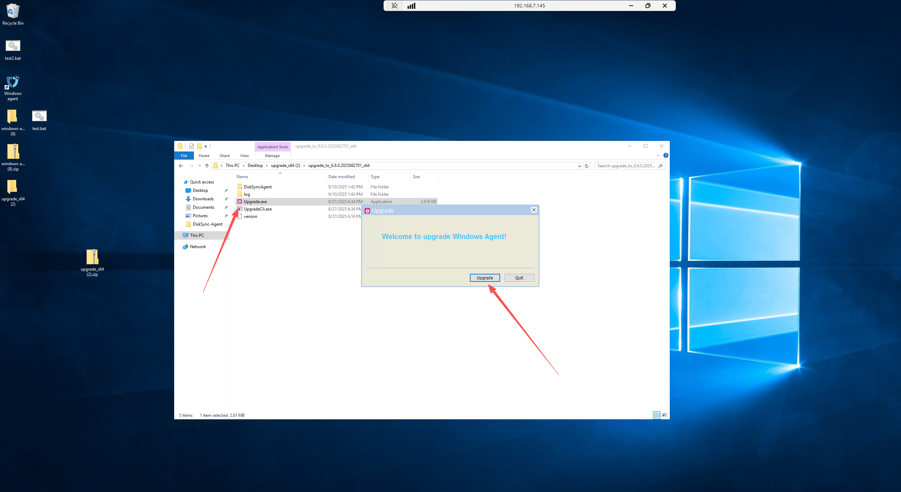

# HyperBDR 5.6.x - 5.11.x Upgrade Guide

## Enhanced Performance with Next-Generation Transport Protocol

HyperBDR introduces a revolutionary user-space transport protocol in the latest version, delivering superior stability and reliability compared to traditional kernel-space mechanisms. This advanced protocol significantly reduces transmission interruptions and failures, especially in challenging network conditions, providing users with an enhanced disaster recovery experience.

**Important:** Due to compatibility considerations with existing block storage modules, users must upgrade both the HyperBDR control console and deployed agents (no uninstallation required) to enable this new transport protocol.

This guide presents **two upgrade paths from HyperBDR 5.x to the latest version**:

* **In-Place Upgrade** (Configuration preserved, user-friendly approach)
* **Complete Reinstallation** (Recommended, streamlined process)

 **Note:** Both approaches require **full data synchronization** after upgrade completion.

---

## Option 1: In-Place Upgrade

### Resource Configuration Cleanup

* Deregister disaster recovery machines and reset them to the second configuration step, awaiting reconfiguration after the update process

### HyperBDR Update

* SSH into the HyperBDR control console host

* Due to directory structure changes in version upgrades, perform the following operations before starting the upgrade:

```bash
## Create venv directories
mkdir -p /opt/installer/production/venvs/atomy-s3block-venv
mkdir -p /opt/installer/production/venvs/SwiftS3Block-venv
mkdir -p /opt/installer/production/venvs/hyper_up-venv
## Initialize version numbers
echo "0.0.0" > /opt/installer/production/venvs/atomy-s3block-venv/version
echo "0.0.0" > /opt/installer/production/venvs/SwiftS3Block-venv/version
echo "0.0.0" > /opt/installer/production/venvs/hyper_up-venv/version
```

```bash
## Reset version numbers
rm -rf /opt/installer/production/config/supervisor-dashboard/VERSION/versions.json
```

```bash
## Remove invalid directories
rm -rf /opt/installer/production/venvs/scripts-venv/version_info/
```

* Follow the official upgrade guide for installation: [View Guide](../dr/operations/upgrade.md#upgrade-preparation)

### Cloud Sync Gateway Update

* Gateway versions below 6.2 do not support iterative upgrades. After updating to the new version, rebuild the cloud sync gateway:

  * Delete all iSCSI gateways and transition host images
  * Remove iSCSI gateways from the interface
  * Delete Cloud_SYNC related security groups from the cloud platform
  * Deploy S3 gateway

### Sync Proxy (Hamal) Update

* SSH into the sync proxy host

* Initialize version number

  ```bash
  # Create hyper_exporter directory
  mkdir -p /opt/hyper_exporter/
  # Initialize version number
  echo "0.0.0" > "/opt/hyper_exporter/exporter_version"
  ```

* Download the latest upgrade script

  > Replace \<HyperBDR IP> with your HyperBDR control console host address

  ```bash
  curl -k -o /usr/local/hyper_exporter/update_sync_proxy.sh https://<HyperBDR IP>:30080/softwares/update_sync_proxy.sh
  ```

* Grant execution permissions

  ```bash
  chmod +x /usr/local/hyper_exporter/update_sync_proxy.sh
  ```

* Execute the upgrade script

  ```bash
  # Navigate to script directory
  cd /usr/local/hyper_exporter/
  # Execute upgrade
  bash update_sync_proxy.sh -y
  ```

* Update configuration

  ```bash
  CONFIG_DIR="/opt/hyper_exporter"
  sed -i '/^ServiceType/d' "/config.ini"
  echo "ServiceType = hamal" >> "/config.ini"
  ```

* Restart monitoring module

  ```bash
  systemctl restart hyper_exporter
  ```

### Agent Update

#### Linux Agent

* SSH into the source agent host

* Initialize version number

  ```bash
  # Create hyper_exporter directory
  mkdir -p /usr/local/hyper_exporter/
  # Initialize version number
  echo "0.0.0" > "/usr/local/hyper_exporter/exporter_version"
  ```

* Download the latest upgrade script

  > Replace \<HyperBDR IP> with your HyperBDR control console host address

  ```bash
  curl -k -o /var/lib/egisplus-agent/upgrade_agent.sh https://<HyperBDR IP>:30080/softwares/upgrade_agent.sh
  ```

* Grant execution permissions

  ```bash
  chmod +x /var/lib/egisplus-agent/upgrade_agent.sh
  ```

* Execute the upgrade script

  ```bash
  # Navigate to script directory
  cd /var/lib/egisplus-agent/
  # Execute upgrade
  bash upgrade_agent.sh
  ```

* Update configuration

  ```bash
  CONFIG_DIR="/usr/local/hyper_exporter"
  sed -i '/^ServiceType/d' "/config.ini"
  echo "ServiceType = linux_agent" >> "/config.ini"
  ```

* Restart monitoring module
  > For older operating systems (CentOS 6, RHEL 6, Ubuntu 14.04 and earlier), SysV init may still be used. Use the service command for equivalent operations.

  ```bash
   # systemd systems (recommended)
   systemctl restart hyper-exporter-agent.service
   # Legacy systems (SysV init)
   service hyper-exporter-agent restart
  ```

#### Windows Agent

* Log into the Windows source host

* Download the latest upgrade package based on your server configuration

  > Replace \<HyperBDR IP> with your HyperBDR control console host address

  * x86

    ```bash
    https://<HyperBDR IP>:30080/softwares/windows-agent-new/upgrade_x86.zip
    ```

  * x64

    ```bash
    https://<HyperBDR IP>:30080/softwares/windows-agent-new/upgrade_x64.zip
    ```

* Extract the downloaded ZIP file

* Right-click and run Upgrade.exe as administrator, following the prompts to complete the upgrade

    

* Download the latest driver package

  > Currently, please download manually: [Download Here](https://hyperbdr-system-image-do-not-delete.obs.ap-southeast-3.myhuaweicloud.com/upgrade_packages/DriverUpgrade.zip)

* Upgrade drivers

  ```bash
  # After extracting the ZIP file, navigate to the extraction directory
  # Right-click and run as administrator
  UpgradeDriver.bat
  ```

    

* Update configuration

  ```bash
  # Adjust path based on actual installation directory
  C:\Program Files (x86)\DiskSync-Agent\hyper_exporter
  # Edit config.ini file, add to the last line
  ServiceType = windows_agent
  ```

    

* Restart the Agent program

### Upgrade Verification

* Log into the HyperBDR interface to view version information, refer to the official FAQ: [View FAQ](https://qa.oneprocloud.com/questions/D1L6)

* Log into the HyperBDR interface to verify Agent and Agentless version availability

    

### Full Data Synchronization

Reconfigure storage settings and initiate data synchronization. For detailed instructions, refer to the HyperBDR product manual:

HyperBDR Manual: [View Guide](../dr/dr/host-dr.md#setup-dr)

HyperMotion Manual: [View Guide](../migration/migration/host-migration.md#setup-migration)

## Option 2: Complete Reinstallation

### Environment Cleanup

* Log into the HyperBDR console

  * Clear related resource configurations based on interface information:

    * Host Resources (deregister hosts as prompted):

      * Configuration Management  Production Site Configuration  Source Sync Proxy

        * Reference official documentation: [View Guide](../dr/configuration/production-site.md#unbind)

      * Resource Disaster Recovery  Host Disaster Recovery  Select Host

        * Reference official documentation: [View Guide](../dr/dr/host-dr.md#deregister-host)

      * Resource Disaster Recovery  Host Disaster Recovery  Disaster Recovery Configuration

        * Select hosts to deregister  Action  Deregister Host

      * Resource Disaster Recovery  Host Disaster Recovery  Start Disaster Recovery

        * Reference official documentation: [View Guide](../dr/dr/host-dr.md#deregister-host-1)

    * Storage Configuration (unbind block storage and object storage configurations as prompted):

      * Configuration Management  Storage Configuration  Object Storage

        * Reference official documentation: [View Guide](../dr/dr-site-configuration-obs/huawei.md#delete)

      * Configuration Management  Storage Configuration  Block Storage

        * Reference official documentation: [View Guide](../dr/dr-site-configuration-block/huawei.md#delete)

* Log into Linux hosts

  * Uninstall existing Agent programs: [View Guide](../dr/configuration/production-site.md#uninstall-linux-agent)

* Log into Windows hosts

  * Uninstall existing Agent programs: [View Guide](../dr/configuration/production-site.md#uninstall-windows-agent)

### HyperBDR Update

* Follow the official upgrade guide for installation: [View Guide](../dr/operations/upgrade.md#upgrade-preparation)

### Reinstall Cloud Sync Gateway

* Complete block storage configuration: [View Guide](../dr/configuration/storage-configuration.md#block-storage)

### Reinstall Sync Proxy

* Complete production site configuration: [View Guide](../dr/configuration/production-site.html)

### Reinstall Agent

* Install Agent programs

  * Linux hosts: [View Guide](../dr/configuration/production-site.md#linux-agent)

  * Windows hosts: [View Guide](../dr/configuration/production-site.md#windows-agent)

### Reinstallation Verification

* Reference official FAQ: [View FAQ](https://qa.oneprocloud.com/questions/D1L6)

### Full Data Synchronization

Reconfigure host resources and storage settings to initiate data synchronization. For detailed instructions, refer to the HyperBDR product manual:

HyperBDR Manual: [View Guide](../dr/)

HyperMotion Manual: [View Guide](../migration/)
