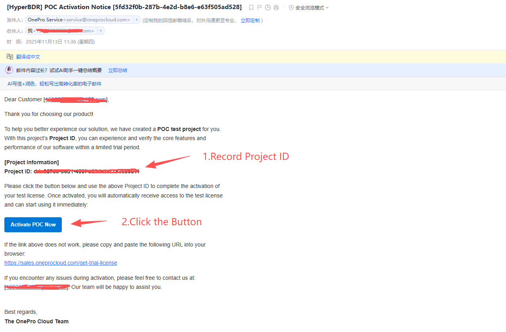
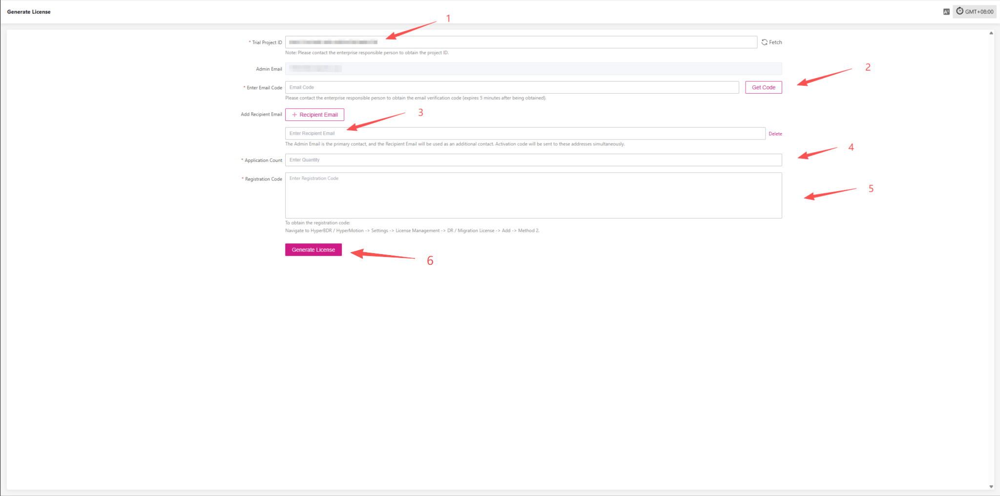

# POC License Application Guide

1. Open the POC authorization notification email, record the **Project ID**, and click **[Activate POC Now]** to go to the license activation page.

   

2. License Activation Page  
   1. Enter the **Project ID** from the email into the “Test Project ID” field. The system will automatically retrieve the corresponding enterprise administrator email.

      ::: tip 💡 Tip
      Make sure the email address is correct before proceeding.
      :::

   2. Click **[Get Email Verification Code]** and contact the enterprise administrator to obtain the code.
   3. If you need to send the activation email to another address, add a new recipient email.
   4. Enter the **number of POC licenses** you want to apply for.
   5. Enter the **POC environment registration code**.

      ::: tip 💡 Tip
      If you request **disaster recovery** or **failback authorization**, the **Failback Registration Code** field will appear automatically.
      :::

   

3. Overall Activation Process

   
