# Agent Pre-Settings

[[toc]]

## Configure the time synchronization service for the source host

::: tip
Ensure that the host time is synchronized with the network time.
:::

### Windows

::: tip
Example OS: Windows Server 2012 R2
:::

#### Configure using the Windows time tools.

Click on the Windows icon on the desktop > Open Control Panel > Select "Date and Time" for configuration.


#### Configure the system to automatically synchronize time with Internet time synchronization servers.

In the "Date and Time", click on "Internet Time", click on "Change settings..."


Check the "Synchronize with an Internet time server" option. From the "Server" dropdown menu, choose a time server (e.g., time.windows.com).


Click "Update now" to test the connection and wait for confirmation. Click "OK" to save the changes.


#### Configure automatic synchronization with the local time synchronization server.

If your host is in an intranet environment, you need to configure the address to be your local time synchronization server address.

::: tip

The **<ntp.server.ip.address>** is the IP address of your NTP server.

:::


Click "Update now" to test the connection and wait for confirmation. Click "OK" to save the changes.


### Linux

::: tip
Example OS: CentOS Linux release 7.5
:::

#### Install NTP  

```shell

 [root@node ~]# yum install -y ntp

```

#### Start the NTP service

```shell

[root@node ~]# systemctl start  ntpd

[root@node ~]# systemctl enable  ntpd

Created symlink from /etc/systemd/system/multi-user.target.wants/ntpd.service to /usr/lib/systemd/system/ntpd.service.

```

#### View NTP service status

```shell

[root@node ~]# systemctl status ntpd

● ntpd.service - Network Time Service

   Loaded: loaded (/usr/lib/systemd/system/ntpd.service; enabled; vendor preset: disabled)

   Active: active (running) since Thu 2022-08-04 08:00:47 CST; 7h left

 Main PID: 20746 (ntpd)

    Tasks: 1

   Memory: 768.0K

   CGroup: /system.slice/ntpd.service

           └─20746 /usr/sbin/ntpd -u ntp:ntp -g


Aug 04 08:00:47 node ntpd[20746]: Listen normally on 6 lo ::1 UDP 123
Aug 04 08:00:47 node ntpd[20746]: Listen normally on 7 ens33 fe80::8a83:7297:7cb8:9934 UDP 123
Aug 04 08:00:47 node ntpd[20746]: Listening on routing socket on fd #24 for interface updates
Aug 04 08:00:47 node systemd[1]: Started Network Time Service.
Aug 04 08:00:47 node ntpd[20746]: 0.0.0.0 c016 06 restart
Aug 04 08:00:47 node ntpd[20746]: 0.0.0.0 c012 02 freq_set kernel 0.000 PPM
Aug 04 08:00:47 node ntpd[20746]: 0.0.0.0 c011 01 freq_not_set
Aug 04 08:00:56 node ntpd[20746]: 0.0.0.0 c61c 0c clock_step -28798.353463 s
Aug 04 00:00:57 node ntpd[20746]: 0.0.0.0 c614 04 freq_mode
Aug 04 00:00:58 node ntpd[20746]: 0.0.0.0 c618 08 no_sys_peer
```

#### Modify the ntp.conf file

::: tip
Please make sure to replace **time.example.com** with the actual NTP server address you want to use. This command will directly save the file after modification, so ensure that your configuration changes are error-free before executing.
:::

```shell
# Comment out lines starting with 'server'.
# Add new NTP server addresses at the end of the file.
[root@localhost ~]# sudo sed -i -e '/^server/ s/^server/#&/' -e '$ a server time.example.com iburst' /etc/ntp.conf

```

#### Restart the service

```shell

[root@node ~]# systemctl restart ntpd

```

#### Check synchronization status

```shell

[root@node ~]# ntpq -p

     remote           refid      st t when poll reach   delay   offset  jitter

==============================================================================

 203.107.6.88    100.107.25.114   2 u    2   64    1   30.975  149.499   0.393

```

## Verify that the time on the source host is synchronized with Coordinated Universal Time (UTC)

::: tip
For security purposes, Object Storage Service verifies the time difference between the client and server. If the time difference is longer than 15 minutes, the Object Storage Service will reject your requests and this error message is reported.
:::

### Viewing the time on Windows system

Click on the Windows icon on the desktop > Open Control Panel > Select "Date and Time"


 
View the time and time zone:

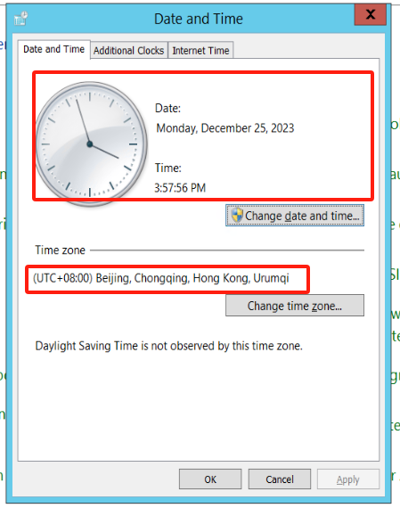


---

### Viewing the time on Linux system

1. **Open the terminal:**
   - Use a terminal application, such as Terminal.
2. **Execute the command to view the system time:**
```
date
```


3. **Execute the command to view the system time zone:**
```
timedatectl
```

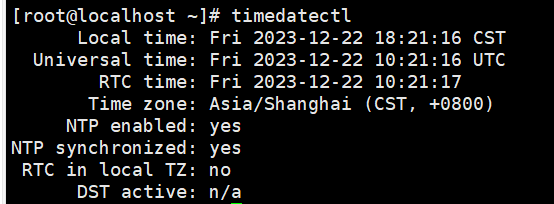

### Viewing UTC Network Time:


1. **Confirm the time zone and time of the source host.**
2. **Network query for standard UTC time and compare it with the source host.**


## Preliminary Investigation
### Get the Windows operating system version

::: tip
Example OS: Microsoft Windows Server 2016 Datacenter
:::

#### Get the Windows OS version through the Control Panel
Open [Control Panel], go to [System and Security], and then select the system to retrieve relevant information.


#### Get the Windows OS version through the CMD
Login to the Windows server, use the shortcut Win + R to open the CMD window, and execute the following command:
```powershell
systeminfo
```


From the output, you can view the OS name.

> **Host Name:** NGINX-WEB  
> **OS Name:** Microsoft Windows Server 2016 Datacenter

### Get the Linux operating system version
> Example OS: CentOS 7.9

Run the following command to view the operating system version:
```shell
cat /etc/redhat-release
```

The output content represents information about the operating system version:  

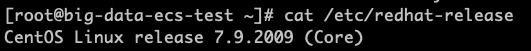

### Check if the host supports Agent-based disaster recovery
Check the operating system and version of the source host, compare it with the Agent Support List, and determine whether the disaster recovery host supports Agent-based disaster recovery.

### Agent Support List

::: tip
【√】: Full support 
:::

::: tip
Currently, the Linux Agent only supports officially released Ubuntu LTS versions. For other customized versions based on Ubuntu, we do not provide support at the moment.  
If your production environment uses a customized Ubuntu version, we need to conduct an internal evaluation on the product side and perform necessary custom builds based on the actual on-site situation. Once the build is completed and passes internal integrity testing, we will provide updates to support your production environment.
:::

| **OS** [Production Source] | **Version** | **Support Information** |
| :---: | :---: | :---: |
| **Windows Server** |  2003 SP2/R2 (64-bit) | √ |
| **Windows Server** |  2008(64-bit) | √ |
| **Windows Server** |  2008 R2(64-bit) | √ |
| **Windows Server** |  2012(64-bit) | √ |
| **Windows Server** |  2012 R2(64-bit) | √ |
| **Windows Server** |  2016(64-bit) | √ |
| **Windows Server** |  2019(64-bit) | √ |
| **Linux** | CentOS 6.5+(64-bit) | √ |
| **Linux** | CentOS 7.x(64-bit) | √ |
| **Linux** | CentOS 8.x(64-bit) | √ |
| **Linux** | Red Hat Enterprise Linux (RHEL) 6.x(64-bit) | √ |
| **Linux** | Red Hat Enterprise Linux (RHEL) 7.x(64-bit) | √ |
| **Linux** | Red Hat Enterprise Linux (RHEL) 8.x(64-bit) | √ |
| **Linux** | SUSE Linux Enterprise Server 11 SP1 (SLES)(64-bit) | √ |
| **Linux** | SUSE Linux Enterprise Server 11 SP1 (SLES)(64-bit) | √ |
| **Linux** | SUSE Linux Enterprise Server 11 SP3 (SLES)(64-bit) | √ |
| **Linux** | SUSE Linux Enterprise Server 11 SP4 (SLES)(64-bit) | √ |
| **Linux** | Ubuntu Server 12.04(64-bit) | √ |
| **Linux** | Ubuntu Server 14.04(64-bit) | √ |
| **Linux** | Ubuntu Server 16.04(64-bit) | √ |
| **Linux** | Ubuntu Server 18.04(64-bit) | √ |
| **Linux** | Ubuntu Server 20.04(64-bit) | √ |


## Install Agent on the source Linux host
### Log in to the HyperBDR disaster recovery platform
Log in to the disaster recovery platform using the username and password for the platform, and perform disaster recovery operations.


### Copy the Agent installation command
Click on 'Configuration' at the top, then on the left, click on 'Production Site'. Choose the Agent mode and click to proceed.


In the 'Linux' section, click on 'Copy Command'.


### Execute the installation command on the source-side host
Log in to the source-side host, execute the specified command, and the Agent program will be successfully installed.
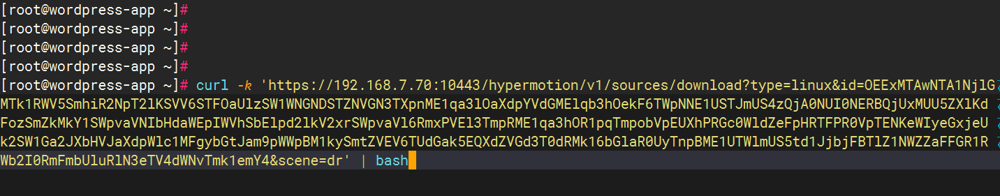


## Install Agent on the source Windows Host

::: tip
The HyperBDR disaster recovery platform is pre-installed by default. In case of local antivirus software, it is essential to proactively add the Windows Agent software to the antivirus software's whitelist. This ensures the smooth execution of the Agent program. Additionally, it is a prerequisite to have a minimum of 1GB of available memory on the host to guarantee the normal operation of the Windows Agent.
:::

Open the Performance tab of Task Manager and view the available memory of the system:
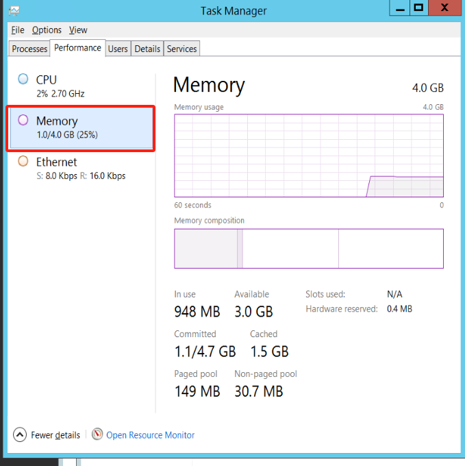

### Download the installation package to the host system
 
Login to the HyperBDR platform, navigate to **[Configuration]** -> **[Production Site]** -> **[Agent]**, and download the ZIP file: 


### Unzip the installation package and proceed with the installation
Extract the installation package to the current directory.
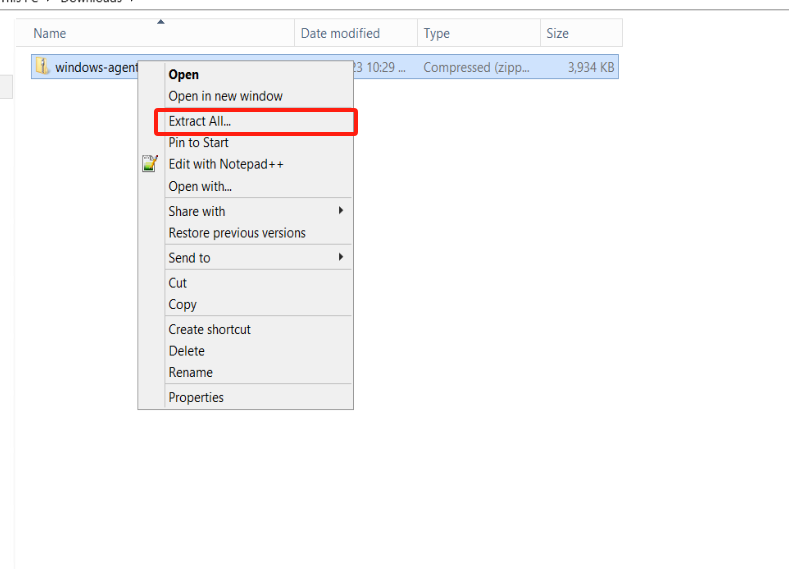


Open the folder of the extracted directory, right-click on the Install.exe file, and run this program as administrator to install the Windows Agent.


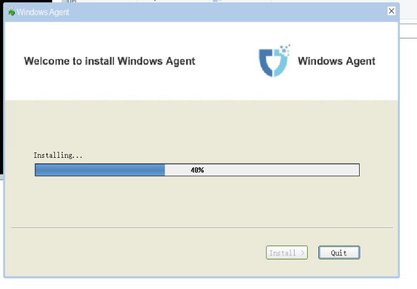

 
Installation of Windows Agent is complete.  
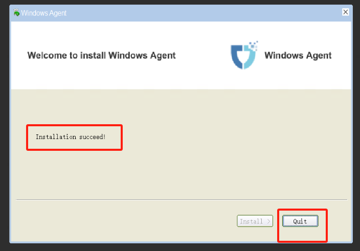

### Start the Windows Agent service
Right-click on the Windows Agent shortcut on the desktop and run it with administrator privileges.  


Start Service  


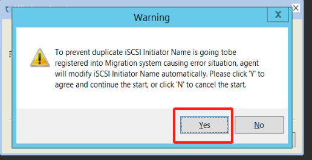

Service started normally  

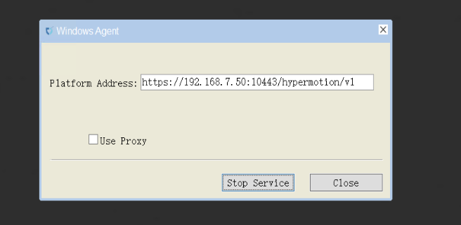


## Verify the Agent registration of the source host

::: tip
After installing the Agent on the source-side Linux host, it will automatically register with the disaster recovery platform.  
After installing and launching the Agent on the source-side Windows host, it will automatically register with the disaster recovery platform.
:::

### Log in to the disaster recovery platform
Log in to the disaster recovery platform using the username and password for the platform, and perform disaster recovery operations.


### View hosts on the disaster recovery main interface
After logging in to the HyperBDR disaster recovery platform, click on the 'DR' in the top menu bar, then on the left menu bar, select 'Host DR' to check whether the hosts are registered on the platform, ensure Host Status is "Registered", Availability is "Online":


## (Option 1: Public Network Access) Test the Connectivity between the Agent Host and Huawei Cloud OBS

::: tip
Ensure your source hosts can access internet before testing.
:::

### Windows

::: tip
Perform testing operations using the Windows Command Prompt (CMD).
:::

#### Public DNS Connectivity Testing
```shell

ping 2 8.8.8.8

```

Success Response:


#### Huawei Object Storage Connectivity

```shell

ping https://obs.ap-southeast-3.myhuaweicloud.com

```

Success Response:

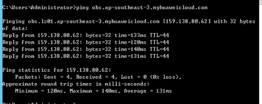

### Linux

#### Public DNS Connectivity Testing

```shell

ping -c 4 -t 2 8.8.8.8

```

Success Response:

```

ping -c 4 -t 2 8.8.8.8

PING 8.8.8.8 (8.8.8.8): 56 data bytes

64 bytes from 8.8.8.8: icmp_seq=0 ttl=111 time=43.362 ms

64 bytes from 8.8.8.8: icmp_seq=1 ttl=111 time=49.807 ms


--- 8.8.8.8 ping statistics ---
2 packets transmitted, 2 packets received, 0.0% packet loss
round-trip min/avg/max/stddev = 43.362/46.585/49.807/3.222 ms
```

#### Huawei Object Storage Connectivity

```shell

curl https://obs.ap-southeast-3.myhuaweicloud.com

```

Success Response:

```

<?xml version="1.0" encoding="UTF-8" standalone="yes"?><Error><Code>AccessDenied</Code><Message>Anonymous access is forbidden for this operation</Message><RequestId>0000018C1F508F2F9012234EA17641CE</RequestId><HostId>Z9v+cC1sRnaWw6x0vi8pxxYA0YVnKxbYHUPAFpnxkX8sLV44u5b02Z+ailn2wCnR</HostId></Error>#

```

::: tip
This command is primarily used to test the accessibility of Huawei Cloud Object Storage buckets. Currently, the tested OBS domain is for the Huawei Cloud Singapore region. If you need to test in a different region, please refer to the official Huawei Cloud documentation to find the corresponding Endpoint domain address.  
Reference Link: [https://developer.huaweicloud.com/intl/en-us/endpoint?OBS](https://developer.huaweicloud.com/intl/en-us/endpoint?OBS)
:::


## (Option 2: Internal VPN Access) Test the Connectivity between the Agent Host and Huawei Cloud OBS

### Windows Host

::: tip
Perform testing operations using the Windows Command Prompt (CMD).
:::

#### Huawei Cloud Private DNS Connectivity Testing

::: tip
Refer to the following document to find the private NDS (Network Domain Service) address based on the used object storage region.  
Reference documents: [https://support.huaweicloud.com/intl/en-us/dns_faq/dns_faq_002.html](https://support.huaweicloud.com/intl/en-us/dns_faq/dns_faq_002.html)
:::

```shell
ping 100.125.1.250
```

Success Response:

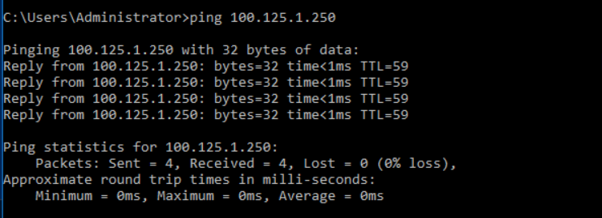

#### Huawei Object Storage Connectivity

```shell

ping https://obs.ap-southeast-3.myhuaweicloud.com

```

Success Response:


### Linux Host

#### Check Object Storage Service Endpoint

Make sure object storage service endpoint address return internal ip address.


```
ping obs.ap-southeast-3.myhuaweicloud.com
```

Success Response:

```

PING obs.lz01.ap-southeast-3.myhuaweicloud.com (100.125.36.29) 56(84) bytes of data.

```

::: tip
Huawei Cloud Object Storage Service internal IP Range: 100.125.xx. If there is no ICMP response, it is considered normal.
:::

#### Huawei Object Storage Connectivity

```

curl https://obs.ap-southeast-3.myhuaweicloud.com

```

Success Response:

```

<?xml version="1.0" encoding="UTF-8" standalone="yes"?><Error><Code>AccessDenied</Code><Message>Anonymous access is forbidden for this operation</Message><RequestId>0000018C1F508F2F9012234EA17641CE</RequestId><HostId>Z9v+cC1sRnaWw6x0vi8pxxYA0YVnKxbYHUPAFpnxkX8sLV44u5b02Z+ailn2wCnR</HostId></Error>#

```

::: tip
This command is primarily used to test the accessibility of Huawei Cloud Object Storage buckets. Currently, the tested OBS domain is for the Huawei Cloud Singapore region. If you need to test in a different region, please refer to the official Huawei Cloud documentation to find the corresponding Endpoint domain address.  
Reference Link: [https://developer.huaweicloud.com/intl/en-us/endpoint?OBS](https://developer.huaweicloud.com/intl/en-us/endpoint?OBS)
:::


## (Option 1: Public Network Access) Test Network Connectivity from Source Host to HyperBDR Console

::: tip
This step needs to be tested after the installation of HyperBDR Console is completed.  
Test Access to HyperBDR Console Port 10443 and Port 30080.
:::

### Windows Host

::: tip
Perform testing operations using the Windows Command Prompt (CMD).
:::

Test Access to HyperBDR Console Port 10443 and Port 30080

Execute Command: 

```shell

ssh -v -p 10443 <HyperBDR Console Public IP>

```

Test Result: If the input results include the information "[debug1: Connection established.]" it indicates that there are no issues with network connectivity.


Execute Command: 

```shell

ssh -v -p 30080 <HyperBDR Console Public IP>

```


Test Result: If the input results include the information "[debug1: Connection established.]" it indicates that there are no issues with network connectivity.

### Linux Host

Test Access to HyperBDR Console Port 10443 and Port 30080

Execute Command: 

```shell

ssh -v -p 10443 <HyperBDR Console Public IP>

```

Test Result: If the input results include the information "[debug1: Connection established.]" it indicates that there are no issues with network connectivity.

```shell

OpenSSH_7.4p1, OpenSSL 1.0.2k-fips 26 Jan 2017

debug1: Reading configuration data /etc/ssh/ssh_config

debug1: /etc/ssh/ssh_config line 58: Applying options for *

debug1: Connecting to <HyperBDR Public IP> [<HyperBDR Public IP>] port 10443.

debug1: Connection established.

```

Execute Command: 

```shell

ssh -v -p 30080 <HyperBDR Console Public IP>

```

Test Result: If the input results include the information "[debug1: Connection established.]" it indicates that there are no issues with network connectivity.

```shell

OpenSSH_7.4p1, OpenSSL 1.0.2k-fips 26 Jan 2017

debug1: Reading configuration data /etc/ssh/ssh_config

debug1: /etc/ssh/ssh_config line 58: Applying options for *

debug1: Connecting to <HyperBDR Console Public IP> [<HyperBDR Console Public IP>] port 30080.

debug1: Connection established.

```

## (Option 2: Internal VPN Access)Test Network Connectivity from Source Host to HyperBDR Console

::: tip
This step needs to be tested after the installation of HyperBDR Console is completed.  
Test Access to HyperBDR Console Port 10443 and Port 30080
:::

### Windows Host

::: tip
Perform testing operations using the Windows Command Prompt (CMD).
:::

Execute Command: 

```shell

ssh -v -p 10443 <HyperBDR Console Internal IP>

```

Test Result: If the input results include the information "[debug1: Connection established.]" it indicates that there are no issues with network connectivity.


Execute Command: 

```shell

ssh -v -p 30080 <HyperBDR Console Internal IP>

```

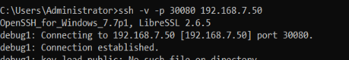

Test Result: If the input results include the information "[debug1: Connection established.]" it indicates that there are no issues with network connectivity.

### Linux Host

Execute Command:

```shell

ssh -v -p 10443 <HyperBDR Console Internal IP>

```

Test Result: If the input results include the information "[debug1: Connection established.]" it indicates that there are no issues with network connectivity.

```shell

OpenSSH_7.4p1, OpenSSL 1.0.2k-fips  26 Jan 2017

debug1: Reading configuration data /etc/ssh/ssh_config

debug1: /etc/ssh/ssh_config line 58: Applying options for *

debug1: Connecting to <HyperBDR Internal IP> [<HyperBDR Internal IP>] port 10443.

debug1: Connection established.

```

Execute Command: 

```shell

ssh -v -p 30080 <HyperBDR Console Internal IP>

```

Test Result: If the input results include the information "[debug1: Connection established.]" it indicates that there are no issues with network connectivity.

```

OpenSSH_7.4p1, OpenSSL 1.0.2k-fips  26 Jan 2017

debug1: Reading configuration data /etc/ssh/ssh_config

debug1: /etc/ssh/ssh_config line 58: Applying options for *

debug1: Connecting to <HyperBDR Internal IP> [<HyperBDR Internal IP>] port 30080.

debug1: Connection established.

```

## **Antivirus Software Inspection and Measures on Source Windows Host**

### Check for the presence of antivirus software on the host

::: tip
If antivirus software is running locally on the Windows host, during the installation and use of the Windows Agent, relevant programs and files may be mistakenly identified as trojans, viruses, or dangerous files, causing the Windows Agent to malfunction.
:::

Before installing the Windows Agent, check if antivirus software is running on the host and take the following measures to avoid issues with the proper installation and operation of the Windows Agent.

#### If the host is running Kaspersky, please click [here](https://docs.oneprocloud.com/userguide/faq/faq.html#kaspersky).
#### If the host is running McAfee, please click [here](https://docs.oneprocloud.com/userguide/faq/faq.html#mcafee).

If the above did not find the antivirus software running on your host, please continue to browse the contents of this document.

### Measures when Antivirus Software is Running on the Windows Host

#### Option 1: Add to Antivirus Software Whitelist

::: warning
As some antivirus software programs may operate in the background, this method may not completely avoid issues caused by antivirus software programs, preventing the Windows Agent from functioning properly.
:::

1. **Disable the protection feature of the antivirus software.**

2. **Install the Windows Agent (refer to the documentation: [Install the Windows Agent](https://docs.oneprocloud.com/userguide/poc/agent-pre-settings.html#install-agent-on-the-source-windows-host)).**

3. **Add the following directories and files to the whitelist of the antivirus software (default installation path).**

| **List** | **Attributes** |
| --- | --- |
| C:\\Program Files (x86)\\DiskSync-Agent | Dir |
| C:\\Program Files (x86)\\DiskSync-Agent\\hyper_exporter | Dir |
| C:\\Program Files (x86)\\DiskSync-Agent\\CollHostInfo.bat | File |
| C:\\Program Files (x86)\\DiskSync-Agent\\create_bcd.bat | File |
| C:\\Program Files (x86)\\DiskSync-Agent\\DiskSyncAgent.exe | File |
| C:\\Program Files (x86)\\DiskSync-Agent\\DiskSyncCtrl.exe | File |
| C:\\Program Files (x86)\\DiskSync-Agent\\ExecPro_in.exe | File |
| C:\\Program Files (x86)\\DiskSync-Agent\\ExecPro_un.exe | File |
| C:\\Program Files (x86)\\DiskSync-Agent\\hyper_exporter.exe | File |
| C:\\Program Files (x86)\\DiskSync-Agent\\Opcli.exe | File |
| C:\\Program Files (x86)\\DiskSync-Agent\\reg_service.bat | File |
| C:\\Program Files (x86)\\DiskSync-Agent\\reset.bat | File |
| C:\\Program Files (x86)\\DiskSync-Agent\\uninst.exe | File |
| C:\\Program Files (x86)\\DiskSync-Agent\\unreg_service.bat | File |
| C:\\Program Files (x86)\\DiskSync-Agent\\WindowsAgentCmd.bat | File |
| C:\\Program Files (x86)\\DiskSync-Agent\\hyper_exporter\\hp_exporter_service.exe | File |
| C:\\Program Files (x86)\\DiskSync-Agent\\hyper_exporter\\hyper_exporter.exe | File |
| C:\\Program Files (x86)\\DiskSync-Agent\\hyper_exporter\\reg_service.bat | File |
| C:\\Program Files (x86)\\DiskSync-Agent\\hyper_exporter\\unreg_service.bat | File |


4. **Enable the Antivirus Software's Protection Feature**


During this process, if the antivirus software prompts actions such as blocking the installation and operation of the Window Agent with pop-ups or isolating files, manual "**allow**" or "**restore**" operations are required.


5. **Start the Windows Agent Service (refer to the documentation: [Start Windows Agent Service](https://docs.oneprocloud.com/userguide/poc/agent-pre-settings.html#start-the-windows-agent-service))**

::: warning
If the program fails to start, uninstall the Windows Agent and repeat steps **[1]** to **[5]** until the Windows Agent starts successfully.
:::

6. **If the issue persists after multiple attempts, please contact us for assistance.**

#### Option 2: Uninstall Antivirus Software

::: tip
Consider this option when option 1 does not resolve the issue. 
:::

To effectively address this issue, completely uninstall the antivirus software before installing the Windows Agent. If possible, uninstall the current antivirus software on the system and restrict its reinstallation during the host disaster recovery process.

#### Option 3: Permanently Close the Antivirus Software Program

::: tip
Consider this option when option 1 does not resolve the issue. 
:::

Exiting the antivirus software program can also allow the normal installation and use of Windows Agent.

::: tip
During the installation and use of Windows Agent, it is crucial to ensure that the antivirus software program is not running. If the antivirus software restarts during the use of Windows Agent (either manually or automatically by the system), it may render Windows Agent unusable, leading to HyperBDR disaster recovery failure.
:::

## (Option 2: Intranet VPN access) Configure Huawei Cloud Intranet DNS Address for the Network Device where the Agent Host Reside

::: tip
If your disaster recovery environment is interconnected with the production site's intranet through Huawei Cloud VPN, after creating the VPC Endpoint service, you need to add the resolution address of the Huawei Cloud intranet OBS VPC Endpoint service in the network where the production site's Agent host is located.
:::

### Configure Firewall or Network Devices such as Switches

::: tip
Example: Palo Alto Firewall  
The following operations are performed in the firewall web management interface.
:::

1. Navigate to [Network] > [DNS Proxy] .

2. Click [Add] to bring up the DNS proxy dialog box.

3. Select the interface on which DNS proxy should be enabled. In the following figure, DNS proxy is enabled on Ethernet 1/2 and 1/3 interfaces.

4. Select the primary and secondary servers to which the firewall should forward DNS queries. This example shows the configuration of enabling DNS proxy on Ethernet interfaces 1/2 and 1/3. The active DNS server is set to 10.0.0.246 (This IP is configured as the Huawei Cloud internal DNS Server Addresse).

::: tip
Configure the Huawei Cloud internal DNS address based on the region where you use Huawei Cloud resources.  
Huawei Cloud internal DNS service address at:  [https://support.huaweicloud.com/intl/en-us/dns_faq/dns_faq_002.html](https://support.huaweicloud.com/intl/en-us/dns_faq/dns_faq_002.html)
:::


