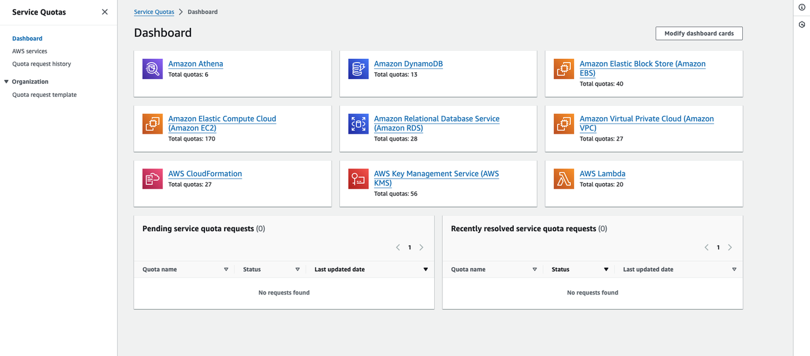
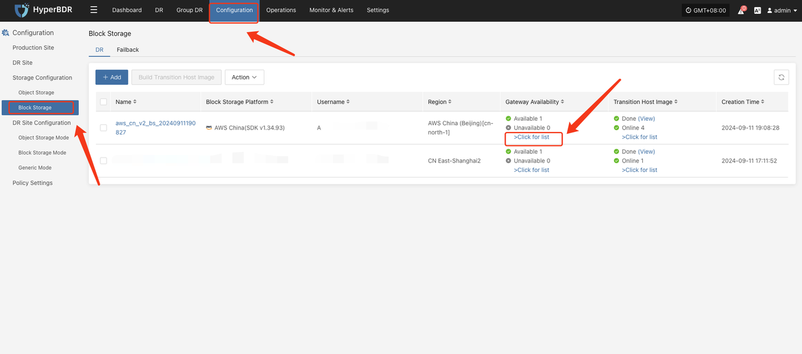
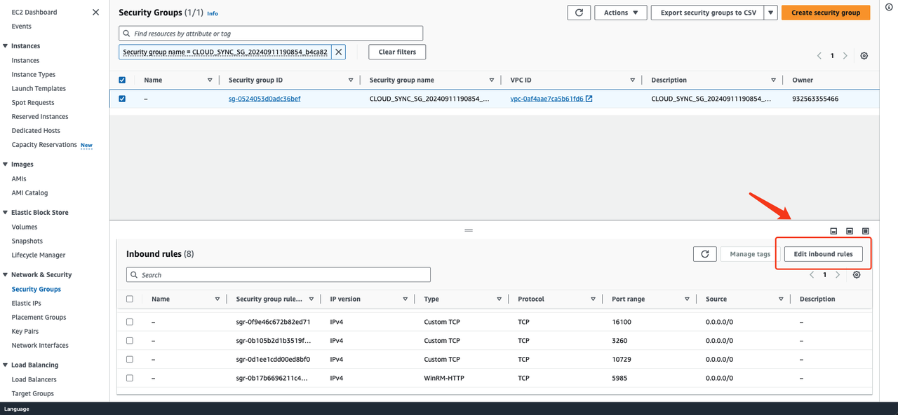
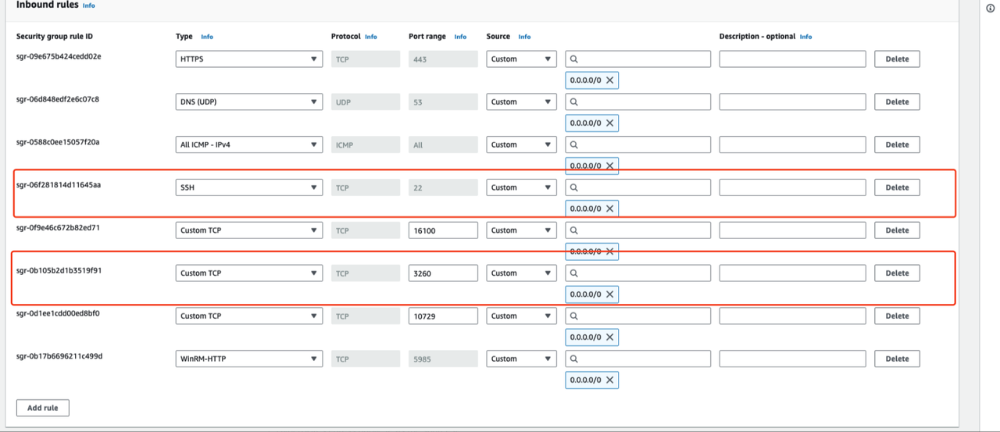

# AWS(Target) Pre-Settings

## Create AWS IAM account for DR purpose

Create a AWS IAM account with correspinding permissions, detail requirement please refer to below document. And create Access Key ID & Access Secret Key of IAM account for setup.

### Create IAM User

**AWS official documentation link:**  
[https://docs.aws.amazon.com/IAM/latest/UserGuide/id_users_create.html](https://docs.aws.amazon.com/IAM/latest/UserGuide/id_users_create.html)

### Granting Authorization to IAM User

**AWS official documentation link:**  
[https://docs.aws.amazon.com/IAM/latest/UserGuide/access_controlling.html](https://docs.aws.amazon.com/IAM/latest/UserGuide/access_controlling.html)

### Managing IAM User Access Keys

**AWS official documentation link:**  
[https://docs.aws.amazon.com/IAM/latest/UserGuide/id_credentials_access-keys.html#Using_CreateAccessKey](https://docs.aws.amazon.com/IAM/latest/UserGuide/id_credentials_access-keys.html#Using_CreateAccessKey)

### AWS IAM Permission Requirements

> AWS has different API versions in different regions, and each region has a slightly different definition of resource description permissions. When you create permissions for HyperBDR, So you need to provide full access to ec2, ebs, s3, ami, and vpc services.

**ec2/vpc/ebs/ami**
```
{
    "Version": "2012-10-17",
    "Statement": [
        {
            "Effect": "Allow",
            "Action": [
                "ec2:*"
            ],
            "Resource": "*"
        }
    ]
}
```

**S3**
```
{
    "Version": "2012-10-17",
    "Statement": [
        {
            "Effect": "Allow",
            "Action": [
                "s3:*"
            ],
            "Resource": "*"
        }
    ]
}
```

## Configure VPC & Subnet

Create VPC Network and Subnet According to AWS Documentation. Explanation: Establish your network based on the following disaster recovery network scenarios.

1. Intranet VPN Access:
If accessing through an intranet VPN, create a DR VPC network and place HyperBDR EC2 instances in this network.
2. Disaster Recovery VPC:
Dedicated VPC network and subnet for HyperBDR disaster recovery and backup, interconnected with the on-premises IDC through VPN.
3. Business VPC:
Business VPC network and subnet used for disaster takeover and drills.

## Create HyperBDR Security Group

> HyperBDR Security Group Name: SG-HyperBDR

### Create Security Group Rules

> NOTE: For Source IP range, we recommend use safe range to replace 0.0.0.0/0.  
> For example, if your external ip address is 110.242.68.66, source can be configurated as 110.242.68.66/32.  
> If it is a public network environment, it is recommended to set whitelist access on port 22 to ensure security.

| No. | Action | Type | Protocol & Port | Source | Description |
| --- | --- | --- | --- | --- | --- |
| 1 | Allow | IPv4 | TCP:22 | 0.0.0.0/0 | Permit default Linux SSH port |
| 2 | Allow | IPv4 | TCP:10443 | 0.0.0.0/0 | Permit HyperBDR web console |
| 3 | Allow | IPv4 | TCP:30443 | 0.0.0.0/0 | Permit HyperBDR Operation and maintenance management platform web console port |
| 4 | Allow | IPv4 | TCP:30080 | 0.0.0.0/0 | Permit HyperBDR https services port |

## Create EC2 for HyperBDR

### Log in to the AWS Console

### Create EC2 Cloud Instance based on Configuration Information

> AWS documentation :  
> [https://docs.aws.amazon.com/AWSEC2/latest/UserGuide/LaunchingAndUsingInstances.html](https://docs.aws.amazon.com/AWSEC2/latest/UserGuide/LaunchingAndUsingInstances.html)  
The resource configuration for HyperBDR servers is as follows:

| Configuration items | Parameters                                                      |
| :------------------ | :-------------------------------------------------------------- |
| Region              | <Your Region\>                                                  |
| Flavor              | c5.2xlarge                                                      |
| Image               | ubuntu-pro-server/images/hvm-ssd/ubuntu-focal-20.04-amd64-pro-server (AWS Community AMIs, ami-0465e6ec564be547e)  |
| System Disk         | 200GB gp2                                                       |
| Network             | <VPC-HyperBDR-172.16.0.0\>                                      |
| Subnet              | <Subnet-HyperBDR-172.16.0.0\> (Automatically assign IP address) |
| Security Group      | SG-HyperBDR                                                     |
| EC2 Name            | HyperBDR-Prod                                                   |
| Key Pair            | <Your KeyPair\>                                                 |
| Username            | ubuntu                                                          |

## VPN Setup

> Note: If your DR Environment is connected to the Intranet of the production site through AWS, you need to purchase the AWS VPN service and configure the AWS to connect to the On-perms network.  
> Configure VPN. For details, see AWS documentation.  
> Document Link: [https://docs.aws.amazon.com/IAM/latest/UserGuide/reference_interface_vpc_endpoints.html](https://docs.aws.amazon.com/IAM/latest/UserGuide/reference_interface_vpc_endpoints.html)

## Create VPC Endpoint

> If your disaster recovery environment is interconnected with the production site's intranet through VPN, and the production site needs to access HyperBDR and OBS services through VPN during a disaster, then you need to purchase and configure VPC Endpoint services in AWS.
>You need to purchase two VPC Endpoint services, one for OBS and the other for DNS.
> Official definition: If you want to access OBS services from a local data center via VPN or Cloud Connect using an intranet method, you can achieve this by connecting through terminal endpoints to access terminal endpoint services.  
> Document Link：[https://docs.aws.amazon.com/IAM/latest/UserGuide/reference_interface_vpc_endpoints.html](https://docs.aws.amazon.com/IAM/latest/UserGuide/reference_interface_vpc_endpoints.html)

## Create VPC Peering

### Disaster recovery VPC connected via peering with multiple business VPC

In AWS Disaster Recovery, the disaster recovery host needs to be restored to the planned production business VPC. Therefore, it is necessary to configure cross VPC peer-to-peer connections in AWS, configure the disaster recovery VPC with the business VPC, and add peer-to-peer connection routing. Mainly used for disaster recovery, the disaster recovery VPC where HyperBDR is located can access the business VPC through the intranet to recover virtual machines for data recovery.

> Peering One Central VPC with Multiple VPCs 
> Document Link:  [https://docs.aws.amazon.com/vpc/latest/peering/create-vpc-peering-connection.html](https://docs.aws.amazon.com/vpc/latest/peering/create-vpc-peering-connection.html)

### Disaster recovery VPC peering with multiple business VPCs, as well as peering connections between multiple business VPC

When all disaster recovery hosts of the customer need to be placed in different business VPCs planned by AWS and there is a need for cross VPC access in the business, then it is necessary to configure peer-to-peer connections between business VPCs to ensure normal cross VPC business interaction after subsequent business recovery.

> Peering Two or More VPCs  
> Document Link:  [https://docs.aws.amazon.com/vpc/latest/peering/create-vpc-peering-connection.html](https://docs.aws.amazon.com/vpc/latest/peering/create-vpc-peering-connection.html)

## Test Network Access between VPCs

> Create VPC Peering configuration has been successfully completed, and routing entries have been added correctly.

### Test the network connectivity between the disaster recovery VPC and the business VPC

- Step1: Login to AWS and create an EC2 test cloud server  Create an EC2 test cloud server on AWS. When configuring the network, choose the business VPC and subnet. Ensure that the security group of this newly created EC2 test virtual machine has an inbound access policy allowing port 22.

Execute command:
```
ssh root@<The intranet IP address of the test EC2> 22
```

Test results:  If you can successfully access and enter the password, it indicates normal access.

### Test the network connectivity between business VPC

- Setp1: Create a new EC2 test cloud server. When configuring the network, choose a different business VPC and subnet. Ensure that the security group of this newly created EC2 test virtual machine has an inbound access policy allowing port 22.
- Sep2: Log in to different test cloud servers through the console and perform bidirectional command tests with the following commands.

Execute command:
```
ssh root@<The intranet IP of the test EC2> 22
```

Test results:
If you can successfully access and enter the password, it indicates normal access.

## AWS platform account quota check

During the disaster recovery process, it is essential to ensure that the cloud account has sufficient resource quotas to support data synchronization and disaster recovery recovery. To prevent potential failure of disaster recovery due to insufficient quotas, it is necessary to perform a resource quota check before initiating the disaster recovery.  
If the remaining quota in the AWS account is insufficient, it is necessary to clean up unnecessary resources in the account or apply for an expansion of AWS resource quotas.

### Source host resource inventory

Need to gather information on the computing and storage resources for the host systems awaiting disaster recovery and input the details into a table.
| Resources Type | Size |
| --- | --- |
| The total number of source host  |  |
| The total number of source host CPU |  |
| The total number of source host RAM(MB) |  |
| The total number of source host disks |  |
| The total disk capacity for source host(GB) |  |

### AWS account resource quota check

**Login AWS**


**View resource quotas**

Access the AWS Console, click on "Service Quotas" in the upper-right corner. The webpage will navigate to the "Quotas" page.




**Count your AWS account resource quotas and calculate the remaining quota**


| Service | Resources Type | Used Quota | Total Quota | Residual Quota |
| --- | --- | --- | --- | --- |
| Elastic Cloud Server | EC2 |  |  |  |
| Elastic Cloud Server | vCPUs |  |  |  |
| Elastic Cloud Server | Memory (MB) |  |  |  |
| Image Management Service | Images |  |  |  |
| Elastic Volume Service | Disks |  |  |  |
| Elastic Volume Service | Disk capacity(GB) |  |  |  |
| Virtual Private Cloud | Elastic IP addresses |  |  |  |

**Compare the remaining quota with the resources of the source hosts**

Compare the resource levels of the source hosts, as per your inventory, with the remaining resource quota in your AWS account to assess whether it meets the requirements for disaster recovery.

**1. If you are using object storage recovery mode for DR, please refer to the following criteria.**

> **Elastic Cloud Server: EC2** Residual Quota ≥ The total number of source host  
> **Elastic Cloud Server: vCPUs** Residual Quota ≥ The total number of source host CPU  
> **Elastic Cloud Server: Memory (MB)** Residual Quota ≥ The total number of source host RAM(MB)  
> **Elastic Volume Service: Disk** Residual Quota ≥ The total number of source host disks  
> **Elastic Volume Service: Disk capacity(GB)** Residual Quota ≥ The total disk capacity for source host(GB)  
> **Image Management Service: Images**  Residual Quota ≥ 2  
> **Virtual Private Cloud: Elastic IP addresses** Residual Quota: Satisfying the required number of public IP for the disaster recovery hosts to be restored to the AWS Cloud platform is sufficient.

**2. If you are using block storage recovery mode for DR, please refer to the following criteria.**

> **Elastic Cloud Server: EC2** Residual Quota ≥ The total number of source host + Number of HyperGate instances  
> **Elastic Cloud Server: vCPUs** Residual Quota ≥ The total number of source host CPU + 2 * Number of HyperGate instances  
> **Elastic Cloud Server: Memory (MB)** Residual Quota ≥ The total number of source host RAM(MB) + 2048(MB) * Number of HyperGate instances  
> **Elastic Volume Service: Disk** Residual Quota ≥ 2 * Total number of source host disks + Number of HyperGate instances  
> **Elastic Volume Service: Disk capacity(GB)** Residual Quota ≥ 2 * Total disk capacity for source host(GB) + 40(GB) * Number of HyperGate instances  
> **Image Management Service: Images**  Residual Quota ≥ 2  
> **Virtual Private Cloud: Elastic IP addresses** Residual Quota: The quantity should satisfy the sum of the required public IP addresses for the disaster recovery hosts to be restored to the AWS Cloud platform, including both the number of public IP for the source hosts and the quantity of HyperGate instances.

If it is discovered that the remaining resource quota in the AWS Cloud account is insufficient, it is necessary to clean up unnecessary resources in the account or apply to AWS Cloud for an expansion of resource quotas.

### Increase quotas in your AWS Cloud account.

If it is discovered that the remaining resource quota in the AWS Cloud account is insufficient, and there are no resources to clean up in the account, you can try submitting a AWS Cloud ticket to request an expansion of resource quotas. 


## Modify the policy of the Cloud Sync Gateway instance security group

### Confirm the instance of Cloud Sync Gateway
> Login the HyperBDR console by default.




Record the Link Address of the cloud sync gateway.

### Modify the cloud sync gateway security group

Log in to AWS and use Link Address to find the cloud sync gateway instance.


Modify security group




1. Modify the Inbound Rules and set the source end of port 22 to the IP address of HyperBDR.
2. Modify the Inbound Rules and set the source end of port 3260 to the IP address of source agent or source agentless proxy.



> If HyperBDR,  source agent, source agentless proxy or is deployed in a private network environment without a fixed public IP, you need to use egress public IP as the source IP.