# Azure Pre-Settings

[[toc]]

## Register applications

Reference Documents: [https://learn.microsoft.com/en-us/security/zero-trust/develop/app-registration](https://learn.microsoft.com/en-us/security/zero-trust/develop/app-registration)

Click to [Microsoft Entra ID] → [App registrations], click the [New registration] button.

  

## Add APl Permissions

Add APl permissions to your App in subscription.

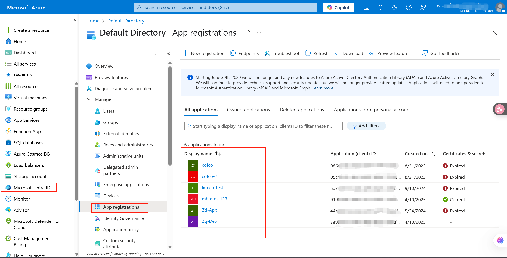

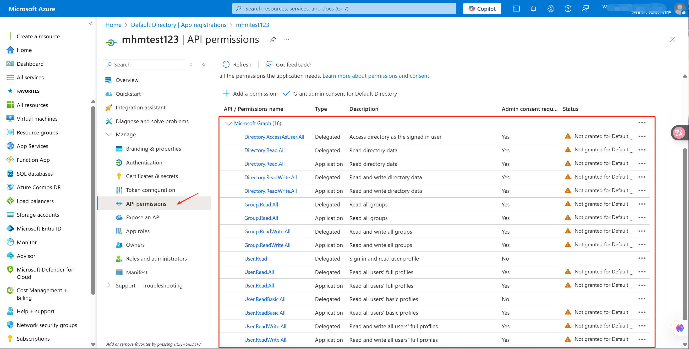

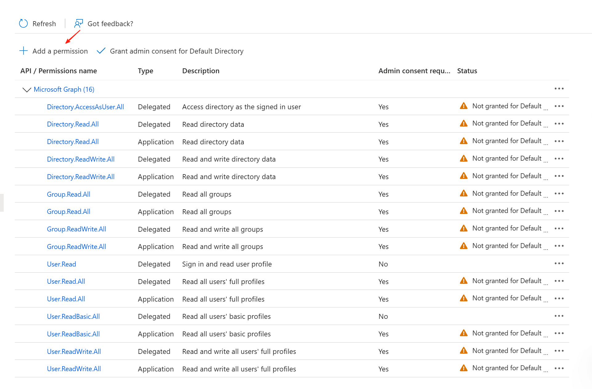

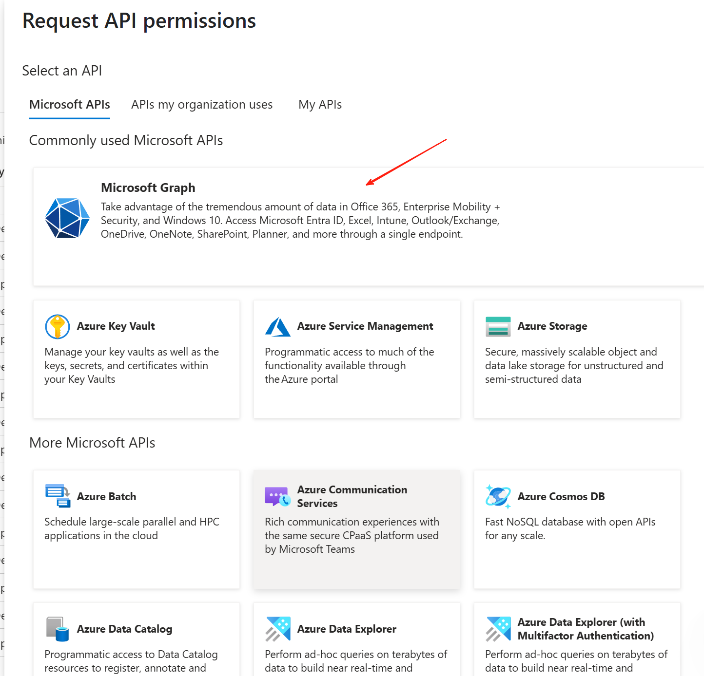

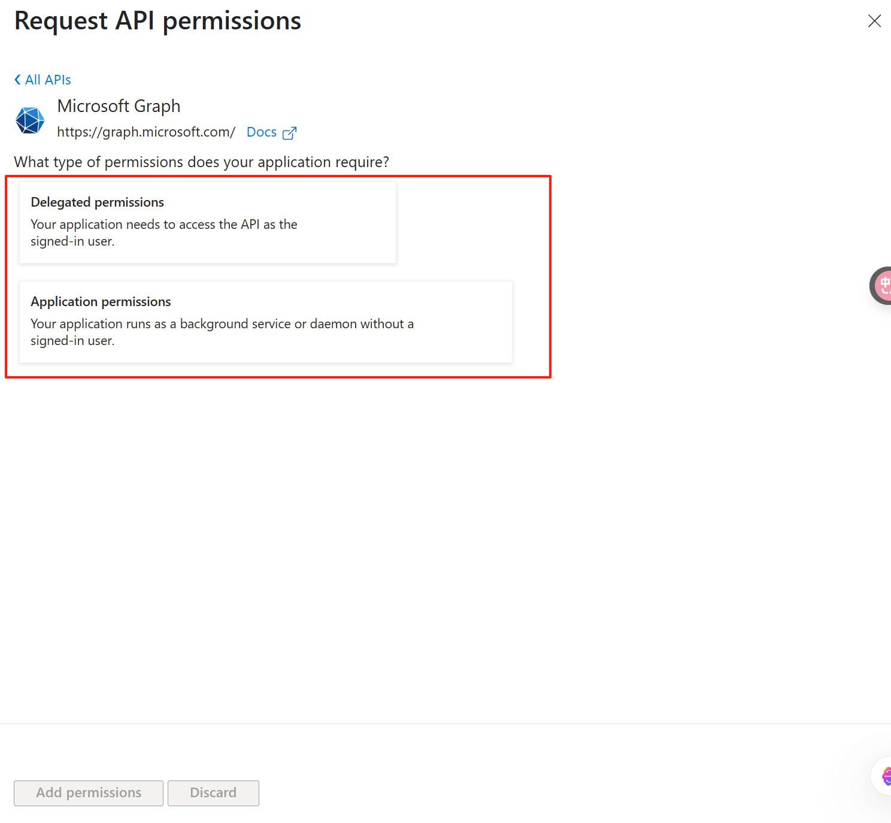

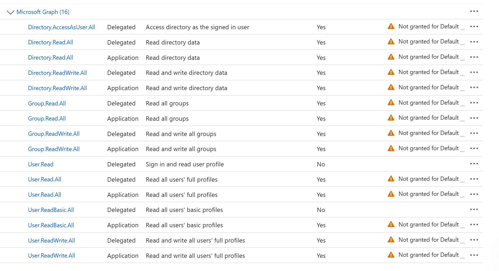

## Create New client secret

::: tip
Client secret values cannot be viewed, except for immediately after creation. Be sure to save the secret when created before leaving the page.
:::

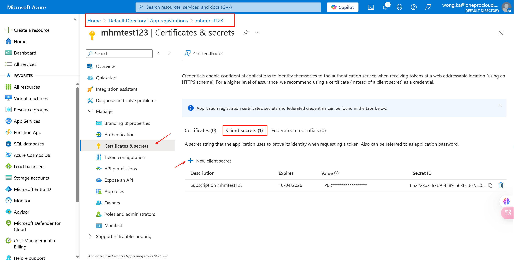

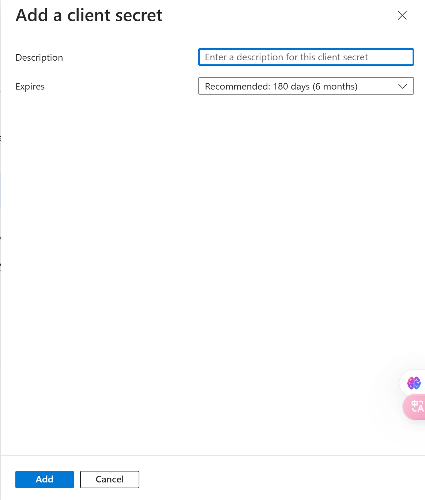

## Create Subscription

> Make sure you have a subscription that can use, and if not, please create a new subscription

1. Sign in to the Azure portal.

2. Navigate to Subscriptions and then select Add.

3. On the Create a subscription page, on the Basics tab, type a Subscription name.

4. Select the Billing account where the new subscription gets created.

5. Select the Billing profile where the subscription gets created.

6. Select the Invoice section where the subscription gets created.

7. Next to Plan, select Microsoft Azure Plan for DevTest if the subscription is used for development or testing workloads. Otherwise, select Microsoft Azure Plan.

8. Select the Advanced tab.

9. Select your Subscription directory. It's the Microsoft Entra ID where the new subscription gets created.

10. Select a Management group. It's the Microsoft Entra management group that the new subscription is associated with. You can only select management groups in the current directory.

11. Select one or more Subscription owners. You can select only users or service principals in the selected subscription directory. You can't select guest directory users. If you select a service principal, enter its App ID.

12. Select the Tags tab.

13. Enter tag pairs for Name and Value.

14. Select Review + create. You should see a message stating Validation passed.

15. Verify that the subscription information is correct, then select Create. A notification that the subscription is getting created is shown.

After the new subscription is created, the owner of the subscription can see it in on the Subscriptions page.

## Register resource provider

Reference Documents: [https://learn.microsoft.com/en-us/azure/azure-resource-manager/management/resource-providers-and-types](https://learn.microsoft.com/en-us/azure/azure-resource-manager/management/resource-providers-and-types)

> Before you use a resource provider, make sure your Azure subscription is registered for the resource provider. Registration configures your subscription to work with the resource provider.

1. Sign in to the Azure portal.

2. On the Azure portal menu, search for Subscriptions. Select it from the available options.

3. Select the subscription you want to view.

4. On the left menu and under Settings, select Resource providers.

5. Find the resource provider you want to register.

6. Select the resource provider to see the details of the resource provider.

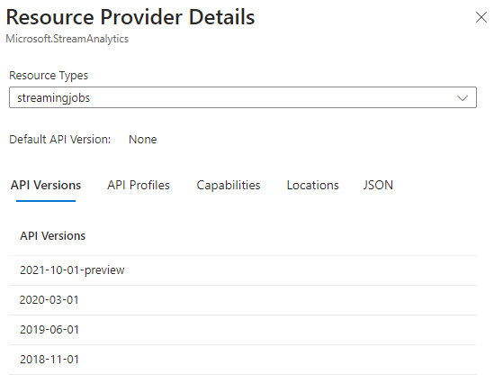

7. Select the resource provider, and select Register. To maintain least privileges in your subscription, only register the resource providers that you're ready to use.

::: tip
As noted earlier, don't block the creation of resources for a resource provider that's in the registering state. When your application doesn't block a resource provider in the registering state, it can continue sooner than waiting for all regions to complete.
:::

8. Re-register a resource provider to use locations that you added since the previous registration.

9. Register the following resource providers

## Add Access control (IAM)

Assign the Owner role to your Subscription

Related members, the members that app create for you, or the app you already have.

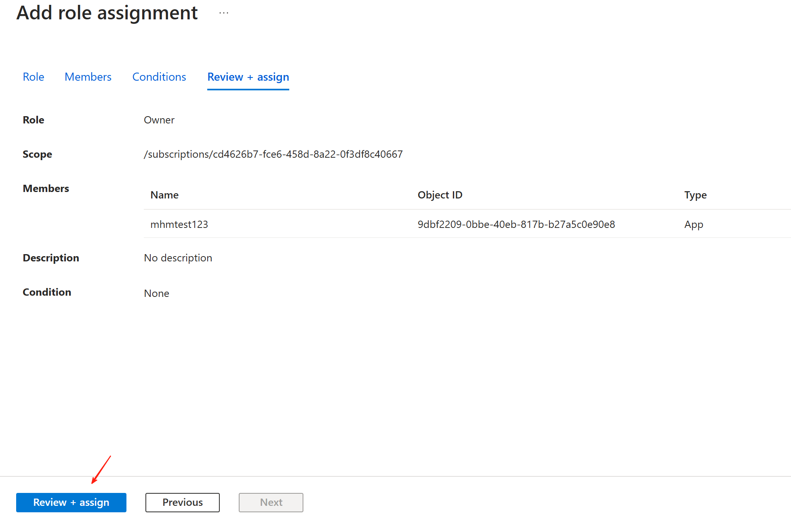

## Prepare resource group

Create a new resource group, associate the created subscription, or associate your existing resource group

## Obtain the required authentication information

**Directory (tenant) ID:**
**[Microsoft Entra ID] → [App registrations] → [Directory (tenant) ID]**

**Application (client) ID**
**[Microsoft Entra ID] → [App registrations] → [Application (client) ID]**

**Client Secret Value**
**[Microsoft Entra ID] → [App registrations] → [Certificates & secrets]**

::: warning
Client secret values cannot be viewed, except for immediately after creation. Be sure to save the secret when created before leaving the page.
:::

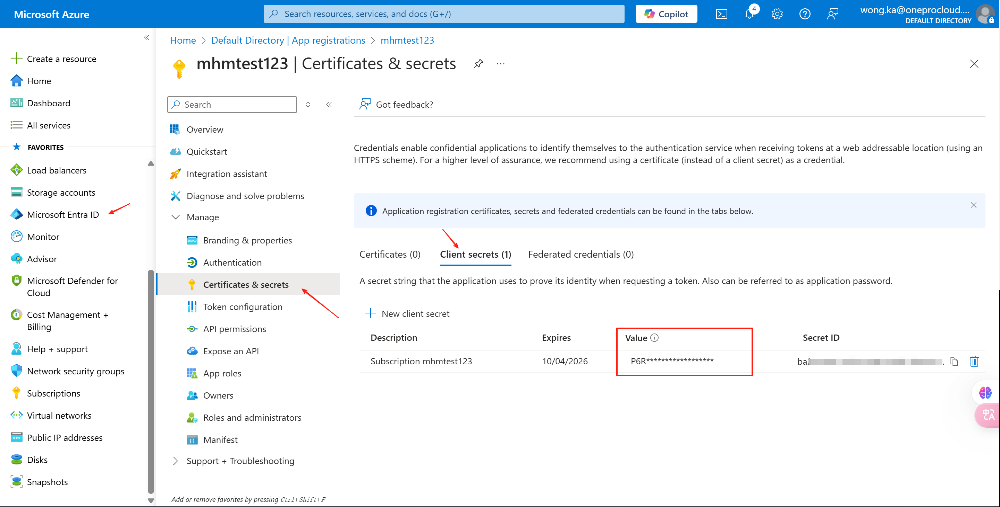

**Subscription ID**
**[Subscriptions]→[Subscription ID]**

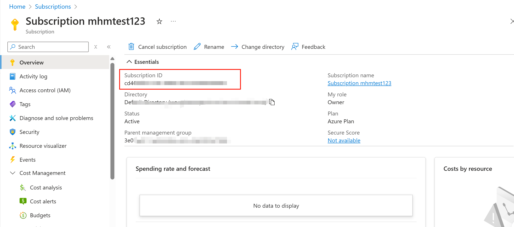

## Notes

### Azure only supports three disk types as instances of system disks

- Premium SSD (locally-redundant storage)
- Standard SSD (locally-redundant storage)
- Standard HDD (locally-redundant storage)

Reference Documents: [http://go.microsoft.com/fwlink/?LinkId=2077607](http://go.microsoft.com/fwlink/?LinkId=2077607)

When create a cloud sync gateway, select one of the three types as the system disk type of the cloud sync gateway.

### Use ubuntu as the username of the image

::: tip
Due to the limitation of Azure cloud image, need use ubuntu as username of image.
:::

When creating a cloud sync gateway, in step 4 [Gateway Advanced Configuration], fill in ubuntu as username.

