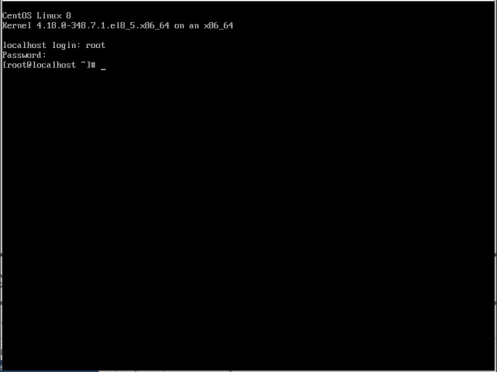

# General Platform Setup

[[toc]]

##  Create Failback Transition Host - Agent

1. Use the failback transition image to create a virtual machine or physical machine in the source production environment as a Failback Transition Host.
2. The Failback Transition Host serves as the data receiver during rollback and the recovery host during the final rollback.
3. The Failback Transition Host serves requires a minimum configuration of 2 cores and 4 GB RAM. As this host is the recovery host during the final rollback, the general rule is to have a computing resource configuration consistent with the failback host.
4. The Failback Transition Host serves storage configuration (disk number and disk capacity) for the Failback Transition Host should match that of the failback host.

**Example: **
| Host configuration | Tackover Host configuration | Failback Transition Host configuration |
| --- | --- | --- |
| CPU | 4 | 4 |
| RAM | 8GB | 8GB |
| OS disk capacity | 100GB | 100GB |
| data disk1 capacity | 200GB | 200GB |
| data disk2 capacity | 500GB | 500GB |

## Configure the IP address for the Failback Transition Host - Agent

::: tip
The virtual machine/physical machine has already been created as a Failback Transition Host in the source production environment by defaul.
:::

### Login the Failback Transition Host system

::: tip
Default User: root  
Default Password: Acb@132.Inst
:::


### Manually configure the network

::: tip
The Hyperdoor image is configured with default DHCP mode for networking. If the source production environment network you selected supports DHCP, confirm the virtual machine's IP and proceed. If the source production environment network does not use DHCP, manual configuration of the machine's network is required
:::

#### Confirm the virtual machine's network adapter device name

```shell
ip a
```


#### Clear network configuration information

```shell
ip addr flush dev ens32 && ip link set ens32 down && ip link set ens32 up
```

Configure a IP address and gateway

::: tip
Configure with example information. Please replace the IP address/mask [192.168.x.x/20] and gateway address [192.168.0.1] based on your actual situation.
:::

```shell
ip addr add 192.168.x.x/20 dev ens32 && ip route add default via 192.168.0.1 dev ens32
```

#### View network configuration

```shell
ip a
```


```shell
ip route
```


## (Intranet VPN Access)Test the connectivity from the Failback Transition Host network to Huawei Cloud OBS network - Agent

### Login Failback Transition Host System

::: tip
Default User: root  
Default Password: Acb@132.Inst
:::



### Huawei Cloud Private DNS Connection Test

::: tip
Please refer to the following document to find the dedicated Network Domain Service (NDS) address based on the used Huawei Cloud OBS region.  
Reference Document: [https://support.huaweicloud.com/intl/en-us/dns_faq/dns_faq_002.html](https://support.huaweicloud.com/intl/en-us/dns_faq/dns_faq_002.html)
:::

```shell
ping 100.125.1.250
```

Success Response:


### Huawei Cloud Object Storage Connection Test

```shell

ping https://obs.ap-southeast-3.myhuaweicloud.com

```

Success Response:


::: tip
This command is primarily used to test the accessibility of Huawei Cloud Object Storage. Currently, the tested OBS domain is applicable to the Huawei Cloud Singapore region. If you need to perform tests in different regions, please refer to the official Huawei Cloud documentation to find the corresponding Endpoint domain.  
Document Link: [https://developer.huaweicloud.com/intl/en-us/endpoint?OBS](https://developer.huaweicloud.com/intl/en-us/endpoint?OBS)
:::

