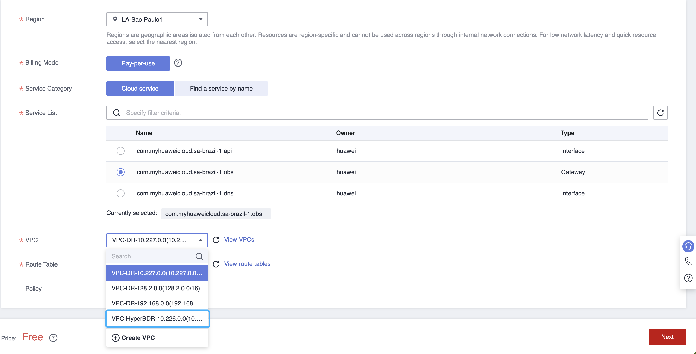
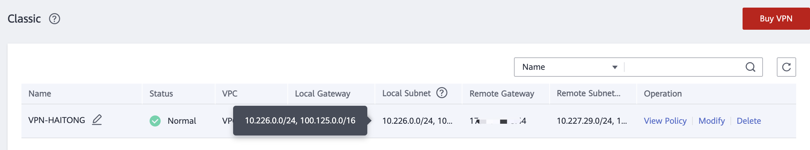

# Huawei Cloud

[[toc]]

## (Intranet VPN Access) Create and configure the VPN service

::: tip
The VPC network of the Huawei cloud failback host connects to the local vCenter/ESXi VM service network.  
If the VPC network where the HyperBDR resides has been connected to the vCenter/ESXi service network through the VPN service when the Dr Is deployed to Huawei cloud, you do not need to connect the network again.
:::

### Configuration document

Configure VPN. For details, see Huawei Cloud official documentation.

Document Link: [https://support.huaweicloud.com/intl/en-us/qs-vpn/vpn_03_0001.html](https://support.huaweicloud.com/intl/en-us/qs-vpn/vpn_03_0001.html)

## (Internal VPN Access) - Create VPC Endpoint service

::: tip
If your disaster recovery environment is interconnected with the production site's intranet through Huawei Cloud VPN, and the production site needs to access Huawei Cloud HyperBDR and OBS services through VPN during a disaster, then you need to purchase and configure VPC Endpoint services in Huawei Cloud.  
You need to purchase two VPC Endpoint services, one for OBS and the other for DNS.
:::

::: tip
If you have purchased and configured the Endpoint service in the VPC when the disaster recovery system is deployed to Huawei cloud, you do not need to repeat this configuration.
:::

### Configure VPC Endpoint

 
Huawei Cloud official definition: If you want to access OBS services from a local data center via VPN or Cloud Connect using an intranet method, you can achieve this by connecting through terminal endpoints to access terminal endpoint services. Document Link: [https://support.huaweicloud.com/intl/en-us/qs-vpcep/vpcep_02_0301.html](https://support.huaweicloud.com/intl/en-us/qs-vpcep/vpcep_02_0301.html)

#### Configure DNS Interface Type for Terminal Endpoints

| Project | Configuration |
| --- | --- |
| Region | Choose the Region to activate |
| Billing Mode | Pay-per-use |
| Service Category | Choose the default "Cloud server," check com.myhuaweicloud.<region\>.dns, and set the type as Interface. |
| VPC | Choose the VPC interconnecting with the local IDC VPN |
| Subnet | Select the subnet for VPN interconnection. |

#### Selection of OBS Gateway-type Terminal Endpoint

| Project | Configuration |
| --- | --- |
| Region | Choose the Region to activate |
| Billing Mode | Pay-per-use |
| Service Category |  Choose the default "Cloud server," check com.myhuaweicloud.<region\>.obs, and set the type as Gateway |
| VPC | Choose the VPC interconnecting with the local IDC VPN |
| Route Table | default |
| Policy | default |

::: tip
In the Service Category section, it may not be possible to directly find the corresponding OBS service for the default Cloud service type. In such cases, you will need to use "Find a service by name" to search. You must enter the complete name of the specific OBS service. Please confirm with Huawei Cloud as the target OBS service terminal endpoints on the Huawei side may have distinctions between v1 and v2 versions. Additionally, the names of each region and the association between v1/v2 versions and the resource pool of the object storage bucket need clarification. If you have purchased v1 OBS terminal endpoints but your object storage bucket is in a v2 cluster, it must be aligned accordingly. Confirm with Huawei in advance regarding the specific version of the object storage bucket's cluster and OBS terminal endpoints

Example: v2 version OBS terminal endpoint name: sa-brazil-1.com.myhuaweicloud.v4.obsv2.lz002
:::

#### Configure VPN local-end OBS gateway

Add the internal subnet range of the local (Huawei Cloud) OBS service at the VPN connection point. The subnet address for all internal Huawei Cloud OBS services is 100.125.0.0/16.

## (Intranet VPN Access) Create and configure the VPN service - Agent

::: tip
The VPC network of the Huawei cloud failback host connects to the source production environment network.  
Note: If the VPC network where the HyperBDR resides has been connected to the source production environment network through the VPN service when the Dr Is deployed to Huawei cloud, you do not need to connect the network again.
:::

### Configuration document
Configure VPN. For details, see Huawei Cloud official documentation.
Document Link: [https://support.huaweicloud.com/intl/en-us/qs-vpn/vpn_03_0001.html](https://support.huaweicloud.com/intl/en-us/qs-vpn/vpn_03_0001.html)

## (Intranet VPN Access) Create and Configure VPN Service - VMware

Requirement: The VPC network where Huawei Cloud HyperBDR is located needs to be interconnected with the local vCenter/ESXi host management network and the upper-level virtual machine business network. 

::: tip
If during disaster recovery to Huawei Cloud, the VPC network where HyperBDR is located is already connected to the vCenter/ESXi business network via a VPN service, then it is only necessary to establish connectivity between the VPC network where HyperBDR is located and the vCenter/ESXi host management network.
:::

To configure the VPN service, please refer to the detailed information in the official Huawei Cloud documentation.  
Document Link:[https://support.huaweicloud.com/intl/en-us/qs-vpn/vpn_03_0001.html](https://support.huaweicloud.com/intl/en-us/qs-vpn/vpn_03_0001.html)

## (Intranet VPN Access) Create Huawei VPC Endpoint - VMware

::: tip
If the purchase and configuration of VPC Endpoint services have already been completed during the disaster recovery to Huawei Cloud, there is no need to repeat the configuration.
:::

Reference Document: [https://docs.oneprocloud.com/userguide/poc/huaweicloud-pre-settings.html#create-huawei-vpc-endpoint](https://docs.oneprocloud.com/userguide/poc/huaweicloud-pre-settings.html#create-huawei-vpc-endpoint)