# VMware Pre-Settings

[[toc]]

## Download the Transition Host Image file (ISO) and upload it to the VMware storage.

### Download the Transition Host Image file (ISO)

::: tip
Download the ISO image to the download address in the document.  
Document link: [https://docs.oneprocloud.com/userguide/poc/failback-hyperbdr-pre-settings.html#download-the-failback-transition-image-for-the-failback-transition-host](https://docs.oneprocloud.com/userguide/poc/failback-hyperbdr-pre-settings.html#download-the-failback-transition-image-for-the-failback-transition-host)
:::

### Upload the Transition Host Image file (ISO) to the VMware storage

#### Log in to the VMware vSphere Client console


#### Select [Storage]

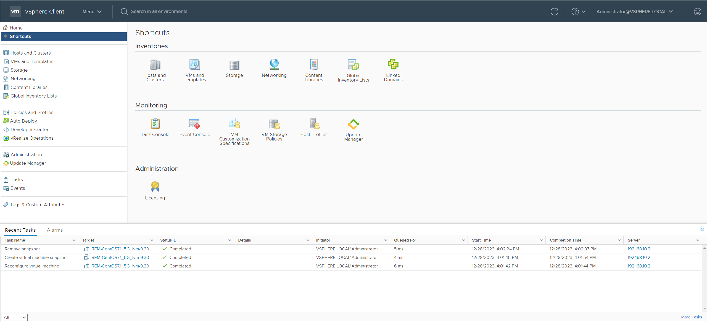


#### On the left navigation bar, choose the available [Datastore]. Click [Files] and select the storage path for the image file,click [Upload Files].

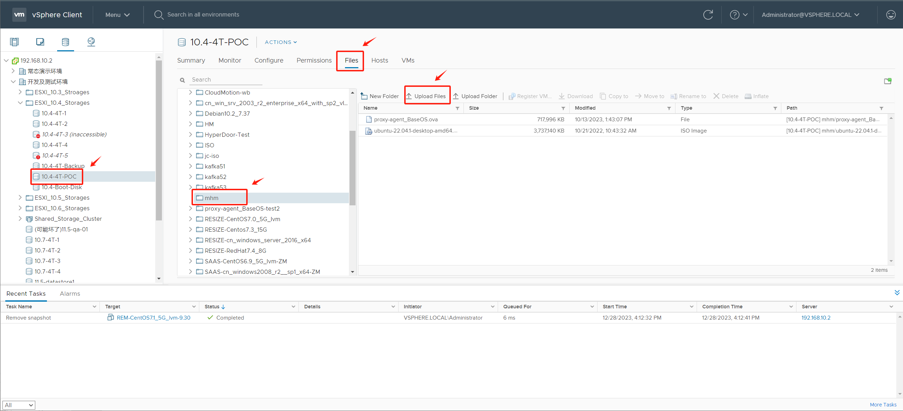

Select the downloaded Transition Host Image file (ISO), and wait for the image upload to complete.


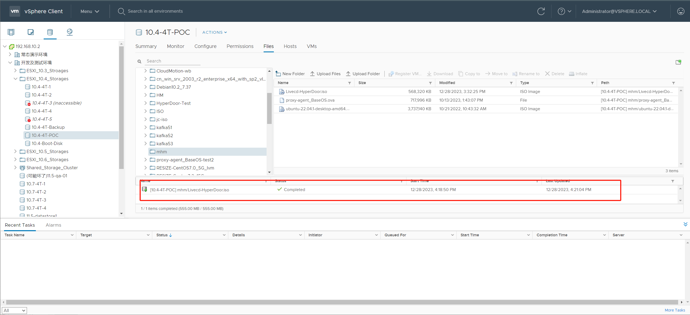


## Use the Transition Host Image to create a virtual machine in the production VMware environment as the Failback Transition Host

### Create a new virtual machine

Select your ESXi host or data center, right-click, and choose [New Virtual Machine]


### New Virtual Machine Configuration

**Step 1: Choose [Create a new virtual machine], and after configuring, click [NEXT]**

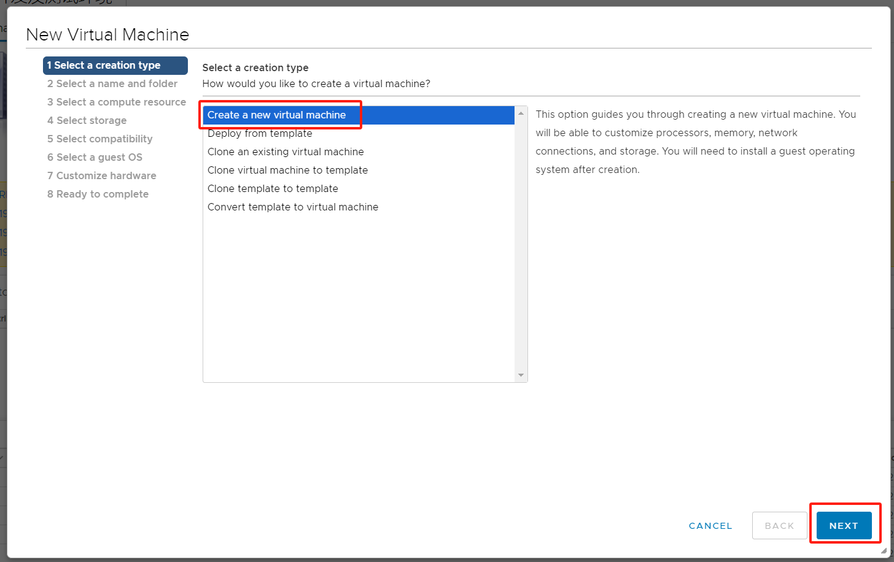

**Step 2: Enter the virtual machine name, select an available cluster,click [NEXT].**


**Step 3: Choose an available [Compute Resource],click [NEXT].**

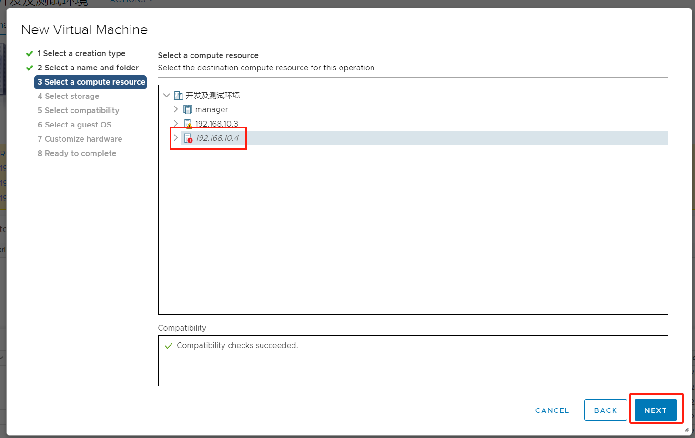

**Step 4: Choose an available [Storage],click [NEXT].**


**Step 5: Choose compatibility (leave it as default), click [NEXT].**

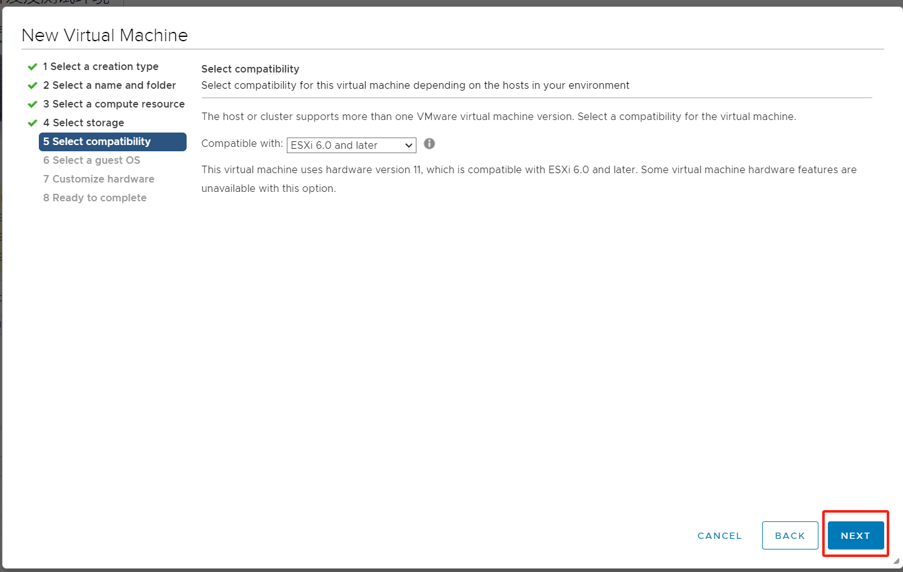

**Step 6: Choose the operating system. For the operating system family, select [Linux], and for the operating system version, choose [Other Linux (64-bit)], click [NEXT].**


**Step 7-1: Customize hardware by configuring CPU ≥2 and memory ≥4GB.**

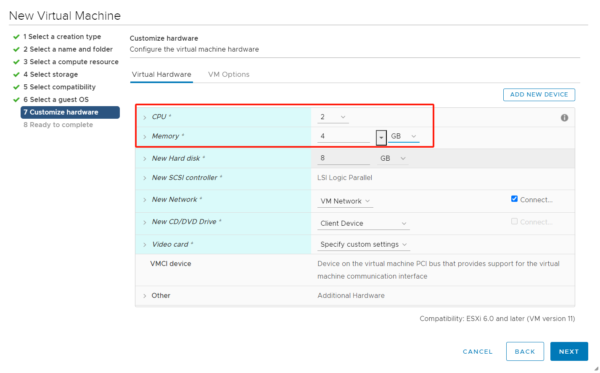

**Step 7-2: Customize hardware by selecting an available network configuration**

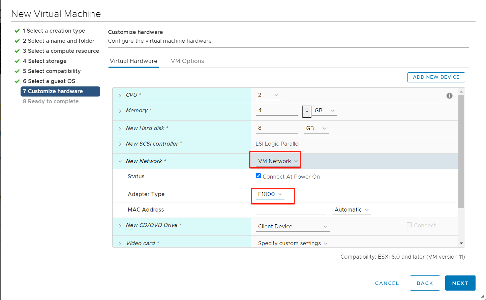

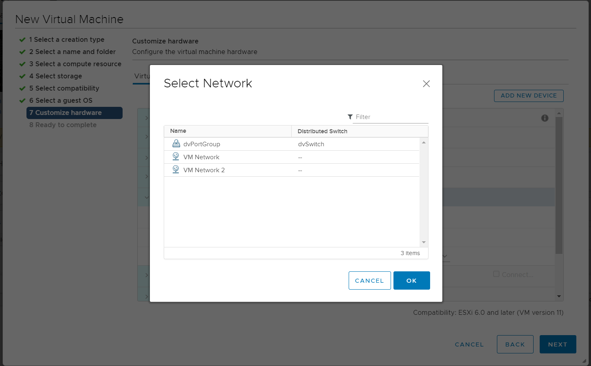

**Step 7-3: Customize hardware by configuring system disk and data disk.**

::: warning
The number and capacity of disks for the Failback Transition Host need to be consistent with the Takeover Host.
:::

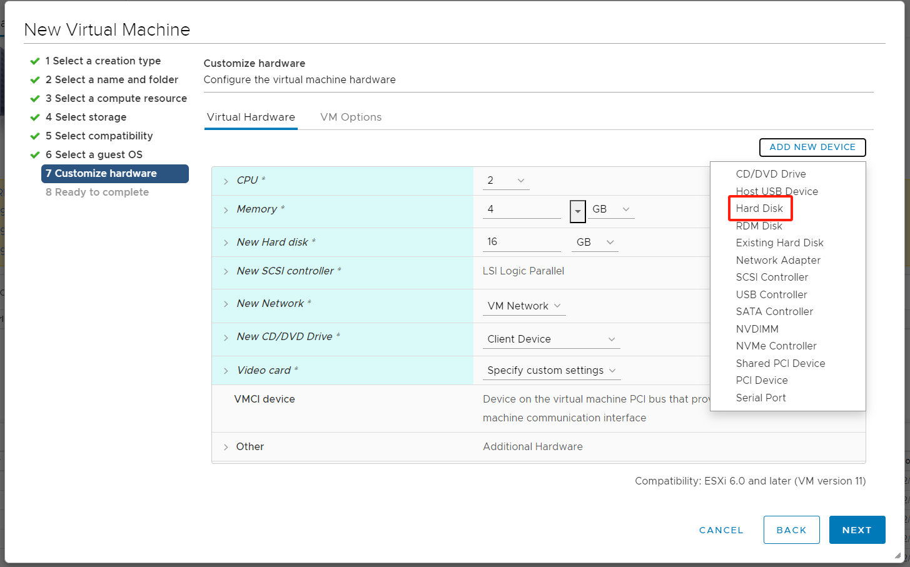


**Step 7-4: Configure the CD/DVD drive. Choose the type as [Datastore ISO File], in the new window select the uploaded Transition Host Image file (ISO) from the storage, and check the option [Connect At Power On].**


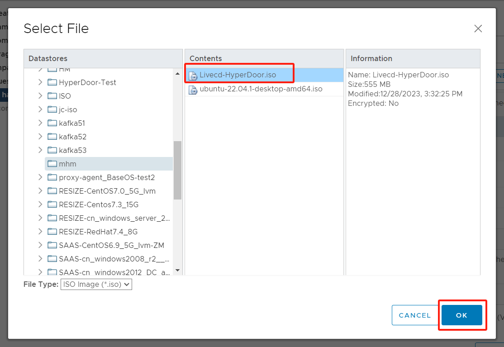


**Step 7-5: The SCSI controller of the disk for the universal storage Failback Transition Host is identical to that of the source machine in VMware.  Leave other configurations as default, click [NEXT].**

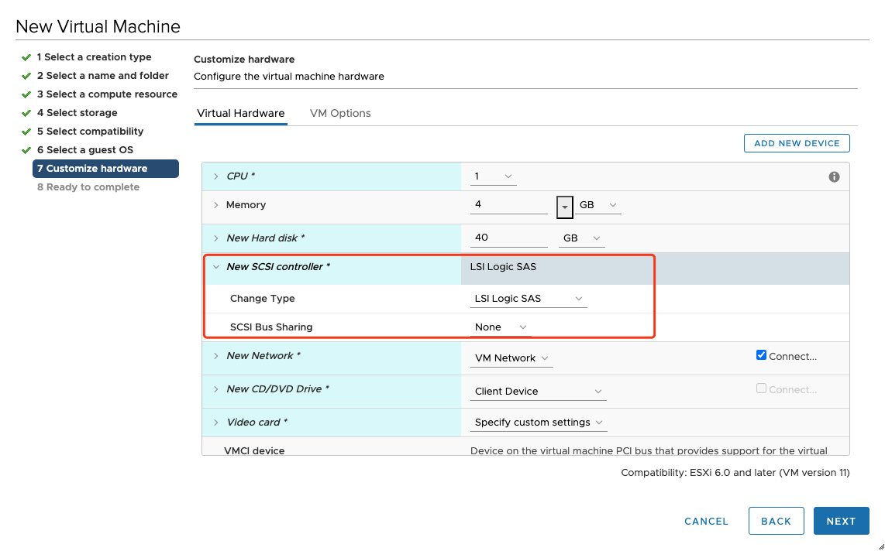

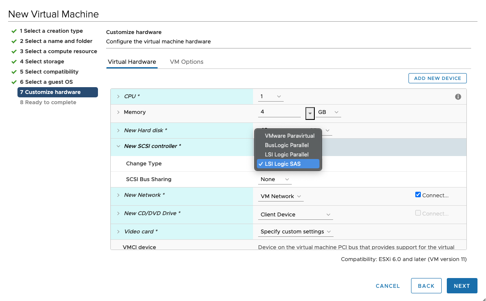

**Step 8: After confirming that the information is correct, click [FINISH] to start the creation.**

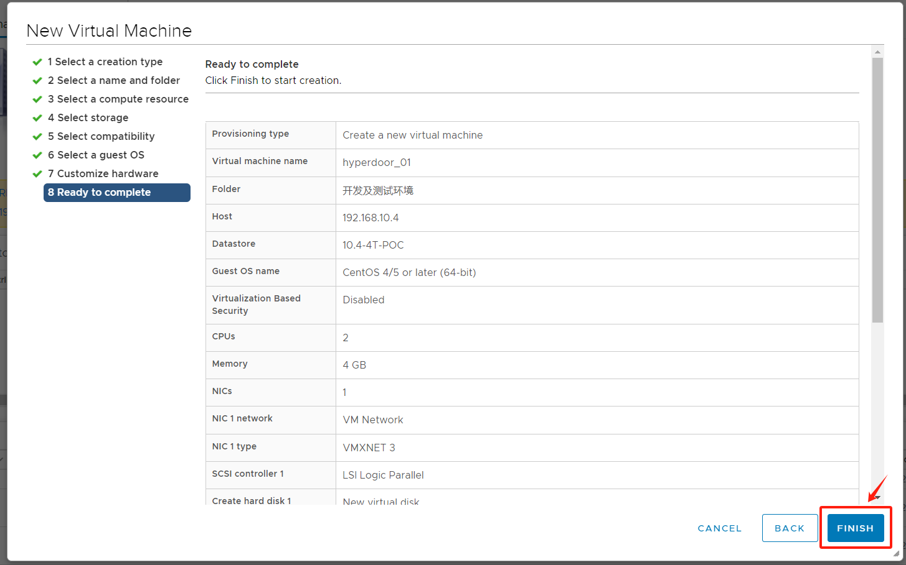

### Start the virtual machine

Right-click on the newly created virtual machine, choose [**Power**] \> [**Power On**].


Open the virtual machine console and check the startup status of the virtual machine.


The virtual machine system has started successfully.


## Configure the IP address for the Failback Transition Host

### Log in to the VMware vSphere Client console


### Access the Failback Transition Host virtual machine through the console.

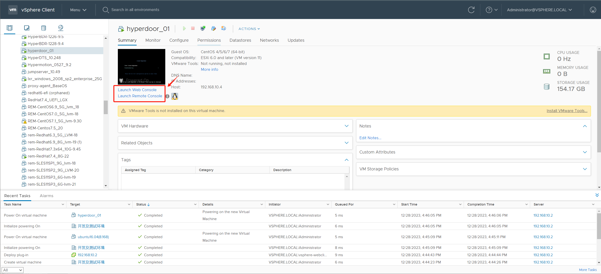

### Log in system

> Default username: root  
> Default password: Acb@132.Inst


### Manually configure the network

::: tip
The Transition Host Image is configured with default DHCP mode for networking. If the VMware network you selected supports DHCP, confirm the virtual machine's IP and proceed. If the VMware network does not use DHCP, manual configuration of the virtual machine's network is required
:::

#### Confirm the virtual machine's network adapter device name

```shell
ip a
```


#### Clear network configuration information

```shell
ip addr flush dev eth0
```

Configure a temporary IP address and gateway

::: tip
Configure with example information. Please replace the IP address/mask [192.168.x.x/20] and gateway address [192.168.0.1] based on your actual situation.
:::

```shell
ip addr add 192.168.x.x/20 dev ens160 && ip route add default via 192.168.0.1
```

#### View network configuration

```shell
ip a
```


```shell
ip route
```


## VMware User Permission Requirements（Host Failback）

### VMware User Preparation（Host Failback）

Prepare the VMware user authentication information for failback and ensure that the user has the necessary permissions. 

For configuring VMware user permissions, please refer to the following document.

Document Link:[https://docs.oneprocloud.com/userguide/poc/vmware-pre-settings.html#vcenter-permission-open-settings-steps](https://docs.oneprocloud.com/userguide/poc/vmware-pre-settings.html#vcenter-permission-open-settings-steps)

### VMware User Permission (Host Failback)

| **Permission Type** | **Permissions** |
| --- | --- |
| Datastore | Low level file operations |
| | Allocate space |
| Network | Assign network |
| Resource | Assign virtual machine to resource pool |
| vApp | Import |
| Virtual machine | **Interaction** |
| | Power off |
| | Power on |
| | Reset |
| | **Guest operations** |
| | Guest operation queries |
| | Guest operation program execution |
| | **Change Configuration** |
| | Change CPU count |
| | Change Memory |
| | Change Settings |
| | Add or remove device |
| | Add new disk |
| | Add existing disk |
| | Remove disk |
| | Advanced configuration |
| | **Edit Inventory** |
| | Create from existing |
| | Remove |
| | **Provisioning** |
| | Clone virtual machine |

## VMware Network Policy Enablement (Host Failback)


1. The HyperBDR node host needs to have normal access to the vCenter on port 443.  
2. The HyperBDR node host needs to have normal access to all ESXi hosts managed by vCenter on port 443.  
3. The VMware business network virtual machine (failback host virtual machine) needs to have normal access to the object storage on port 443.  
4. The HyperBDR node host needs to have normal access to port 10729 of the VMware business network virtual machine (failback host virtual machine).

::: tip
The HyperBDR node host requires access to the vCenter API interface for authentication. By invoking the Disaster Recovery Production vCenter/ESXi interface, it creates a failback host virtual machine in the VMware business network, manages it, and automatically creates a failback host virtual machine. This involves accessing port 443 of Huawei Cloud Object Storage to retrieve data for failback host.
:::

## (Intranet VPN Access)Configure a Huawei cloud Intranet DNS address for the VMware Network-Object Storage Fallback

::: tip
If the configuration of the Huawei Cloud intranet OBS VPC Endpoint service resolution address has already been completed during the disaster recovery to Huawei Cloud, there is no need to repeat the configuration.
:::

If your fallback environment is interconnected with the on-premises network through Huawei Cloud VPN, after creating VPC Endpoint services, it is necessary to configure the Huawei Cloud intranet OBS VPC Endpoint service resolution address in the local vCenter/ESXi host management network and the virtual machine business network.  
Reference Document: [https://docs.oneprocloud.com/userguide/poc/hyperbdr-agent-pre-settings.html#option-2-intranet-vpn-access-configure-huawei-cloud-intranet-dns-address-for-the-network-device-where-the-agent-host-resid](https://docs.oneprocloud.com/userguide/poc/hyperbdr-agent-pre-settings.html#option-2-intranet-vpn-access-configure-huawei-cloud-intranet-dns-address-for-the-network-device-where-the-agent-host-resid)

## (Intranet VPN Access)Test the connectivity from the VMware failback host network to Huawei Cloud OBS network

### Prepare and log in the test host 

::: tip
The network of the test host needs to be consistent with the network of the fallback recovery host.  
:::

### Huawei Cloud Private DNS Connection Test

::: tip
Please refer to the following document to find the dedicated Network Domain Service (NDS) address based on the used Huawei Cloud OBS region.  
Reference Document:[https://support.huaweicloud.com/intl/en-us/dns_faq/dns_faq_002.html](https://support.huaweicloud.com/intl/en-us/dns_faq/dns_faq_002.html)
:::

```shell
ping 100.125.1.250
```

Success Response:


### Huawei Cloud Object Storage Connection Test

```shell
ping https://obs.ap-southeast-3.myhuaweicloud.com
```

Success Response:

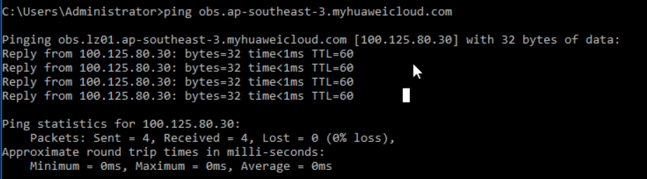

::: tip
This command is primarily used to test the accessibility of Huawei Cloud Object Storage buckets. Currently, the tested OBS domain is applicable to the Huawei Cloud Singapore region. If you need to perform tests in different regions, please refer to the official Huawei Cloud documentation to find the corresponding Endpoint domain.  
Document Link: [https://developer.huaweicloud.com/intl/en-us/endpoint?OBS](https://developer.huaweicloud.com/intl/en-us/endpoint?OBS)
:::

## Verify the status of the Huawei Cloud Object Storage added by HyperBDR(Host Failback)

::: tip
The deployment of the HyperBDR environment has been completed by default.
:::

### Log in HyperBDR Console


### Check the status of Huawei Cloud Object Storage

::: tip
The following operations use Huawei Cloud Object Storage as an example.
:::

Select [**Configuration**]> [**Object Storage**]> [**Failback**], and you can see the failback [**Object Storage**] you added. Confirm that the status of [**Object Storage**] is [**Available**].

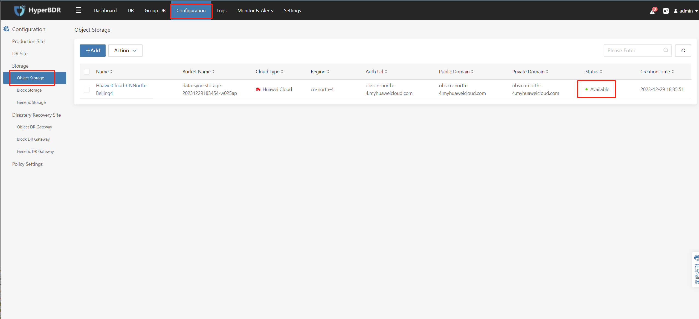

##  Add the vCenter/ESXi as an Object DR Gateway(Failback)

::: tip
Default deployment of HyperBDR environment completed
:::

### Login HyperBDR


### Add Object DR Gateway(Failback)

**Step 1.** Select "Configuration" in the upper navigation bar, choose "Object DR Gateway" in the left menu, and click "Add" on the "Failback" tab.


**Step 2.** Fill in the authentication information for the VMware platform on the "Authentication Information" page, and click "Next" after confirmation.


**Step 3.** Configure the failback target platform VMware Setting, and click "Next" after confirmation.

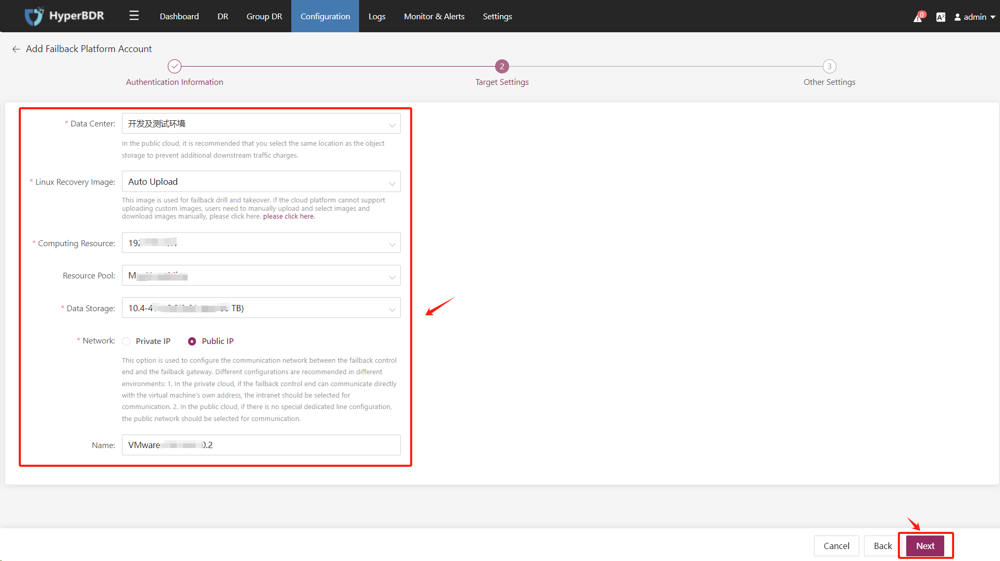

**Step 4. **The "Driver Adaption" option can remain at its default setting.

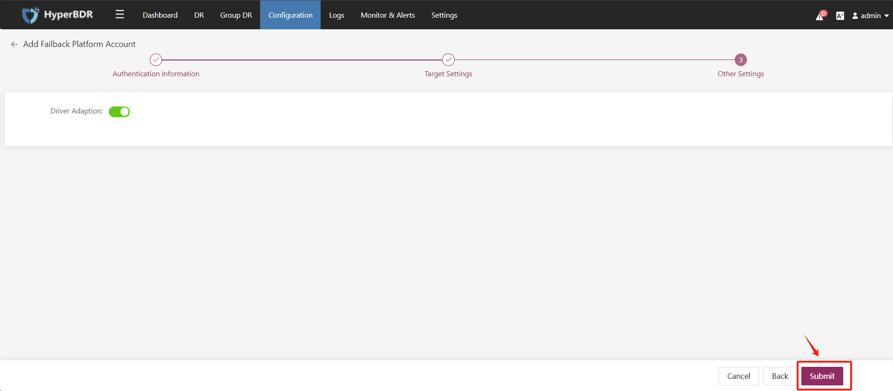

**Step 5.** The Object DR Gateway(Failback) has been successfully added.


