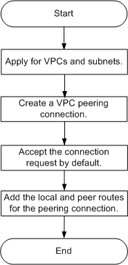
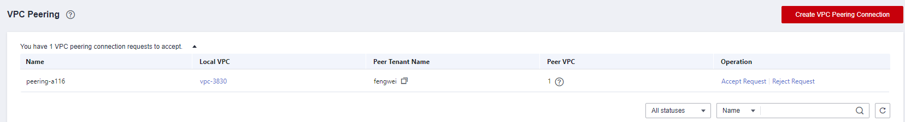
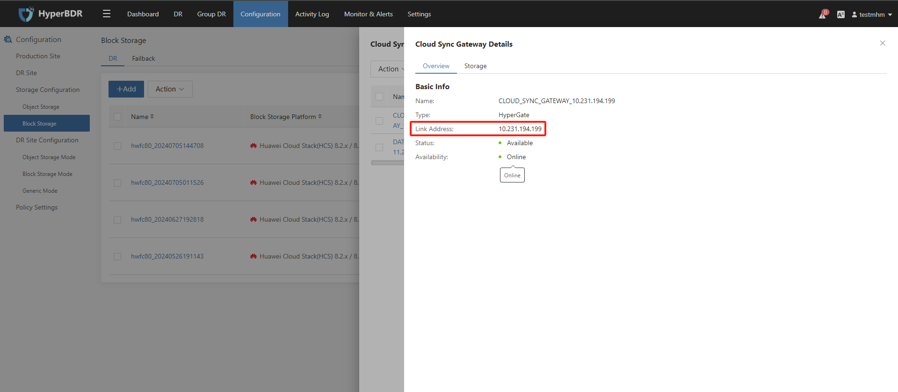
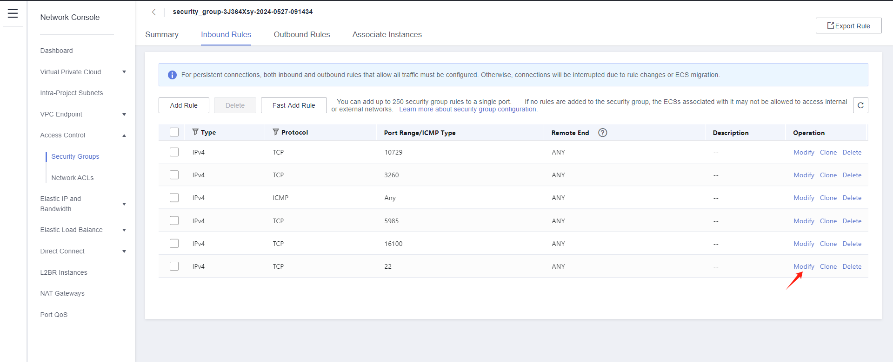

# Huawei Cloud Stack Pre-Settings

[[toc]]

## Preparing a Huawei Cloud Stack Account

Prepare a Huawei Cloud Stack platform account. The account must have the control permissions to use the compute, storage, network, and image functions of the platform.

### Create IAM User

Contact Huawei Support to provide account.

### Granting Authorization to IAM User

Contact Huawei Support to grant permissions to the account. The account must have control permissions for compute, storage, network, and image.

## Obtain Huawei Cloud HCS 8.x Platform Credentials information

When targeting the Huawei Cloud HCS 8.x version, the following authentication information of the HCS 8.x platform is required to complete the authentication docking of the API interface.  

[How to obtain Huawei Cloud HCS 8.x Platform Credentials information?](https://docs.oneprocloud.com/userguide/faq/faq.html#how-to-obtain-huawei-cloud-hcs-8-x-platform-credentials-information)

## Configure VPC & Subnet

Establish your network based on the following disaster recovery network scenarios.  
[Network Planning Overview](http://192.168.7.58:8080/userguide/presales/dr-network-planning-recommendations.html#deployment-solution-for-block-storage)

## Create HyperBDR Security Group

::: tip
HyperBDR Security Group Name: SG-HyperBDR
:::

### Create Security Group Rules

::: warning
Note: For the source IP range, we strongly recommend setting the source access for TCP:22 to a secure range instead of 0.0.0.0/0. Setting it to 0.0.0.0/0 means your ECS host is exposed to the internet, allowing anyone to access and potentially attack it, posing a security risk.  

For example, if your external IP address is 110.242.68.66, the source IP range can be configured as 110.242.68.66/32.
:::

| No. | Action | Type | Protocol & Port | Source | Description |
| --- | --- | --- | --- | --- | --- |
| 1 | Allow | IPv4 | TCP:22 | 0.0.0.0/0 | Permit default Linux SSH port |
| 2 | Allow | IPv4 | TCP:10443 | 0.0.0.0/0 | Permit HyperBDR web console |
| 3 | Allow | IPv4 | TCP:30443 | 0.0.0.0/0 | Permit HyperBDR Operation and maintenance management platform web console port |
| 4 | Allow | IPv4 | TCP:30080 | 0.0.0.0/0 | Permit HyperBDR https services port |

## Image Download & Upload

### Image Download

::: tip
We need to use three image files to import four images in Huawei Cloud Stack.
Linux BIOS Image is used to create a cloud sync gateway and boot Linux hosts with DR; Windows BIOS Image is used for DR to boot Windows hosts; Linux/Windows UEFI Image is used for DR to boot UEFI hosts.
:::

::: tip
Download images to your local machine through the provided image links. 
:::

### Image Info

#### Linux Image

* File Name: ubuntu-20.04-server-cloud-init-amd64.qcow2
* Version: ubuntu 20.04 server
* Size: 5.85 GB
* Download Link: [https://downloads.oneprocloud.com/docs_images/ubuntu-20.04-server-cloud-init-amd64.qcow2](https://downloads.oneprocloud.com/docs_images/ubuntu-20.04-server-cloud-init-amd64.qcow2)  

#### Windows Image

* File Name: Windows_Server_2016_Datacenter_64bit_English_40G.qcow2
* Version: Windows Server 2016 Datacenter 64bit English
* Size: 12.11 GB
* Download Link: [https://downloads.oneprocloud.com/docs_images/Windows_Server_2016_Datacenter_64bit_English_40G.qcow2](https://downloads.oneprocloud.com/docs_images/Windows_Server_2016_Datacenter_64bit_English_40G.qcow2) 
* MD5 Value of the Image: 519444d4b0343e15fa014c50d906a832

#### UEFI Image

* File Name: HuaweiCloud_UEFI_GenericImage.qcow2
* Version: HuaweiCloud_UEFI_GenericImage
* Size: 554.69 MB
* Download Link: [https://downloads.oneprocloud.com/docs_images/HuaweiCloud_UEFI_GenericImage.qcow2](https://downloads.oneprocloud.com/docs_images/HuaweiCloud_UEFI_GenericImage.qcow2) 
* MD5 Value of the Image: 7814209a573666f2701b35236764723d

### Import BIOS Image

Contact Huawei Support to import the required image to the Huawei Cloud Stack platform as a usable image.

::: warning
1. The name must be one of the following and cannot have additional characters.
2. Due to the diverse versions of Windows on the source hosts, select the generic option for the operating system.
3. Linux image is primarily used for creating an HD. The recommended version for the current release is Ubuntu 20.04
:::

**Windows BIOS Image**

Supported Windows image names

> Windows Server 2016 Standard 64bit  
> Windows Server 2016 Standard 64bit English  
> Windows Server 2016 Datacenter 64bit  
> Windows Server 2016 Datacenter 64bit English  
> Windows Server 2019 Datacenter 64bit  
> Windows Server 2019 Datacenter 64bit English

::: warning
The size of the System disk must be 40G.
:::

**Linux BIOS Image**  

Supported Linux image names

> Ubuntu 20.04 server 64bit  

### Import UEFI Image

::: tip
Use the [HuaweiCloud_UEFI_GenericImage.qcow2] qcow2 file in Huawei Cloud OBS to import the Linux UEFI image and Windows UEFI image respectively.
:::

**Windows UEFI Image**

Supported Windows image names

> Windows Server 2016 Standard 64bit English UEFI
> Windows Server 2019 Datacenter 64bit UEFI
> Windows Server 2019 Datacenter 64bit English UEFI

::: warning
The size of the System disk must be 40G.
:::

**Linux UEFI Image**  

Supported Linux image names

> Ubuntu 20.04 server 64bit UEFI

## Create Huawei VPC Peering

### Process for Configuring a VPC Peering Connection

The process for configuring a VPC peering connection depends on whether the VPC peering connection is created with a VPC of another tenant or you have the management permission (administrators or operators) on the project the peer VPC belongs to.

- Enable communication between VPCs of the same tenant by following instructions provided in Associated Project Configuration Process when you have the management permission on projects the two VPCs with peering connections belong to.
Enable communication between VPCs of the same tenant by following instructions provided in Other Project Configuration Process when you do not 
- have the management permission on the peer VPC, that is, you are not a project member and have only the read-only permission.
- For details about how to enable communication between VPCs of different tenants, see Other Project Configuration Process.

::: tip
After configuring the VPC peering connection, configure security groups and network ACLs to allow traffic to pass.
:::

### Creating a VPC Peering Connection for Associated Projects

::: tip
If you have the management permission on projects to which the local and peer VPCs with peering connections belong, the system automatically accepts the connection request after the VPC peering connection is created.
:::

Figure 1 Associated project configuration process



1. Apply for VPCs and subnets by following the instructions provided in Applying for a VPC and Creating a Subnet.
2. Create a VPC peering connection for associated projects by following the instructions provided in Creating a VPC Peering Connection for Associated Projects.
3. Add local and peer routes for the VPC peering connection by following the instructions provided in Adding Routes for a VPC Peering Connection.

::: tip
To enable communication between the two VPCs, you must add both local and peer routes for the VPC peering connection.
:::

**Associated Project Configuration Process**
If you also have the management permission on projects the two VPCs with peering connections belong to, the peer end automatically accepts the connection request after the VPC peering connection is created, and the connection status is Accepted. You can directly add routes for a VPC peering connection.

**Prerequisites**
- You have created two VPCs of the same tenant in the same region.
- The external networks corresponding to the two VPCs are in the same network group.

**Procedure**

1. Log in to the VPC console. For details, see How Can I Log In to the VPC Console as a VDC Administrator or VDC Operator?
2. In the navigation pane under Network Console, choose Virtual Private Cloud > VPC Peering.
3. In the right pane displayed, click Create VPC Peering Connection.
4. Set the parameters as prompted.

| Parameter | Description | Example Value |
| --- | --- | --- |
| Name | Specifies the name of the VPC peering connection. <br> The name can contain only letters, digits, underscores (_), hyphens (-), and periods (.). | peering-001 |
| Local VPC | Specifies the local VPC name. You can select one from the drop-down list. | vpc_002 |
| Local VPC CIDR Block | Specifies the CIDR block of the VPC. The CIDR block of a subnet must be the same as the CIDR block for the VPC (for a single subnet in the VPC) or a subset of the CIDR block for the VPC (for multiple subnets in the VPC). | N/A |
| Project | Specifies whether the project to which the peer VPC belongs is associated with the user. <br>**- Associated Projects:** indicates that the current user has the permission on projects to which the peer VPC belongs. <br>**- Other Projects:** indicates that the current user does not have the permission on projects to which the peer VPC belongs. <br>Select Associated Projects. | Associated Projects |
| Project Name | Specifies the name of the project where the peer VPC resides. The name of the current project is used by default. | project_001 |
| Peer VPC | You can select one from the drop-down list if the VPC peering connection is created between two VPCs of your own. | vpc_fab1 |
| Peer VPC CIDR Block | Specifies the CIDR block of the VPC. The CIDR block of a subnet must be the same as the CIDR block for the VPC (for a single subnet in the VPC) or a subset of the CIDR block for the VPC (for multiple subnets in the VPC). | N/A |

5. Check the information and click OK.

::: tip
- After a VPC peering connection is created, the system automatically accepts the connection request.
- You need to create routes for the local and peer VPCs to enable communication between the two VPCs. Add local and peer routes for the VPC peering connection by following instructions provided in Adding Routes for a VPC Peering Connection.
:::

### Accepting a VPC Peering Connection Request

If you need to create a VPC peering connection for different projects and the local project user does not have the permission to access the peer project, the peer project user must accept the VPC peering connection request first.

You can accept or reject a VPC peering connection request in the To be accepted state. When a connection request from an untrusted project is received, you can reject it.

**Accepting a Request**

1. Log in to the VPC console. For details, see How Can I Log In to the VPC Console as a VDC Administrator or VDC Operator?
2. In the navigation pane under Network Console, choose Virtual Private Cloud > VPC Peering.
3. In the All statuses area above the VPC peering connection list, select To be accepted.
4. Locate the target VPC peering connection and click Accept Request in the Operation column.

5. Click OK.

### Adding Routes for a VPC Peering Connection

Select IP address ranges of the same type as the destination addresses of the local and peer routes. For example, select IPv4 or IPv6 address ranges for both the local and peer routes. Otherwise, the local and peer ends cannot directly communicate with each other.

You can run the ping command to check whether the two VPCs can communicate with each other.

**Prerequisites**
- The subnets or CIDR blocks of the two VPCs connected by the VPC peering connection for which routes will be added contain no overlapping CIDR blocks.
- If the VPC peering connection request is accepted, the connection status changes to Accepted.

**Adding a Local Route**

1. Log in to the VPC console. For details, see How Can I Log In to the VPC Console as a VDC Administrator or VDC Operator?
2. In the navigation pane on the left, choose Virtual Private Cloud > VPC Peering.
3. On the VPC Peering page, locate the target VPC peering connection.
4. Click its name to view details and then click the Local Routes tab.
5. Click Add Local Route.
6. Click OK to switch to the page showing the VPC peering connection details.

**Adding a Peer Route**

If VPCs of the same tenant need to communicate with each other, the operation user has the management permission on projects to which the two VPCs with peering connections belong and can add local and peer routes at the same time. In other scenarios, you cannot add routes to both ends as the same user. In this case, skip this section.

1. On the displayed page, click the Peer Routes tab.
2. On the Peer Routes tab, click Add Peer Route and add a route. The parameters related to the peer route are the same as those related to the local route.
3. Click OK.


## Test Network Access between VPCs

::: tip
[Create VPC Peering](https://docs.oneprocloud.com/userguide/poc/hcs-pre-settings.html#create-huawei-vpc-peering) configuration has been successfully completed, and routing entries have been added correctly.
:::

### Test the network connectivity between the disaster recovery VPC and the business VPC

- Step1: Login to Huawei Cloud Stack and create an ECS test cloud server  
Create an ECS test cloud server (CentOS 7.6 operating system) on Huawei Cloud Stack. When configuring the network, choose the business VPC and subnet. Ensure that the security group of this newly created ECS test virtual machine has an inbound access policy allowing port 22.

- Step2: Network testing access from the disaster recovery VPC to the business VPC

Log in to the Huawei Cloud Stack console, access the HyperBDR ECS cloud server, and use the intranet IP to connect to the ECS host within the business VPC.

Execute command:

```sh
ssh root@<The intranet IP address of the test ECS> 22
```

Test results:  
If you can successfully access and enter the password, it indicates normal access.

### Test the network connectivity between business VPC

- Setp1: Create a new ECS test cloud server with CentOS 7.6 operating system. When configuring the network, choose a different business VPC and subnet. Ensure that the security group of this newly created ECS test virtual machine has an inbound access policy allowing port 22

- Sep2: Log in to different test cloud servers through the console and perform bidirectional command tests with the following commands

Execute command:

```sh
ssh root@<The intranet IP of the test ECS> 22
```

Test results:  
If you can successfully access and enter the password, it indicates normal access.

## Huawei Cloud platform account quota check

During the disaster recovery process, it is essential to ensure that the cloud account has sufficient resource quotas to support data synchronization and disaster recovery recovery. To prevent potential failure of disaster recovery due to insufficient quotas, it is necessary to perform a resource quota check before initiating the disaster recovery.

If the remaining quota in the Huawei Cloud account is insufficient, it is necessary to clean up unnecessary resources in the account or apply for an expansion of Huawei Cloud resource quotas.

### Source host resource inventory

Need to gather information on the computing and storage resources for the host systems awaiting disaster recovery and input the details into a table.

| Resources Type | Size |
| --- | --- |
| The total number of source host  |  |
| The total number of source host CPU |  |
| The total number of source host RAM(MB) |  |
| The total number of source host disks |  |
| The total disk capacity for source host(GB) |  |

### Huawei Cloud Stack account resource quota check

**View resource quotas**
Compile your Huawei Cloud Stack account resource quotas and calculate the remaining quota

| Service | Resources Type | Used Quota | Total Quota | Residual Quota |
| --- | --- | --- | --- | --- |
| Elastic Cloud Server | ECSs |  |  |  |
| Elastic Cloud Server | vCPUs |  |  |  |
| Elastic Cloud Server | Memory (MB) |  |  |  |
| Image Management Service | Images |  |  |  |
| Elastic Volume Service | Disks |  |  |  |
| Elastic Volume Service | Disk capacity(GB) |  |  |  |
| Virtual Private Cloud | Elastic IP addresses |  |  |  |

#### Compare the remaining quota with the resources of the source hosts

Compare the resource levels of the source hosts, as per your inventory, with the remaining resource quota in your Huawei Cloud account to assess whether it meets the requirements for disaster recovery.

**1. If you are using object storage recovery mode for DR, please refer to the following criteria.**

> **Elastic Cloud Server: ECSs** Residual Quota ≥ The total number of source host  
> **Elastic Cloud Server: vCPUs** Residual Quota ≥ The total number of source host CPU  
> **Elastic Cloud Server: Memory (MB)** Residual Quota ≥ The total number of source host RAM(MB)  
> **Elastic Volume Service: Disk** Residual Quota ≥ The total number of source host disks  
> **Elastic Volume Service: Disk capacity(GB)** Residual Quota ≥ The total disk capacity for source host(GB)  
> **Image Management Service: Images**  Residual Quota ≥ 2  
> **Virtual Private Cloud: Elastic IP addresses** Residual Quota: Satisfying the required number of public IP for the disaster recovery hosts to be restored to the Huawei Cloud platform is sufficient.

**2. If you are using block storage recovery mode for DR, please refer to the following criteria.**

> **Elastic Cloud Server: ECSs** Residual Quota ≥ The total number of source host + Number of HyperGate instances  
> **Elastic Cloud Server: vCPUs** Residual Quota ≥ The total number of source host CPU + 2 * Number of HyperGate instances  
> **Elastic Cloud Server: Memory (MB)** Residual Quota ≥ The total number of source host RAM(MB) + 2048(MB) * Number of HyperGate instances  
> **Elastic Volume Service: Disk** Residual Quota ≥ 2 * Total number of source host disks + Number of HyperGate instances  
> **Elastic Volume Service: Disk capacity(GB)** Residual Quota ≥ 2 * Total disk capacity for source host(GB) + 40(GB) * Number of HyperGate instances  
> **Image Management Service: Images**  Residual Quota ≥ 2  
> **Virtual Private Cloud: Elastic IP addresses** Residual Quota: The quantity should satisfy the sum of the required public IP addresses for the disaster recovery hosts to be restored to the Huawei Cloud platform, including both the number of public IP for the source hosts and the quantity of HyperGate instances.

If it is discovered that the remaining resource quota in the Huawei Cloud account is insufficient, it is necessary to clean up unnecessary resources in the account or apply to Huawei Cloud for an expansion of resource quotas.

### Increase quotas in your Huawei Cloud Stack account.

If it is discovered that the remaining resource quota in the Huawei Cloud Stack account is insufficient, and there are no resources to clean up in the account, you can try submitting a Huawei Cloud Stack ticket to request an expansion of resource quotas.

## Modify the ssh policy of the Cloud Sync Gateway instance security group

### Confirm the instance of Cloud Sync Gateway

::: tip
Login the HyperBDR console by default.
:::




Record the Link Address of the cloud sync gateway.

### Modify the cloud sync gateway security group

Log in to Huawei Cloud Stack and use Link Address to find the cloud sync gateway instance.


Modify security group


Modify the Inbound Rules and set the source end of port 22 to the IP address of HyperBDR.

::: tip
If HyperBDR is deployed in a private network environment without a fixed public IP, you need to use HyperBDR's egress public IP as the source IP.
:::




