# Huawei Cloud Pre-Settings

[[toc]]

## Create Huawei Cloud IAM account for DR purpose

Create a Huawei Cloud IAM account with correspinding permissions, detail requirement please refer to below document. And create Access Key ID & Access Secret Key of IAM account for setup.

### Create IAM User

#### Huawei Cloud official documentation link:

- [https://support.huaweicloud.com/intl/en-us/usermanual-iam/iam_02_0001.html](https://support.huaweicloud.com/intl/en-us/usermanual-iam/iam_02_0001.html)

### Granting Authorization to IAM User

#### Huawei Cloud official documentation link:

- [https://support.huaweicloud.com/intl/en-us/usermanual-iam/iam_01_0652.html](https://support.huaweicloud.com/intl/en-us/usermanual-iam/iam_01_0652.html)

### Managing IAM User Access Keys

#### Huawei Cloud official documentation link:

- [https://support.huaweicloud.com/intl/en-us/usermanual-iam/iam_02_0003.html](https://support.huaweicloud.com/intl/en-us/usermanual-iam/iam_02_0003.html)

### Huawei Cloud IAM Permission Requirements

::: tip
Huawei Cloud has different API versions of v2 and v3 in different regions, and each region has a slightly different definition of resource description permissions. When you create permissions for HyperBDR, So you need to provide full access to ecs, evs, obs, ims, and netwrok services.
:::

#### ecs/vpc/evs/ims

```
{
    "Version": "1.1",
    "Statement": [
        {
            "Effect": "Allow",
            "Action": [
                "ecs:*:*"
            ]
        },
        {
            "Effect": "Allow",
            "Action": [
                "evs:*:*"
            ]
        },
        {
            "Effect": "Allow",
            "Action": [
                "vpc:*:*"
            ]
        },
        {
            "Effect": "Allow",
            "Action": [
                "IMS:*:*"
            ]
        }
    ]
}
```

#### obs

```
{
    "Version": "1.1",
    "Statement": [
        {
            "Effect": "Allow",
            "Action": [
                "OBS:*:*"
            ]
        }
    ]
}
```

## Configure VPC & Subnet

Create VPC Network and Subnet According to Huawei Cloud Documentation. Explanation: Establish your network based on the following disaster recovery network scenarios.

1. Intranet VPN Access:

If accessing through an intranet VPN, create a DR VPC network and place HyperBDR ECS instances in this network.

2. Disaster Recovery VPC:

Dedicated VPC network and subnet for HyperBDR disaster recovery and backup, interconnected with the on-premises IDC through VPN.

3. Business VPC:

Business VPC network and subnet used for disaster takeover and drills.

## Create HyperBDR Security Group

::: tip
HyperBDR Security Group Name: SG-HyperBDR
:::

### Create Security Group Rules

::: warning
Note: For the source IP range, we strongly recommend setting the source access for TCP:22 to a secure range instead of 0.0.0.0/0. Setting it to 0.0.0.0/0 means your ECS host is exposed to the internet, allowing anyone to access and potentially attack it, posing a security risk.  

For example, if your external IP address is 110.242.68.66, the source IP range can be configured as 110.242.68.66/32.
:::

| No. | Action | Type | Protocol & Port | Source | Description |
| --- | --- | --- | --- | --- | --- |
| 1 | Allow | IPv4 | TCP:22 | 0.0.0.0/0 | Permit default Linux SSH port |
| 2 | Allow | IPv4 | TCP:10443 | 0.0.0.0/0 | Permit HyperBDR web console |
| 3 | Allow | IPv4 | TCP:30443 | 0.0.0.0/0 | Permit HyperBDR Operation and maintenance management platform web console port |
| 4 | Allow | IPv4 | TCP:30080 | 0.0.0.0/0 | Permit HyperBDR https services port |

## Create ECS for HyperBDR

### Log in to the Huawei Cloud Console

### Create ECS Cloud Instance based on Configuration Information

> Huawei Cloud documentation : [https://support.huaweicloud.com/intl/en-us/qs-ecs/ecs_02_0009.html](https://support.huaweicloud.com/intl/en-us/qs-ecs/ecs_02_0009.html)  
> The resource configuration for HyperBDR servers is as follows:

::: warning
Notes: We strongly recommend that when creating an ECS cloud instance, the login mode is selected as KeyPair login instead of password login to ensure the security of your server access.
:::

| Configuration items | Parameters                                                      |
| :------------------ | :-------------------------------------------------------------- |
| Region              | <Your Region\>                                                  |
| Billing Mode        | Yearly/Monthly                                                  |
| AZ                  | AZ1                                                             |
| Flavor              | s6.2xlarge.2                                                    |
| Image               | Ubuntu 20.04 server 64bit(40GiB)(cecc4bcf-b055-4d35-bd5f-693d4412eaef)  |
| System Disk         | High IO 200GB                                                   |
| Network             | <VPC-HyperBDR-172.16.0.0\>                                      |
| Subnet              | <Subnet-HyperBDR-172.16.0.0\> (Automatically assign IP address) |
| Security Group      | SG-HyperBDR                                                     |
| EIP                 | Auto assign                                                     |
| EIP Type            | Dynamic BGP                                                     |
| Billed By           | Traffic                                                         |
| Bandwidth Size      | 100Mbps                                                         |
| ECS Name            | HyperBDR-Prod                                                   |
| Login Mode          | KeyPair                                                         |
| Key Pair            | <Your KeyPair\>                                                 |

> About Key Pair Login Mode, you can see the following link for details:
> [https://support.huaweicloud.com/en-us/usermanual-ecs/en-us_topic_0014250631.html](https://support.huaweicloud.com/en-us/usermanual-ecs/en-us_topic_0014250631.html)  

## Image Download & Upload

### Image Download

::: tip
We need to use three image files to import four images in Huawei Cloud.
Linux BIOS Image is used to create a cloud sync gateway and boot Linux hosts with DR; Windows BIOS Image is used for DR to boot Windows hosts; Linux/Windows UEFI Image is used for DR to boot UEFI hosts.
:::

::: tip
Download images to your local machine through the provided image links. 
:::

### Image Info

#### Linux Image

* File Name: ubuntu-20.04-server-cloud-init-amd64.qcow2
* Version: ubuntu 20.04 server
* Size: 596.38 MB
* Download Link: [https://downloads.oneprocloud.com/docs_images/ubuntu-20.04-server-cloud-init-amd64.qcow2](https://downloads.oneprocloud.com/docs_images/ubuntu-20.04-server-cloud-init-amd64.qcow2)  

#### Windows Image

* File Name: Windows_Server_2016_Datacenter_64bit_English_40G.qcow2
* Version: Windows Server 2016 Datacenter 64bit English
* Size: 12.11 GB
* Download Link: [https://downloads.oneprocloud.com/docs_images/Windows_Server_2016_Datacenter_64bit_English_40G.qcow2](https://downloads.oneprocloud.com/docs_images/Windows_Server_2016_Datacenter_64bit_English_40G.qcow2) 
* MD5 Value of the Image: 519444d4b0343e15fa014c50d906a832

#### UEFI Image

* File Name: HuaweiCloud_UEFI_GenericImage.qcow2
* Version: HuaweiCloud_UEFI_GenericImage
* Size: 554.69 MB
* Download Link: [https://downloads.oneprocloud.com/docs_images/HuaweiCloud_UEFI_GenericImage.qcow2](https://downloads.oneprocloud.com/docs_images/HuaweiCloud_UEFI_GenericImage.qcow2) 
* MD5 Value of the Image: 7814209a573666f2701b35236764723d

### Upload Image to Huawei Cloud Object Storage

::: tip
Huawei Cloud official documentation link: [https://support.huaweicloud.com/intl/en-us/usermanual-ims/ims_01_0205.html](https://support.huaweicloud.com/intl/en-us/usermanual-ims/ims_01_0205.html) 
:::

### Import Image

::: tip
Huawei Cloud official documentation link:  
[https://support.huaweicloud.com/intl/en-us/usermanual-ims/ims_01_0206.html](https://support.huaweicloud.com/intl/en-us/usermanual-ims/ims_01_0206.html)  
[https://support.huaweicloud.com/intl/en-us/usermanual-ims/ims_01_0211.html](https://support.huaweicloud.com/intl/en-us/usermanual-ims/ims_01_0211.html)
:::

#### Import BIOS Image

::: tip
Use **[ubuntu-20.04-server-cloudimg-amd64.qcow2]** and **[Windows_Server_2016_Datacenter_64bit_English_40G.qcow2]** qcow2 files in Huawei Cloud OBS to import the Linux BIOS Image and Windows BIOS Image respectively.
:::

##### Step1: Access the IMS console.

- Log in to the management console.
- Under Compute, click Image Management Service.The IMS console is displayed.Register an external image file as a private image.
  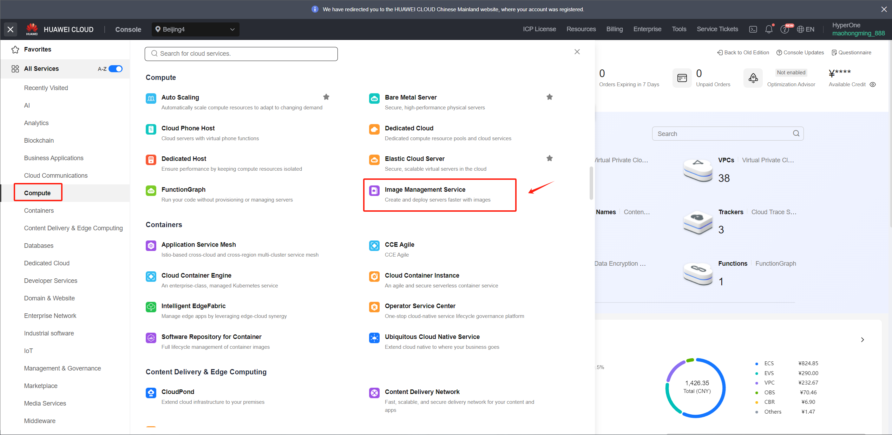

##### Step2: Register an external image file as a private image

- Click Create Image in the upper right corner
  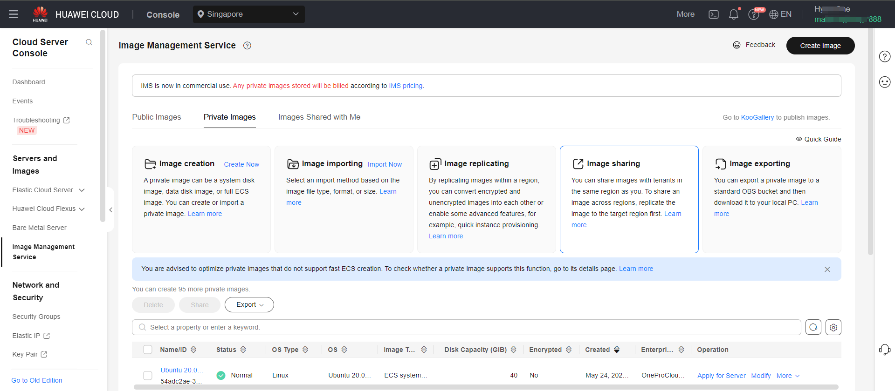

::: warning 
1.The name must be one of the following and cannot have additional characters.  
2.Due to the diverse versions of Windows on the source hosts, select the generic option for the operating system.  
3.Linux image is primarily used for creating an HD. The recommended version for the current release is Ubuntu 20.04  
:::

**Windows BIOS Image**  

Supported Windows image names

> Windows Server 2016 Standard 64bit  
> Windows Server 2016 Standard 64bit English  
> Windows Server 2016 Datacenter 64bit  
> Windows Server 2016 Datacenter 64bit English  
> Windows Server 2019 Datacenter 64bit  
> Windows Server 2019 Datacenter 64bit English

::: warning
The size of the System disk must be 40G.
:::

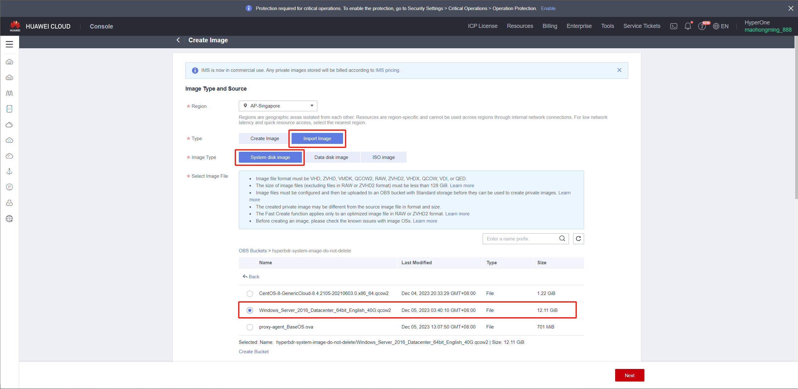

**Linux BIOS Image**  

Supported Linux image names

> Ubuntu 20.04 server 64bit  

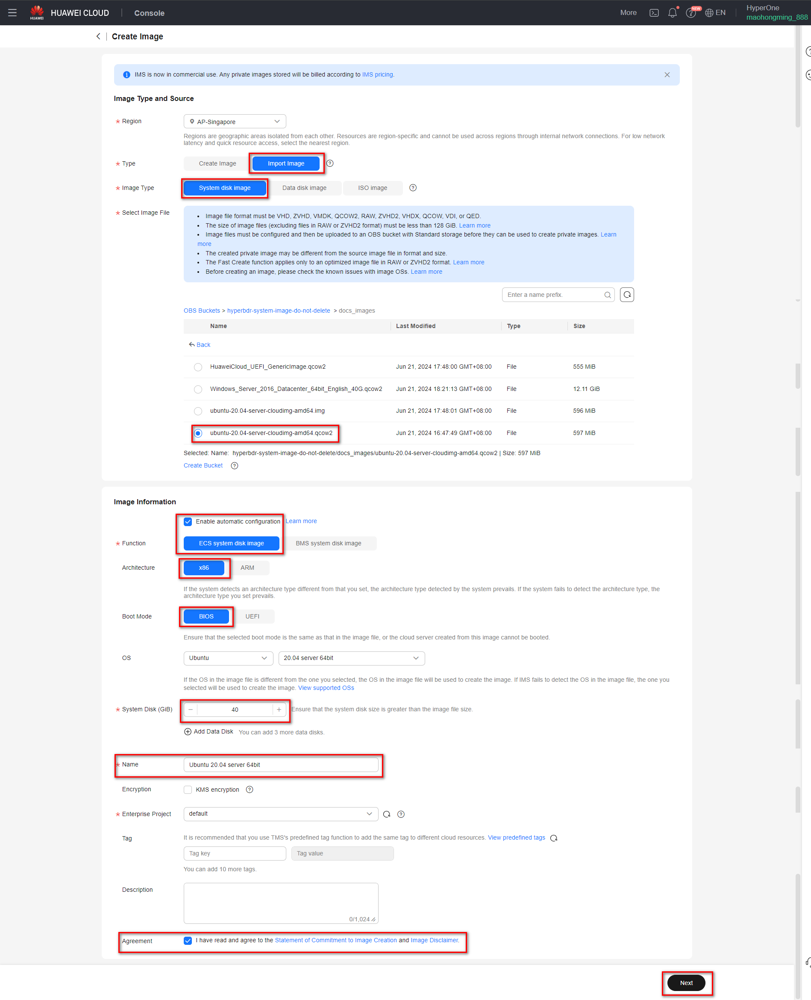

##### Step3: Confirm and submit

- Click Next and confirm the image specifications. Select Statement of Commitment to Image Creation and Huawei Image Disclaimer. Click Submit.

- Go back to the Private Images page. The image is successfully registered when its status becomes Normal.

#### Import UEFI Image

::: tip
Use the **[HuaweiCloud_UEFI_GenericImage.qcow2]** qcow2 file in Huawei Cloud OBS to import the Linux UEFI image and Windows UEFI image respectively.
:::

##### Step1: Access the IMS console.

- Log in to the management console.
- Under Compute, click Image Management Service.The IMS console is displayed.Register an external image file as a private image.
  

##### Step2: Register an external image file as a private image

- Click Create Image in the upper right corner
  

::: warning 
1.The name must be one of the following and cannot have additional characters.  
2.Due to the diverse versions of Windows on the source hosts, select the generic option for the operating system.  
3.Linux image is primarily used for creating an HD. The recommended version for the current release is Ubuntu 20.04  
:::

**Windows UEFI Image**  

Supported Windows image names

> Windows Server 2016 Standard 64bit English UEFI  
> Windows Server 2019 Datacenter 64bit UEFI  
> Windows Server 2019 Datacenter 64bit English UEFI

::: warning
The size of the System disk must be 40G.
:::

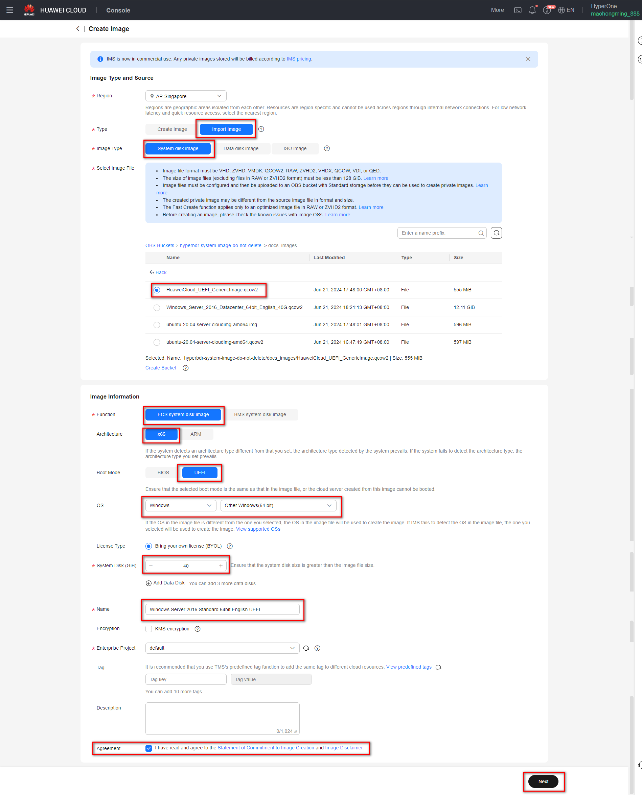

**Linux UEFI Image**  

Supported Linux image names

> Ubuntu 20.04 server 64bit UEFI  

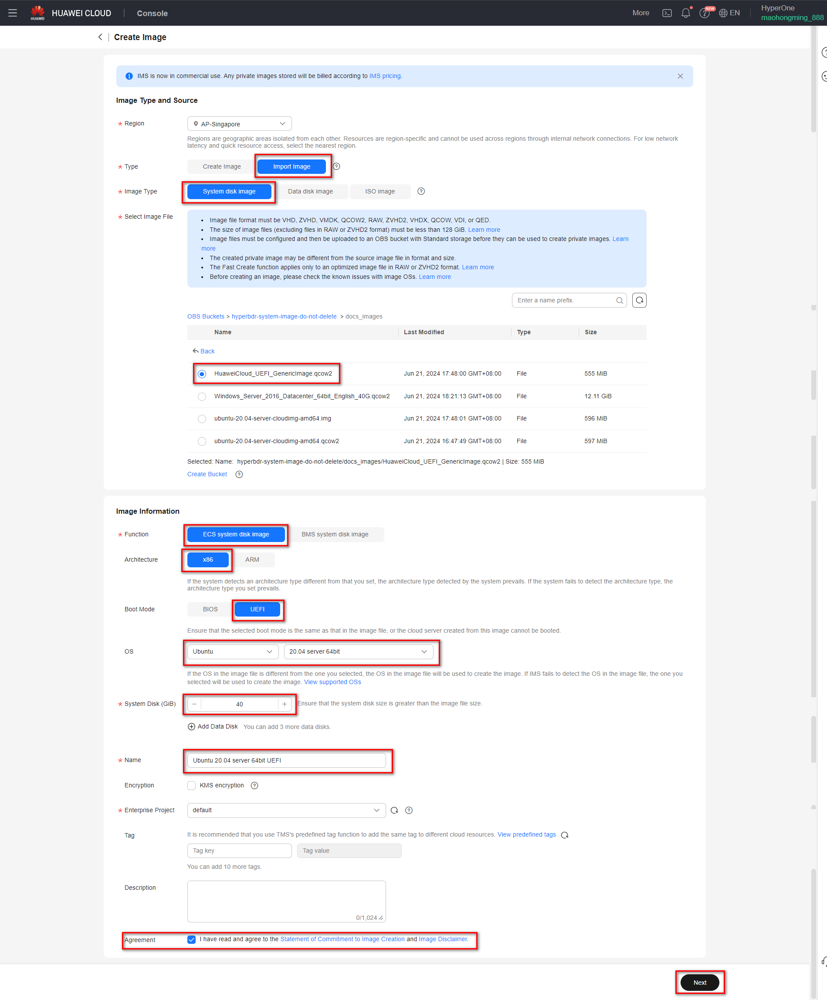

##### Step3: Confirm and submit

- Click Next and confirm the image specifications. Select Statement of Commitment to Image Creation and Huawei Image Disclaimer. Click Submit.

- Go back to the Private Images page. The image is successfully registered when its status becomes Normal.

## VPN Setup

> Note: If your DR Environment is connected to the Intranet of the production site through Huawei Cloud, you need to purchase the Huawei cloud VPN service and configure the Huawei cloud to connect to the On-perms network.

> Configure VPN. For details, see Huawei Cloud official documentation.  
> Document Link: [https://support.huaweicloud.com/intl/en-us/qs-vpn/vpn_03_0001.html](https://support.huaweicloud.com/intl/en-us/qs-vpn/vpn_03_0001.html)

## Create Huawei VPC Endpoint

> If your disaster recovery environment is interconnected with the production site's intranet through Huawei Cloud VPN, and the production site needs to access Huawei Cloud HyperBDR and OBS services through VPN during a disaster, then you need to purchase and configure VPC Endpoint services in Huawei Cloud.

> You need to purchase two VPC Endpoint services, one for OBS and the other for DNS.

> Huawei Cloud official definition: If you want to access OBS services from a local data center via VPN or Cloud Connect using an intranet method, you can achieve this by connecting through terminal endpoints to access terminal endpoint services.  
> Document Link: [https://support.huaweicloud.com/intl/en-us/qs-vpcep/vpcep_02_0301.html](https://support.huaweicloud.com/intl/en-us/qs-vpcep/vpcep_02_0301.html)

### Configure DNS Interface Type for Terminal Endpoints

| Project | Configuration |
| --- | --- |
| Region | Choose the Region to activate |
| Billing Mode | Pay-per-use |
| Service Category | Choose the default "Cloud server," check com.myhuaweicloud.<region\>.dns, and set the type as Interface. |
| VPC | Choose the VPC interconnecting with the local IDC VPN |
| Subnet | Select the subnet for VPN interconnection |


### Selection of OBS Gateway-type Terminal Endpoint

| Project | Configuration |
| --- | --- |
| Region | Choose the Region to activate |
| Billing Mode | Pay-per-use |
| Service Category | Choose the default "Cloud server," check com.myhuaweicloud.<region/>.obs, and set the type as Gateway |
| VPC | Choose the VPC interconnecting with the local IDC VPN |
| Route Table | default |
| Policy | default |

::: warning 
Note: In the Service Category section, it may not be possible to directly find the corresponding OBS service for the default Cloud service type. In such cases, you will need to use "Find a service by name" to search. You must enter the complete name of the specific OBS service. Please confirm with Huawei Cloud as the target OBS service terminal endpoints on the Huawei side may have distinctions between v1 and v2 versions. Additionally, the names of each region and the association between v1/v2 versions and the resource pool of the object storage bucket need clarification. If you have purchased v1 OBS terminal endpoints but your object storage bucket is in a v2 cluster, it must be aligned accordingly. Confirm with Huawei in advance regarding the specific version of the object storage bucket's cluster and OBS terminal endpoints

Example: v2 version OBS terminal endpoint name: sa-brazil-1.com.myhuaweicloud.v4.obsv2.lz002 
:::


### Configure VPN local-end OBS gateway

Add the internal subnet range of the local (Huawei Cloud) OBS service at the VPN connection point. The subnet address for all internal Huawei Cloud OBS services is 100.125.0.0/16.  
  


## Create Huawei VPC Peering

::: tip
Based on business requirements, choose different VPC peering configurations:  
- If there is no need for mutual access between multiple business VPCs, you only need to configure the peering connection according to the [Disaster recovery VPC connected via peering with multiple business VPC](https://docs.oneprocloud.com/userguide/poc/huaweicloud-pre-settings.html#disaster-recovery-vpc-connected-via-peering-with-multiple-business-vpc) setup.  
- If there is a requirement for mutual access between multiple business VPCs, then you need to configure according to the [Disaster recovery VPC peering with multiple business VPCs, as well as peering connections between multiple business VPC](https://docs.oneprocloud.com/userguide/poc/huaweicloud-pre-settings.html#disaster-recovery-vpc-peering-with-multiple-business-vpcs-as-well-as-peering-connections-between-multiple-business-vpc) setup.
:::

### Disaster recovery VPC connected via peering with multiple business VPC

In Huawei Cloud Disaster Recovery, the disaster recovery host needs to be restored to the planned production business VPC. Therefore, it is necessary to configure cross VPC peer-to-peer connections in Huawei Cloud, configure the disaster recovery VPC with the business VPC, and add peer-to-peer connection routing. Mainly used for disaster recovery, the disaster recovery VPC where HyperBDR is located can access the business VPC through the intranet to recover virtual machines for data recovery.

> Huawei Cloud Document Link:  
> [https://support.huaweicloud.com/intl/en-us/usermanual-vpc/en-us_topic_0046809840.html#section1](https://support.huaweicloud.com/intl/en-us/usermanual-vpc/en-us_topic_0046809840.html#section1)


### Disaster recovery VPC peering with multiple business VPCs, as well as peering connections between multiple business VPC

When all disaster recovery hosts of the customer need to be placed in different business VPCs planned by Huawei Cloud, and there is a need for cross VPC access in the business, then it is necessary to configure peer-to-peer connections between business VPCs to ensure normal cross VPC business interaction after subsequent business recovery.

> Huawei Cloud Document Link:  
> [https://support.huaweicloud.com/intl/en-us/usermanual-vpc/en-us_topic_0046809840.html#section0](https://support.huaweicloud.com/intl/en-us/usermanual-vpc/en-us_topic_0046809840.html#section0)

## Test Network Access between VPCs

::: tip
[Create huawei VPC Peering](https://docs.oneprocloud.com/userguide/poc/huaweicloud-pre-settings.html#create-huawei-vpc-peering) configuration has been successfully completed, and routing entries have been added correctly.
:::

### Test the network connectivity between the disaster recovery VPC and the business VPC

- Step1: Login to Huawei Cloud and create an ECS test cloud server  
Create an ECS test cloud server (CentOS 7.6 operating system) on Huawei Cloud. When configuring the network, choose the business VPC and subnet. Ensure that the security group of this newly created ECS test virtual machine has an inbound access policy allowing port 22.

- Step2: Network testing access from the disaster recovery VPC to the business VPC

Log in to the Huawei Cloud console, access the HyperBDR ECS cloud server, and use the intranet IP to connect to the ECS host within the business VPC.


Execute command:

```sh
ssh root@<The intranet IP address of the test ECS> 22
```

Test results:  
If you can successfully access and enter the password, it indicates normal access.

### Test the network connectivity between business VPC

- Setp1: Create a new ECS test cloud server with CentOS 7.6 operating system. When configuring the network, choose a different business VPC and subnet. Ensure that the security group of this newly created ECS test virtual machine has an inbound access policy allowing port 22

- Sep2: Log in to different test cloud servers through the console and perform bidirectional command tests with the following commands

Execute command:

```sh
ssh root@<The intranet IP of the test ECS> 22
```

Test results:  
If you can successfully access and enter the password, it indicates normal access.

## Huawei Cloud platform account quota check

During the disaster recovery process, it is essential to ensure that the cloud account has sufficient resource quotas to support data synchronization and disaster recovery recovery. To prevent potential failure of disaster recovery due to insufficient quotas, it is necessary to perform a resource quota check before initiating the disaster recovery.

If the remaining quota in the Huawei Cloud account is insufficient, it is necessary to clean up unnecessary resources in the account or apply for an expansion of Huawei Cloud resource quotas.

### Source host resource inventory

Need to gather information on the computing and storage resources for the host systems awaiting disaster recovery and input the details into a table.
| Resources Type | Size |
| --- | --- |
| The total number of source host  |  |
| The total number of source host CPU |  |
| The total number of source host RAM(MB) |  |
| The total number of source host disks |  |
| The total disk capacity for source host(GB) |  |

### Huawei Cloud account resource quota check

#### Login Huawei Cloud


#### View resource quotas

Access the CDN Console, select 'Resources' > 'My Quotas'. The system will navigate to the 'Quotas' page.


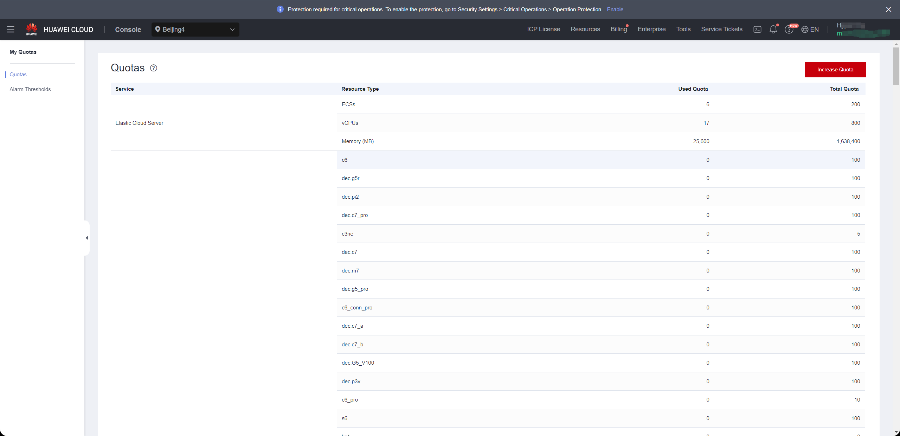


#### Compile your Huawei Cloud account resource quotas and calculate the remaining quota

Access the CDN Console, select 'Resources' > 'My Quotas'. The system will navigate to the 'Quotas' page.


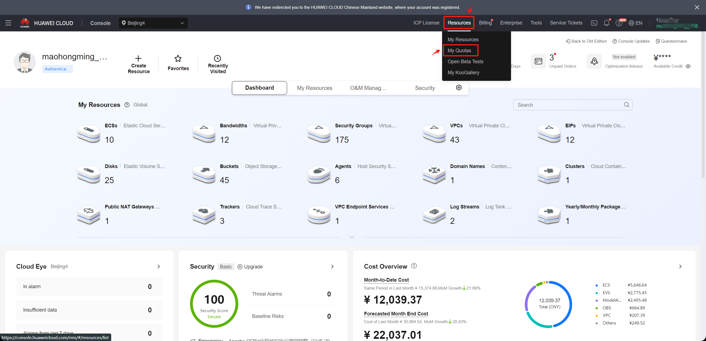


| Service | Resources Type | Used Quota | Total Quota | Residual Quota |
| --- | --- | --- | --- | --- |
| Elastic Cloud Server | ECSs |  |  |  |
| Elastic Cloud Server | vCPUs |  |  |  |
| Elastic Cloud Server | Memory (MB) |  |  |  |
| Image Management Service | Images |  |  |  |
| Elastic Volume Service | Disks |  |  |  |
| Elastic Volume Service | Disk capacity(GB) |  |  |  |
| Virtual Private Cloud | Elastic IP addresses |  |  |  |

#### Compare the remaining quota with the resources of the source hosts

Compare the resource levels of the source hosts, as per your inventory, with the remaining resource quota in your Huawei Cloud account to assess whether it meets the requirements for disaster recovery.

**1. If you are using object storage recovery mode for DR, please refer to the following criteria.**

> **Elastic Cloud Server: ECSs** Residual Quota ≥ The total number of source host  
> **Elastic Cloud Server: vCPUs** Residual Quota ≥ The total number of source host CPU  
> **Elastic Cloud Server: Memory (MB)** Residual Quota ≥ The total number of source host RAM(MB)  
> **Elastic Volume Service: Disk** Residual Quota ≥ The total number of source host disks  
> **Elastic Volume Service: Disk capacity(GB)** Residual Quota ≥ The total disk capacity for source host(GB)  
> **Image Management Service: Images**  Residual Quota ≥ 2  
> **Virtual Private Cloud: Elastic IP addresses** Residual Quota: Satisfying the required number of public IP for the disaster recovery hosts to be restored to the Huawei Cloud platform is sufficient.

**2. If you are using block storage recovery mode for DR, please refer to the following criteria.**

> **Elastic Cloud Server: ECSs** Residual Quota ≥ The total number of source host + Number of HyperGate instances  
> **Elastic Cloud Server: vCPUs** Residual Quota ≥ The total number of source host CPU + 2 * Number of HyperGate instances  
> **Elastic Cloud Server: Memory (MB)** Residual Quota ≥ The total number of source host RAM(MB) + 2048(MB) * Number of HyperGate instances  
> **Elastic Volume Service: Disk** Residual Quota ≥ 2 * Total number of source host disks + Number of HyperGate instances  
> **Elastic Volume Service: Disk capacity(GB)** Residual Quota ≥ 2 * Total disk capacity for source host(GB) + 40(GB) * Number of HyperGate instances  
> **Image Management Service: Images**  Residual Quota ≥ 2  
> **Virtual Private Cloud: Elastic IP addresses** Residual Quota: The quantity should satisfy the sum of the required public IP addresses for the disaster recovery hosts to be restored to the Huawei Cloud platform, including both the number of public IP for the source hosts and the quantity of HyperGate instances.

If it is discovered that the remaining resource quota in the Huawei Cloud account is insufficient, it is necessary to clean up unnecessary resources in the account or apply to Huawei Cloud for an expansion of resource quotas.

### Increase quotas in your Huawei Cloud account.

If it is discovered that the remaining resource quota in the Huawei Cloud account is insufficient, and there are no resources to clean up in the account, you can try submitting a Huawei Cloud ticket to request an expansion of resource quotas. 

In the 'Quotas' page, click on 'Increase', and fill out the Huawei Cloud Ticket.


After completing the form, check the agreement box and click 'Submit.' Wait and monitor the response from the Huawei Cloud Ticket for information regarding the increase quotas.

## Modify the ssh policy of the Cloud Sync Gateway instance security group

### Confirm the instance of Cloud Sync Gateway

::: tip
Login the HyperBDR console by default.
:::

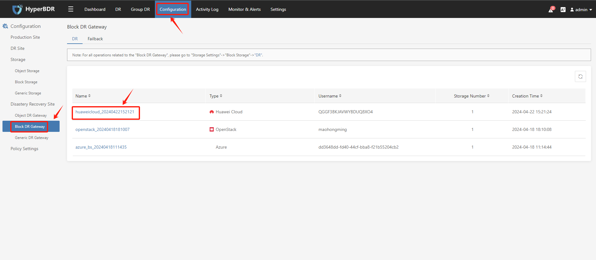

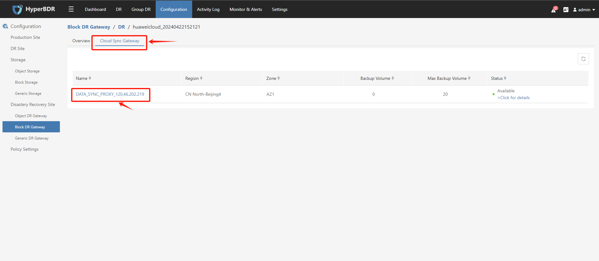


Record the Link Address of the cloud sync gateway.

### Modify the cloud sync gateway security group

Log in to Huawei Cloud and use Link Address to find the cloud sync gateway instance.

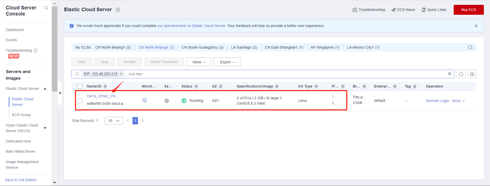

Modify security group

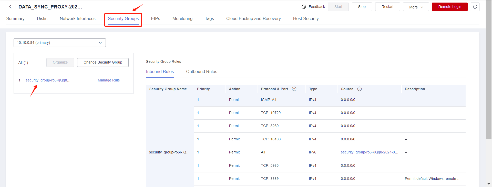

Modify the Inbound Rules and set the source end of port 22 to the IP address of HyperBDR.

::: tip
If HyperBDR is deployed in a private network environment without a fixed public IP, you need to use HyperBDR's egress public IP as the source IP.
:::

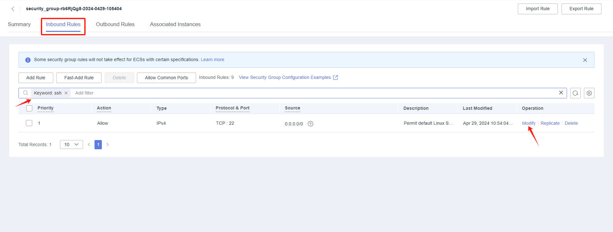

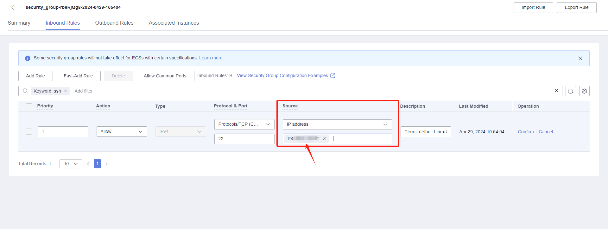


