# HyperBDR Setup

[[toc]]

## Apply for HyperBDR License

::: tip
Already logged in to the HyperBDR Console  by default.
:::

### Activate a License

Go to [Settings]->[Licenses], then click the [+Add] button: 

There are two ways to activate a license: 

#### I. Activate a license by fill in the application form.

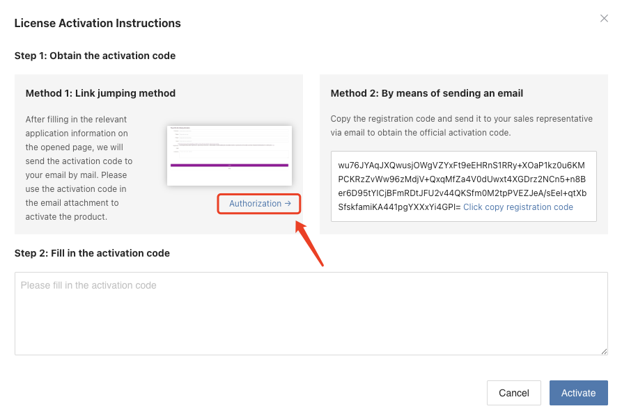

- Click the **"Authorization->"** button, will jump to application form.

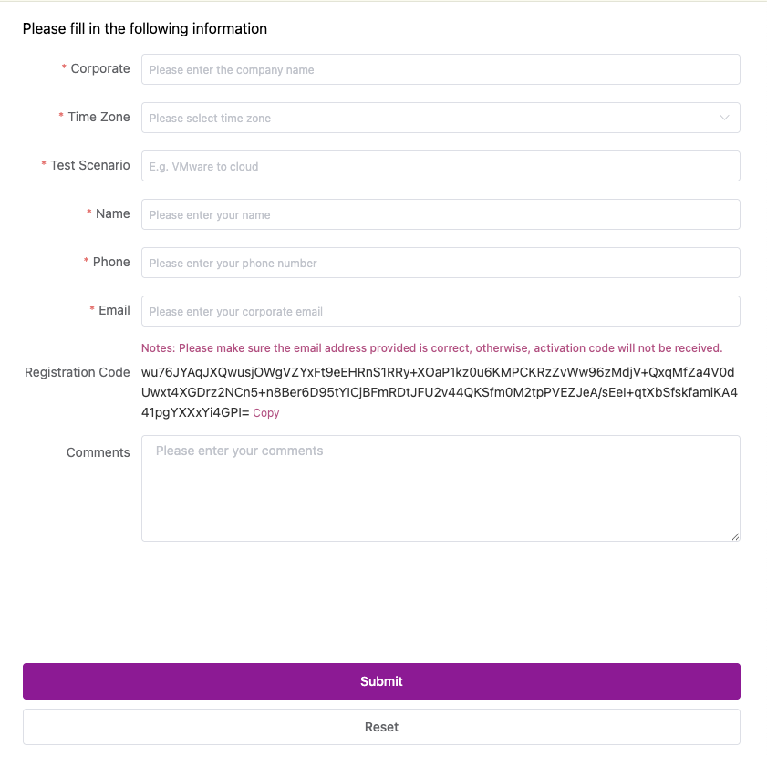

Fill in the application form. OnePro Cloud customer service will email user the activation code after reviewing the application. 

Fill in the activation code and click the [Activate] button. 

::: warning
Please make sure the email address provided on the application form is correct, otherwise activation code will not be received.  
:::

#### II. Activate a license by using the activation code

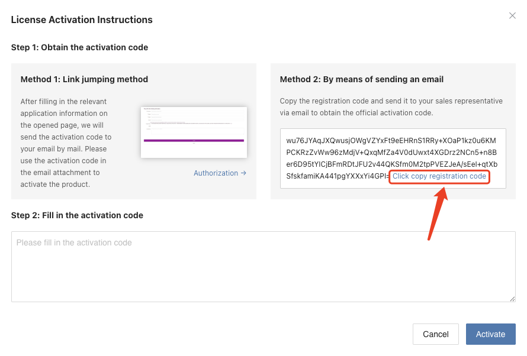 

Copy and email the registration code to OnePro Cloud and customer service will email user the activation code. 

Fill in the activation code and click the [Activate] button. 

::: tip
User can send the registration code to OnePro Cloud sales representative or [enquiry@oneprocloud.com](mailto:enquiry@oneprocloud.com).
:::

## Verify Sync Proxy Registration in HyperBDR

::: tip
After the Sync Proxy Node installation is completed, it will automatically be added to HyperBDR, and you can view this Sync Proxy Node machine in HyperBDR.
:::

::: tip
Already logged in to the HyperBDR Console  by default.
:::

### Check The Status Of The Sync Proxy Node  

Click on the top menu bar 'Configuration,' 'Production Site,' 'SyncNode' to view the Sync Proxy Node host. If you can see this host and status is 'online,' it indicates that it has been successfully registered with HyperBDR, and you can proceed with further configuration and usage.

## Add VMware Credentials

::: tip
Using the pre-prepared VMware account information, add VMware to the HyperBDR platform as a disaster recovery source-side production platform.
:::

::: tip
Already logged in to the HyperBDR Console  by default.
:::

### Add VMware To The HyperBDR

Click on the top menu bar 'Configuration,' 'Production Site,' 'VMware.' Click the 'Add' button, then on the popped-up page, click the 'Next' button. Follow the prompts to fill in the VMware information and click the 'Submit' button.

::: warning
If the EXSi host where the synchronized VM is located uses domain name, Sync Proxy will be unable to access the EXSi host because it cannot resolve the domain name. Need to configure source domain setting on HyperBDR/HyperMotion.  
Please refer to the documentation for configuration: [https://qa.oneprocloud.com/questions/D1E4](https://qa.oneprocloud.com/questions/D1E4)
:::

| Auth Url | https://\<vCenter IP/Domain Name\>:443 |
| --- | --- |
| user | \<vCenter user\> |
| password | \<vCenter password\> |
| SyncNode | \<Sync Proxy Node IP\> |

## Add AWS Credentials

::: tip
Using the pre-prepared AWS account information, add AWS to the HyperBDR platform as a disaster recovery source-side production platform.
:::

::: tip
Already logged in to the HyperBDR Console  by default.
:::

### Add AWS to the HyperBDR

Click on the top menu bar 'Configuration,' 'Production Site', 'AWS' Click the 'Add' button, then on the popped-up page, click the 'Next' button. Follow the prompts to fill in the VMware information and click the 'Submit' button.

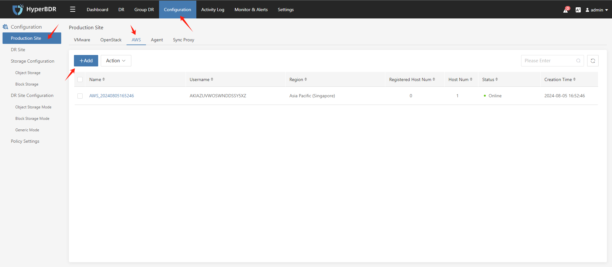
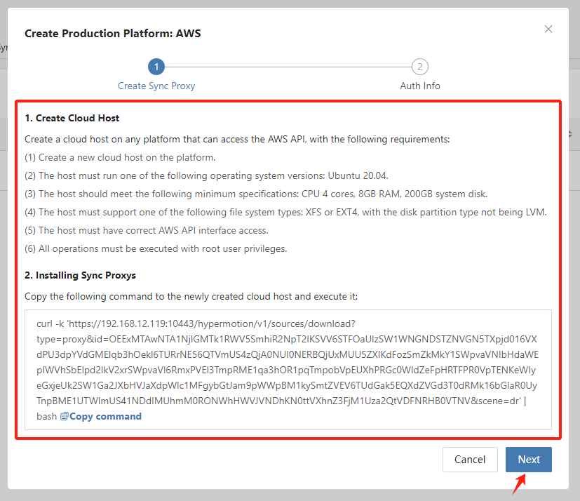

| Item | Description |
| --- | --- |
| Access Key ID | Access to AWS Access Key, which has full permissions for the account. |
| Access Key Secret | Get the AWS Access Key Secret and have full permissions for the account. |
| Region | The region of the machine to be synchronized. |
| Sync Proxy | The host IP of the Sync Proxy installed. |

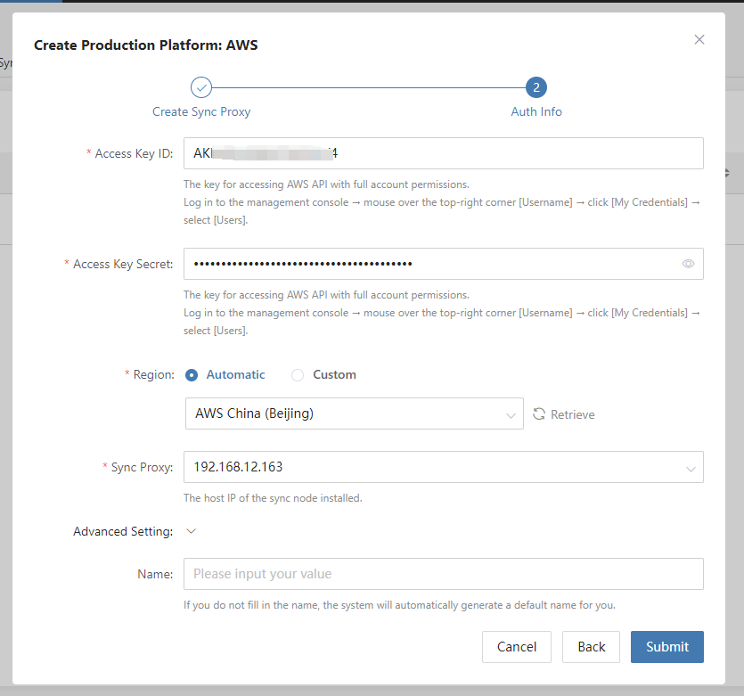

## Verify VMware Status in HyperBDR

::: tip
Already logged in to the HyperBDR Console  by default.
:::

### Check the status of the VMware Connection

Click on the top menu bar 'Configuration,' 'Production Site,' 'VMware' to view the status of the added source-side VMware account, as well as obtain information such as the number of hosts. You can also click on the VMware name to check the detailed information and host details. If everything is normal, you can proceed with the subsequent configuration operations.

If the status is 'Online,' it indicates that the addition was successful.

## Verify AWS Status in HyperBDR

::: tip
Already logged in to the HyperBDR Console  by default.
:::

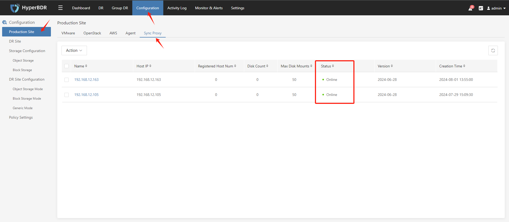

### Check the status of the AWS Connection

Click on the top menu bar 'Configuration,' 'Production Site,' 'AWS' to view the status of the added source-side AWS account, as well as obtain information such as the number of hosts. You can also click on the AWS  connections name to check the detailed information and host details. If everything is normal, you can proceed with the subsequent configuration operations.

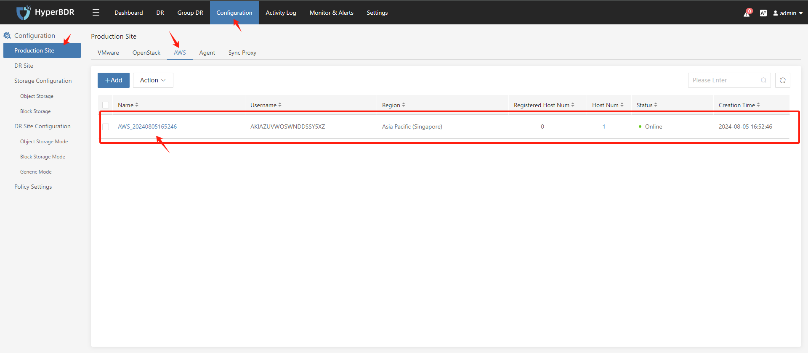

If the status is 'Online,' it indicates that the addition was successful.

## Add Object Storage

::: tip
Already logged in to the HyperBDR Console  by default.  
:::

### Configure Step

::: tip
The following operations use Huawei Cloud Object Storage as an example. Please choose the corresponding object storage based on your actual disaster recovery scenario.
:::

::: tip
Using the provided IAM account AK/SK information, configure and add Huawei Cloud Object Storage bucket in the HyperBDR Console .
:::

- Step1: "Click on the top menu bar 'Configuration,' 'Storage,' 'Object Storage.' Click the 'Add' button.  

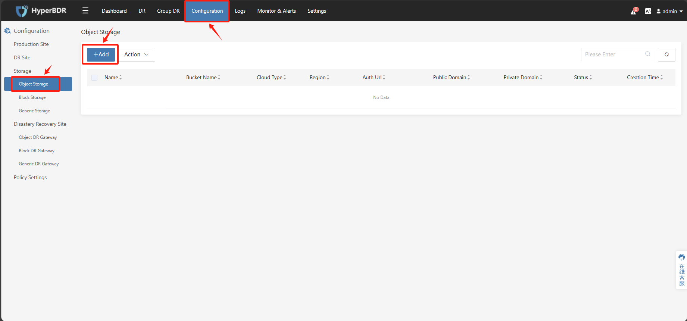

- Step2: Fill in or select the corresponding parameters according to the prompts, click 'Submit,' and wait for the completion.  

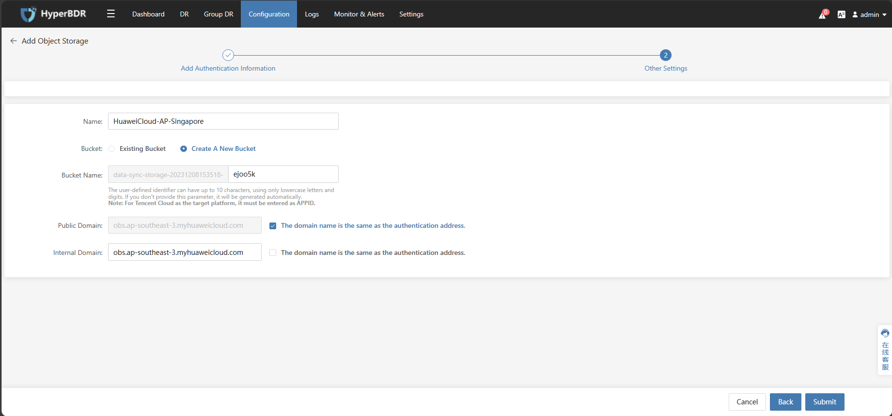

## Add Object DR Gateway

::: tip
Already logged in to the HyperBDR Console  by default.
:::

### Configure Step

::: tip
The following operations use Huawei Cloud as an example. Please choose the corresponding disaster recovery target cloud based on your actual disaster recovery scenario.
:::

::: tip
Using the provided IAM account AK/SK information, Configure and add Huawei Cloud Object DR Gateway in the HyperBDR Console 
:::

Click on the top menu bar "Configuration," "Disaster Recovery Site," "Object DR Gateway." Click the "Add" button, fill in or select the corresponding parameters as prompted, click "Submit," and wait for the completion.

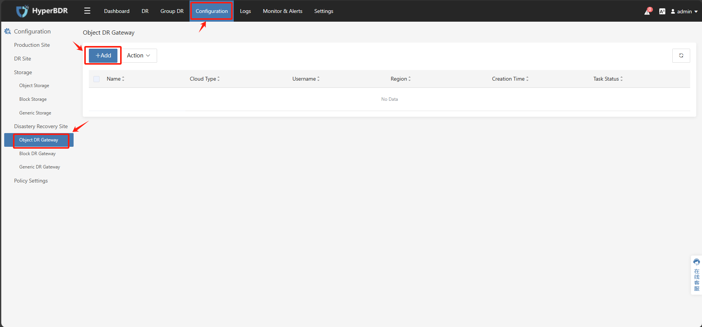

::: tip
Windows UEFI Fixes Image uses the private Windows image you uploaded.

Document link: [https://docs.oneprocloud.com/userguide/poc/huaweicloud-pre-settings.html#image-download-upload](https://docs.oneprocloud.com/userguide/poc/huaweicloud-pre-settings.html#image-download-upload)
:::

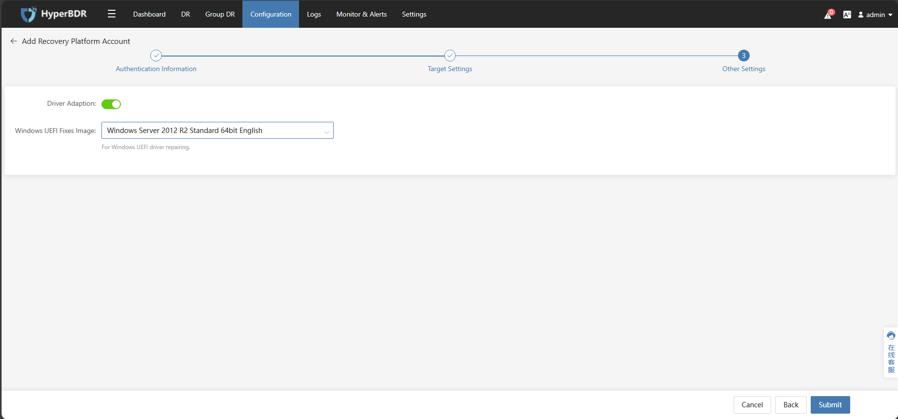

## Add VMware Hosts in HyperBDR

::: tip
Already logged in to the HyperBDR Console  by default.  
Already Add VMware Connection to  the HyperBDR by default.
:::

### Configure Step

Click on the top menu bar "DR," "Host DR," click the "Add Host" button, select "Agentless," "VMware," choose the previously added VMware account, filter and select the desired disaster recovery hosts, and finally click confirm. Once the selection is complete, click confirm to add the VMware disaster recovery hosts to the disaster recovery platform.  

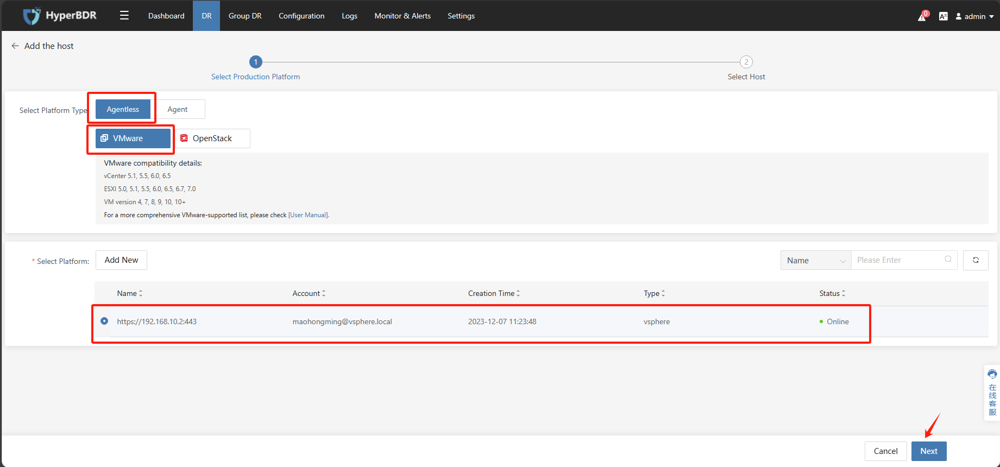

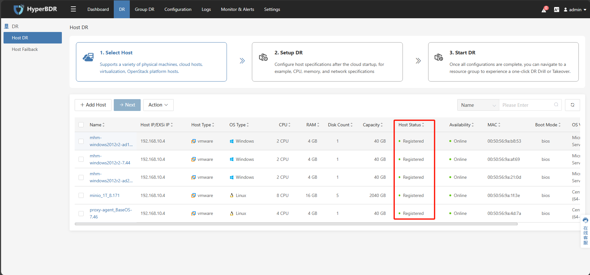

## Add AWS EC2 to HyperBDR

::: tip
Already logged in to the HyperBDR Console  by default.  
Already Add AWS Connection to  the HyperBDR by default.
:::

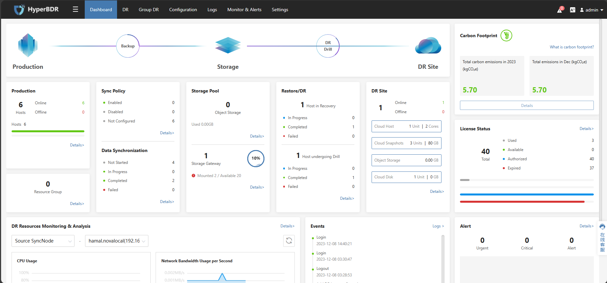

### Configure Step

Click on the top menu bar "DR," "Host DR," click the "Add Host" button, select "Agentless," "AWS", choose the previously added AWS account, filter and select the desired disaster recovery hosts, and finally click confirm. Once the selection is complete, click confirm to add the AWS disaster recovery EC2 to the disaster recovery platform.

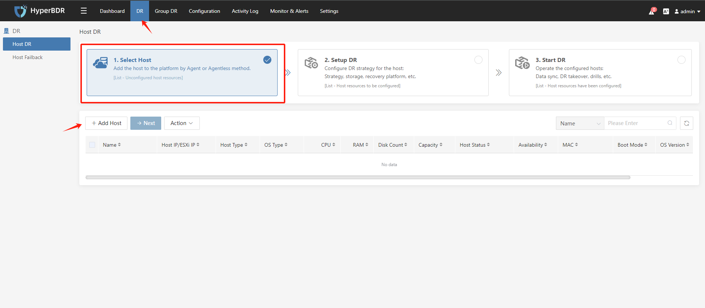
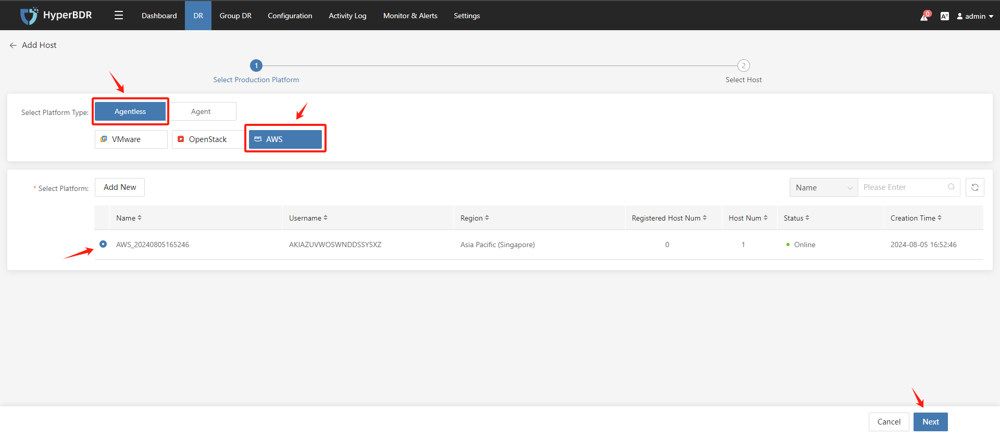
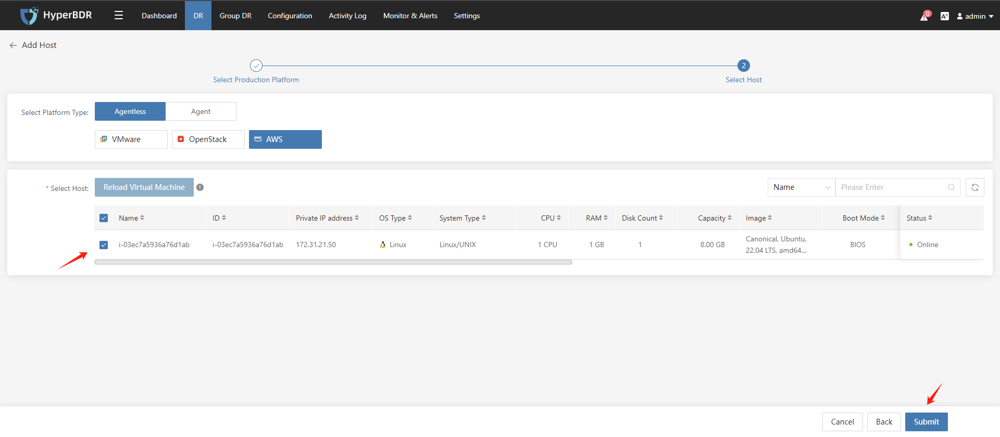

::: tip
If the EC2 you newly created on the cloud platform is not displayed in the list below, please click the "Reload Virtual Machine" button to reload it into this list.
:::

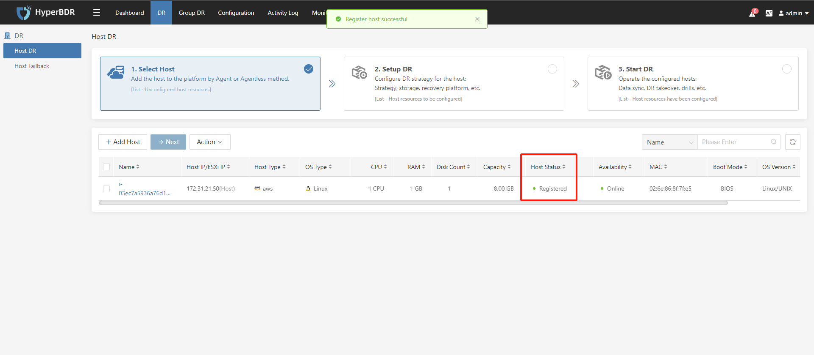

## Bind/Unbind Sync Proxy to VMware Production Site

::: tip
By default, each Sync Proxy supports up to 50 disks for simultaneous synchronization in Agentless mode. When the total number of disks to be synchronized on the source VMs is greater than 50, you need to expand the Agentless Sync Proxy. 
:::

### Configure Step
::: tip
Already logged in to the HyperBDR Console  by default.  
Already Add VMware Connection to  the HyperBDR by default.
:::

1. Click on the top menu bar "**Configuration**" > "**Production Site**" > "**Sync Proxy**".
> The installed Sync Proxy will be displayed on this page.
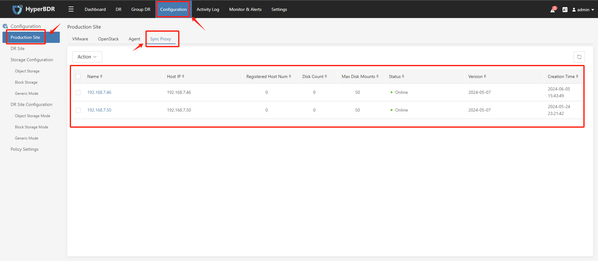

2. Select the installed Sync Proxy, click "**Action**" > "**bind**".
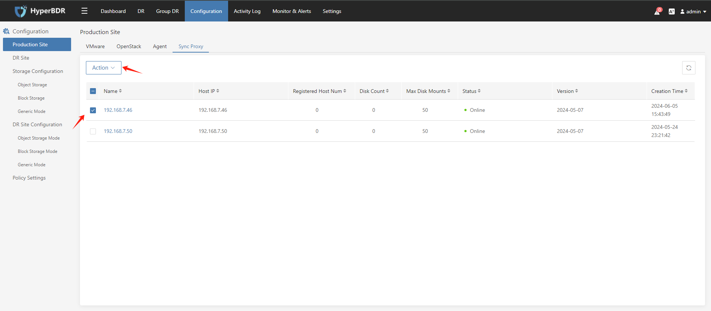
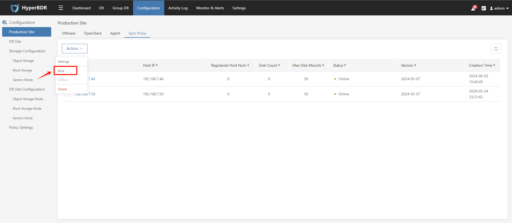
3. Select the required link to bind the new Sync Proxy to the Production VMware Site, click "**Submit**" after confirmation.
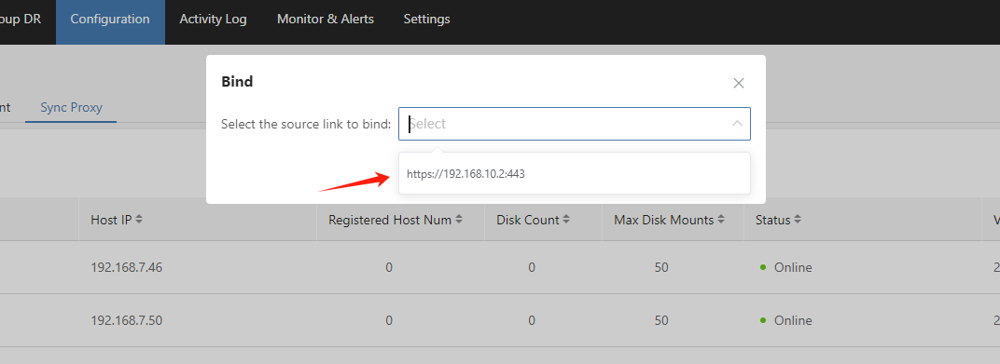
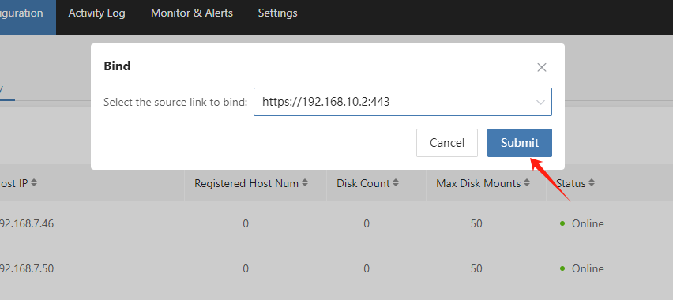
4. View the Sync Proxy bundled with the Production VMware Site.
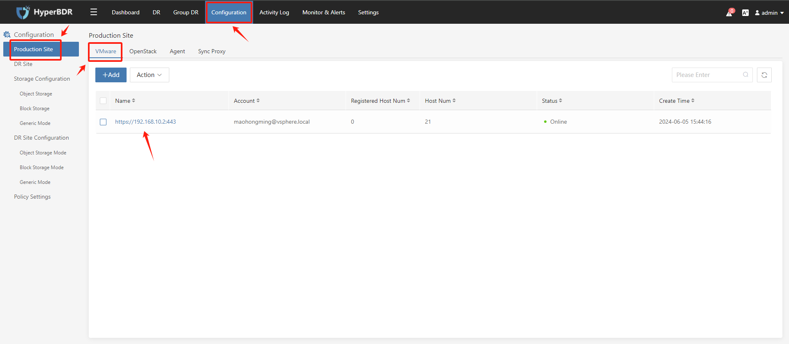
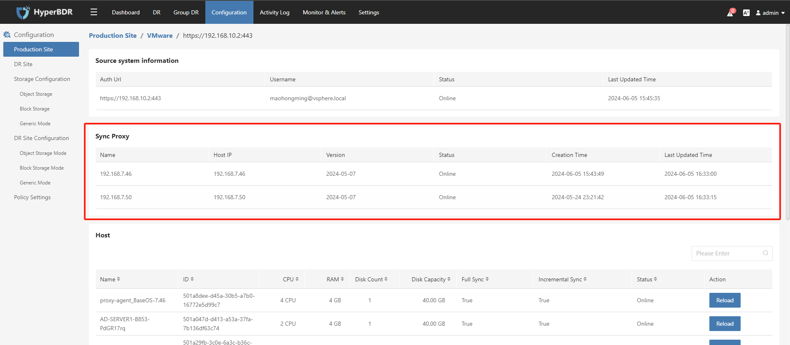
5. Unbaind Sync Proxy.
::: tip
You can only unbind Sync Proxy that has no registered host.
:::

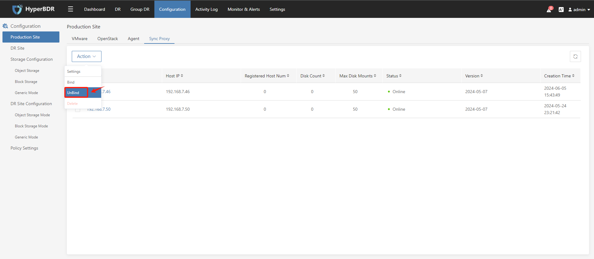
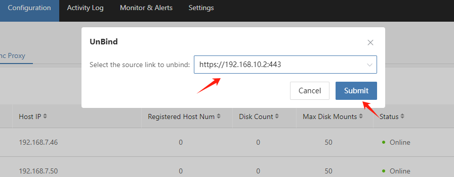
