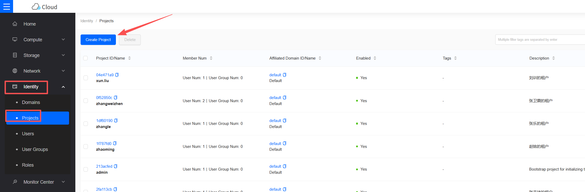
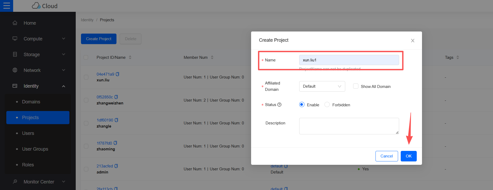
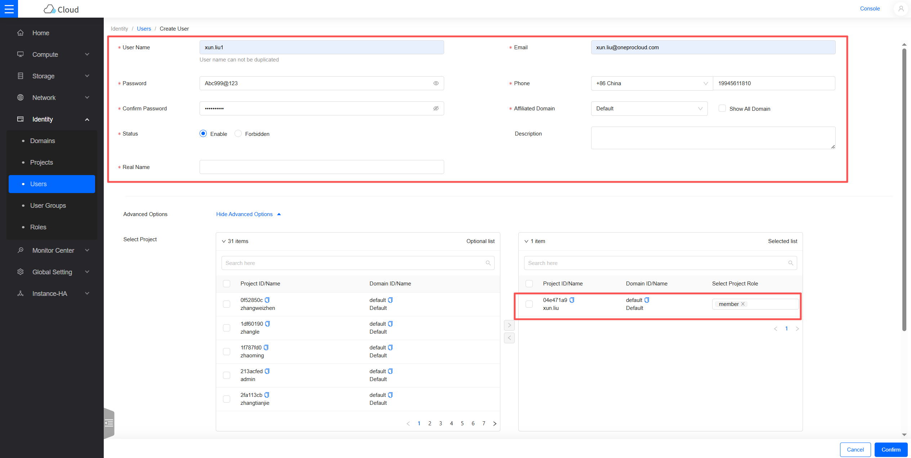
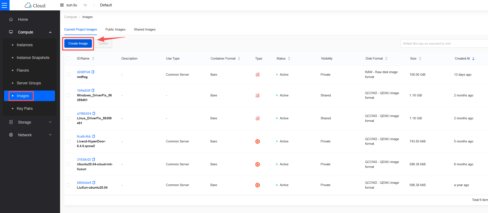
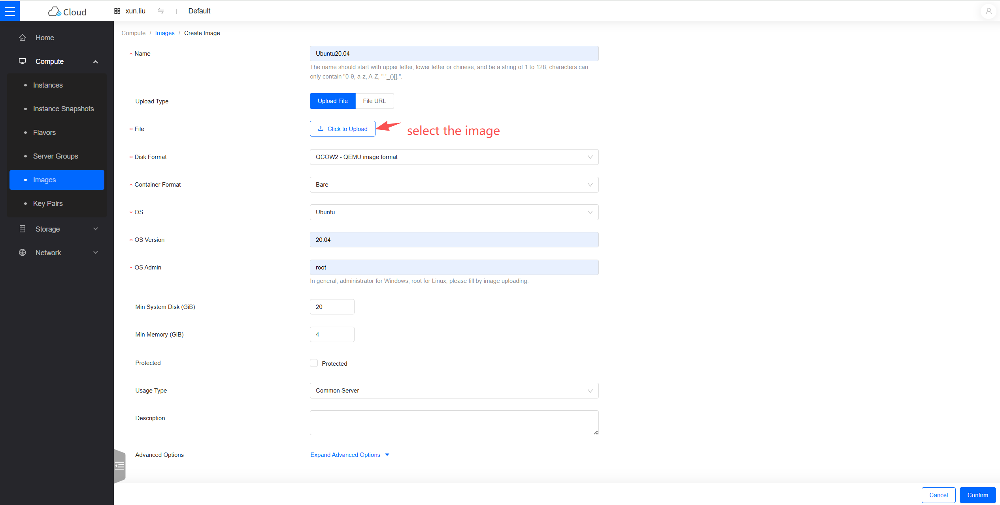
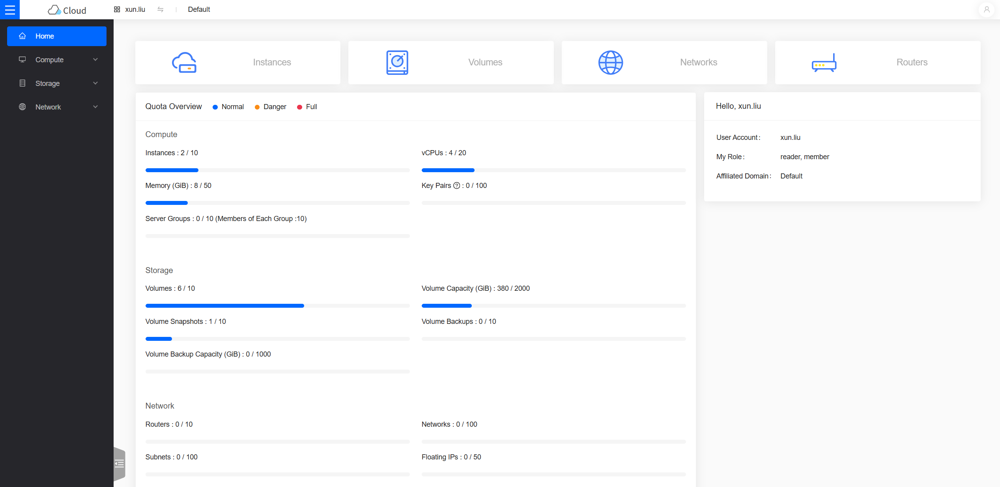

# OpenStack Pre-Settings

[[toc]]

## Creating an OpenStack Tenant for the Disaster Recovery Target

Create an OpenStack tenant and assign the appropriate permissions. 

### Creating a Tenant
Note: The steps for creating a tenant vary slightly between different OpenStack versions. The following is a reference example for the W version.
#### Step 1: Create a Project



#### Step 2: Create a User and Bind to the Project, Select the Project Role as member




## Configuring Network & Subnet
Description: Set up your network according to the following disaster recovery network scenarios.

1. Internal Network Access:

If accessing via an internal network, create a Disaster Recovery network and place the HyperBDR host instance within this network.

2. Disaster Recovery Network:

Create a dedicated network and subnet for HyperBDR disaster recovery and backup, connecting to the source IDC via an internal network.

3. Business Network:

The business network and subnet used for disaster recovery takeover and drills.

## Creating the HyperBDR Security Group

::: tip
HyperBDR Security Group Name: SG-HyperBDR
:::

### Creating Security Group Rules

::: warning
Note: For security group rules, configure the corresponding rules according to your platform's security requirements.

:::

| No. | Action | Type | Protocol & Port | Source | Description |
| --- | --- | --- | --- | --- | --- |
| 1 | 允许 | IPv4 | TCP:22 | 0.0.0.0/0 | 默认允许Linux SSH端口 |
| 2 | 允许 | IPv4 | TCP:10443 | 0.0.0.0/0 | 允许 HyperBDR web 控制台 |
| 3 | 允许 | IPv4 | TCP:30443 | 0.0.0.0/0 | 允许 HyperBDR 运维管理平台 Web 控制台端口 |
| 4 | 允许 | IPv4 | TCP:30080 | 0.0.0.0/0 | 允许 HyperBDR HTTPS 服务端口 |

## Image Download & Upload

### Downloading Images

::: tip
Download the Windows/Linux images to your local computer using the provided image links. 
:::

### Image Information

#### Linux Image

* Version: ubuntu 24.04 server
* Size:  596.38 MB
* Download Link: [https://downloads.oneprocloud.com/docs_images/ubuntu-24.04-server-cloud-init-amd64.qcow2](https://downloads.oneprocloud.com/docs_images/ubuntu-24.04-server-cloud-init-amd64.qcow2)  

#### Windows Image

* Version: Windows Server 2016 Datacenter 64bit English
* Size: 12.11 GB
* Download Link: [https://downloads.oneprocloud.com/docs_images/Windows_Server_2016_Datacenter_64bit_English_40G.qcow2](https://downloads.oneprocloud.com/docs_images/Windows_Server_2016_Datacenter_64bit_English_40G.qcow2) 
* Image MD5 Value: 519444d4b0343e15fa014c50d906a832


### Importing Images to OpenStack

#### Step 1: Log in to OpenStack
#### Step 2: Create Image



Wait for the image creation to complete.

## Creating an ECS Instance for HyperBDR Installation

### Log in to the OpenStack Console

### Create a Virtual Machine Based on the Required Specifications

> HyperBDR Server Required Specifications


| Configuration Item              | Parameters                                                     |
| :------------------ | :-------------------------------------------------------------- |
| Specification                |   8U16G                                                 |
| Image                | Ubuntu 20.04                                        |
| System Disk	              | 500GB                                                      |
| Network                | <VPC-HyperBDR\>                                      |
| Subnet                | <Subnet-HyperBDR\>  |
| Security Group	              | SG-HyperBDR                                                     |
| Instance Name	             | HyperBDR-Prod                                                  |
|Login Username	            | root                                                      |
| Password               | <Your Password\>                                                           |


## Testing Network Access Between Networks

### Testing Network Connectivity Between Disaster Recovery Network and Business Network

- Step 1: Log in to OpenStack and create a test server.  
Create a test cloud server (using Ubuntu 24.04 OS) on OpenStack. When configuring the network, select the Business VPC and subnet. Ensure the security group for this newly created test VM has an inbound policy allowing access on port 22.

- Step 2: Test network access from the Disaster Recovery VPC to the Business VPC.

Log in to the OpenStack console, then log in to the HyperBDR server. Use the internal network IP to connect to the host within the Business VPC.


Execute the command:

```sh
ssh root@<Business_VPC_Host_IP_Address>  22
```

Test Result:  
If you can successfully access and enter the password, the access is normal.

### Testing Network Connectivity Between Business Networks

- Step 1: Create a new test cloud server using the Ubuntu 24.04 operating system. When configuring the network, select a different Business VPC and subnet. Ensure the security group for this newly created test VM has an inbound policy allowing access on port 22.

- Step 2: Log in to the test cloud servers in different VPCs via the console and perform bidirectional command tests using the following command.

Execute the command:

```sh
ssh root@<Test_Host_IP_Address> 22
```

Test Result:
If you can successfully access and enter the password, the access is normal.

## OpenStack Account Quota Check

During the disaster recovery process, it is crucial to ensure that the OpenStack account has sufficient resource quotas to support data synchronization and disaster recovery. To prevent potential disaster recovery failures due to insufficient quotas, it is necessary to perform a resource quota check before initiating disaster recovery.

If the remaining quota in the account is insufficient, it is necessary to clean up unnecessary resources in the account or apply for an expansion of the resource quota.


### Source Host Resource Inventory

Collect the compute and storage resource information of the host systems awaiting disaster recovery and input the details into a table.

| Resource Type | Quantity/Capacity|
| --- | --- |
| Total Number of Source Hosts	  |  |
| Total vCPUs of Source Hosts	 |  |
| Total Memory of Source Hosts	 |  |
| Total Number of Disks on Source Hosts	 |  |
| Total Disk Capacity of Source Hosts	 |  |

### OpenStack Account Resource Quota Check

#### Log in to OpenStack

#### View Resource Quota



#### Organize Your OpenStack Account Resource Quotas and Calculate Remaining Quotas


| Service | Resource Type	 | Used Quota	 | Total Quota	 | Remaining Quota|
| --- | --- | --- | --- | --- |
| Compute | Instances |  |  |  |
| Compute | CPU |  |  |  |
| Compute | RAM (MB)	 |  |  |  |
| Storage | Volumes |  |  |  |
| Storage | Volume Capacity (GB)	 |  |  |  |
| Storage | Volume Snapshots	 |  |  |  |
| Network | Networks |  |  |  |
| Network | Subnets |  |  |  |
| Network | Ports |  |  |  |
| Network | Security Groups	 |  |  |  |
| Network | Security Group Rules	 |  |  |  |

#### Compare Remaining Quotas with Source Host Resources

Based on your inventory, compare the resource levels of the source hosts with the remaining resource quotas in the OpenStack account to assess whether they meet the disaster recovery requirements.

**1. If you are using Object Storage Recovery Mode for disaster recovery, refer to the following criteria.**

> **Compute: Instances** Remaining Quota ≥ Total Number of Source Hosts  
> **Compute: vCPUs** Remaining Quota ≥ Total vCPUs of Source Hosts  
> **Compute: RAM (MB)** Remaining Quota ≥ Total Memory of Source Hosts (MB)  
> **Storage: Volumes** Remaining Quota ≥ Total Number of Disks on Source Hosts  
> **Storage: Volume Capacity (GB)** Remaining Quota ≥ Total Disk Capacity of Source Hosts (GB)  
> **Storage: Volume Snapshots** Remaining Quota ≥ Number of Snapshots to Retain     
> **Network: Networks** Remaining Quota ≥ 2 
> **Network: Security Groups** Remaining Quota ≥    
> **Network: Security Group Rules** Remaining Quota ≥ 20    

**2. If you are using Block Storage Recovery Mode for disaster recovery, refer to the following criteria.**

> **Compute: Instances** Remaining Quota ≥ Total Number of Source Hosts + Number of Cloud_Sync_Gateways   
> **Compute: vCPUs** Remaining Quota ≥ Total vCPUs of Source Hosts  + vCPUs of Cloud_Sync_Gateways   
> **Compute: RAM (MB)** Remaining Quota ≥ Total Memory of Source Hosts (MB)+ Memory of Cloud_Sync_Gateways   
> **Storage: Volumes** Remaining Quota ≥ Total Number of Disks on Source Hosts  + Number of Cloud_Sync_Gateways    
> **Storage: Volume Capacity (GB)** Remaining Quota ≥ Total Disk Capacity of Source Hosts (GB) + Disk Capacity of Cloud_Sync_Gateways   
> **Storage: Volume Snapshots**  Remaining Quota ≥ Number of Snapshots to Retain    
> **Network: Networks** Remaining Quota ≥ 2   
> **Network: Security Groups** Remaining Quota ≥ 2   
> **Network: Security Group Rules** Remaining Quota ≥ 20   

If it is found that the remaining resource quota in the OpenStack account is insufficient, it is necessary to clean up unnecessary resources in the account or apply to the OpenStack administrator to expand the resource quota.

