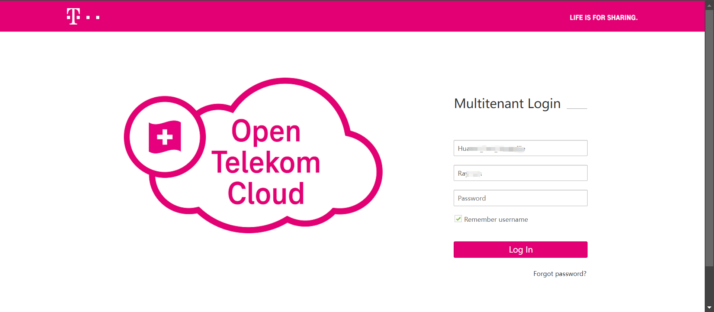
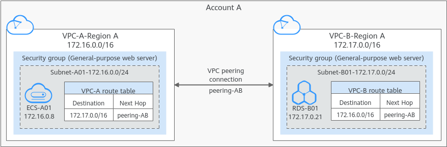

# Open Telekom Cloud Pre-Settings

[[toc]]

## Preparing a Open Telekom Cloud Account

Prepare a Open Telekom Cloud platform account. The account must have the control permissions to use the compute, storage, network, and image functions of the platform.

### Create IAM User

Contact OTC Platform Support to provide account.

### Granting Authorization to IAM User

Contact Cloud Platform Support to grant permissions to the account. The account must have control permissions for compute, storage, network, and image.

## Obtain AK/SK for OTC account

Log in to OTC platform.



Click to enter My Credentials and create AK/SK on the Access Keys page.


## Configure VPC & Subnet

Establish your network based on the following disaster recovery network scenarios.  
[Network Planning Overview](http://192.168.7.58:8080/userguide/presales/dr-network-planning-recommendations.html#deployment-solution-for-block-storage)

## Create HyperBDR Security Group

::: tip
HyperBDR Security Group Name: SG-HyperBDR
:::

### Create Security Group Rules

::: warning
Note: For the source IP range, we strongly recommend setting the source access for TCP:22 to a secure range instead of 0.0.0.0/0. Setting it to 0.0.0.0/0 means your ECS host is exposed to the internet, allowing anyone to access and potentially attack it, posing a security risk.  

For example, if your external IP address is 110.242.68.66, the source IP range can be configured as 110.242.68.66/32.
:::

| No. | Action | Type | Protocol & Port | Source | Description |
| --- | --- | --- | --- | --- | --- |
| 1 | Allow | IPv4 | TCP:22 | 0.0.0.0/0 | Permit default Linux SSH port |
| 2 | Allow | IPv4 | TCP:10443 | 0.0.0.0/0 | Permit HyperBDR web console |
| 3 | Allow | IPv4 | TCP:30443 | 0.0.0.0/0 | Permit HyperBDR Operation and maintenance management platform web console port |
| 4 | Allow | IPv4 | TCP:30080 | 0.0.0.0/0 | Permit HyperBDR https services port |

OTC VPC Reference Documentation:  
[https://docs.sc.otc.t-systems.com/virtual-private-cloud/umn/operation_guide_new_console_edition/index.html](https://docs.sc.otc.t-systems.com/virtual-private-cloud/umn/operation_guide_new_console_edition/index.html)

## Image Download & Upload

### Image Download

::: tip
We need to use three image files to import four images in Open Telekom Cloud.
Linux BIOS Image is used to create a cloud sync gateway and boot Linux hosts with DR; Windows BIOS Image is used for DR to boot Windows hosts; Linux/Windows UEFI Image is used for DR to boot UEFI hosts.
:::

::: tip
Download images to your local machine through the provided image links. 
:::

### Image Info

#### Linux Image

* File Name: ubuntu-20.04-server-cloud-init-amd64.qcow2
* Version: ubuntu 20.04 server
* Size: 5.85 GB
* Download Link: [https://downloads.oneprocloud.com/docs_images/ubuntu-20.04-server-cloud-init-amd64.qcow2](https://downloads.oneprocloud.com/docs_images/ubuntu-20.04-server-cloud-init-amd64.qcow2)  

#### Windows Image

* File Name: Windows_Server_2016_Datacenter_64bit_English_40G.qcow2
* Version: Windows Server 2016 Datacenter 64bit English
* Size: 12.11 GB
* Download Link: [https://downloads.oneprocloud.com/docs_images/Windows_Server_2016_Datacenter_64bit_English_40G.qcow2](https://downloads.oneprocloud.com/docs_images/Windows_Server_2016_Datacenter_64bit_English_40G.qcow2) 
* MD5 Value of the Image: 519444d4b0343e15fa014c50d906a832

#### UEFI Image

* File Name: HuaweiCloud_UEFI_GenericImage.qcow2
* Version: HuaweiCloud_UEFI_GenericImage
* Size: 554.69 MB
* Download Link: [https://downloads.oneprocloud.com/docs_images/HuaweiCloud_UEFI_GenericImage.qcow2](https://downloads.oneprocloud.com/docs_images/HuaweiCloud_UEFI_GenericImage.qcow2) 
* MD5 Value of the Image: 7814209a573666f2701b35236764723d

### Import Image

Contact OTC Platform Support to import the required image to the Open Telekom Cloud platform as a usable image.

OTC Reference Documentation:   
[Creating a Windows System Disk Image from an External Image File](https://docs-beta.sc.otc.t-systems.com/image-management-service/umn/creating_a_private_image/creating_a_windows_system_disk_image_from_an_external_image_file/index.html)  
[Creating a Linux System Disk Image from an External Image File](https://docs-beta.sc.otc.t-systems.com/image-management-service/umn/creating_a_private_image/creating_a_linux_system_disk_image_from_an_external_image_file/index.html)

### Image requirements

::: warning
1. The name must be one of the following and cannot have additional characters.
2. Due to the diverse versions of Windows on the source hosts, select the generic option for the operating system.
3. Linux image is primarily used for creating an HD. The recommended version for the current release is Ubuntu 20.04
:::

**Windows BIOS Image**

Supported Windows image names

> Windows Server 2016 Standard 64bit  
> Windows Server 2016 Standard 64bit English  
> Windows Server 2016 Datacenter 64bit  
> Windows Server 2016 Datacenter 64bit English  
> Windows Server 2019 Datacenter 64bit  
> Windows Server 2019 Datacenter 64bit English

::: warning
The size of the System disk must be 40G.
:::

**Linux BIOS Image**  

Supported Linux image names

> Ubuntu 20.04 server 64bit  

**Windows UEFI Image**

Supported Windows image names

> Windows Server 2016 Standard 64bit English UEFI
> Windows Server 2019 Datacenter 64bit UEFI
> Windows Server 2019 Datacenter 64bit English UEFI

::: warning
The size of the System disk must be 40G.
:::

**Linux UEFI Image**  

Supported Linux image names

> Ubuntu 20.04 server 64bit UEFI

## Create VPC Peering

### Process for Configuring a VPC Peering Connection

The process for configuring a VPC peering connection depends on whether the VPC peering connection is created with a VPC of another tenant or you have the management permission (administrators or operators) on the project the peer VPC belongs to.

- Enable communication between VPCs of the same tenant by following instructions provided in Associated Project Configuration Process when you have the management permission on projects the two VPCs with peering connections belong to.
Enable communication between VPCs of the same tenant by following instructions provided in Other Project Configuration Process when you do not 
- have the management permission on the peer VPC, that is, you are not a project member and have only the read-only permission.
- For details about how to enable communication between VPCs of different tenants, see Other Project Configuration Process.

::: tip
After configuring the VPC peering connection, configure security groups and network ACLs to allow traffic to pass.
:::

### Creating a VPC Peering Connection with Another VPC in Your Account

In OTC Disaster Recovery, the disaster recovery host needs to be restored to the planned production business VPC. Therefore, it is necessary to configure cross VPC peer-to-peer connections in OTC, configure the disaster recovery VPC with the business VPC, and add peer-to-peer connection routing. Mainly used for disaster recovery, the disaster recovery VPC where HyperBDR is located can access the business VPC through the intranet to recover virtual machines for data recovery.

Notes and Constraints
- Only one VPC peering connection can be created between two VPCs at the same time.
- A VPC peering connection can only connect VPCs in the same region.
- If the local and peer VPCs have overlapping CIDR blocks, the VPC peering connection may not take effect.
- After a VPC peering connection is created, you must add routes to the route tables of the local and peer VPCs. Otherwise, the VPC peering connection does not take effect.

Figure 1 Networking diagram of a VPC peering connection between VPCs in the same account.


> OTC Document Link:  
> [Creating a VPC Peering Connection with Another VPC in Your Account](https://docs.otc.t-systems.com/virtual-private-cloud/umn/vpc_peering_connection/creating_a_vpc_peering_connection_with_another_vpc_in_your_account.html)

## Test Network Access between VPCs

::: tip
[Create VPC Peering](https://docs.oneprocloud.com/userguide/poc/opentelekomcloud-pre-settings.html#create-vpc-peering) configuration has been successfully completed, and routing entries have been added correctly.
:::

### Test the network connectivity between the disaster recovery VPC and the business VPC

- Step1: Login to OTC and create an ECS test cloud server  
Create an ECS test cloud server (CentOS 7.6 operating system) on OTC. When configuring the network, choose the business VPC and subnet. Ensure that the security group of this newly created ECS test virtual machine has an inbound access policy allowing port 22.

- Step2: Network testing access from the disaster recovery VPC to the business VPC

Log in to the OTC console, access the HyperBDR ECS cloud server, and use the intranet IP to connect to the ECS host within the business VPC.

Execute command:

```sh
ssh root@<The intranet IP address of the test ECS> 22
```

Test results:  
If you can successfully access and enter the password, it indicates normal access.

### Test the network connectivity between business VPC


- Setp1: Create a new ECS test cloud server with CentOS 7.6 operating system. When configuring the network, choose a different business VPC and subnet. Ensure that the security group of this newly created ECS test virtual machine has an inbound access policy allowing port 22

- Sep2: Log in to different test cloud servers through the console and perform bidirectional command tests with the following commands

Execute command:

```sh
ssh root@<The intranet IP of the test ECS> 22
```

Test results:  
If you can successfully access and enter the password, it indicates normal access.

## OTC platform account quota check

During the disaster recovery process, it is essential to ensure that the cloud account has sufficient resource quotas to support data synchronization and disaster recovery recovery. To prevent potential failure of disaster recovery due to insufficient quotas, it is necessary to perform a resource quota check before initiating the disaster recovery.

If the remaining quota in the OTC account is insufficient, it is necessary to clean up unnecessary resources in the account or apply for an expansion of OTC resource quotas.

### Source host resource inventory

Need to gather information on the computing and storage resources for the host systems awaiting disaster recovery and input the details into a table.

| Resources Type | Size |
| --- | --- |
| The total number of source host  |  |
| The total number of source host CPU |  |
| The total number of source host RAM(MB) |  |
| The total number of source host disks |  |
| The total disk capacity for source host(GB) |  |

### Open Telekom Cloud account resource quota check

**View resource quotas**
Compile your Open Telekom Cloud account resource quotas and calculate the remaining quota

| Service | Resources Type | Used Quota | Total Quota | Residual Quota |
| --- | --- | --- | --- | --- |
| Elastic Cloud Server | ECSs |  |  |  |
| Elastic Cloud Server | vCPUs |  |  |  |
| Elastic Cloud Server | Memory (MB) |  |  |  |
| Image Management Service | Images |  |  |  |
| Elastic Volume Service | Disks |  |  |  |
| Elastic Volume Service | Disk capacity(GB) |  |  |  |
| Virtual Private Cloud | Elastic IP addresses |  |  |  |

#### Compare the remaining quota with the resources of the source hosts

Compare the resource levels of the source hosts, as per your inventory, with the remaining resource quota in your OTC account to assess whether it meets the requirements for disaster recovery.

**1. If you are using object storage recovery mode for DR, please refer to the following criteria.**

> **Elastic Cloud Server: ECSs** Residual Quota ≥ The total number of source host  
> **Elastic Cloud Server: vCPUs** Residual Quota ≥ The total number of source host CPU  
> **Elastic Cloud Server: Memory (MB)** Residual Quota ≥ The total number of source host RAM(MB)  
> **Elastic Volume Service: Disk** Residual Quota ≥ The total number of source host disks  
> **Elastic Volume Service: Disk capacity(GB)** Residual Quota ≥ The total disk capacity for source host(GB)  
> **Image Management Service: Images**  Residual Quota ≥ 2  
> **Virtual Private Cloud: Elastic IP addresses** Residual Quota: Satisfying the required number of public IP for the disaster recovery hosts to be restored to the OTC platform is sufficient.

**2. If you are using block storage recovery mode for DR, please refer to the following criteria.**

> **Elastic Cloud Server: ECSs** Residual Quota ≥ The total number of source host + Number of HyperGate instances  
> **Elastic Cloud Server: vCPUs** Residual Quota ≥ The total number of source host CPU + 2 * Number of HyperGate instances  
> **Elastic Cloud Server: Memory (MB)** Residual Quota ≥ The total number of source host RAM(MB) + 2048(MB) * Number of HyperGate instances  
> **Elastic Volume Service: Disk** Residual Quota ≥ 2 * Total number of source host disks + Number of HyperGate instances  
> **Elastic Volume Service: Disk capacity(GB)** Residual Quota ≥ 2 * Total disk capacity for source host(GB) + 40(GB) * Number of HyperGate instances  
> **Image Management Service: Images**  Residual Quota ≥ 2  
> **Virtual Private Cloud: Elastic IP addresses** Residual Quota: The quantity should satisfy the sum of the required public IP addresses for the disaster recovery hosts to be restored to the OTC platform, including both the number of public IP for the source hosts and the quantity of HyperGate instances.

If it is discovered that the remaining resource quota in the OTC account is insufficient, it is necessary to clean up unnecessary resources in the account or apply to OTC for an expansion of resource quotas.

### Increase quotas in your Open Telekom Cloud account.

If it is discovered that the remaining resource quota in the Open Telekom Cloud account is insufficient, and there are no resources to clean up in the account, you can try submitting a Open Telekom Cloud ticket to request an expansion of resource quotas.

## Modify the ssh policy of the Cloud Sync Gateway instance security group

### Confirm the instance of Cloud Sync Gateway

::: tip
Login the HyperBDR console by default.
:::


Record the Link Address of the cloud sync gateway.

### Modify the cloud sync gateway security group

Log in to Open Telekom Cloud and use Link Address to find the cloud sync gateway instance.


Modify security group


Modify the Inbound Rules and set the source end of port 22 to the IP address of HyperBDR.

::: tip
If HyperBDR is deployed in a private network environment without a fixed public IP, you need to use HyperBDR's egress public IP as the source IP.
:::


