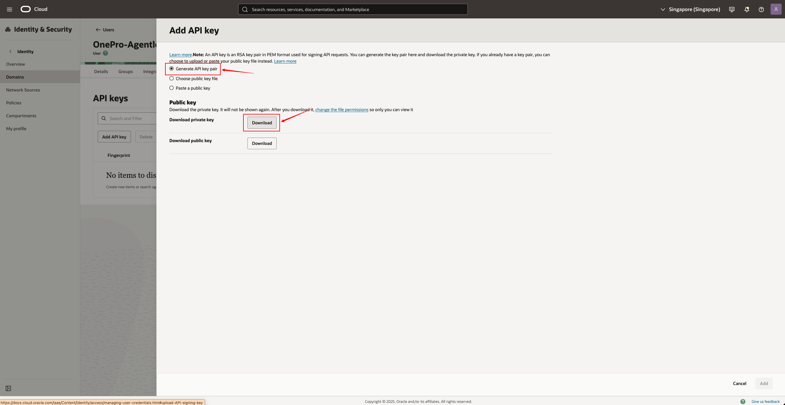
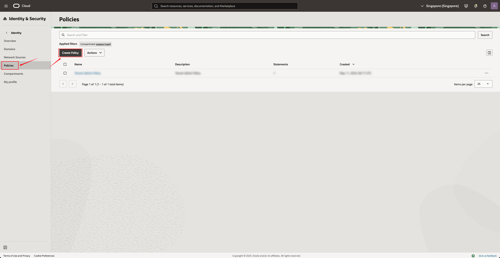

# Oracle Cloud Pre-Settings

> **Applicable Scenarios**: Used in HyperBDR / HyperMotion / OnePro products to perform agentless resource discovery, synchronization, or disaster recovery functions through Oracle Cloud (OCI). This document guides customers on how to create OCI users, user groups, authorization policies, download API Keys (public key/private key), and ultimately generate authentication information that can be used on the product side.

***

## **Table of Contents**

1. Introduction

2. Precondition

3) Create User Group (Group)

4) Create User (User)

5. Generate and download API Key (for proxy-free mode)

6. Create an access policy (Policy)

7) Collect necessary information (Tenancy OCID / User OCID / Fingerprint)

8) Enter the configuration information into the product side&#x20;

9. Frequently Asked Questions (FAQ)&#x20;

***

## 1. **Introduction**

To access Oracle Cloud resources (such as instances, disks, mirroring, etc.) using HyperBDR/HyperMotion, you need to create an account with the minimum necessary permissions in OCI and achieve agentless access through **API Key**.

This guide will instruct you on how to operate:&#x20;

* Create User Group

* Create User

* Generate API key pairs for users&#x20;

* Create an access policy with least privilege

* Obtain the certification information that ultimately needs to be filled in on the product side&#x20;

***

## 2. **Precondition**

* Already have an Oracle Cloud administrator account&#x20;

* has access to  the OCI Console&#x20;

* Login Address:<https://cloud.oracle.com>

* Administrator privileges are required to perform user and policy operations

***

## 3. **Create User Group (Group)**

1. Log in to the Oracle Cloud Console using an administrator account

2. Click in the top left corner **"Hamburger Menu (☰)" → Identity & Security → Domains&#x20;**

* Click on the current default Domain (usually *Default*)&#x20;

* Select from the top menu bar **"User Management → Groups" (User Groups)**

* Click on the&#x20;**&#x20;"Create Group"&#x20;**

**Fill in the parameters:**

| Field | Example | Description |
|-------|---------|-------------|
| Name | DR-User-Groups | User group name |
| Description | Group for DR Agentless access | Optional. It is recommended to fill in the purpose |
| User can request access | Yes | Start |

* Click **Create** to complete the creation.

***

## 4. **Create User (User)**

1. Under the current Domain, click on the top menu bar and select **"User Management → Users" (Users)**

* Click on the&#x20;**&#x20;"Create User"&#x20;**

**Fill in the parameters:**

| Field | Example | Description |
|---|---|---|
| First Name | OnePro-Agentless-User | User name (unique) |
| Last Name | DR Agentless access user | Optional |
| Username | agentless-user | Optional |
| Email | Optional (depending on the Settings) | If email notification is enabled, it can be filled in |
| Use the email address as the username | Yes/No | Optional |

* Under "Groups", you can select the previously created group and add users to the group created in Step 3:**DR-User-Groups**

* After checking the group to join, click&#x20;**&#x20;"Create"&#x20;**&#x20;

***

## 5. **Generate API Key for the user (very important)&#x20;**

> API Key is the core authentication method for products to connect to OCI.

1. Open the newly created user, click on **"API Keys"**

2. Click&#x20;**&#x20;"Add API Key"&#x20;**

* Select **“Generate API Key Pair”** (let the system generate automatically)&#x20;

For the Public Key here, you only need to click "**&#x20;Download private key&#x20;**", and after downloading, click "Add"&#x20;

* Download the following content (very important):

| Files | Explanation |
|---|---|
| privateKey.pem | Private key, used for input on the product end |
| publicKey.pem | Public key |
| config | The configuration file can obtain the fingerprint |
| oci_api_key_public.pem | Copy of public key |

* After saving the API Key, Oracle will display the Fingerprint, which can be copied and saved.&#x20;

***

## 6. **Create an access policy (Policy)**

> We need to create a policy that authorizes the user group just mentioned to have the ability to access instances and disks.&#x20;

1. Go to **Identity & Security → Policies**

2. Select your **Root Compartment / Tenancy** (very important, do not choose incorrectly)

3. Click on the top right corner**Create Policy**

**Strategy Example:**

| Field | Content |
|---|---|
| Name | OnePro-Agentless-Policies |
| Description | Policy for Agentless user |
| Compartment | Tenancy (root) |
| Policy Syntax | See below |

**Please add the following statement to the Policy:**

Replace **`DR-User-Groups`** with the actual user group name

After creation, click&#x20;**&#x20;Create&#x20;**&#x20;to complete.&#x20;

***

## 7. **Collect necessary information (for entry into the product side)**

In agentless mode, you need to collect the following information from OCI:&#x20;

| Information Item   | Acquisition Method |
|---|---|
| Tenancy OCID       | Console → Administration → Tenancy Details |
| User OCID          | Open the user → "User OCID" |
| Region             | Region selector in the upper right corner, e.g., "ap-singapore-1" |
| Fingerprint        | Can be viewed on the API Key page |
| Private Key Content| Open the downloaded privateKey.pem |

It is recommended to organize the above information so that it can be filled in HyperBDR / HyperMotion.&#x20;

***

## 8. **Enter configuration information (example) on the product side&#x20;**

When adding an Oracle Cloud account in HyperBDR / HyperMotion, enter the following information:&#x20;

| Product Field   | OCI Information Source      |
|---|---|
| Tenancy OCID    | Tenancy Details Page        |
| User OCID       | User Details Page           |
| Region          | Console (upper right corner)|
| Fingerprint     | User API Key details        |
| Private Key     | privateKey.pem file content |

[Click to view the user manual](../../userguide/dr/configuration/production-site.md#oracle)

Save it after completion.

***

## 9. **Frequently Asked Questions (FAQ)&#x20;**

### **Q1: What if the API Key is lost after downloading?**

New API Key needs to be regenerated on the user page, and the configuration on the product side needs to be updated.

### **Q2: Why does policy authorization always fail?**

Please confirm whether you have selected **Tenancy (Root Compartment)**, as a child Compartment will result in insufficient permissions.

### **Q3: User joined the group but still has no permissions?**

Policies need to be bound to user groups, rather than directly to users.&#x20;

### **Q4: Prompted with no permission to access the instance or disk?**

Please confirm that the following policies have been added:

`Allow group <group_name> to manage instance-family in tenancy`

`Allow group <group_name> to manage volume-family in tenancy`
