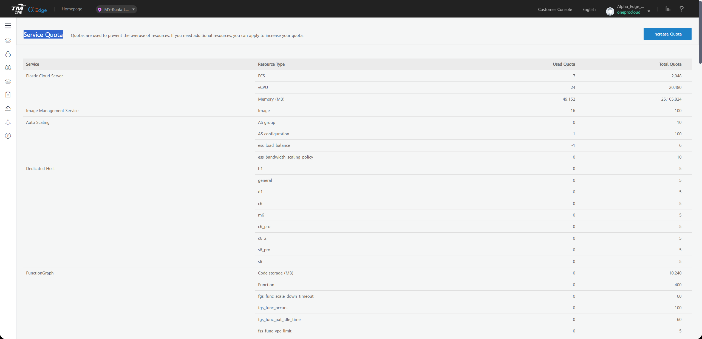
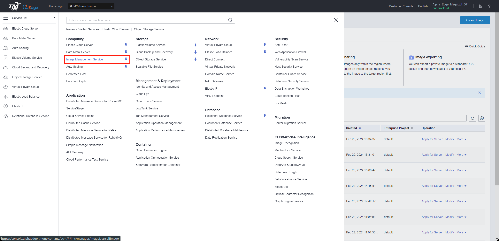
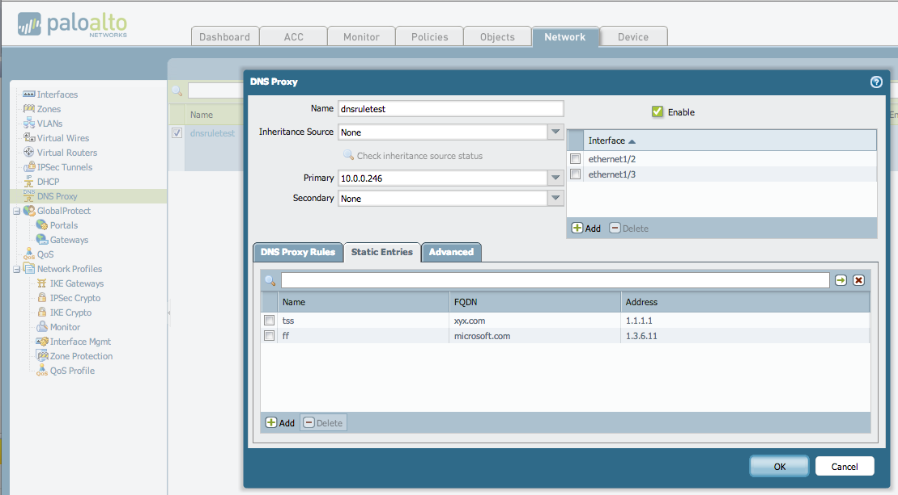

# TM CAE Pre-Settings

[[toc]]

## Create TM CAE IAM account for DR purpose

Create a TM CAE IAM account with correspinding permissions, detail requirement please refer to below document. And create Access Key ID & Access Secret Key of IAM account for setup.

### Create IAM User

#### TM CAE official documentation link:

- [https://support.alphaedge.tmone.com.my/en-us/usermanual/iam/iam_02_0001.html](https://support.alphaedge.tmone.com.my/en-us/usermanual/iam/iam_02_0001.html)

### Granting Authorization to IAM User

#### TM CAE official documentation link:

- [https://support.alphaedge.tmone.com.my/en-us/usermanual/iam/iam_01_0652.html](https://support.alphaedge.tmone.com.my/en-us/usermanual/iam/iam_01_0652.html)

### Managing IAM User Access Keys

#### TM CAE official documentation link:

- [https://support.alphaedge.tmone.com.my/en-us/usermanual/iam/iam_02_0003.html](https://support.alphaedge.tmone.com.my/en-us/usermanual/iam/iam_02_0003.html)

### TM CAE IAM Permission Requirements

::: tip
TM CAE has different API versions in different regions, and each region has a slightly different definition of resource description permissions. When you create permissions for HyperBDR, So you need to provide full access to ecs, evs, obs, ims, and netwrok services.
:::

#### ecs/vpc/evs/ims

```
{
    "Version": "1.1",
    "Statement": [
        {
            "Effect": "Allow",
            "Action": [
                "ecs:*:*"
            ]
        },
        {
            "Effect": "Allow",
            "Action": [
                "evs:*:*"
            ]
        },
        {
            "Effect": "Allow",
            "Action": [
                "vpc:*:*"
            ]
        },
        {
            "Effect": "Allow",
            "Action": [
                "IMS:*:*"
            ]
        }
    ]
}
```

#### obs

```
{
    "Version": "1.1",
    "Statement": [
        {
            "Effect": "Allow",
            "Action": [
                "OBS:*:*"
            ]
        }
    ]
}
```
## Configure VPC & Subnet

Create VPC Network and Subnet According to TM CAE Documentation. Explanation: Establish your network based on the following disaster recovery network scenarios.

1. Intranet VPN Access:

If accessing through an intranet VPN, create a DR VPC network and place HyperBDR ECS instances in this network.

2. Disaster Recovery VPC:

Dedicated VPC network and subnet for HyperBDR disaster recovery and backup, interconnected with the on-premises IDC through VPN.

3. Business VPC:

Business VPC network and subnet used for disaster takeover and drills.

## Create HyperBDR Security Group

::: tip
HyperBDR Security Group Name: SG-HyperBDR
:::

### Create Security Group Rules

> NOTE: For Source IP range, we recommend use safe range to replace 0.0.0.0/0.
> For example, if your external ip address is 110.242.68.66, source can be configurated as 110.242.68.66/32.

| No. | Action | Type | Protocol & Port | Source | Description |
| --- | --- | --- | --- | --- | --- |
| 1 | Allow | IPv4 | TCP:22 | 0.0.0.0/0 | Permit default Linux SSH port |
| 2 | Allow | IPv4 | TCP:10443 | 0.0.0.0/0 | Permit HyperBDR web console |
| 3 | Allow | IPv4 | TCP:30443 | 0.0.0.0/0 | Permit HyperBDR Operation and maintenance management platform web console port |
| 4 | Allow | IPv4 | TCP:30080 | 0.0.0.0/0 | Permit HyperBDR https services port |

## Create ECS for HyperBDR

### Log in to the TM CAE Console

### Create ECS Cloud Instance based on Configuration Information

> TM CAE documentation : [https://support.alphaedge.tmone.com.my/en-us/usermanual/ecs/en-us_topic_0021831611.html](https://support.alphaedge.tmone.com.my/en-us/usermanual/ecs/en-us_topic_0021831611.html)  
> The resource configuration for HyperBDR servers is as follows:

| Configuration items | Parameters                                                      |
| :------------------ | :-------------------------------------------------------------- |
| Region              | <Your Region\>                                                  |
| Billing Mode        | Yearly/Monthly                                                  |
| AZ                  | AZ1                                                             |
| Flavor              | s6.2xlarge.2                                                    |
| Image               | CentOS 7.9 64bit(40 GiB)(d580586a-1761-4f06-bb11-5f358ee29e40)  |
| System Disk         | High IO 200GB                                                   |
| Network             | <VPC-HyperBDR-172.16.0.0\>                                      |
| Subnet              | <Subnet-HyperBDR-172.16.0.0\> (Automatically assign IP address) |
| Security Group      | SG-HyperBDR                                                     |
| EIP                 | Auto assign                                                     |
| EIP Type            | Dynamic BGP                                                     |
| Billed By           | Traffic                                                         |
| Bandwidth Size      | 100Mbps                                                         |
| ECS Name            | HyperBDR-Prod                                                   |
| Login Mode          | Password                                                        |
| Username            | root                                                            |
| Password            | ec1@OneProCloud#!                                               |

## TM CAE platform account quota check

During the disaster recovery process, it is essential to ensure that the cloud account has sufficient resource quotas to support data synchronization and disaster recovery recovery. To prevent potential failure of disaster recovery due to insufficient quotas, it is necessary to perform a resource quota check before initiating the disaster recovery.

If the remaining quota in the TM CAE account is insufficient, it is necessary to clean up unnecessary resources in the account or apply for an expansion of TM CAE resource quotas.

### Source host resource inventory

Need to gather information on the computing and storage resources for the host systems awaiting disaster recovery and input the details into a table.
| Resources Type | Size |
| --- | --- |
| The total number of source host  |  |
| The total number of source host CPU |  |
| The total number of source host RAM(MB) |  |
| The total number of source host disks |  |
| The total disk capacity for source host(GB) |  |

### TM CAE account resource quota check

#### Login TM CAE


#### View resource quotas

Access the CDN Console, click on "My Quotas" in the upper-right corner. The webpage will navigate to the "Quotas" page.




#### Count your TM CAE account resource quotas and calculate the remaining quota


| Service | Resources Type | Used Quota | Total Quota | Residual Quota |
| --- | --- | --- | --- | --- |
| Elastic Cloud Server | ECS |  |  |  |
| Elastic Cloud Server | vCPU |  |  |  |
| Elastic Cloud Server | Memory (MB) |  |  |  |
| Image Management Service | Image |  |  |  |
| Elastic Volume Service | Disk |  |  |  |
| Elastic Volume Service | Disk capacity(GB) |  |  |  |
| Virtual Private Cloud | EIP |  |  |  |

#### Compare the remaining quota with the resources of the source hosts

Compare the resource levels of the source hosts, as per your inventory, with the remaining resource quota in your TM CAE account to assess whether it meets the requirements for disaster recovery.

**1. If you are using object storage recovery mode for DR, please refer to the following criteria.**

> **Elastic Cloud Server: ECS** Residual Quota ≥ The total number of source host  
> **Elastic Cloud Server: vCPU** Residual Quota ≥ The total number of source host CPU  
> **Elastic Cloud Server: Memory (MB)** Residual Quota ≥ The total number of source host RAM(MB)  
> **Elastic Volume Service: Disk** Residual Quota ≥ The total number of source host disks  
> **Elastic Volume Service: Disk capacity(GB)** Residual Quota ≥ The total disk capacity for source host(GB)  
> **Image Management Service: Image**  Residual Quota ≥ 2  
> **Virtual Private Cloud: EIP** Residual Quota: Satisfying the required number of public IP for the disaster recovery hosts to be restored to the TM CAE platform is sufficient.

**2. If you are using block storage recovery mode for DR, please refer to the following criteria.**

> **Elastic Cloud Server: ECS** Residual Quota ≥ The total number of source host + Number of HyperGate instances  
> **Elastic Cloud Server: vCPU** Residual Quota ≥ The total number of source host CPU + 2 * Number of HyperGate instances  
> **Elastic Cloud Server: Memory (MB)** Residual Quota ≥ The total number of source host RAM(MB) + 2048(MB) * Number of HyperGate instances  
> **Elastic Volume Service: Disk** Residual Quota ≥ 2 * Total number of source host disks + Number of HyperGate instances  
> **Elastic Volume Service: Disk capacity(GB)** Residual Quota ≥ 2 * Total disk capacity for source host(GB) + 40(GB) * Number of HyperGate instances  
> **Image Management Service: Image**  Residual Quota ≥ 2  
> **Virtual Private Cloud: EIP** Residual Quota: The quantity should satisfy the sum of the required public IP addresses for the disaster recovery hosts to be restored to the TM CAE platform, including both the number of public IP for the source hosts and the quantity of HyperGate instances.

If it is discovered that the remaining resource quota in the TM CAE account is insufficient, it is necessary to clean up unnecessary resources in the account or apply to TM CAE for an expansion of resource quotas.

### Increase quotas in your TM CAE account.

If it is discovered that the remaining resource quota in the TM CAE account is insufficient, and there are no resources to clean up in the account, you can click on "Increase Quota" to view the method for expanding the quota.  


## Image Download & Upload

### Image Download

::: tip
Windows images are primarily used for disaster recovery with UEFI Windows as the source host, while Linux images are used in block storage mode and serve as the base image for cloud sync gateway creation. 
:::

::: tip
Download Windows/Linux images to your local machine through the provided image links. 
:::

### Image Info

#### Linux Image

* Version: CentOS 8.4 64bit
* Size:  1.22 GB
* Download Link: [https://hyperbdr-system-image-do-not-delete.obs.ap-southeast-3.myhuaweicloud.com/CentOS-8-GenericCloud-8.4.2105-20210603.0.x86_64.qcow2](https://hyperbdr-system-image-do-not-delete.obs.ap-southeast-3.myhuaweicloud.com/CentOS-8-GenericCloud-8.4.2105-20210603.0.x86_64.qcow2) 
* MD5 Value of the Image: fe9f21a75a80d12159030fff76e1c8a5

#### Windows Image

* Version: Windows Server 2016 Datacenter 64bit English
* Size: 12.11 GB
* Download Link: [https://hyperbdr-system-image-do-not-delete.obs.ap-southeast-3.myhuaweicloud.com/Windows_Server_2016_Datacenter_64bit_English_40G.qcow2](https://hyperbdr-system-image-do-not-delete.obs.ap-southeast-3.myhuaweicloud.com/Windows_Server_2016_Datacenter_64bit_English_40G.qcow2) 
* MD5 Value of the Image: 519444d4b0343e15fa014c50d906a832

### Upload Image to TM CAE Object Storage

::: tip
TM CAE documentation link:  
[Upload Windows Image](https://support.alphaedge.tmone.com.my/en-us/usermanual/ims/en-us_topic_0030713183.html)  
[Upload Linux Image](https://support.alphaedge.tmone.com.my/usermanual/ims/en-us_topic_0030713192.html)
:::

### Import Image

::: tip
TM CAE documentation link:   
[Register Windows Image](https://support.alphaedge.tmone.com.my/en-us/usermanual/ims/en-us_topic_0030713184.html)  
[Register Linux Image](https://support.alphaedge.tmone.com.my/en-us/usermanual/ims/en-us_topic_0030713193.html)
:::

#### Step1: Access the IMS console.

- Log in to the management console.
- Under Computing, click Image Management Service.The IMS console is displayed.Register an external image file as a private image.  



#### Step2: Register an external image file as a private image

- Click Create Image in the upper right corner


::: warning 
1.The name must be one of the following and cannot have additional characters.  
2.Due to the diverse versions of Windows on the source hosts, select the generic option for the operating system.  
3.Linux image is primarily used for creating an HD. The recommended version for the current release is CentOS 8+  
:::
Supported Windows image names

> Windows Server 2012 R2 Standard 64bit  
> Windows Server 2012 R2 Datacenter 64bit  
> Windows Server 2016 Standard 64bit  
> Windows Server 2016 Standard 64bit English  
> Windows Server 2016 Datacenter 64bit  
> Windows Server 2016 Datacenter 64bit English  
> Windows Server 2019 Datacenter 64bit  
> Windows Server 2019 Datacenter 64bit English


::: warning
The size of the System disk must be 40G.  
Boot Mode Select BIOS.
:::


Supported Linux image names

> CentOS 8.4 64bit  
> CentOS 8.3 64bit  
> CentOS 8.2 64bit  
> CentOS 8.1 64bit  
> CentOS 8.5 64bit


#### Step3: Confirm and submit

- Click Next and confirm the image specifications. Click Submit.

- Go back to the Private Images page. The image is successfully registered when its status becomes Normal.

## VPN Setup

> Note: If your DR Environment is connected to the Intranet of the production site through TM CAE, you need to purchase the TM CAE VPN service and configure the TM CAE to connect to the On-perms network.

> Configure VPN. For details, see TM CAE documentation.  
> Document Link: [https://support.alphaedge.tmone.com.my/en-us/usermanual/vpn/en-us_topic_0133627788.html](https://support.alphaedge.tmone.com.my/en-us/usermanual/vpn/en-us_topic_0133627788.html)

## Create VPC Endpoint

> If your disaster recovery environment is interconnected with the production site's intranet through VPN, and the production site needs to access HyperBDR and OBS services through VPN during a disaster, then you need to purchase and configure VPC Endpoint services in TM CAE.

> You need to purchase two VPC Endpoint services, one for OBS and the other for DNS.

> Official definition: If you want to access OBS services from a local data center via VPN or Cloud Connect using an intranet method, you can achieve this by connecting through terminal endpoints to access terminal endpoint services.  
> Document Link: [https://support.alphaedge.tmone.com.my/usermanual/vpcep/vpcep_02_0301.html](https://support.alphaedge.tmone.com.my/usermanual/vpcep/vpcep_02_0301.html)

## Create VPC Peering

::: tip
Based on business requirements, choose different VPC peering configurations:  
- If there is no need for mutual access between multiple business VPCs, you only need to configure the peering connection according to the [Disaster recovery VPC connected via peering with multiple business VPC](https://docs.oneprocloud.com/userguide/poc/tmcae-pre-settings.html#disaster-recovery-vpc-connected-via-peering-with-multiple-business-vpc) setup.  
- If there is a requirement for mutual access between multiple business VPCs, then you need to configure according to the [Disaster recovery VPC peering with multiple business VPCs, as well as peering connections between multiple business VPC](https://docs.oneprocloud.com/userguide/poc/tmcae-pre-settings.html#disaster-recovery-vpc-peering-with-multiple-business-vpcs-as-well-as-peering-connections-between-multiple-business-vpc) setup.
:::

### Disaster recovery VPC connected via peering with multiple business VPC

In TM CAE Disaster Recovery, the disaster recovery host needs to be restored to the planned production business VPC. Therefore, it is necessary to configure cross VPC peer-to-peer connections in TM CAE, configure the disaster recovery VPC with the business VPC, and add peer-to-peer connection routing. Mainly used for disaster recovery, the disaster recovery VPC where HyperBDR is located can access the business VPC through the intranet to recover virtual machines for data recovery.

> Peering One Central VPC with Multiple VPCs Document Link:  
> [https://support.alphaedge.tmone.com.my/usermanual/vpc/en-us_topic_0046809840.html#en-us_topic_0046809840__section51284316142](https://support.alphaedge.tmone.com.my/usermanual/vpc/en-us_topic_0046809840.html#en-us_topic_0046809840__section51284316142)

### Disaster recovery VPC peering with multiple business VPCs, as well as peering connections between multiple business VPC

When all disaster recovery hosts of the customer need to be placed in different business VPCs planned by TM CAE and there is a need for cross VPC access in the business, then it is necessary to configure peer-to-peer connections between business VPCs to ensure normal cross VPC business interaction after subsequent business recovery.

> Peering Two or More VPCs Document Link:  
> [https://support.alphaedge.tmone.com.my/usermanual/vpc/en-us_topic_0046809840.html#en-us_topic_0046809840__section1450741418179](https://support.alphaedge.tmone.com.my/usermanual/vpc/en-us_topic_0046809840.html#en-us_topic_0046809840__section1450741418179)

## Test Network Access between VPCs

::: tip
[Create VPC Peering](https://docs.oneprocloud.com/userguide/poc/tmcae-pre-settings.html#create-vpc-peering) configuration has been successfully completed, and routing entries have been added correctly.
:::

### Test the network connectivity between the disaster recovery VPC and the business VPC

- Step1: Login to TM CAE and create an ECS test cloud server  
Create an ECS test cloud server (CentOS 7.6 operating system) on TM CAE. When configuring the network, choose the business VPC and subnet. Ensure that the security group of this newly created ECS test virtual machine has an inbound access policy allowing port 22.

- Step2: Network testing access from the disaster recovery VPC to the business VPC

Log in to the TM CAE console, access the HyperBDR ECS cloud server, and use the intranet IP to connect to the ECS host within the business VPC.


Execute command:

```sh
ssh root@<The intranet IP address of the test ECS> 22
```

Test results:  
If you can successfully access and enter the password, it indicates normal access.

### Test the network connectivity between business VPC

- Setp1: Create a new ECS test cloud server with CentOS 7.6 operating system. When configuring the network, choose a different business VPC and subnet. Ensure that the security group of this newly created ECS test virtual machine has an inbound access policy allowing port 22

- Sep2: Log in to different test cloud servers through the console and perform bidirectional command tests with the following commands

Execute command:

```sh
ssh root@<The intranet IP of the test ECS> 22
```

Test results:  
If you can successfully access and enter the password, it indicates normal access.

## Test Network Connectivity from Proxy to Object Storage

::: tip
Make sure you already login to Proxy VM
:::

### Internet

Ensure your proxy can access internet before testing.

#### Public DNS Connectivity Testing

```
ping -c 4 -t 2 8.8.8.8
```

Success Response:

```
ping -c 4 -t 2 8.8.8.8
PING 8.8.8.8 (8.8.8.8): 56 data bytes
64 bytes from 8.8.8.8: icmp_seq=0 ttl=111 time=43.362 ms
64 bytes from 8.8.8.8: icmp_seq=1 ttl=111 time=49.807 ms

--- 8.8.8.8 ping statistics ---
2 packets transmitted, 2 packets received, 0.0% packet loss
round-trip min/avg/max/stddev = 43.362/46.585/49.807/3.222 ms
```

#### TM CAE Object Storage Bucket Connectivity

```
curl I https://obs.my-kualalumpur-1.alphaedge.tmone.com.my
```

Success Response:

```
HTTP/1.1 405 Method Not Allowed
Server: OBS
x-obs-request-id: 0000018DF405888D9011AFB39D67F98A
Allow: HEAD, GET, OPTIONS
x-obs-id-2: 32AAAQAAEAABAAAQAAEAABAAAQAAEAABCRv4Sw/xc+SxYUK6EjH40JhyPz4MkKIn
Content-Type: application/xml
Date: Thu, 29 Feb 2024 08:40:19 GMT
Content-Length: 380
```

::: tip
Note: This command is primarily used to test the accessibility of TM CAE Object Storage buckets. Currently, the tested OBS domain is for the TM CAE MY-Kuala Lumpur region. If you need to test in a different region, please refer to the official TM CAE documentation to find the corresponding Endpoint domain address.
:::

Reference Link: [https://support.alphaedge.tmone.com.my/en-us/endpoint/index.html](https://support.alphaedge.tmone.com.my/en-us/endpoint/index.html)

### VPN

#### Check Object Storage Service Endpoint

Make sure object storage service endpoint address return internal ip address.

```sh
ping obs.my-kualalumpur-1.alphaedge.tmone.com.my
```

Success Response:

```
PING obs.lz01.my-kualalumpur-1.alphaedge.tmone.com.my (100.125.32.15)) 56(84) bytes of data.
64 bytes from 100.125.32.15 (100.125.32.15): icmp_seq=1 ttl=44 time=0.255 ms
64 bytes from 100.125.32.15 (100.125.32.15): icmp_seq=2 ttl=44 time=0.294 ms
64 bytes from 100.125.32.15 (100.125.32.15): icmp_seq=3 ttl=44 time=0.300 ms
```

::: tip
TM CAE Object Storage Service internal IP Range: 100.125.xx.xx If there is no ICMP response, it is considered normal.
:::

#### TM CAE Object Storage Bucket Connectivity

```sh
curl -I https://obs.my-kualalumpur-1.alphaedge.tmone.com.my
```

Success Response:

```
HTTP/1.1 405 Method Not Allowed
Server: OBS
x-obs-request-id: 0000018DF405888D9011AFB39D67F98A
Allow: HEAD, GET, OPTIONS
x-obs-id-2: 32AAAQAAEAABAAAQAAEAABAAAQAAEAABCRv4Sw/xc+SxYUK6EjH40JhyPz4MkKIn
Content-Type: application/xml
Date: Thu, 29 Feb 2024 08:40:19 GMT
Content-Length: 380
```

::: tip
Note: This command is primarily used to test the accessibility of TM CAE Object Storage buckets. Currently, the tested OBS domain is for the TM CAE MY-Kuala Lumpur region. If you need to test in a different region, please refer to the official TM CAE documentation to find the corresponding Endpoint domain address.
:::

Reference Link: [https://support.alphaedge.tmone.com.my/en-us/endpoint/index.html](https://support.alphaedge.tmone.com.my/en-us/endpoint/index.html)

## (Option 2: Intranet VPN access)Configure TM CAE Intranet DNS address for the network device where the Agent host resid

::: tip
If your disaster recovery environment is interconnected with the production site's intranet through TM CAE VPN, after creating the VPC Endpoint service, you need to add the resolution address of the TM CAE intranet OBS VPC Endpoint service in the network where the production site's Agent host is located.
:::

### Configure firewall or network devices such as switches

::: tip
Example: Palo Alto Firewall  
The following operations are performed in the firewall web management interface.
:::

1. Navigate to [Network] > [DNS Proxy] .

2. Click [Add] to bring up the DNS proxy dialog box.

3. Select the interface on which DNS proxy should be enabled. In the following figure, DNS proxy is enabled on Ethernet 1/2 and 1/3 interfaces.

4. Select the primary and secondary servers to which the firewall should forward DNS queries. This example shows the configuration of enabling DNS proxy on Ethernet interfaces 1/2 and 1/3. The active DNS server is set to 10.0.0.246 (This IP is configured as the TM CAE internal DNS Server Addresse).

::: tip
Configure the TM CAE internal DNS address based on the region where you use TM CAE resources.  
TM CAE internal DNS service address at:  [https://support.alphaedge.tmone.com.my/en-us/usermanual/dns/dns_faq_002.html](https://support.alphaedge.tmone.com.my/en-us/usermanual/dns/dns_faq_002.html)
:::



## (Option 1: Public Network Access)Test The Connectivity Between The Agent Host And TM CAE OBS

::: tip
Ensure your source hosts can access internet before testing.
:::

### Windows

::: tip
Perform testing operations using the Windows Command Prompt (CMD).
:::

#### Public DNS Connectivity Testing
```shell

ping 8.8.8.8

```

Success Response:


#### TM CAE Object Storage Connectivity

```shell

ping obs.my-kualalumpur-1.alphaedge.tmone.com.my

```

Success Response:

```
C:\Users\Administrator>ping obs.my-kualalumpur-1.alphaedge.tmone.com.my

Pinging obs.lz01.my-kualalumpur-1.alphaedge.tmone.com.my [202.165.20.91] with 32
 bytes of data:
Reply from 202.165.20.91: bytes=32 time=311ms TTL=44
Reply from 202.165.20.91: bytes=32 time=310ms TTL=44
Reply from 202.165.20.91: bytes=32 time=319ms TTL=44
Reply from 202.165.20.91: bytes=32 time=310ms TTL=44

Ping statistics for 202.165.20.91:
    Packets: Sent = 4, Received = 4, Lost = 0 (0% loss),
Approximate round trip times in milli-seconds:
    Minimum = 310ms, Maximum = 319ms, Average = 312ms
```

### Linux

#### Public DNS Connectivity Testing

```shell

ping -c 4 -t 2 8.8.8.8

```

Success Response:

```

ping -c 4 -t 2 8.8.8.8

PING 8.8.8.8 (8.8.8.8): 56 data bytes

64 bytes from 8.8.8.8: icmp_seq=0 ttl=111 time=43.362 ms

64 bytes from 8.8.8.8: icmp_seq=1 ttl=111 time=49.807 ms


--- 8.8.8.8 ping statistics ---
2 packets transmitted, 2 packets received, 0.0% packet loss
round-trip min/avg/max/stddev = 43.362/46.585/49.807/3.222 ms
```

#### TM CAE Object Storage Connectivity

```shell

ping obs.my-kualalumpur-1.alphaedge.tmone.com.my

```

Success Response:

```
64 bytes from 202.165.20.91 (202.165.20.91): icmp_seq=1 ttl=44 time=68 ms
64 bytes from 202.165.20.91 (202.165.20.91): icmp_seq=3 ttl=44 time=77 ms
64 bytes from 202.165.20.91 (202.165.20.91): icmp_seq=4 ttl=44 time=66 ms
64 bytes from 202.165.20.91 (202.165.20.91): icmp_seq=5 ttl=44 time=71 ms
64 bytes from 202.165.20.91 (202.165.20.91): icmp_seq=6 ttl=44 time=79 ms

```

::: tip
Note: This command is primarily used to test the accessibility of TM CAE Object Storage buckets. Currently, the tested OBS domain is for the TM CAE MY-Kuala Lumpur region. If you need to test in a different region, please refer to the official TM CAE documentation to find the corresponding Endpoint domain address.
:::

Reference Link: [https://support.alphaedge.tmone.com.my/en-us/endpoint/index.html](https://support.alphaedge.tmone.com.my/en-us/endpoint/index.html)

## (Option 2: Internal VPN Access)Test The Connectivity Between The Agent Host And TM CAE OBS

### Windows Host

::: tip
Perform testing operations using the Windows Command Prompt (CMD).
:::

#### TM CAE Private DNS Connectivity Testing

::: tip
Refer to the following document to find the private NDS (Network Domain Service) address based on the used object storage region.  
Reference documents: [https://support.alphaedge.tmone.com.my/en-us/usermanual/dns/dns_faq_002.html](https://support.alphaedge.tmone.com.my/en-us/usermanual/dns/dns_faq_002.html)
:::

```shell
ping 100.125.12.250
```

Success Response:

```
C:\Users\Administrator>ping 100.125.12.250

Pinging 100.125.12.250 with 32 bytes of data:
Reply from 100.125.12.250: bytes=32 time=101ms TTL=84
Reply from 100.125.12.250: bytes=32 time=96ms TTL=93
Reply from 100.125.12.250: bytes=32 time=91ms TTL=75
Reply from 100.125.12.250: bytes=32 time=95ms TTL=77

Ping statistics for 100.125.12.250:
    Packets: Sent = 4, Received = 4, Lost = 0 (0% loss),
Approximate round trip times in milli-seconds:
    Minimum = 91ms, Maximum = 101ms, Average = 95ms
```

#### TM CAE Object Storage Connectivity

```shell

ping obs.my-kualalumpur-1.alphaedge.tmone.com.my

```

Success Response:

```
C:\Users\Administrator>ping obs.my-kualalumpur-1.alphaedge.tmone.com.my

Pinging obs.lz01.my-kualalumpur-1.alphaedge.tmone.com.my [100.125.32.15] with 32
 bytes of data:
Reply from 100.125.32.15: bytes=32 time=311ms TTL=44
Reply from 100.125.32.15: bytes=32 time=310ms TTL=44
Reply from 100.125.32.15: bytes=32 time=319ms TTL=44
Reply from 100.125.32.15: bytes=32 time=310ms TTL=44

Ping statistics for 100.125.32.15:
    Packets: Sent = 4, Received = 4, Lost = 0 (0% loss),
Approximate round trip times in milli-seconds:
    Minimum = 310ms, Maximum = 319ms, Average = 312ms
```

### Linux Host

#### Check Object Storage Service Endpoint

Make sure object storage service endpoint address return internal ip address.


```
ping obs.my-kualalumpur-1.alphaedge.tmone.com.my
```

Success Response:

```
64 bytes from 100.125.32.15 (100.125.32.15): icmp_seq=1 ttl=44 time=0.255 ms
64 bytes from 100.125.32.15 (100.125.32.15): icmp_seq=2 ttl=44 time=0.294 ms
64 bytes from 100.125.32.15 (100.125.32.15): icmp_seq=3 ttl=44 time=0.300 ms
```

::: tip
TM CAE Object Storage Service internal IP Range: 100.125.xx.xx If there is no ICMP response, it is considered normal.
:::

#### TM CAE Object Storage Connectivity

```

curl -I obs.my-kualalumpur-1.alphaedge.tmone.com.my

```

Success Response:

```
HTTP/1.1 405 Method Not Allowed
Server: OBS
Date: Tue, 05 Mar 2024 08:25:12 GMT
Content-Type: application/xml
Content-Length: 380
Connection: close
x-reserved: amazon, aws and amazon web services are trademarks or registered trademarks of Amazon Technologies, Inc
x-amz-request-id: 0000018E0DB77D90900FFC3569013F9E
Allow: HEAD, GET, OPTIONS
x-amz-id-2: 32AAAQAAEAABAAAQAAEAABAAAQAAEAABCRFIjeNiGuFNgKb8WqvHNfJse+CDi0GZ

```

::: tip
This command is primarily used to test the accessibility of TM CAE Object Storage buckets. Currently, the tested OBS domain is for the TM CAE MY-Kuala Lumpur region. If you need to test in a different region, please refer to the official TM CAE documentation to find the corresponding Endpoint domain address.   
Reference Link: [https://support.alphaedge.tmone.com.my/en-us/endpoint/index.html](https://support.alphaedge.tmone.com.my/en-us/endpoint/index.html)
:::
