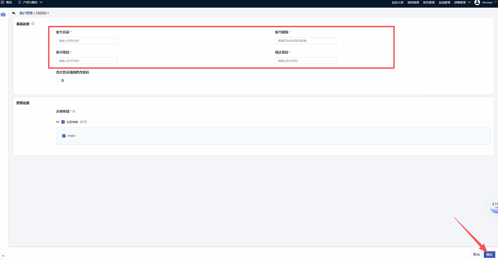
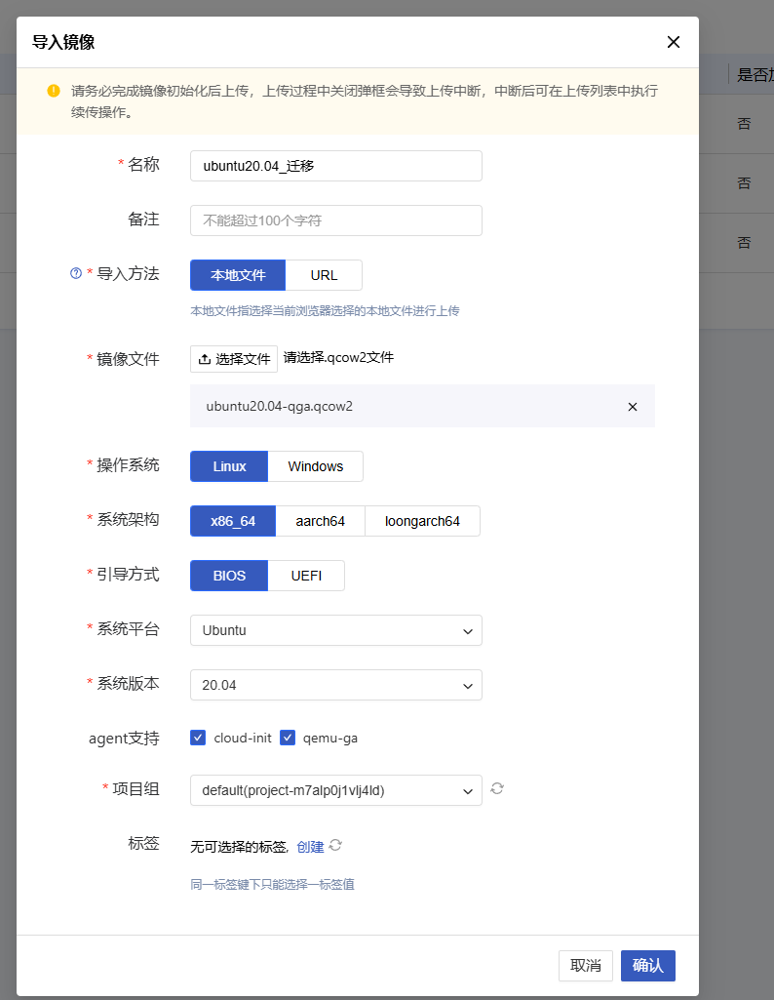

# Ucloud Pre Settings

[[toc]]

## **Create a UcloudStack user for the disaster recovery target**

Due to API restrictions, it is not possible to directly use the Admin tenant  for disaster recovery/migration. A UcloudStack regular  tenant  needs to be created to start disaster recovery/migration. For detailed requirements, please refer to the following document.

### **Create Tenant**

Note: The steps for creating a tenant vary slightly for each version of UcloudStack. The following is a reference example for version 2.13.2.

On platform selection, Tenant Management -- Create


According to the platform's prompts, enter the account name, email, and password, then click Confirm to complete the creation.



## **Configure Network & Subnet**

Note: Build your network based on the following disaster recovery network scenario.

1. Internal network access:

If accessing through an internal network, please create a disaster recovery network and place the HyperBDR host instance in this network.&#x20;

2. Disaster Recovery Network:&#x20;

Create dedicated networks and subnets for HyperBDR disaster recovery and backup, and connect them to the source IDC via the internal network.

3. Business Network:

Business networks and subnets for disaster recovery takeover and drills.

## **Create HyperBDR Security Group**

::: tip

HyperBDR Security Group Name: SG-HyperBDR

:::

### **Create security group rules**

::: warning

Note: For security group rules, simply set the corresponding rules according to the security requirements of your own platform.

:::

| No. | Action | Type | Protocol & Port | Source    | Description                                                                              |
| --- | ------ | ---- | --------------- | --------- | ---------------------------------------------------------------------------------------- |
| 1   | Allow  | IPv4 | TCP:22          | 0.0.0.0/0 | Default allow Linux SSH port                                                             |
| 2   | Allow  | IPv4 | TCP:10443       | 0.0.0.0/0 | Allow HyperBDR web Console                                                               |
| 3   | Allow  | IPv4 | TCP:30443       | 0.0.0.0/0 | Allow the Web Console port of the HyperBDR Operation and Maintenance Management Platform |
| 4   | Allow  | IPv4 | TCP:30080       | 0.0.0.0/0 | Allow HyperBDR HTTPS service port                                                        |

## **Mirroring Download & Upload**

### **Mirror Download**

::: tip

Download the Linux mirroring to the local computer via the provided mirroring link.

:::

### **Mirroring Information**

#### **Linux mirroring**

* **This mirroring is a dedicated version for Ucloud, with the QGA service built-in&#x20;**

* Version: ubuntu 20.04 server

* Size: 617 MB

* Download link: https://downloads.oneprocloud.com/docs\_images/ubuntu20.04-server-qga.qcow2 &#x20;

### **Import mirroring to UcloudStack**

#### **Step 1: Log in to UcloudStack&#x20;**

#### **Step 2: Create mirroring**




Just wait for the mirroring creation to complete.

## **Create an ECS instance to install HyperBDR**

### **Log in to the UcloudStack Console**

### **Create a virtual host based on the required specifications**

> The required specifications for the HyperBDR server are as follows&#x20;

| Configuration Item | Parameter            |
| ------------------ | -------------------- |
| Specification      | 8U16G                |
| Mirroring          | Ubuntu 20.04         |
| System Disk        | 500GB                |
| Network            | \<VPC-HyperBDR\\>    |
| Subnet             | \<Subnet-HyperBDR\\> |
| Security Group     | SG-HyperBDR          |
| Instance Name      | HyperBDR-Prod        |
| Login Username     | root                 |
| Password           | \<Your password\\>   |

## **Test network access between VPCs**

### **Test the network connectivity between the disaster recovery VPC and the business VPC**

* Step 1: Log in to UcloudStack and create a test server&#x20;

Create a test cloud server on UcloudStack (using Ubuntu 20.04 operating system). When configuring the network, select the business VPC and subnet. Ensure that the security group of this newly created test virtual machine has an inbound access policy allowing port 22.

* Step 2: Conduct network test access from the disaster recovery VPC to the business VPC

Log in to the UcloudStack Console, log in to the HyperBDR Server, and use the internal network IP to connect to the host within the business VPC.

Execute command:

```bash
ssh root@<业务vpc主机IP地址>  22
```

Test Results:&#x20;

If you can successfully access and enter your password, it indicates normal access.&#x20;

### **Test the network connectivity between business VPCs&#x20;**

* Step 1: Create a new test cloud server using the Ubuntu 20.04 operating system. When configuring the network, select different business VPCs and subnets. Ensure that the security group of this newly created test virtual machine has an inbound access policy that allows port 22.&#x20;

* Step 2: Log in to the test cloud servers in different VPCs via the Console, and use the following commands to perform bidirectional command testing.&#x20;

Execute command:

```bash
ssh root@<测试主机IP地址> 22
```

Test Results:&#x20;

If you can successfully access and enter your password, it indicates normal access.&#x20;

## **UcloudStack Account Quota Check**

During the disaster recovery process, it is crucial to ensure that the UcloudStack account has sufficient resource quotas to support data synchronization and disaster recovery. To prevent potential failure of disaster recovery due to insufficient quotas, it is necessary to conduct a resource quota check before initiating disaster recovery.

If the remaining quota in the account is insufficient, it is necessary to clean up unnecessary resources in the account or apply for an extension of the resource quota.&#x20;

### **Source Host Resource Inventory**

It is necessary to collect information on the computing and storage resources of the host system waiting for disaster recovery and enter the detailed information into a table.&#x20;

| Resource Type                            | Size |
| ---------------------------------------- | ---- |
| Total number of source hosts             |      |
| Total number of CPUs on the source host  |      |
| Total memory size of the source host     |      |
| Total number of disks on the source host |      |
| Total capacity of the source host disk   |      |
