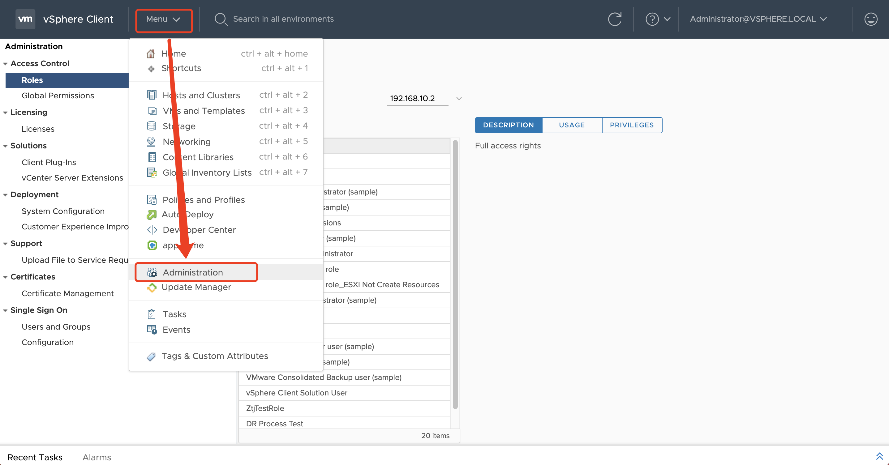
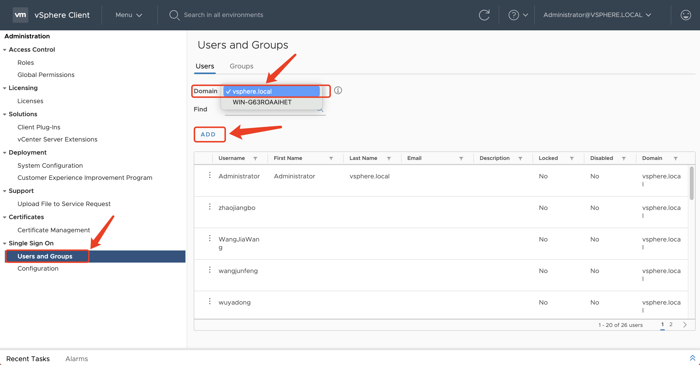
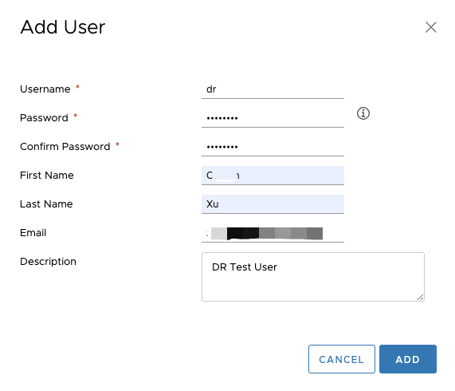
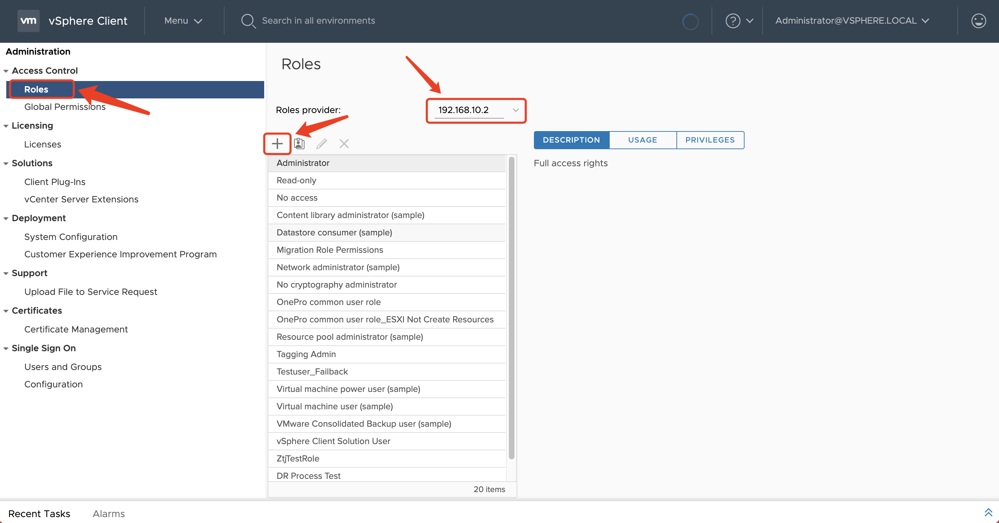
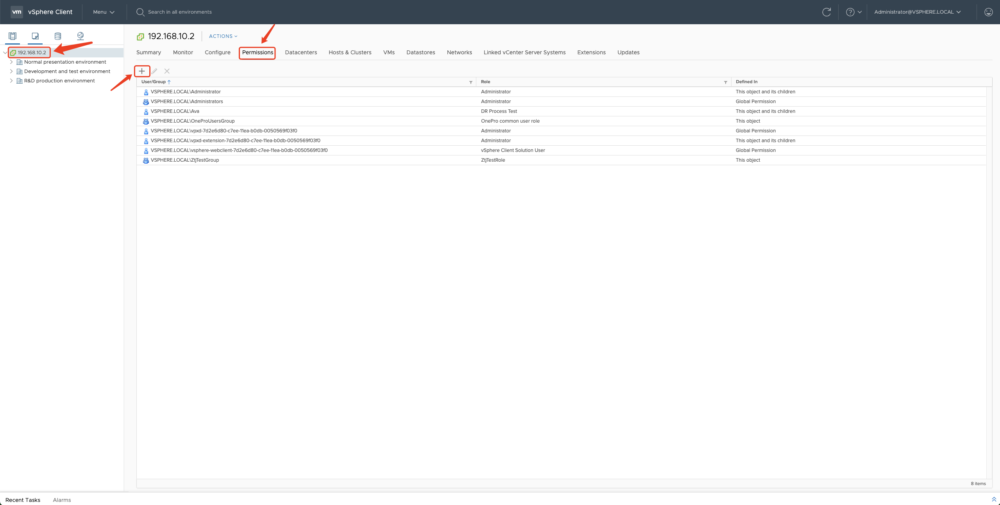
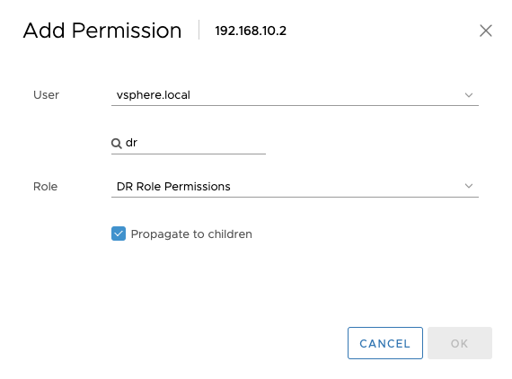
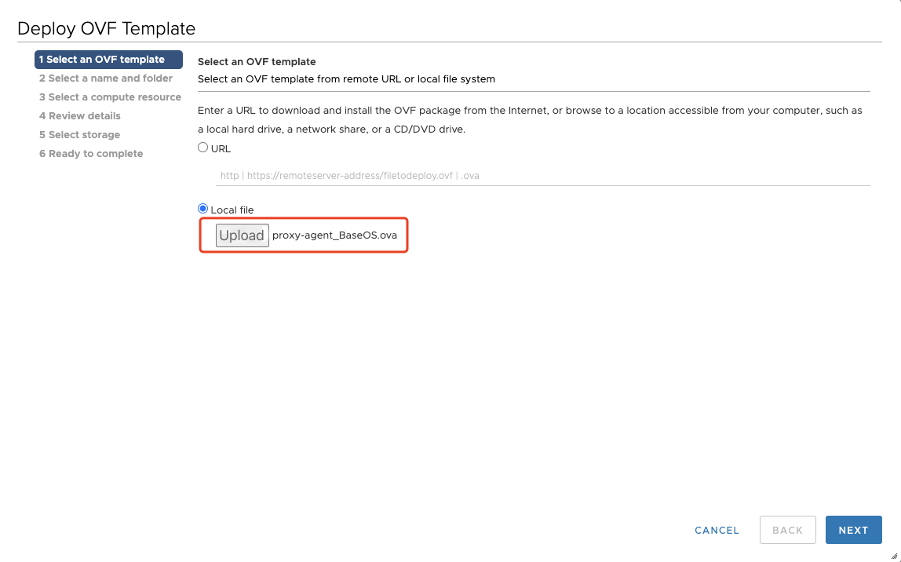
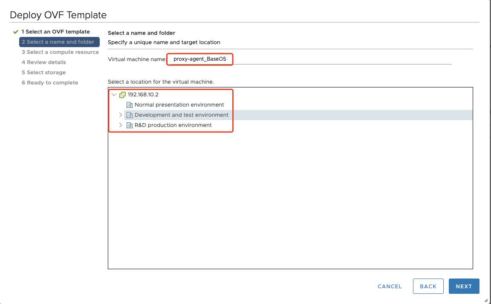
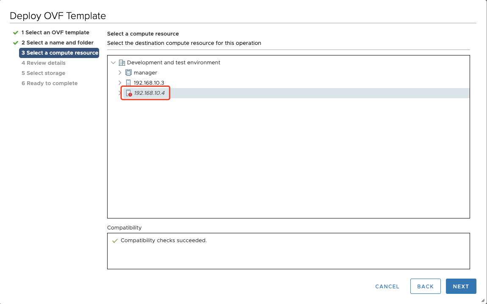

# VMware Pre-Settings

[[toc]]

## VMware Environemnt Preparation

1. Export host information via vCenter: [VMware Quick Investigation](../../product-overview/presales/hyperbdr-vmware-investigation.md)
2. Fill in detail VM host information based on the export inf, which will be used for DR setup .

## VMware User Permission Requirements

### Why do we need the permissions?

The need for these permissions arises from HyperBDR's utilization of VMware CBT (Change Block Tracking) technology for incremental data synchronization. CBT is a technique employed in VMware to facilitate incremental backup and replication. It effectively tracks the blocks that have undergone changes on a virtual disk, enabling the transmission of only the data associated with these changes during the backup and replication processes.

### VMware User Permission

Prepare the VMware user authentication information for data synchronization and ensure that the user has the necessary permissions.

Provide VMware user with following permissions:

| Permission Type | Permissions                          |
| --------------- | ------------------------------------ |
| Host Profile    | View host configuration files        |
| Global          | Enable method                        |
|                 | Disable method                       |
|                 | License management                   |
| Content Library | Download files                       |
|                 | Update configuration settings        |
|                 | View configuration settings          |
|                 | Read storage                         |
| Scheduled Tasks | Create tasks                         |
| Data Storage    | Low-level file operations            |
|                 | Update virtual machine metadata      |
|                 | Update virtual machine files         |
|                 | Browse data storage                  |
| Virtual Machine | Interaction                          |
|                 | Backup operation on virtual machine  |
|                 | Defragment all disks                 |
|                 | Restore Fault Tolerance              |
|                 | Enable Fault Tolerance               |
|                 | Pause or Unpause                     |
|                 | Perform Guest Operations via VIX API |
|                 | Reset                                |
|                 | Guest Operations                     |
|                 | Modify guest operations              |
|                 | Query guest operations               |
|                 | Execute guest operation programs     |
|                 | Snapshot Management                  |
|                 | Create snapshot                      |
|                 | Remove snapshot                      |
|                 | Configuration Changes                |
|                 | Modify device settings               |
|                 | Toggle fork parent                   |
|                 | Toggle disk change tracking          |
|                 | Reload based on path                 |
|                 | Display connection settings          |
|                 | Modify Settings                      |
|                 | Modify resources                     |
|                 | Query Fault Tolerance compatibility  |
|                 | Query unowned files                  |
|                 | Retrieve disk lease                  |
|                 | Configure managedBy                  |
|                 | Reset guest information              |
|                 | Advanced configuration               |
|                 | Service Configuration                |
|                 | Modify service configuration         |
|                 | Query service configuration          |
|                 | Manage service configuration         |
|                 | Read service configuration           |
| Provisioning    | Allow virtual machine download       |
|                 | Allow read-only access to disks      |
|                 | Allow file access                    |
|                 | Allow disk access                    |
|                 | Customize guest                      |
|                 | Read customization specification     |

### vCenter Permission Open Settings Steps

#### Step 01: Log in to the vCenter Administrator Console

#### Step 02: Add Access Users

Click on **"Menu"**, **"Administration"**

Click on the left-hand menu **"Users and Groups"**, select **"Users"** tab, choose the **"Domain"** associated with the correct login for vCenter, and click the **"Add"** button.

Follow the prompts to enter the Username, Password, Confirm Password, and any other optional information. Then, click the **"Add"** button.

#### Step 03: Add Access Control Roles

On the left-hand menu, go to **"Access Control"**, **"Roles"**. Under **"Role Provider"**, select the vCenter address, and click the **"+"** button.

Refer to "[VMware User Permission](https://docs.oneprocloud.com/userguide/poc/vmware-pre-settings.html#vmware-user-permission)" and select the appropriate settings. Then, click the "NEXT" button.

Set a new Role name and Description, then click the **"FINISH"** button.

#### Step 04: Add Permissions to vCenter 

In **"Hosts and Clusters"**, find the top-level **"vCenter IP"** on the left-hand menu, select it, and click on the **"Permissions"** menu on the right. Then, click the **"+"** button.

Follow the prompts to choose the domain for user authorization, keeping it consistent with the previous steps. Search for the **"dr"** user to be added. Select the **"DR Role Permissions"** for the role and check the box for "Propagate to Child". Then, click the "OK" button.

After the addition is complete, provide the vCenter access address, **"dr"** user, and login password to **HyperBDR Console**.

### Fill in HyperBDR Console

Then fill in the authentication information of this account to the HyperBDR Console DR Platform later, including:

- vCenter IP
- vCenter usename
- vCenter password

## Download The OVA Images

Download the template file for installing **Sync Proxy** node (OVA)

- [proxy-agent_BaseOS.ova](https://hyperbdr-system-image-do-not-delete.obs.ap-southeast-3.myhuaweicloud.com/proxy-agent_BaseOS.ova)

## Import OVA Images and Create **Sync Proxy** Virtual Machine in VMware

### Deploy VOF template

select the your ESXis or Datacenter Name, Right click, select the **"Deploy OVF Template.."**

#### Step01: Select an OVF template

Click the **"Local file"** system, and click the **"select file"** button, select the ova template downloaded locally in advance, download OVA template name is **"proxy-agent_BaseOS.ova"**.

#### Step02: Select a name and folder

You can give this vm a name, like **"proxy-agent_BaseOS"**, then select a location for the virtual machine.

#### Step03: Select a compute resource

Select the destination compute resource for the created VM.

#### Step04: Review details

Verify the template details.

#### Step05: Select storage

Select the storage for the configuration and disk files.

#### Step06: Select networks

Select a destination network for each source network.

#### Step07: Ready to complete

Confirm the created information then click **"Finish"** to start creation.

#### Review import OVF template tasks

- **"Import OVF package"** and **"Deploy OVF template"** task is progress.

- **"Import OVF package"** and **"Deploy OVF template"** task status completed.

### Modify the Sync Proxy VM Flavors

- Click the VM name, then right click, select the **"Edit Settings..."**.

- Modify the CPU to 4 core, Memory to 8GB, Hard disk 1 size to 100GB.

### Power On the Sync Proxy VM

- Select the VM name, then right click, click the **"Power"**, **"Power On"**.

Next step, you can configration the Sync Proxy node IP Address.

## Frequently Asked Questions

### How many hosts can a single Sync Proxy support for data synchronization?

The Sync Proxy limits data synchronization based on the number of disks on the source host. According to best practices for the project, to ensure timely synchronization, each 4-core 8GB Sync Proxy can support up to 50 disks simultaneously. You can also increase the Sync Proxy specifications, such as using an 8-core 16GB host, to support the simultaneous synchronization of 100 disks.

[How can I increse max mounts disks in sync proxy?](https://qa.oneprocloud.com/questions/D1p4/E1r4)
