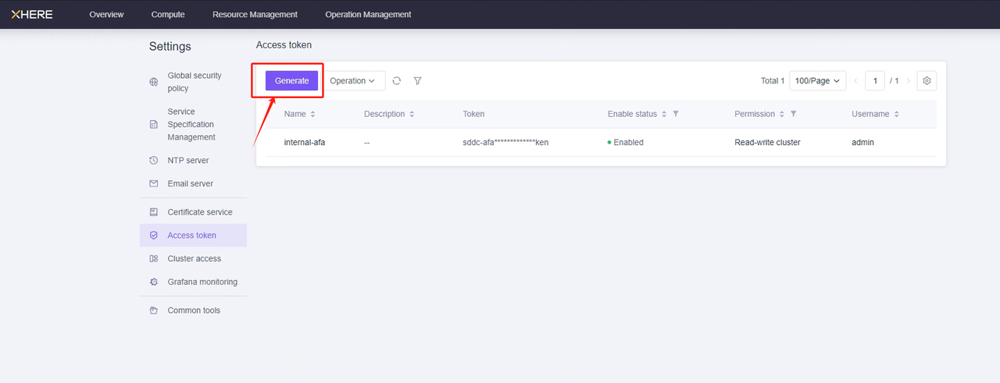
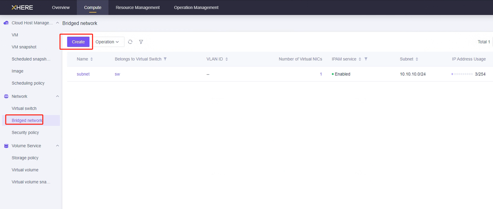
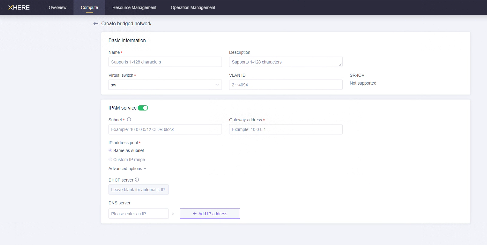
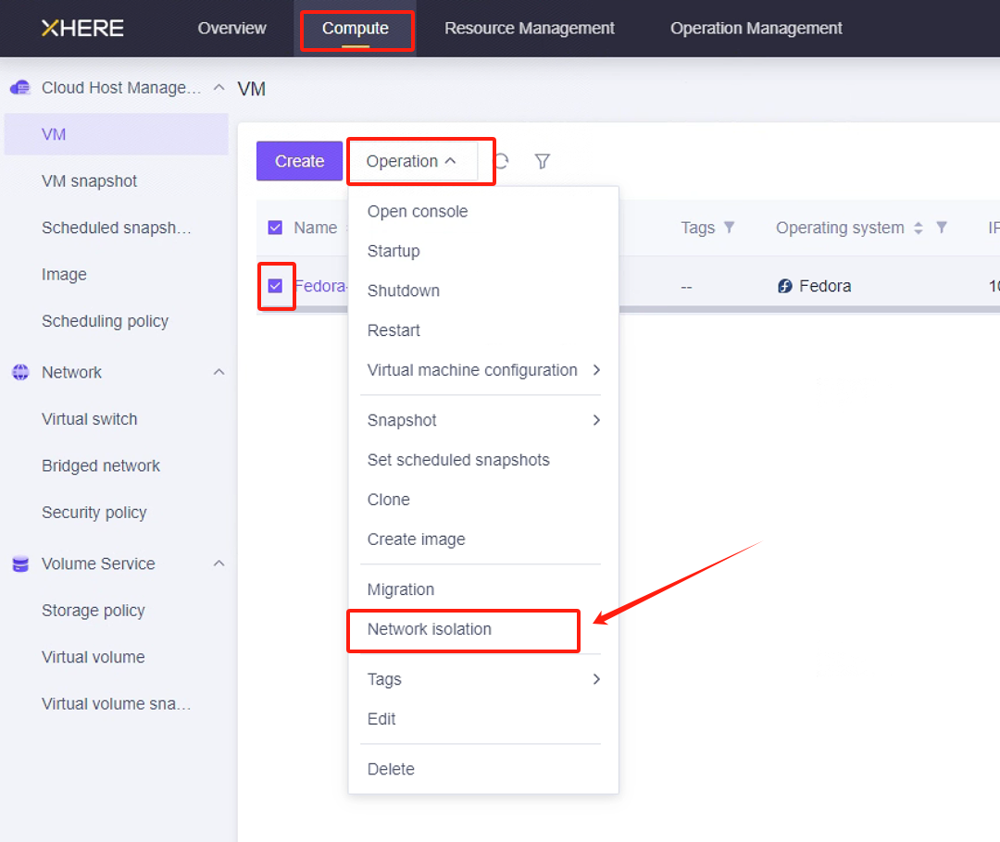
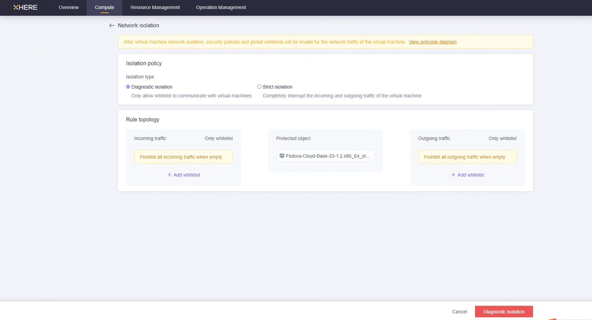
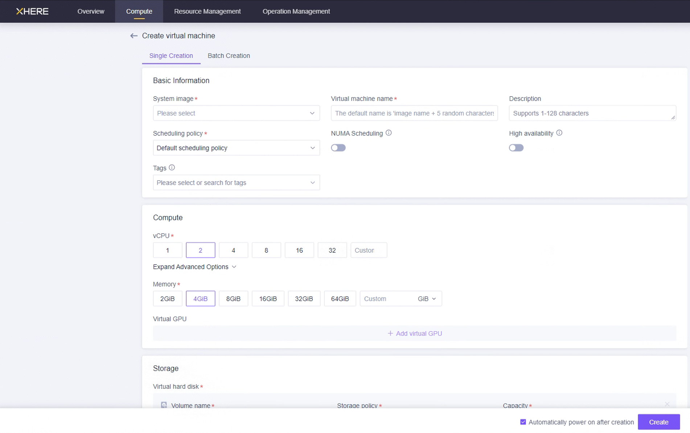

# XHERE Pre-Settings

## Create & Configure XHERE Account for DR purpose

### Create User & Granting Authorization to User

After the XHERE cloud platform is deployed, the default account is usually the admin account, and the admin account has the authority to perform all operations. 


### Managing User Access Keys





After clicking "Generate", simply enter a name and you can create an token for “admin” account.


## Bridged Network Setup

 To meet the requirements for disaster recovery, the network needs to be created in advance.  


 The required network includes:  


1.  The network where the HyperBDR disaster recovery tool is located.  

2.  The network where the Cloud Sync Gateway is located.  

3.  The network where the disaster recovery services are located.  


 The method for creating the network is as follows:  








Explanation: Establish your network based on the following disaster recovery network scenarios.


1. HyperBDR Bridged Network:


If accessing through an intranet , create a DR Bridged network and place HyperBDR VM instances in this network.


2. Data Backup Bridged Network:


Dedicated Bridged network and subnet for Data backup, interconnected with the on-premises IDC through Intranet.


3. Business Bridged Network:


Business Bridged network and subnet used for disaster takeover and drills.


## Test Network Access between Bridged Network

>  The pre-created bridged networks need to ensure network communication between them.  
>

### Test the network connectivity between the on-premises IDC Network  and HyperBDR Bridged Network

+ Step1: Login to XHERE and create an Instance A  on XHERE for deploy the HyperBDR disaster tool . When configuring the network, choose the HyperBDR Bridged Network and subnet. Ensure that the security group of this newly created Instance  has an inbound access policy allowing port 10443 and 30080.

+ Step2:  Deploy the HyperBDR disaster recovery tool and ensure that the program is running normally.  

+ Step3: Select a host from the source IDC data center to test the connection to port 10443 and 30080 of Instance A on Xhere.  


 Execute the command on the source host   :


```plain
ssh -v -p 10443 <The intranet IP address of the Instance A> 
ssh -v -p 30080 <The intranet IP address of the Instance A> 
```


Test results: If you can successfully access and enter the password, it indicates normal access.


### Test the network connectivity between the HyperBDR Bridged Network and Data Backup Bridged Network

+ Setp1: Create a new Instance B on XHERE. When configuring the network, choose the Data Backup Bridged Network and subnet. Ensure that the security group of this newly created VM test virtual machine has an inbound access policy allowing port 22，16100 and 10729.

+ Sep2: Log in to the Instance where is HyperBDR is located. 


Then execute command  :


```plain
ssh -v -p 22 <The intranet IP address of the Instance B> 
ssh -v -p 10729 <The intranet IP address of the Instance B> 
ssh -v -p 16100 <The intranet IP address of the Instance B> 
```


Test results:


If you can successfully access and enter the password, it indicates normal access.


### Test the network connectivity between the on-premises IDC Network and the Data Backup Bridged Network 

+ Step1： Select a host from the source IDC data center to test the connection to port 3260 of Instance B on Xhere.  And by the way, this Instance B is the host mentioned above.  


 Execute the command on the source host   :


```plain
ssh -v -p 3260 <The intranet IP address of the Instance> 
```


Test results: If you can successfully access and enter the password, it indicates normal access.


### Test the network connectivity between the HyperBDR Bridged Network and Business Bridged Network

+ Setp1: Create a new VM Instance C. When configuring the network, choose the business Bridged Network and subnet. Ensure that the security group of this newly created VM test virtual machine has an inbound access policy allowing port 22 and 10729.

+ Sep2:  Log in to the Instance where is HyperBDR is located. 


Then execute command:


```plain
ssh -v -p 22 <The intranet IP address of the Instance C> 
ssh -v -p 10729 <The intranet IP address of the Instance C> 
```


Test results:


If you can successfully access and enter the password, it indicates normal access.


## Create HyperBDR Security Policy

 In XHERE, security policies can be set for a specific host. For example:  








NOTE: For Source IP range, we recommend use safe range to replace 0.0.0.0/0. For example, if your external ip address is 110.242.68.66, source can be configurated as 110.242.68.66/32.


If it is a public network environment, it is recommended to set whitelist access on port 22 to ensure security.


## Create VM for HyperBDR

### Log in to the XHERE Console

### Create Cloud Instance based on Configuration Information

> The resource configuration for HyperBDR servers is as follows:
>





 On this page, you can select an Ubuntu 20.04 image to create a host for installing the HyperBDR tool. Choose the instance specifications of 8U16G200G for the host.  


## XHERE platform account quota check

During the disaster recovery process, it is essential to ensure that the cloud account has sufficient resource quotas to support data synchronization and disaster recovery. To prevent potential failure of disaster recovery due to insufficient quotas, it is necessary to perform a resource quota check before initiating the disaster recovery.


If the remaining quota in the XHERE account is insufficient, it is necessary to clean up unnecessary resources in the account or apply for an expansion of XHERE resource quotas.


### Source host resource inventory

Need to gather information on the computing and storage resources for the host systems awaiting disaster recovery and input the details into a table.


| **<font style="color:#373c43;">Resources Type</font>** | **<font style="color:#373c43;">Size</font>** |
| :--- | :--- |
| <font style="color:rgb(0, 0, 0);">The total number of source host</font> | |
| <font style="color:rgb(0, 0, 0);">The total number of source host CPU</font> | |
| <font style="color:rgb(0, 0, 0);">The total number of source host RAM(MB)</font> | |
| <font style="color:rgb(0, 0, 0);">The total number of source host disks</font> | |
| <font style="color:rgb(0, 0, 0);">The total disk capacity for source host(GB)</font> | |


### XHERE account resource quota check

 View the relevant resources in “Resource Management”.  


## Modify the ssh policy of the Cloud Sync Gateway instance security group

 You can configure "Network isolation" for the "Cloud Sync Gateway" instance and set rules for inbound and outbound traffic through a whitelist.  


