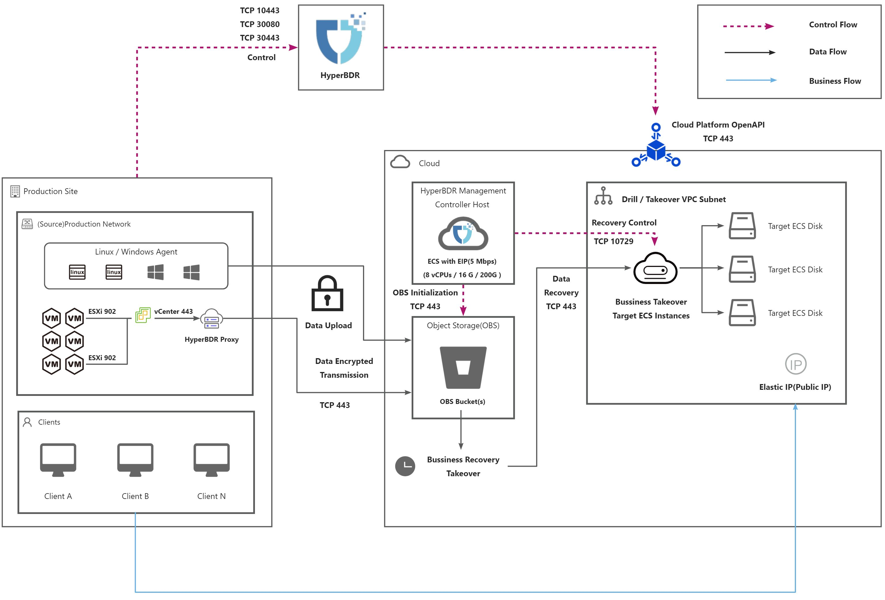
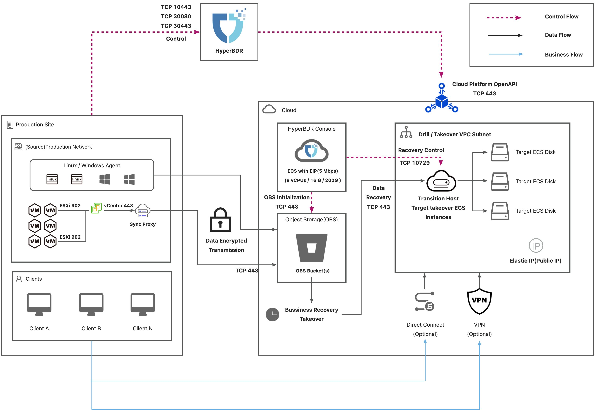
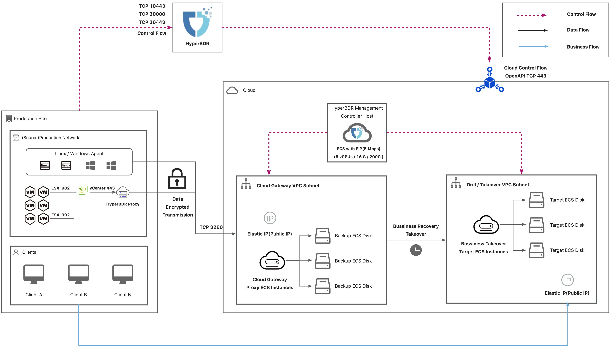
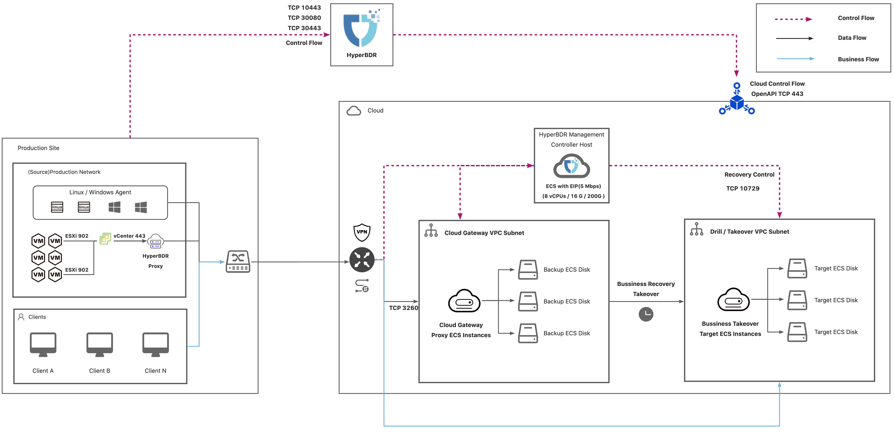

## Network Planning Overview

[[toc]]

This document primarily focuses on the rational planning of the HyperBDR network and disaster recovery takeover, as well as the network used for drills, prior to the commencement of the project. The following are fundamental principles for network planning:

- HyperBDR should be deployed within the disaster recovery platform to ensure that, in the event of a production platform failure, HyperBDR can still effectively recover business systems on the disaster recovery platform.

- HyperBDR does not have specific requirements for the underlying networking topology; it only requires that network communication ports and directions align with HyperBDR's needs.

- The deployment approach for HyperBDR depends on the connection method between the production site and the cloud disaster recovery site. Based on different network connection scenarios, there are slight variations in deployment methods, resource requirements, and associated costs.

- For stateful business system takeover, attention should be given to the firewall policy configuration of the network used for disaster recovery takeover, ensuring it aligns with the production network connection. This is to avoid incorrect data writes after the disaster recovery takeover system directly connects to the production end.

## Deployment Solution for Object Storage

### Networking Schemes

| Solution | Data Transmission | Business Access |
| --- | --- | --- |
| Internet | Internet | Internet |
| Dedicated Network Connection Solution (e.g. VPN) | Dedicated Network | Dedicated Network |
| Hybrid Network Solution | Internet | Dedicated Network |

> NOTE: Business Access after Post-Disaster Recovery Takeover

### List of Open Ports

#### Agent

Agent contains Windows Agent and Linux Agent.

| **No.** | **From** | **To** | **Direction** | **Ports** | **Type** | **Comment** |
| --- | --- | --- | --- | --- | --- | --- |
| 1 | Agent | HyperBDR Console | TCP Unidirectional | 10443 / 30080 | Control Flow | 
| 2 | Agent | Object Storage Service | TCP Unidirectional | 443 | Data Flow | 
| 3 | HyperBDR Console | Object Storage Service | TCP Unidirectional | 443 | Control Flow | 
| 4 | HyperBDR Console | Transition Host | TCP Unidirectional | 10729 | Control Flow | It is necessary to establish VPC Peering between HyperBDR Console and the VPC hosting the recovered VM. Port configurations will be automatically set up by the security group, and no specific settings are required. |
| 5 | HyperBDR Console | Cloud API | TCP Unidirectional | 443 | Control Flow | 
| 6 | Transition Host | Object Storage Service | TCP Unidirectional | 443 | Data Flow | 

#### VMware Agentless

| **No.** | **From** | **To** | **Direction** | **Ports** | **Type** | **Comment** |
| --- | --- | --- | --- | --- | --- | --- |
| 1 | Sync Proxy | vCenter | TCP Unidirectional | 443 | Control Flow |  |
| 2 | Sync Proxy | ESXi | TCP Unidirectional | 902 | Data Flow | Port 902 for all ESXis managed by vCenter |
| 3 | Sync Proxy | HyperBDR Console | TCP Unidirectional | 10443 / 30080 | Control Flow |  |
| 4 | Sync Proxy | Object Storage Service | TCP Unidirectional | 443 | Data Flow |  |
| 5 | HyperBDR Console | Object Storage Service | TCP Unidirectional | 443 | Control Flow |  |
| 6 | HyperBDR Console | Transition Host | TCP Unidirectional | 10729 | Control Flow | It is necessary to establish VPC Peering between HyperBDR Console and the VPC hosting the recovered VM. Port configurations will be automatically set up by the security group, and no specific settings are required. |
| 7 | HyperBDR Console | Cloud API | TCP Unidirectional | 443 | Control Flow |  |
| 8 | Transition Host | Object Storage Service | TCP Unidirectional | 443 | Data Flow |  |

### Deployment Architecture

#### Internet

#### Dedicated Network Connection

#### Hybrid Network

## Deployment Solution for Block Storage

### Network Schemes

| Solution | Data Transmission | Business Access |
| --- | --- | --- |
| Internet | Internet | Internet |
| Dedicated Network Connection Solution (e.g. VPN) | Dedicated Network | Dedicated Network |

> NOTE: Business Access after Post-Disaster Recovery Takeover

### List of Open Ports

#### Agent

| **No.** | **From** | **To** | **Direction** | **Ports** | **Type** | **Comment** |
| --- | --- | --- | --- | --- | --- | --- |
| 1 | Agent | HyperBDR Console | TCP Unidirectional | 10443 / 30080 | Control Flow | 
| 2 | Agent | Cloud Sync Gateway | TCP Unidirectional | 3260 | Data Flow | 
| 3 | HyperBDR Console | Cloud Sync Gateway | TCP Unidirectional | 22 / 10729 | Control Flow | It is necessary to establish VPC Peering between HyperBDR Console and the VPC hosting the recovered VM. Port configurations will be automatically set up by the security group, and no specific settings are required. |
| 4 | HyperBDR Console | Cloud API | TCP Unidirectional | 443 | Control Flow | 

#### Agentless

| **No.** | **From** | **To** | **Direction** | **Ports** | **Type** | **Comment** |
| --- | --- | --- | --- | --- | --- | --- |
| 1 | Sync Proxy | vCenter | TCP Unidirectional | 443 | Control Flow |  |
| 2 | Sync Proxy | ESXi | TCP Unidirectional | 902 | Data Flow | Port 902 for all ESXis managed by vCenter |
| 3 | Sync Proxy | HyperBDR Console | TCP Unidirectional | 10443 / 30080 | Control Flow |  |
| 4 | Sync Proxy | Cloud Sync Gateway | TCP Unidirectional | 3260 | Data Flow |  |
| 5 | HyperBDR Console | Cloud Sync Gateway | TCP Unidirectional | 22 / 10729 | Control Flow | It is necessary to establish VPC Peering between HyperBDR Console and the VPC hosting the recovered VM. Port configurations will be automatically set up by the security group, and no specific settings are required. |
| 6 | HyperBDR Console | Cloud API | TCP Unidirectional | 443 | Control Flow | 

### Deployment Architecture

#### Internet

#### Dedicated Network Connection

## Failback Network Planning — Dedicated Line Solution

During the failback process, due to the necessity for cloud takeover of the host with direct access to the production-side IP address, the current support is limited to dedicated line solutions.

### Block Storage

#### Deployment Architecutre

#### List of Open Ports

| **No.** | **From** | **To** | **Direction** | **Ports** | **Type** | **Comment** |
| --- | --- | --- | --- | --- | --- | --- |
| 1 | Failback Agent | HyperBDR Console | TCP Unidirectional | 10443 / 30080 | Control Flow | 
| 2 | Failback Agent | Failback Transition Host | TCP Unidirectional | 3260 | Data Flow | 
| 3 | HyperBDR Console | Failback Transition Host | TCP Unidirectional | 10729 | Control Flow | 

### Object Storage

#### Deployment Architecture

#### List of Open Ports

| **No.** | **From** | **To** | **Direction** | **Ports** | **Type** | **Comment** |
| --- | --- | --- | --- | --- | --- | --- |
| 1 | Failback Agent | HyperBDR Console | TCP Unidirectional | 10443 / 30080 | Control Flow | 
| 2 | Failback Agent | Object Storage Service | TCP Unidirectional | 443 | Data Flow | 
| 3 | HyperBDR Console | Object Storage Service | TCP Unidirectional | 443 | Control Flow | 
| 4 | HyperBDR Console | Failback Transition Host | TCP Unidirectional | 10729 | Control Flow | 
| 5 | HyperBDR Console | Cloud API | TCP Unidirectional | 443 | Control Flow | 
| 6 | HyperBDR Console | vCenter/ESXi | TCP Unidirectional | 443/902 | Control Flow | 
| 7 | Failback Transition Host | Object Storage Service | TCP Unidirectional | 443 | Data Flow | 

## DR Network Planning

### User Network

We use the network of a specific client's production environment as an example to illustrate network planning under different scenarios. Below is the network architecture topology diagram for the user:

The user network allocation is as follows:

| Network | Subnet | Usage |
| --- | --- | --- |
| Client Desktops | 192.168.0.0/24 | User access application network |
| Application A | 192.168.4.0/24 | Application A network |
| Application B | 10.227.129.0/24 | The network for Business System B, which is the VMware Business Network address |
| VMware Management Network | 10.227.230.0/24 | VMware management network |

### Dedicated Line Solution 1

Production network and takeover subnet are distinct.

#### Architecture

#### Firewall Policies

| Production Subnet | Takeover Subnet | Production to Takeover | Takeover to Production |
| --- | --- | --- | --- |
| 192.168.0.0/24   192.168.4.0/24 | 192.168.104.0/24 | ALLOW | Denied |
| 192.168.0.0/24   10.227.129.0/24 | 10.227.229.0/24 | ALLOW | Denied |

Explanation:

- User Access: On the target cloud platform, a different subnet address is used for the takeover network. On the production side, direct access to the cloud's VPC is possible through the dedicated line. Users can also connect directly to the cloud's VPN using a VPN client to access the business network.

- Firewall Configuration: To prevent erroneously accessing the original hosts after takeover, restrictions are in place to prevent the directly accessing the production network from the taken-over hosts. Specific ports are allowed based on policy requirements.

### Dedicated Line Solution 2

Production network and takeover subnet are the same.

#### Architecture

#### Firewall Policies

| Production Subnet | Takeover Subnet | Production to Takeover | Takeover to Production |
| --- | --- | --- | --- |
| 192.168.0.0/24   192.168.4.0/24 | 192.168.4.0/24 | Denied | Denied |
| 192.168.0.0/24   10.227.129.0/24 | 10.227.129.0/24 | Denied | Denied |

Explanation:

- Firewall Configuration: To prevent erroneously accessing the original hosts after takeover, restrictions are in place to prevent the directly accessing the production network from the taken-over hosts. Specific ports are allowed based on policy requirements.

### Internet

#### Architecutre

#### Firewall Policies

Users access the taken-over business system directly through a public network address. The firewall needs to allow the required access from the public network

