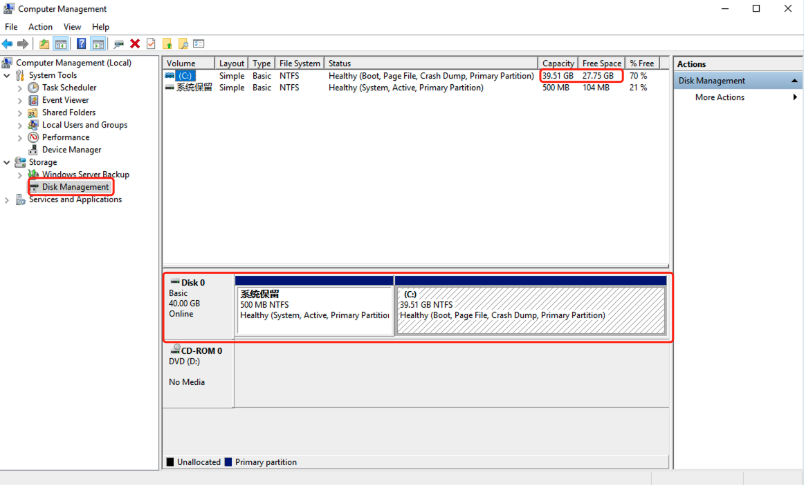

# Agent Quick Investigation

## Investigation Steps

### Windows Server 2016

This document provides a comprehensive guide on retrieving host information from a Windows environment, covering essential details such as the host name, operating system version, CPU specifications, memory details, and disk information. For the purpose of this section, we will use Windows Server 2016 as a reference. Please note that you can adapt the queries to other operating system versions as needed.

#### Get host name, operating system version, cpu, memory, etc. (Control Panel)

Open Control Pannel -> System and Security -> System to retrieve relevant information.


#### Get host name, operating system version, cpu, memory, etc. (command line)

Log in to the windows server, press the shortcut key "Win + R" to open the CMD window, and run the following command:

```powershell

systeminfo

```

The output is as follows; you can check the Host Name, OS Name, Processor(s), and Total Physical Memory to obtain the corresponding information.

> **Host Name:** NGINX-WEB  
> **OS Name:** Microsoft Windows Server 2016 Datacenter  
> **Processor(s):** 1 Processor(s) Installed.  
> **Total Physical Memory:** 4096MB


#### Retrieve disk information.

Open the "Control Panel", go to "System and Security", select "Administrative Tools", click the "Computer Management", and click on "Disk Management".


1. **Retrieve the number of disks.**


As shown in the figure below, Disk 0 represents the first disk. If there are multiple storage devices, they will be sequentially labeled as Disk 1, Disk x, and so on, with each one representing an independent storage unit. Just record the total number.


2. **Retrieve the actual usage of each disk.**


As shown in the figure below, at the upper-right position, the allocation and usage information for all disks are displayed. 'C' represents a partition with corresponding capacity and available space. You can calculate the actual usage of the current 'C' partition by subtracting the available space from the total capacity. A single disk may have multiple partitions, so correspondingly check the lower-right position of Disk 0 in the figure to determine the disk to which each partition belongs. This way, you can separately calculate the actual usage of each disk.

> The Disk 0 has a C partition with a total capacity of 39.51GB, available space of 28.14GB, and the current actual usage space on Disk 0 is 11.37GB.  
> If there are other disks, the same calculation method applies to determine the actual usage space on each respective disk.



### CentOS 7 (Linux)

This document primarily guides on obtaining relevant host information on a Linux machine, including the host name, operating system version, kernel version, CPU, memory, disk, and other details. The steps for collecting Linux host information in this instance will be based on CentOS 7; for other operating system versions, please refer to their respective documentation.

#### 1. Retrieve host name

To retrieve the host name on a Linux system, you can use the **hostname** command. Open a terminal and run the following command:

```bash

hostname

```

The output is as follows, and the displayed content is the hostname:


#### 2. Retrieve the operating system version

Run the following command to view the operating system version:

```bash

cat /etc/redhat-release

```

The output content represents information about the operating system version:


#### 3. Retrieve the kernel version

Run the following command to view the kernel version:

```bash
uname -r
```

The output content represents information about the kernel version:

```
4.1.12-61.1.28.el6uek.x86_64
```

#### 4. Retrieve CPU information

Run the following command to view CPU information:

```bash

lscpu

```

In the output, locate the value of **"CPU(s)"**, which represents the number of CPU cores:


#### 5. Retrieve Memory information

Run the following command to view memory information:

```bash

free -h

```

Look for the "Total" column, which displays the total physical memory:


#### 6. Retrieve disk information


1. **Check the number of disks and the total capacity.**


Run the following command to obtain the number of disks and their total capacity:

```bash

lsblk

```

The output content is as follows: Look for the content in the NAME column, the disks starting with "sd/vd" indicate the number of disks, and the SIZE column represents the total capacity of the disks:


2. **Retrieve actual disk usage**


Run the following command to obtain the actual disk usage:

```bash

df -Th

```

Check the used space of the disk based on the output.

> Notes: In the "Mounted on" column, "/" represents the root partition. Check the "Used" column for the actual usage of the root partition. If there are other mounted partitions, you also need to obtain their information.


Based on the above operation steps, obtain the corresponding system information for subsequent disaster recovery testing. When executing any commands, ensure that you have sufficient permissions. Additionally, after collecting the information, fill in the gathered details into the corresponding disaster recovery host research table.

