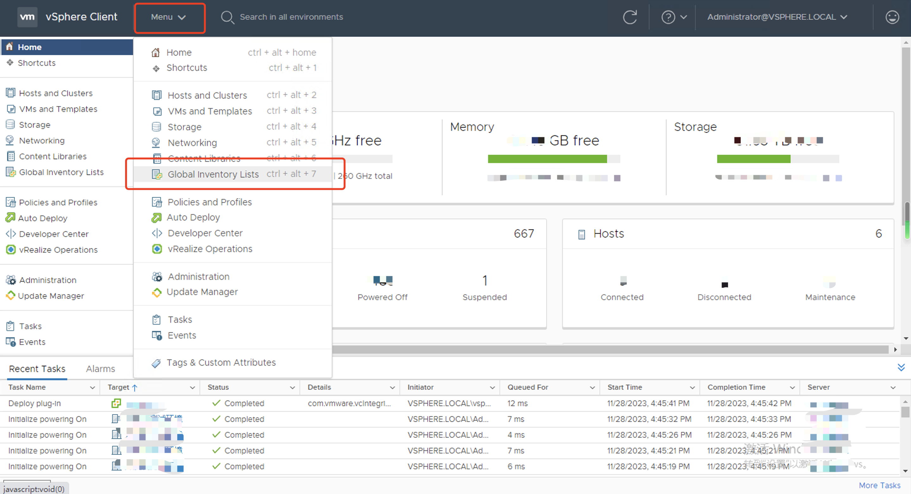
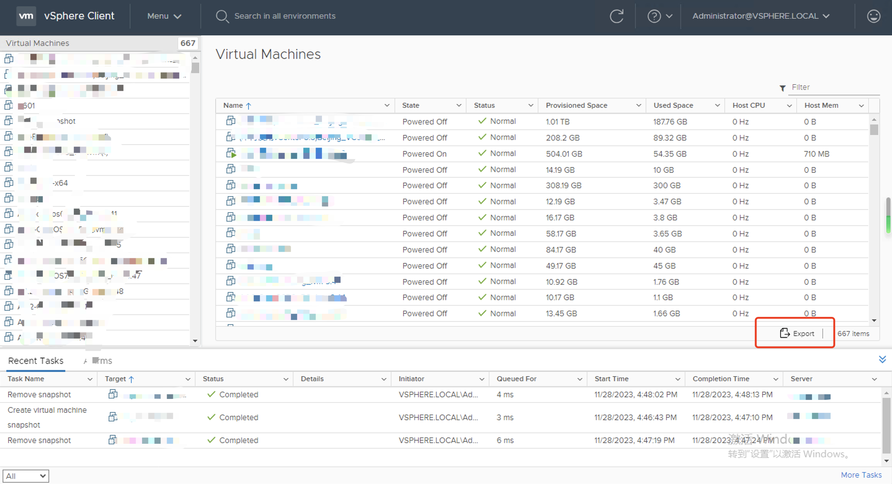
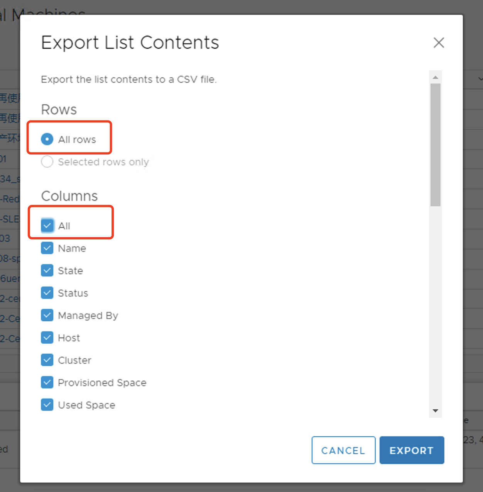

# VMware Quick Investigation

This document is primarily designed to guide the initial investigation of user scenarios to determine whether they fall within the scope of product support during the early stages.  

Complete the following steps to export a CSV file containing VMware virtual machine information and upload the CSV file to us using the [Google Form](https://docs.google.com/forms/d/1ikUHJxwYqeYmfBuk2Tl7Fy1I9aYIqvlFsSsg21rqfTs/prefill).  

## Investigation Steps

### Host Information Collection

> Why do we need this information? We are investigating your VMware host details to assist us in analyzing whether your operating system type is compatible with HyperBDR for protection and to determine how to effectively utilize cloud resources to safeguard your system.

Upon completion of these steps, you will receive a CSV file. Kindly send the file back to us for further assessment and assistance.

#### Login to vCenter

#### Menu -> Global Inventory Lists

#### Virtual Machines

#### Export

#### Select [All Rows] and [All Columns]

#### Exporting

## FAQ

### The export operation has been blocked

Upon completing the configuration, it is essential to execute a page reload for the changes to take effect.

[Upload Investigation Information](https://docs.google.com/forms/d/1ikUHJxwYqeYmfBuk2Tl7Fy1I9aYIqvlFsSsg21rqfTs/prefill)
